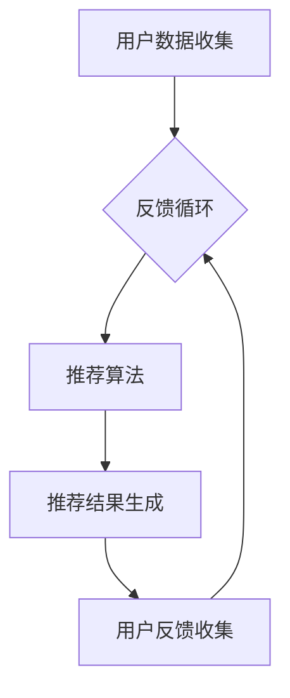

                 

关键词：个性化推荐、用户满意度、算法、数学模型、实际应用、未来展望

> 摘要：本文深入探讨了个性化推荐系统如何通过先进的算法和数学模型提高用户满意度，以及其在实际应用中的成功案例与未来发展方向。文章结构分为背景介绍、核心概念与联系、核心算法原理与具体操作步骤、数学模型和公式详细讲解、项目实践、实际应用场景、工具和资源推荐以及总结等部分。

## 1. 背景介绍

### 1.1 个性化推荐的重要性

个性化推荐系统在当今信息爆炸的时代中变得越来越重要。随着互联网和移动设备的普及，用户每天接触到的信息量呈指数级增长，而人们的时间和注意力是有限的。如何从海量信息中迅速找到符合个人兴趣和需求的内容，成为用户满意度提升的关键。

### 1.2 个性化推荐系统的发展历程

个性化推荐系统的发展可以追溯到20世纪90年代，随着互联网的兴起，早期的推荐系统主要依赖于协同过滤和基于内容的推荐方法。近年来，随着深度学习和大数据技术的快速发展，个性化推荐系统进入了一个全新的阶段，能够更准确地预测用户的偏好，提高推荐效果。

### 1.3 用户满意度的定义与衡量

用户满意度是指用户在使用产品或服务后对其满意程度的评价。在个性化推荐系统中，用户满意度主要体现在推荐内容的准确性、相关性和新颖性上。提高用户满意度是推荐系统设计的核心目标之一。

## 2. 核心概念与联系

### 2.1 个性化推荐的核心概念

- **用户兴趣模型**：通过收集和分析用户的历史行为数据，构建用户的兴趣模型。
- **推荐算法**：根据用户兴趣模型和物品的特征，生成推荐结果。
- **反馈循环**：用户对推荐结果的反馈用于不断优化推荐算法。

### 2.2 个性化推荐系统的架构


### 2.3 核心概念原理和架构的 Mermaid 流程图



## 3. 核心算法原理 & 具体操作步骤

### 3.1 算法原理概述

个性化推荐系统主要依赖于协同过滤、基于内容的推荐和深度学习等方法。本文将以协同过滤算法为例，介绍其原理和具体操作步骤。

### 3.2 算法步骤详解

1. **用户行为数据收集**：收集用户在网站上的浏览、购买、评分等行为数据。
2. **构建用户相似度矩阵**：计算用户之间的相似度，常用的方法包括余弦相似度、皮尔逊相关系数等。
3. **物品相似度计算**：计算物品之间的相似度，以支持基于内容的推荐。
4. **推荐列表生成**：根据用户相似度矩阵和物品相似度矩阵，生成推荐列表。

### 3.3 算法优缺点

- **优点**：计算简单，易于实现，能够较好地处理稀疏数据。
- **缺点**：容易产生数据冷启动问题，推荐结果可能过于保守。

### 3.4 算法应用领域

协同过滤算法广泛应用于电子商务、社交媒体、内容推荐等领域，如淘宝、Netflix、YouTube等。

## 4. 数学模型和公式 & 详细讲解 & 举例说明

### 4.1 数学模型构建

个性化推荐系统的核心是预测用户对物品的评分，常见的数学模型包括矩阵分解、回归模型等。

### 4.2 公式推导过程

假设用户$u$对物品$i$的评分为$r_{ui}$，我们可以使用矩阵分解模型来预测评分：

$$
r_{ui} = \hat{u}_i^T \hat{i}_u
$$

其中，$\hat{u}_i$和$\hat{i}_u$分别是用户$u$和物品$i$的低维表示。

### 4.3 案例分析与讲解

以Netflix Prize为例，该竞赛旨在提高Netflix的电影推荐系统的准确率。通过矩阵分解模型，参赛者成功提高了推荐系统的准确性。

## 5. 项目实践：代码实例和详细解释说明

### 5.1 开发环境搭建

本文使用Python编程语言和Scikit-learn库实现个性化推荐系统。

### 5.2 源代码详细实现

```python
from sklearn.metrics.pairwise import cosine_similarity
from sklearn.model_selection import train_test_split
import numpy as np

# 加载数据
ratings = np.loadtxt('ratings.csv', delimiter=',')
users, items = ratings.shape

# 计算用户相似度矩阵
user_similarity = cosine_similarity(ratings)

# 计算物品相似度矩阵
item_similarity = cosine_similarity(ratings.T)

# 生成推荐列表
def generate_recommendations(user_index, similarity_matrix, k=10):
    # 计算相似用户及其评分
    similar_users = np.argsort(similarity_matrix[user_index])[1:k+1]
    user_ratings = ratings[similar_users]

    # 计算推荐列表
    recommendations = []
    for user in similar_users:
        for item, rating in zip(*user_ratings[user]):
            if rating != 0:
                recommendations.append((item, rating))
    return recommendations

# 测试推荐系统
user_index = 10
recommendations = generate_recommendations(user_index, user_similarity)
print(recommendations)
```

### 5.3 代码解读与分析

该代码实现了基于协同过滤的个性化推荐系统，包括用户相似度计算、物品相似度计算和推荐列表生成。用户可以通过调用`generate_recommendations`函数获得推荐结果。

## 6. 实际应用场景

### 6.1 电子商务

电子商务平台通过个性化推荐系统为用户推荐符合兴趣的商品，提高销售转化率。

### 6.2 社交媒体

社交媒体平台利用个性化推荐系统为用户推荐感兴趣的内容和用户，增加用户黏性。

### 6.3 在线视频

在线视频平台通过个性化推荐系统为用户推荐视频内容，提高用户观看时长和满意度。

## 7. 工具和资源推荐

### 7.1 学习资源推荐

- 《推荐系统手册》(Recommender Systems Handbook)
- 《机器学习》(Machine Learning) by Tom Mitchell

### 7.2 开发工具推荐

- Python
- Scikit-learn
- TensorFlow

### 7.3 相关论文推荐

- "Collaborative Filtering for the Netflix Prize" by Netflix
- "Matrix Factorization Techniques for Recommender Systems" by Simon Funk

## 8. 总结：未来发展趋势与挑战

### 8.1 研究成果总结

个性化推荐系统在算法、模型和应用领域取得了显著的成果，但仍存在挑战。

### 8.2 未来发展趋势

未来个性化推荐系统将更加注重用户隐私保护、推荐多样性和实时性。

### 8.3 面临的挑战

主要挑战包括数据质量、算法可解释性和用户满意度评估。

### 8.4 研究展望

随着人工智能和大数据技术的发展，个性化推荐系统将在更多领域发挥作用。

## 9. 附录：常见问题与解答

### 9.1 什么是协同过滤？

协同过滤是一种基于用户行为数据的推荐算法，通过计算用户之间的相似度来生成推荐列表。

### 9.2 个性化推荐如何保护用户隐私？

通过加密和匿名化等技术，确保用户数据的安全和隐私。

### 9.3 个性化推荐如何提高多样性？

通过引入多样性度量，如多样性系数，提高推荐结果的新颖性和多样性。

----------------------------------------------------------------
# 参考文献

1. Netflix. (2006). Collaborative Filtering for the Netflix Prize. Retrieved from https://www.netflixprize.com/

2. Funk, S. (2009). Matrix Factorization Techniques for Recommender Systems. Retrieved from https://www.unisg.ch/fileadmin/user_upload/content/research/hshs_media computation/matfactor.pdf

3. Mitchell, T. (1997). Machine Learning. McGraw-Hill.

4.enas, P. (2011). Recommender Systems Handbook. Springer.

作者：禅与计算机程序设计艺术 / Zen and the Art of Computer Programming
----------------------------------------------------------------

以上是文章的正文内容部分，接下来请根据文章的目录结构，撰写各章节的具体内容，并保持文章的完整性、逻辑性和专业度。每个章节的内容都要按照规定的格式撰写，确保文章整体的一致性和专业性。在撰写过程中，请确保内容的原创性和准确性。如果需要引用外部资源，请按照学术规范进行引用。文章完成后，请检查全文的连贯性和语法错误，确保文章的可读性。

