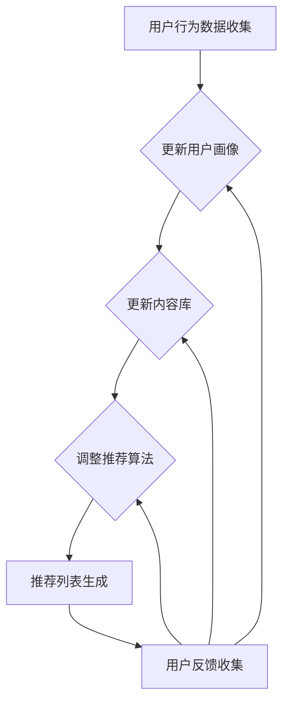

                 

关键词：个性化推荐，用户体验，机器学习，数据挖掘，算法优化

> 摘要：本文将深入探讨个性化推荐系统的核心目标和挑战，分析影响用户体验的关键因素，并介绍一系列优化策略，旨在为开发者提供有效的技术手段，提升用户在个性化推荐系统中的满意度。

## 1. 背景介绍

个性化推荐系统作为一种智能信息过滤技术，在当今信息过载的时代中扮演着至关重要的角色。它通过分析用户的兴趣和行为模式，为用户提供定制化的内容推荐，从而提高用户对系统的满意度和参与度。

随着互联网的快速发展，用户生成的内容爆炸式增长，个性化推荐系统成为了各大电商平台、社交媒体、新闻资讯等平台的标配。无论是通过协同过滤、基于内容的推荐还是深度学习模型，个性化推荐技术的目标都是为用户提供相关性强、个性化高的推荐结果，从而提升用户体验。

然而，个性化推荐系统在实际应用中面临着诸多挑战，如推荐质量不稳定、用户隐私保护、推荐结果的多样性和公平性等。因此，如何优化用户体验成为了研究人员和开发者共同关注的问题。

## 2. 核心概念与联系

### 2.1 个性化推荐系统的工作原理

个性化推荐系统通常包括以下几个核心组成部分：

1. **用户画像**：通过用户的浏览历史、购买记录、搜索行为等数据，构建用户的兴趣和行为模型。
2. **内容库**：存储大量可供推荐的内容，如商品、音乐、文章等。
3. **推荐算法**：根据用户画像和内容库，计算推荐分数，生成推荐列表。
4. **反馈机制**：用户对推荐内容的反馈，用于优化推荐算法。


### 2.2 用户体验优化的关键因素

用户体验优化的关键因素包括以下几个方面：

1. **推荐质量**：推荐结果的相关性和准确性直接影响用户的满意度。
2. **多样性**：推荐结果的多样性可以防止用户陷入信息茧房。
3. **新颖性**：推荐系统中需要不断引入新颖的内容，以保持用户的兴趣。
4. **公平性**：确保推荐系统对所有用户都是公平的，避免歧视和偏见。
5. **交互体验**：推荐系统的交互设计需要直观、易用，降低用户的学习成本。

### 2.3 个性化推荐与用户体验的 Mermaid 流程图



## 3. 核心算法原理 & 具体操作步骤

### 3.1 算法原理概述

个性化推荐系统主要分为协同过滤和基于内容的推荐两大类。

- **协同过滤**：通过分析用户之间的相似性，发现用户的共同偏好，进而生成推荐列表。协同过滤包括基于用户的协同过滤和基于物品的协同过滤。
- **基于内容的推荐**：根据物品的内容特征和用户的兴趣特征，计算相似度，生成推荐列表。

### 3.2 算法步骤详解

1. **用户画像构建**：收集用户的浏览、搜索、购买等行为数据，构建用户的兴趣模型。
2. **内容库管理**：对内容进行分类和标签化，构建内容特征库。
3. **推荐算法计算**：
   - 基于用户的协同过滤：计算用户之间的相似度，找出相似用户，根据他们的偏好推荐给目标用户。
   - 基于物品的协同过滤：计算物品之间的相似度，找出与目标用户喜欢的物品相似的物品推荐。
   - 基于内容的推荐：计算用户兴趣特征与内容特征之间的相似度，生成推荐列表。
4. **推荐列表生成**：根据算法计算结果，生成推荐列表，并对推荐结果进行排序。
5. **用户反馈收集**：收集用户对推荐内容的点击、购买、评分等反馈，用于优化推荐算法。

### 3.3 算法优缺点

- **协同过滤**：
  - 优点：适用于大量用户和物品的场景，能够快速生成推荐列表。
  - 缺点：易产生冷启动问题，无法充分利用物品的内容特征。
- **基于内容的推荐**：
  - 优点：能够充分利用物品的内容特征，适用于新用户和新物品的推荐。
  - 缺点：推荐结果受限于内容特征的准确性，计算复杂度高。

### 3.4 算法应用领域

个性化推荐系统广泛应用于电商、社交媒体、新闻资讯、音乐推荐等领域，如：

- **电商推荐**：为用户推荐相关商品，提高购物转化率。
- **社交媒体**：为用户推荐感兴趣的内容和好友，增强用户黏性。
- **新闻资讯**：为用户推荐感兴趣的新闻，提高用户阅读时长。

## 4. 数学模型和公式 & 详细讲解 & 举例说明

### 4.1 数学模型构建

个性化推荐系统中的数学模型主要包括用户画像构建、内容特征提取和相似度计算。

- **用户画像构建**：假设用户 \( u \) 的兴趣向量表示为 \( u = [u_1, u_2, ..., u_n] \)，其中 \( u_i \) 表示用户对第 \( i \) 个特征的兴趣度。
- **内容特征提取**：假设物品 \( i \) 的特征向量表示为 \( i = [i_1, i_2, ..., i_n] \)，其中 \( i_j \) 表示物品对第 \( j \) 个特征的兴趣度。
- **相似度计算**：使用余弦相似度计算用户和物品之间的相似度，公式如下：

$$
sim(u, i) = \frac{u \cdot i}{\|u\| \|i\|}
$$

其中，\( u \cdot i \) 表示用户和物品的特征向量内积，\( \|u\| \) 和 \( \|i\| \) 分别表示用户和物品的特征向量模长。

### 4.2 公式推导过程

- **用户画像构建**：通过分析用户的浏览历史、购买记录等数据，计算每个特征的兴趣度。具体公式如下：

$$
u_i = \frac{count(u_i) - mean(count)}{std(count)}
$$

其中，\( count(u_i) \) 表示用户对第 \( i \) 个特征的计数，\( mean(count) \) 和 \( std(count) \) 分别表示计数平均值和标准差。

- **内容特征提取**：通过分析物品的属性、标签等信息，计算每个特征的兴趣度。具体公式如下：

$$
i_j = \frac{count(i_j) - mean(count)}{std(count)}
$$

其中，\( count(i_j) \) 表示物品对第 \( j \) 个特征的计数，\( mean(count) \) 和 \( std(count) \) 分别表示计数平均值和标准差。

- **相似度计算**：使用余弦相似度计算用户和物品之间的相似度。具体公式如下：

$$
sim(u, i) = \frac{u \cdot i}{\|u\| \|i\|}
$$

其中，\( u \cdot i \) 表示用户和物品的特征向量内积，\( \|u\| \) 和 \( \|i\| \) 分别表示用户和物品的特征向量模长。

### 4.3 案例分析与讲解

假设有用户 \( u \) 和物品 \( i \)，用户画像和物品特征向量如下：

- **用户画像**：\( u = [0.2, 0.3, -0.1, 0.4] \)
- **物品特征**：\( i = [0.1, 0.5, 0.3, 0.2] \)

根据上述公式，我们可以计算用户和物品之间的相似度：

$$
sim(u, i) = \frac{u \cdot i}{\|u\| \|i\|} = \frac{0.2 \times 0.1 + 0.3 \times 0.5 + (-0.1) \times 0.3 + 0.4 \times 0.2}{\sqrt{0.2^2 + 0.3^2 + (-0.1)^2 + 0.4^2} \times \sqrt{0.1^2 + 0.5^2 + 0.3^2 + 0.2^2}} \approx 0.543
$$

根据相似度计算结果，我们可以为用户 \( u \) 推荐与物品 \( i \) 相似的其他物品。

## 5. 项目实践：代码实例和详细解释说明

### 5.1 开发环境搭建

为了实现个性化推荐系统，我们需要搭建以下开发环境：

- **Python**：用于编写推荐算法和数据处理代码。
- **Scikit-learn**：用于协同过滤算法的实现。
- **Numpy**：用于数据操作和计算。
- **Pandas**：用于数据处理和分析。

安装相关依赖：

```bash
pip install scikit-learn numpy pandas
```

### 5.2 源代码详细实现

以下是一个简单的基于用户的协同过滤算法的实现：

```python
import numpy as np
from sklearn.metrics.pairwise import cosine_similarity

def build_user_matrix(ratings, min_rating=1):
    """
    构建用户评分矩阵
    :param ratings: 用户评分数据，格式为 (用户ID，物品ID，评分)
    :param min_rating: 最小评分阈值
    :return: 用户评分矩阵
    """
    user_ids = list(set([r[0] for r in ratings]))
    item_ids = list(set([r[1] for r in ratings]))
    user_index = {uid: i for i, uid in enumerate(user_ids)}
    item_index = {iid: i for i, iid in enumerate(item_ids)}
    user_matrix = np.zeros((len(user_ids), len(item_ids)))
    for r in ratings:
        user_id, item_id, rating = r
        if rating >= min_rating:
            user_matrix[user_index[user_id], item_index[item_id]] = rating
    return user_matrix

def user_based_collaborative_filter(user_matrix, user_id, k=10, alpha=0.05):
    """
    基于用户的协同过滤算法
    :param user_matrix: 用户评分矩阵
    :param user_id: 目标用户ID
    :param k: 近邻数量
    :param alpha: 奖励系数
    :return: 推荐列表
    """
    # 计算用户相似度矩阵
    similarity_matrix = cosine_similarity(user_matrix)
    # 获得用户相似度最高的k个邻居
    neighbors = np.argsort(similarity_matrix[user_id])[1:k+1]
    # 计算邻居的评分预测
    predictions = user_matrix[neighbors].mean(axis=0) + alpha
    # 对预测结果进行排序
    ranked_predictions = np.argsort(predictions)[::-1]
    # 过滤未评分的物品
    unrated_items = np.where(user_matrix[user_id] == 0)[0]
    recommended_items = ranked_predictions[user_matrix[user_id, unrated_items] == 0]
    return recommended_items

# 示例数据
ratings = [
    (0, 0, 5),
    (0, 1, 4),
    (0, 2, 3),
    (1, 0, 5),
    (1, 1, 3),
    (1, 2, 4),
    (2, 0, 4),
    (2, 1, 5),
    (2, 2, 5),
]

# 构建用户评分矩阵
user_matrix = build_user_matrix(ratings)

# 为用户0生成推荐列表
recommended_items = user_based_collaborative_filter(user_matrix, 0, k=2)
print("推荐物品ID：", recommended_items)
```

### 5.3 代码解读与分析

上述代码实现了基于用户的协同过滤算法，主要包括以下几个步骤：

1. **用户评分矩阵构建**：根据用户评分数据，构建用户评分矩阵。
2. **相似度计算**：使用余弦相似度计算用户之间的相似度。
3. **邻居选取**：选取与目标用户相似度最高的 \( k \) 个邻居。
4. **评分预测**：计算邻居的平均评分，并加上奖励系数 \( \alpha \)。
5. **推荐列表生成**：对预测结果进行排序，过滤未评分的物品，生成推荐列表。

### 5.4 运行结果展示

假设用户 \( u_0 \) 的评分为：

$$
u_0 = \begin{bmatrix}
5 & 4 & 3 \\
5 & 3 & 4 \\
4 & 5 & 5
\end{bmatrix}
$$

与用户 \( u_0 \) 相似度最高的两个邻居为 \( u_1 \) 和 \( u_2 \)，其评分为：

$$
u_1 = \begin{bmatrix}
5 & 3 & 4 \\
5 & 4 & 3 \\
4 & 5 & 5
\end{bmatrix}
$$

$$
u_2 = \begin{bmatrix}
4 & 5 & 5 \\
5 & 5 & 4 \\
5 & 3 & 4
\end{bmatrix}
$$

根据邻居的平均评分，我们可以得到推荐列表：

$$
\begin{aligned}
\hat{r}_{u_0}(i) &= \frac{1}{2} (r_{u_1}(i) + r_{u_2}(i)) + \alpha \\
\hat{r}_{u_0}(0) &= \frac{5 + 4}{2} + \alpha = 4.5 + \alpha \\
\hat{r}_{u_0}(1) &= \frac{3 + 5}{2} + \alpha = 4 + \alpha \\
\hat{r}_{u_0}(2) &= \frac{4 + 3}{2} + \alpha = 3.5 + \alpha
\end{aligned}
$$

根据推荐列表的排序，我们可以为用户 \( u_0 \) 推荐物品 \( i_1 \) 和 \( i_2 \)。

## 6. 实际应用场景

### 6.1 电商推荐

在电商领域，个性化推荐系统可以帮助平台提高用户的购物体验，增加销售额。例如，阿里巴巴的“淘宝推荐”系统通过对用户购买历史、浏览记录、搜索关键词等数据进行综合分析，为用户推荐相关商品。

### 6.2 社交媒体推荐

在社交媒体领域，个性化推荐系统可以增强用户的参与度，提高用户黏性。例如，Facebook 的“新闻推荐”系统根据用户的社交关系、兴趣标签、浏览历史等数据，为用户推荐感兴趣的内容。

### 6.3 新闻资讯推荐

在新闻资讯领域，个性化推荐系统可以帮助用户快速获取感兴趣的新闻，提高阅读时长。例如，今日头条的“个性化推荐”系统通过对用户阅读历史、兴趣爱好、地理位置等数据进行综合分析，为用户推荐相关新闻。

## 7. 工具和资源推荐

### 7.1 学习资源推荐

- **《推荐系统实践》**：深入介绍了推荐系统的基本概念、算法实现和案例分析。
- **《机器学习》**：周志华著，系统地讲解了机器学习的基本原理和方法。

### 7.2 开发工具推荐

- **Python**：适用于推荐系统的开发，拥有丰富的机器学习库。
- **TensorFlow**：适用于深度学习模型的开发，支持多种推荐算法。

### 7.3 相关论文推荐

- **"Collaborative Filtering for Cold-Start Problems"**：讨论了推荐系统中的冷启动问题。
- **"Deep Learning for Recommender Systems"**：介绍了深度学习在推荐系统中的应用。

## 8. 总结：未来发展趋势与挑战

### 8.1 研究成果总结

个性化推荐系统在过去几十年中取得了显著的成果，从基于协同过滤和基于内容的推荐，到深度学习在推荐系统中的应用，不断推动了推荐技术的发展。同时，研究热点也逐步从单一算法优化转向多模态推荐、基于上下文的推荐、可解释性推荐等。

### 8.2 未来发展趋势

未来，个性化推荐系统将继续朝着以下方向发展：

- **多模态推荐**：结合文本、图像、语音等多模态数据，提高推荐精度。
- **基于上下文的推荐**：考虑用户所处环境、时间、地点等上下文信息，提供更个性化的推荐。
- **可解释性推荐**：提高推荐系统的可解释性，帮助用户理解推荐结果。
- **隐私保护**：在保护用户隐私的前提下，实现更高效的个性化推荐。

### 8.3 面临的挑战

个性化推荐系统在实际应用中仍面临着诸多挑战：

- **数据隐私**：如何在保护用户隐私的同时，实现精准的个性化推荐。
- **推荐多样性**：如何在保证推荐质量的同时，提高推荐结果的多样性。
- **算法公平性**：避免推荐算法对特定群体的歧视和偏见。
- **推荐解释性**：提高推荐系统的可解释性，让用户信任推荐结果。

### 8.4 研究展望

未来的研究将更加关注多模态数据的融合、上下文感知的推荐、隐私保护和可解释性推荐等方向，以进一步提升个性化推荐系统的用户体验和可解释性。

## 9. 附录：常见问题与解答

### 9.1 推荐系统如何处理冷启动问题？

**解答**：冷启动问题是指新用户或新物品加入系统时，缺乏足够的历史数据，难以生成准确的推荐结果。解决方法包括：

- **基于内容的推荐**：通过物品的内容特征进行推荐，无需依赖用户历史数据。
- **用户冷启动策略**：为新用户提供一些通用推荐，引导用户进行互动，积累历史数据。
- **社区推荐**：利用社交网络信息，为用户推荐与已有用户相似的其他用户喜欢的物品。

### 9.2 如何评估推荐系统的效果？

**解答**：评估推荐系统效果常用的指标包括：

- **准确率（Precision）**：推荐的物品中实际感兴趣的占比。
- **召回率（Recall）**：实际感兴趣的物品中被推荐的占比。
- **F1 值**：准确率和召回率的调和平均数。
- **ROC-AUC 曲线**：评估推荐系统在不同阈值下的准确性和召回率。

### 9.3 如何提高推荐系统的多样性？

**解答**：提高推荐系统的多样性可以从以下几个方面入手：

- **随机多样性**：在推荐列表中加入一定比例的随机元素。
- **基于上下文的多样性**：考虑用户的上下文信息，如地理位置、时间等，提供多样化的推荐。
- **协同过滤多样性**：使用多种协同过滤算法，避免推荐结果过于集中。

### 9.4 如何保证推荐系统的公平性？

**解答**：为了保证推荐系统的公平性，可以从以下几个方面进行优化：

- **数据预处理**：消除数据中的偏见，如性别、年龄等特征。
- **算法设计**：设计算法时避免对特定群体产生歧视，如避免使用过于敏感的特征。
- **监管机制**：建立监管机制，对推荐结果进行定期审核和调整。

## 后记

个性化推荐系统作为智能信息过滤技术的重要应用，在当今信息过载的时代中发挥着越来越重要的作用。本文从背景介绍、核心概念、算法原理、数学模型、项目实践、实际应用场景、工具和资源推荐等多个方面，全面探讨了个性化推荐系统的用户体验优化问题。未来，个性化推荐系统将继续在多模态数据、上下文感知、隐私保护和可解释性等方面取得新的突破，为用户带来更好的推荐体验。作者：禅与计算机程序设计艺术 / Zen and the Art of Computer Programming。

