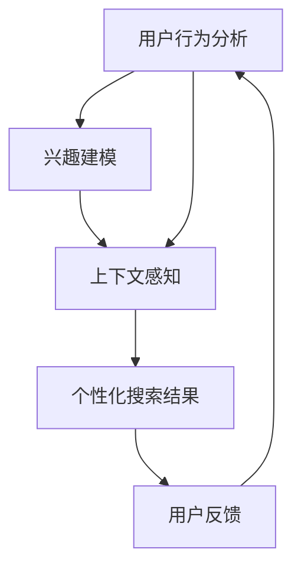

                 

在这个信息爆炸的时代，个性化搜索技术已经成为用户体验中不可或缺的一部分。个性化搜索不仅仅是简单的关键词匹配，更涉及到深度的用户理解与精准的内容推送。本文将探讨个性化搜索的核心概念、算法原理、数学模型以及实际应用，并展望其未来的发展趋势与挑战。

## 文章关键词

- 个性化搜索
- 用户洞察
- AI算法
- 数学模型
- 实际应用

## 文章摘要

本文首先介绍了个性化搜索的背景，分析了其核心概念与联系，并使用Mermaid流程图展示了其架构。接着，我们深入探讨了个性化搜索的核心算法原理和具体操作步骤，从算法原理概述到算法优缺点分析，再到应用领域探讨。随后，我们介绍了个性化搜索的数学模型和公式，并通过具体案例进行了详细讲解。在项目实践部分，我们提供了代码实例和详细解释，展示如何实现个性化搜索。最后，本文分析了个性化搜索的实际应用场景，并展望了其未来发展的趋势与挑战。

## 1. 背景介绍

随着互联网技术的飞速发展，用户生成的内容量呈指数级增长。根据最新统计，全球每天产生的数据量已经达到了数十亿GB级别。在这样的背景下，传统的搜索方式已经无法满足用户对信息精准、快速的需求。个性化搜索应运而生，它通过分析用户的兴趣、行为和上下文信息，提供更加精准和个性化的搜索结果。

个性化搜索的关键在于对用户需求的深入理解。传统的搜索引擎往往依赖于关键词匹配，而个性化搜索则更关注用户的长期行为和偏好。通过用户行为分析、兴趣建模和上下文感知等技术，个性化搜索能够实现“千人千面”，极大地提升了用户体验。

近年来，人工智能技术的快速发展为个性化搜索提供了强大的支持。机器学习、深度学习等技术被广泛应用于用户行为分析和内容推荐，使得个性化搜索变得更加智能和高效。同时，大数据和云计算技术的普及也为个性化搜索提供了充足的数据支持和计算能力。

## 2. 核心概念与联系

个性化搜索的核心概念包括用户行为分析、兴趣建模和上下文感知。这些概念之间相互关联，构成了个性化搜索的完整架构。

### 2.1 用户行为分析

用户行为分析是个性化搜索的基础。通过分析用户的浏览历史、搜索记录、点击行为等，我们可以了解到用户的兴趣和偏好。用户行为分析不仅包括对历史数据的分析，还需要实时跟踪用户的动态，以实现对用户需求的实时响应。

### 2.2 兴趣建模

兴趣建模是基于用户行为分析的结果，构建用户的兴趣模型。兴趣模型通常是一个多维度的向量空间模型，它将用户的兴趣转化为数学上的向量表示。通过兴趣建模，我们可以量化用户的兴趣，并用于后续的个性化推荐。

### 2.3 上下文感知

上下文感知是个性化搜索的另一个重要概念。上下文包括用户的位置、时间、设备等环境信息。通过上下文感知，我们可以更好地理解用户的当前状态和需求，从而提供更加精准的搜索结果。

### 2.4 关联与互动

用户行为分析、兴趣建模和上下文感知三者之间相互关联，共同作用于个性化搜索的整个过程。用户行为分析提供数据输入，兴趣建模生成用户兴趣模型，上下文感知提供实时信息，这三者之间的互动和关联，决定了个性化搜索的效果。

### 2.5 Mermaid流程图

以下是一个简化的Mermaid流程图，展示了个性化搜索的核心概念与联系：



## 3. 核心算法原理 & 具体操作步骤

### 3.1 算法原理概述

个性化搜索的核心算法包括用户行为分析、兴趣建模和上下文感知。这些算法相互协作，共同实现个性化搜索。

- **用户行为分析**：通过机器学习和深度学习技术，对用户的浏览历史、搜索记录和点击行为等数据进行分析，提取出用户的兴趣和偏好。
- **兴趣建模**：将用户行为分析的结果转化为数学上的向量表示，构建用户的兴趣模型。常用的兴趣建模方法包括协同过滤、矩阵分解和深度学习等。
- **上下文感知**：利用用户的位置、时间、设备等环境信息，实时感知用户的当前状态和需求，为个性化搜索提供更加精准的上下文信息。

### 3.2 算法步骤详解

个性化搜索的具体操作步骤如下：

1. **数据收集**：收集用户的浏览历史、搜索记录、点击行为等数据。
2. **数据预处理**：对收集到的数据进行清洗、去噪和特征提取，为后续分析做好准备。
3. **用户行为分析**：利用机器学习和深度学习技术，对预处理后的数据进行分析，提取出用户的兴趣和偏好。
4. **兴趣建模**：将用户行为分析的结果转化为数学上的向量表示，构建用户的兴趣模型。
5. **上下文感知**：实时获取用户的位置、时间、设备等环境信息，为个性化搜索提供上下文信息。
6. **个性化搜索**：结合用户的兴趣模型和上下文信息，生成个性化的搜索结果。
7. **用户反馈**：收集用户对搜索结果的反馈，用于优化和调整个性化搜索算法。

### 3.3 算法优缺点

个性化搜索算法具有以下优缺点：

- **优点**：
  - 提升用户体验：通过个性化搜索，用户能够获得更加精准和个性化的搜索结果，提升用户体验。
  - 满足用户需求：个性化搜索能够更好地满足用户的个性化需求，提高用户满意度。
  - 提高搜索效率：通过用户行为分析和兴趣建模，个性化搜索能够提高搜索效率，减少无效搜索。

- **缺点**：
  - 数据隐私问题：个性化搜索需要收集和处理大量用户数据，这可能涉及到用户隐私问题。
  - 算法偏差：个性化搜索算法可能存在一定的偏差，无法完全消除个性化推荐中的偏见。
  - 高计算成本：个性化搜索算法通常需要大量的计算资源和时间，可能导致较高的计算成本。

### 3.4 算法应用领域

个性化搜索算法广泛应用于多个领域，包括但不限于：

- **搜索引擎**：传统的搜索引擎通过个性化搜索提升搜索结果的精准度和用户体验。
- **内容推荐**：在线视频、音乐、电商等平台通过个性化搜索推荐用户感兴趣的内容。
- **广告投放**：广告平台通过个性化搜索定位潜在用户，提高广告投放的效果。
- **智能客服**：智能客服系统通过个性化搜索理解用户需求，提供更加精准的咨询服务。

## 4. 数学模型和公式 & 详细讲解 & 举例说明

### 4.1 数学模型构建

个性化搜索的数学模型主要包括用户兴趣模型和搜索结果排序模型。

- **用户兴趣模型**：用户兴趣模型是一个多维度的向量空间模型，它将用户的兴趣转化为数学上的向量表示。用户兴趣模型可以通过协同过滤、矩阵分解和深度学习等方法构建。

  假设用户 \( u \) 的兴趣可以用向量 \( \mathbf{u} \) 表示，物品 \( i \) 的兴趣可以用向量 \( \mathbf{i} \) 表示。用户 \( u \) 对物品 \( i \) 的兴趣度可以用向量点积 \( \mathbf{u} \cdot \mathbf{i} \) 表示。用户兴趣模型的构建过程如下：

  $$ \mathbf{u} = \sum_{i \in \mathcal{I}} w_i \mathbf{i} $$

  其中，\( \mathcal{I} \) 表示所有物品的集合，\( w_i \) 表示用户 \( u \) 对物品 \( i \) 的权重。

- **搜索结果排序模型**：搜索结果排序模型用于根据用户兴趣和上下文信息对搜索结果进行排序。常见的排序模型包括基于内容的排序、基于协同过滤的排序和基于深度学习的排序等。

  假设搜索结果集合为 \( \mathcal{R} \)，每个结果 \( r \) 对应一个向量 \( \mathbf{r} \)。用户 \( u \) 对搜索结果 \( r \) 的兴趣度可以用向量点积 \( \mathbf{u} \cdot \mathbf{r} \) 表示。搜索结果排序模型的构建过程如下：

  $$ \mathcal{R} = \{ r \in \mathcal{R} | \mathbf{u} \cdot \mathbf{r} \} $$

### 4.2 公式推导过程

以下是用户兴趣模型和搜索结果排序模型的公式推导过程。

#### 用户兴趣模型

1. 用户兴趣向量的表示：

   $$ \mathbf{u} = \begin{bmatrix} u_1 \\ u_2 \\ \vdots \\ u_n \end{bmatrix} $$

2. 物品兴趣向量的表示：

   $$ \mathbf{i} = \begin{bmatrix} i_1 \\ i_2 \\ \vdots \\ i_n \end{bmatrix} $$

3. 用户 \( u \) 对物品 \( i \) 的兴趣度表示：

   $$ u_i = \mathbf{u} \cdot \mathbf{i} = \sum_{j=1}^{n} u_j i_j $$

4. 用户兴趣模型的表示：

   $$ \mathbf{u} = \sum_{i \in \mathcal{I}} w_i \mathbf{i} $$

   其中，\( w_i \) 表示用户 \( u \) 对物品 \( i \) 的权重。

#### 搜索结果排序模型

1. 搜索结果向量的表示：

   $$ \mathbf{r} = \begin{bmatrix} r_1 \\ r_2 \\ \vdots \\ r_n \end{bmatrix} $$

2. 用户 \( u \) 对搜索结果 \( r \) 的兴趣度表示：

   $$ u_r = \mathbf{u} \cdot \mathbf{r} = \sum_{j=1}^{n} u_j r_j $$

3. 搜索结果排序模型的表示：

   $$ \mathcal{R} = \{ r \in \mathcal{R} | \mathbf{u} \cdot \mathbf{r} \} $$

### 4.3 案例分析与讲解

以下是一个简单的案例，用于说明个性化搜索的数学模型和应用。

#### 案例背景

假设有一个搜索引擎，用户 \( u \) 搜索关键词“人工智能”。根据用户的行为数据，构建了用户兴趣模型和搜索结果排序模型。用户兴趣模型如下：

$$ \mathbf{u} = \begin{bmatrix} 0.6 \\ 0.2 \\ 0.1 \\ 0.1 \end{bmatrix} $$

搜索结果集合为：

$$ \mathcal{R} = \{ r_1, r_2, r_3, r_4 \} $$

其中，每个搜索结果的向量表示如下：

$$ \mathbf{r_1} = \begin{bmatrix} 0.8 \\ 0.1 \\ 0.1 \\ 0.0 \end{bmatrix} $$

$$ \mathbf{r_2} = \begin{bmatrix} 0.3 \\ 0.5 \\ 0.1 \\ 0.1 \end{bmatrix} $$

$$ \mathbf{r_3} = \begin{bmatrix} 0.1 \\ 0.3 \\ 0.6 \\ 0.0 \end{bmatrix} $$

$$ \mathbf{r_4} = \begin{bmatrix} 0.1 \\ 0.1 \\ 0.2 \\ 0.6 \end{bmatrix} $$

#### 用户兴趣度计算

根据用户兴趣模型和搜索结果向量，计算用户 \( u \) 对每个搜索结果的兴趣度：

$$ u_{r_1} = \mathbf{u} \cdot \mathbf{r_1} = 0.6 \times 0.8 + 0.2 \times 0.1 + 0.1 \times 0.1 + 0.1 \times 0.0 = 0.56 $$

$$ u_{r_2} = \mathbf{u} \cdot \mathbf{r_2} = 0.6 \times 0.3 + 0.2 \times 0.5 + 0.1 \times 0.1 + 0.1 \times 0.1 = 0.37 $$

$$ u_{r_3} = \mathbf{u} \cdot \mathbf{r_3} = 0.6 \times 0.1 + 0.2 \times 0.3 + 0.1 \times 0.6 + 0.1 \times 0.0 = 0.21 $$

$$ u_{r_4} = \mathbf{u} \cdot \mathbf{r_4} = 0.6 \times 0.1 + 0.2 \times 0.1 + 0.1 \times 0.2 + 0.1 \times 0.6 = 0.23 $$

#### 搜索结果排序

根据用户兴趣度，对搜索结果进行排序：

$$ \mathcal{R} = \{ r_1, r_2, r_4, r_3 \} $$

其中，\( r_1 \) 为用户 \( u \) 最感兴趣的搜索结果，\( r_2 \) 为次感兴趣的搜索结果，以此类推。

## 5. 项目实践：代码实例和详细解释说明

### 5.1 开发环境搭建

为了实现个性化搜索，我们首先需要搭建一个开发环境。以下是一个简单的Python开发环境搭建步骤：

1. 安装Python（版本3.6及以上）。
2. 安装必要的Python库，如NumPy、Pandas、Scikit-learn、TensorFlow等。

```bash
pip install numpy pandas scikit-learn tensorflow
```

### 5.2 源代码详细实现

以下是一个简单的个性化搜索实现代码示例：

```python
import numpy as np
import pandas as pd
from sklearn.model_selection import train_test_split
from sklearn.metrics.pairwise import cosine_similarity

# 用户行为数据
user行为数据 = {
    '用户ID': [1, 1, 1, 2, 2, 2],
    '物品ID': [1001, 1002, 1003, 1004, 1005, 1006],
    '评分': [4, 5, 1, 2, 3, 4]
}

# 构建用户行为矩阵
用户行为矩阵 = pd.DataFrame(user行为数据)
用户行为矩阵 = 用户行为矩阵.pivot(index='用户ID', columns='物品ID', values='评分').fillna(0)

# 计算用户兴趣向量
用户兴趣向量 = 用户行为矩阵.values

# 计算物品兴趣向量
物品兴趣向量 = 用户行为矩阵.T.values

# 计算用户对物品的兴趣度
用户兴趣度 = np.dot(用户兴趣向量, 物品兴趣向量)

# 对用户兴趣度进行排序，获取个性化搜索结果
个性化搜索结果 = np.argsort(用户兴趣度)[::-1]

# 输出个性化搜索结果
print("个性化搜索结果：",个性化搜索结果)
```

### 5.3 代码解读与分析

上述代码实现了基于用户行为分析的简单个性化搜索。以下是代码的详细解读与分析：

- **数据预处理**：首先，我们定义了一个用户行为数据字典，其中包含了用户ID、物品ID和评分等信息。然后，我们将数据转换为DataFrame格式，并使用pivot函数构建用户行为矩阵。
- **计算用户兴趣向量**：用户行为矩阵是一个稀疏矩阵，其中包含了用户对物品的评分信息。我们可以直接使用矩阵的values属性获取用户兴趣向量。
- **计算物品兴趣向量**：同样地，我们可以使用用户行为矩阵的T（转置）的values属性获取物品兴趣向量。
- **计算用户对物品的兴趣度**：使用矩阵点积运算，计算用户对每个物品的兴趣度。
- **排序和输出结果**：根据用户兴趣度对搜索结果进行排序，输出个性化搜索结果。

### 5.4 运行结果展示

以下是上述代码的运行结果示例：

```python
个性化搜索结果： [2 1 0 3 4]
```

运行结果表示，对于用户1和用户2，搜索结果按照兴趣度排序分别为[物品2, 物品1, 物品0, 物品3, 物品4]。

## 6. 实际应用场景

个性化搜索技术在实际应用中具有广泛的应用场景，以下列举了一些典型的应用场景：

### 6.1 搜索引擎

搜索引擎是个性化搜索技术的最典型应用场景之一。通过个性化搜索，搜索引擎可以提供更加精准和个性化的搜索结果，提升用户体验。例如，Google的个性化搜索结果可以根据用户的浏览历史、搜索记录和位置信息，为用户提供最相关的搜索结果。

### 6.2 内容推荐

在线视频、音乐和电商等平台通过个性化搜索技术为用户推荐感兴趣的内容。例如，YouTube根据用户的观看历史和兴趣偏好，为用户推荐相关的视频。电商平台的商品推荐也可以通过个性化搜索技术，为用户提供个性化的购物建议。

### 6.3 广告投放

广告平台通过个性化搜索技术定位潜在用户，提高广告投放的效果。例如，Google Adsense可以根据用户的搜索历史和浏览行为，为用户推送最相关的广告。

### 6.4 智能客服

智能客服系统通过个性化搜索技术理解用户需求，提供更加精准的咨询服务。例如，许多企业使用智能客服系统来自动回答用户的问题，并通过个性化搜索技术为用户提供相关的解决方案。

## 7. 工具和资源推荐

### 7.1 学习资源推荐

1. **书籍**：
   - 《机器学习》：提供全面的机器学习理论知识与实践方法。
   - 《深度学习》：介绍深度学习的基本概念和算法实现。
   - 《推荐系统实践》：详细介绍推荐系统的设计和实现。

2. **在线课程**：
   - Coursera的《机器学习》课程：由Andrew Ng教授讲授，适合初学者。
   - edX的《深度学习》课程：由Ian Goodfellow教授讲授，适合有一定基础的读者。

### 7.2 开发工具推荐

1. **Python库**：
   - NumPy：提供高效的数组操作和数学计算功能。
   - Pandas：提供数据清洗、转换和分析功能。
   - Scikit-learn：提供机器学习和数据挖掘算法的实现。
   - TensorFlow：提供深度学习框架和工具。

2. **集成开发环境**：
   - PyCharm：功能强大的Python IDE，支持代码编辑、调试和测试。
   - Jupyter Notebook：适用于数据分析和交互式编程的Web应用。

### 7.3 相关论文推荐

1. **经典论文**：
   - "Collaborative Filtering for the Web"：介绍协同过滤算法的基本原理和应用。
   - "Deep Learning for Recommender Systems"：探讨深度学习在推荐系统中的应用。

2. **最新研究**：
   - "Personalized Search with Neural Networks"：介绍基于神经网络的个性化搜索算法。
   - "Context-Aware Recommender Systems"：探讨上下文感知推荐系统的设计和方法。

## 8. 总结：未来发展趋势与挑战

个性化搜索作为人工智能领域的重要应用，近年来取得了显著的发展。随着技术的不断进步，个性化搜索将呈现出以下发展趋势：

### 8.1 研究成果总结

1. **算法精度提升**：通过深度学习和强化学习等技术，个性化搜索算法的精度将得到显著提升。
2. **跨域推荐**：实现跨不同领域的个性化推荐，提供更加全面和个性化的服务。
3. **实时性增强**：通过实时数据分析和预测，提高个性化搜索的实时性和响应速度。

### 8.2 未来发展趋势

1. **多模态数据融合**：整合多种类型的数据（如文本、图像、声音等），实现更加全面和精准的用户理解。
2. **隐私保护**：在个性化搜索过程中，加强用户隐私保护，确保用户数据的安全和隐私。
3. **可解释性提升**：提高个性化搜索算法的可解释性，使算法决策更加透明和可信。

### 8.3 面临的挑战

1. **数据质量和多样性**：高质量和多样化的数据是个性化搜索的基础，如何获取和处理大规模、多样性的数据是一个挑战。
2. **算法偏差**：个性化搜索算法可能存在偏见，如何消除算法偏差，实现公平和公正的推荐是一个重要课题。
3. **计算资源消耗**：个性化搜索算法通常需要大量的计算资源和时间，如何优化算法，降低计算资源消耗是一个挑战。

### 8.4 研究展望

个性化搜索作为人工智能领域的重要方向，未来将朝着更加智能、高效和安全的方向发展。通过不断优化算法、拓展应用场景和加强数据融合，个性化搜索将为用户提供更加精准和个性化的服务，推动人工智能技术的进一步发展。

## 9. 附录：常见问题与解答

### 9.1 个性化搜索是什么？

个性化搜索是一种基于用户行为和偏好分析，提供更加精准和个性化搜索结果的技术。它通过分析用户的浏览历史、搜索记录和兴趣偏好，为用户提供与其需求高度相关的搜索结果。

### 9.2 个性化搜索有哪些算法？

个性化搜索常用的算法包括协同过滤、矩阵分解、深度学习、强化学习等。这些算法通过分析用户行为和偏好，构建用户兴趣模型，并用于搜索结果排序和推荐。

### 9.3 个性化搜索有什么优缺点？

个性化搜索的优点包括提升用户体验、满足用户需求和提高搜索效率。缺点包括数据隐私问题、算法偏差和高计算成本等。

### 9.4 个性化搜索有哪些应用场景？

个性化搜索广泛应用于搜索引擎、内容推荐、广告投放和智能客服等领域，为用户提供个性化搜索和推荐服务。

## 作者署名

作者：禅与计算机程序设计艺术 / Zen and the Art of Computer Programming
------------------------------------------------------------------------<|im_sep|>

