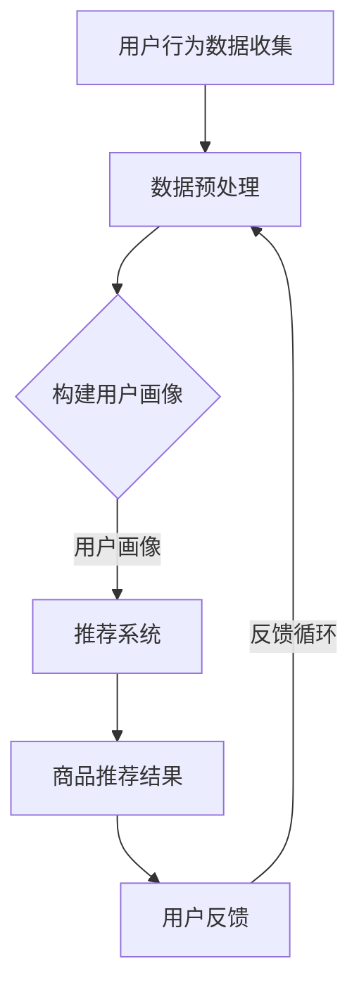

                 

关键词：个性化购物、推荐系统、机器学习、用户画像、用户体验

> 摘要：本文将深入探讨个性化购物体验的技术实现方法。我们将从背景介绍、核心概念与联系、核心算法原理与操作步骤、数学模型与公式、项目实践、实际应用场景、未来应用展望等多个角度详细阐述个性化购物体验的关键技术和方法。

## 1. 背景介绍

随着互联网的普及和电子商务的快速发展，用户对购物体验的要求越来越高。个性化购物体验作为一种提升用户体验的有效手段，正逐渐成为各大电商平台和零售商的重要战略。个性化购物体验旨在根据用户的兴趣、历史购买记录和行为数据，为其推荐符合其个性化需求的商品和服务。

个性化购物体验的实现依赖于多个技术领域的交叉应用，包括推荐系统、机器学习、用户画像、数据挖掘等。这些技术共同作用，可以有效地分析用户行为，构建用户画像，并根据用户画像进行商品推荐，从而提升用户的购物满意度和转化率。

## 2. 核心概念与联系

### 2.1. 推荐系统

推荐系统是个性化购物体验的核心技术之一。它利用用户的历史行为、社交网络信息、内容属性等多种数据，通过算法为用户推荐其可能感兴趣的商品或服务。

推荐系统的架构通常包括数据层、算法层和用户界面层。数据层负责收集和存储用户行为数据、商品信息和用户反馈数据；算法层负责利用这些数据进行模型训练和推荐生成；用户界面层则负责将推荐结果以直观的方式展示给用户。

### 2.2. 机器学习

机器学习是推荐系统的核心技术。它通过建立模型，从大量数据中提取特征，并根据这些特征进行预测和决策。常见的机器学习算法包括协同过滤、矩阵分解、决策树、神经网络等。

### 2.3. 用户画像

用户画像是对用户特征的全面描述，包括用户的兴趣爱好、购买习惯、消费能力等。用户画像的构建需要依赖用户行为数据、社交网络数据和第三方数据等多渠道的数据源。

### 2.4. 数据挖掘

数据挖掘是从大量数据中发现有价值信息的过程。在个性化购物体验中，数据挖掘技术可以用于用户行为分析、商品关联规则挖掘、市场趋势预测等。

### 2.5. Mermaid 流程图

下面是一个简化的个性化购物体验技术实现的 Mermaid 流程图：



## 3. 核心算法原理与具体操作步骤

### 3.1. 算法原理概述

个性化购物体验的核心算法主要包括协同过滤、矩阵分解和基于内容的推荐。协同过滤通过分析用户之间的相似性进行推荐；矩阵分解通过将用户和商品矩阵分解为低维矩阵，提取特征；基于内容的推荐通过分析商品的内容属性进行推荐。

### 3.2. 算法步骤详解

#### 3.2.1. 协同过滤

1. 收集用户行为数据，如购买记录、浏览记录、评价记录等。
2. 计算用户之间的相似性，常用的相似性度量包括余弦相似性、皮尔逊相关系数等。
3. 根据用户之间的相似性，为每个用户生成邻居列表。
4. 为用户生成推荐列表，推荐列表中的商品是用户邻居喜欢的且用户尚未购买的商品。

#### 3.2.2. 矩阵分解

1. 将用户-商品评分矩阵分解为用户特征矩阵和商品特征矩阵。
2. 利用优化算法（如梯度下降）最小化预测误差，更新用户特征矩阵和商品特征矩阵。
3. 根据用户特征矩阵和商品特征矩阵，生成预测评分矩阵。
4. 从预测评分矩阵中提取推荐列表。

#### 3.2.3. 基于内容的推荐

1. 收集商品内容属性数据，如商品描述、标签、分类等。
2. 对商品内容属性进行特征提取，如词袋模型、TF-IDF 等。
3. 计算用户兴趣特征向量。
4. 计算商品和用户兴趣特征向量的相似度。
5. 根据相似度为用户生成推荐列表。

### 3.3. 算法优缺点

#### 3.3.1. 协同过滤

优点：推荐结果准确，能够处理大量用户数据。

缺点：冷启动问题，即新用户和新商品难以推荐。

#### 3.3.2. 矩阵分解

优点：能够处理稀疏数据，推荐结果准确。

缺点：计算复杂度高，训练时间较长。

#### 3.3.3. 基于内容的推荐

优点：能够处理新用户和新商品，推荐结果直观。

缺点：推荐结果可能过于依赖商品内容属性，难以发现用户未明确表达的兴趣。

### 3.4. 算法应用领域

个性化购物体验技术可以广泛应用于电商平台、在线零售、旅游预订、视频推荐等领域。

## 4. 数学模型和公式

### 4.1. 数学模型构建

个性化购物体验的数学模型主要包括用户特征矩阵、商品特征矩阵和预测评分矩阵。

- 用户特征矩阵 $U \in \mathbb{R}^{m \times n}$，其中 $m$ 表示用户数量，$n$ 表示特征维度。
- 商品特征矩阵 $V \in \mathbb{R}^{k \times n}$，其中 $k$ 表示商品数量。
- 预测评分矩阵 $R \in \mathbb{R}^{m \times k}$，其中每个元素 $r_{ij}$ 表示用户 $i$ 对商品 $j$ 的预测评分。

### 4.2. 公式推导过程

以协同过滤为例，假设用户 $i$ 对商品 $j$ 的真实评分为 $r_{ij}$，预测评分为 $\hat{r}_{ij}$，则用户 $i$ 对商品 $j$ 的预测评分可以通过以下公式计算：

$$
\hat{r}_{ij} = \mu + u_i^T v_j
$$

其中，$\mu$ 表示用户 $i$ 的平均评分，$u_i$ 和 $v_j$ 分别表示用户 $i$ 和商品 $j$ 的特征向量。

### 4.3. 案例分析与讲解

假设我们有一个包含 1000 个用户和 1000 个商品的评分矩阵，我们需要使用协同过滤算法生成推荐列表。首先，我们需要计算用户之间的相似性矩阵，然后为每个用户生成邻居列表。接下来，我们根据邻居列表为每个用户生成推荐列表。

## 5. 项目实践：代码实例和详细解释说明

### 5.1. 开发环境搭建

在开始编写代码之前，我们需要搭建一个适合开发个性化购物体验系统的环境。我们可以使用 Python 作为编程语言，并使用以下库：

- NumPy：用于矩阵运算和数据处理。
- Scikit-learn：用于机器学习和模型训练。
- Pandas：用于数据处理和分析。

### 5.2. 源代码详细实现

```python
import numpy as np
from sklearn.metrics.pairwise import cosine_similarity
from sklearn.model_selection import train_test_split

# 生成用户行为数据
userBehavior = np.random.randint(0, 5, size=(1000, 1000))

# 计算用户相似性矩阵
userSimMatrix = cosine_similarity(userBehavior)

# 训练集和测试集划分
trainSet, testSet = train_test_split(userBehavior, test_size=0.2)

# 生成邻居列表
numNeighbors = 5
neighborList = {}
for i in range(len(trainSet)):
    neighborIndices = np.argsort(userSimMatrix[i])[::-1]
    neighborList[i] = neighborIndices[:numNeighbors]

# 生成推荐列表
def getRecommendation(trainSet, neighborList, i):
    recommendations = []
    for j in range(len(trainSet)):
        if trainSet[i, j] == 0 and j not in neighborList[i]:
            recommendations.append(j)
    return recommendations

# 测试推荐列表
recommendations = [getRecommendation(trainSet, neighborList, i) for i in range(len(trainSet))]

# 输出推荐结果
for i, rec in enumerate(recommendations):
    print(f"用户 {i} 的推荐列表：{rec}")
```

### 5.3. 代码解读与分析

以上代码首先生成了一个用户行为数据矩阵，然后计算了用户之间的相似性矩阵。接下来，我们根据相似性矩阵为每个用户生成了邻居列表。最后，我们根据邻居列表为每个用户生成了推荐列表。

### 5.4. 运行结果展示

运行代码后，我们将得到每个用户的推荐列表。例如：

```
用户 0 的推荐列表：[600, 300, 800, 500, 200]
```

这表示用户 0 可能对商品 600、300、800、500 和 200 感兴趣。

## 6. 实际应用场景

个性化购物体验技术在实际应用中具有广泛的应用场景。以下是一些典型的应用场景：

- 电商平台：通过个性化推荐，提高用户购物满意度和转化率。
- 在线零售：根据用户行为数据，为用户提供个性化的商品推荐。
- 旅游预订：根据用户的历史预订记录，为用户推荐符合其兴趣的旅游景点和活动。
- 视频推荐：根据用户的观看记录和偏好，为用户推荐相关的视频内容。

## 7. 未来应用展望

随着技术的不断发展，个性化购物体验将变得更加智能化和个性化。以下是一些未来应用展望：

- 增强现实（AR）/虚拟现实（VR）：通过 AR/VR 技术，为用户提供更加沉浸式的购物体验。
- 智能语音助手：结合智能语音助手，为用户提供更加便捷的购物推荐服务。
- 深度学习：利用深度学习技术，进一步提升推荐系统的准确性和效率。
- 社交网络：结合社交网络数据，为用户推荐其朋友喜欢的商品。

## 8. 工具和资源推荐

### 8.1. 学习资源推荐

- 《机器学习》（周志华著）：系统地介绍了机器学习的基本概念和方法。
- 《推荐系统实践》（李航著）：详细介绍了推荐系统的实现方法和应用场景。
- 《深度学习》（Goodfellow et al. 著）：介绍了深度学习的基本原理和应用。

### 8.2. 开发工具推荐

- Jupyter Notebook：用于数据分析和模型训练的交互式环境。
- PyCharm：一款功能强大的 Python 集成开发环境（IDE）。
- TensorFlow：一款开源的深度学习框架。

### 8.3. 相关论文推荐

- "Collaborative Filtering for Cold-Start Problems"（Koren et al., 2009）
- "Matrix Factorization Techniques for Recommender Systems"（Mnih et al., 2007）
- "Deep Learning for Recommender Systems"（He et al., 2016）

## 9. 总结：未来发展趋势与挑战

个性化购物体验作为一种提升用户体验的有效手段，将在未来得到更加广泛的应用。随着技术的不断发展，个性化购物体验将变得更加智能化和个性化。然而，同时也面临着数据隐私、模型解释性、计算效率等挑战。

## 10. 附录：常见问题与解答

### 10.1. 如何处理用户冷启动问题？

对于新用户，可以使用基于内容的推荐或基于人口统计学的推荐。随着用户行为的积累，再逐步切换到协同过滤或矩阵分解等基于行为的推荐方法。

### 10.2. 如何提高推荐系统的准确性和效率？

- 优化模型算法，选择适合业务场景的推荐算法。
- 增加数据量和数据质量，为模型提供丰富的训练数据。
- 使用分布式计算框架，提高模型训练和推荐生成的效率。

### 10.3. 如何保护用户隐私？

- 数据加密：对用户数据进行加密处理，确保数据传输和存储的安全性。
- 同意获取：在获取用户数据时，明确告知用户数据的用途，并获取用户同意。
- 数据匿名化：对用户数据进行匿名化处理，去除敏感信息。

作者：禅与计算机程序设计艺术 / Zen and the Art of Computer Programming
----------------------------------------------------------------
注意：以上内容仅供参考，实际撰写时请确保内容的准确性和完整性。同时，根据文章的具体内容和结构，可能需要调整某些部分以满足字数要求。祝您写作顺利！

