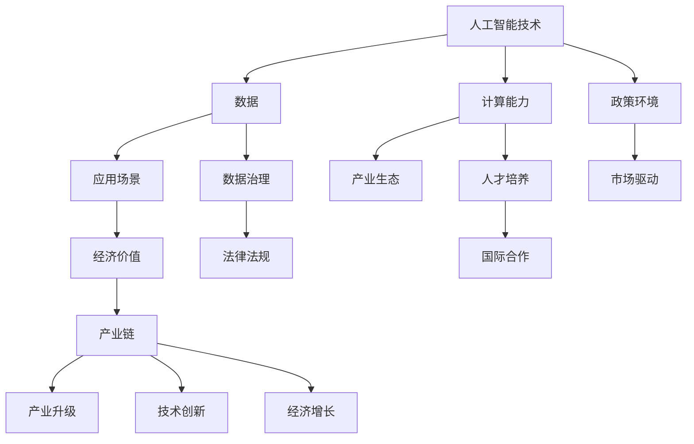

                 

关键词：人工智能、AI经济周期、机遇、挑战、技术发展、产业发展、创新驱动

> 摘要：随着人工智能技术的迅速发展，中国已经进入了一个全新的AI经济周期。本文将探讨中国在这一周期中所面临的机遇与挑战，分析我国人工智能产业的发展现状，展望未来发展趋势，并探讨如何应对这些挑战，实现人工智能技术的可持续发展。

## 1. 背景介绍

人工智能（Artificial Intelligence，AI）作为计算机科学的一个分支，旨在使计算机系统能够模拟人类的智能行为。自20世纪50年代起，人工智能领域取得了诸多突破，尤其在深度学习、自然语言处理、计算机视觉等方面，技术的飞速发展极大地提升了AI系统的性能和应用范围。随着大数据、云计算等技术的不断发展，人工智能的应用场景愈加广泛，从智能家居、智能交通到金融、医疗，AI正在深刻改变着各行各业。

近年来，中国政府高度重视人工智能技术发展，将人工智能列为国家战略，提出了“新一代人工智能发展规划”，旨在通过政策引导、资金支持、人才培养等多方面措施，加速人工智能技术的研究和应用。在全球范围内，中国已经成为人工智能技术创新和应用的重要力量。

## 2. 核心概念与联系

在探讨中国AI经济周期的机遇与挑战之前，有必要先了解一些核心概念和它们之间的联系。以下是一个简化的Mermaid流程图，用以描述这些核心概念及其相互作用。



### 2.1 人工智能技术

人工智能技术是整个AI经济周期的核心。它包括机器学习、深度学习、自然语言处理、计算机视觉等多个子领域。人工智能技术的进步，不仅提高了计算机系统的智能化程度，也为各行业提供了创新的解决方案。

### 2.2 数据

数据是人工智能的燃料。大数据的积累和数据的多样化，为人工智能的训练和应用提供了丰富的资源。数据的质量和多样性直接影响AI系统的性能和效果。

### 2.3 计算能力

计算能力的提升是人工智能发展的关键因素。高性能计算集群和分布式计算技术的应用，使得大规模数据分析和复杂算法的实现成为可能。

### 2.4 应用场景

应用场景是人工智能技术价值的体现。通过将人工智能技术应用到实际场景中，可以解决各种复杂问题，提高生产效率，降低成本。

### 2.5 产业生态

产业生态包括产业链上下游的企业、研究机构、投资者等。一个健康的产业生态能够促进技术的创新和应用，加速产业的发展。

### 2.6 经济价值

经济价值是AI技术应用的直接体现。通过提升效率、降低成本、创造新的商业模式，人工智能技术为经济增长注入了新的动力。

### 2.7 政策环境

政策环境是影响AI技术发展的重要因素。政府通过制定战略规划、提供资金支持、优化法律法规等手段，为人工智能技术的发展提供了良好的环境。

### 2.8 数据治理

数据治理包括数据安全、隐私保护、数据标准化等方面。有效的数据治理能够保障数据的质量和安全，促进AI技术的健康发展。

### 2.9 人才培养

人才培养是人工智能发展的基石。通过培养一批高素质的人工智能专业人才，可以为AI技术的创新和应用提供强有力的支持。

### 2.10 国际合作

国际合作是推动人工智能技术全球发展的重要途径。通过国际合作，可以分享技术成果、经验，加速全球人工智能技术的进步。

## 3. 核心算法原理 & 具体操作步骤

### 3.1 算法原理概述

人工智能技术的核心在于算法。以下是一些人工智能领域中的核心算法原理：

- **深度学习（Deep Learning）**：基于神经网络的结构，通过多层非线性变换来提取数据特征，具有很强的表达能力和泛化能力。
- **强化学习（Reinforcement Learning）**：通过与环境的交互，通过试错来学习最优策略，适用于策略优化和决策问题。
- **生成对抗网络（GANs）**：由生成器和判别器组成，通过对抗训练生成逼真的数据，广泛应用于图像生成、数据增强等。
- **自然语言处理（NLP）**：通过处理和理解自然语言，实现人机交互和信息检索等功能，是AI领域的重要研究方向。

### 3.2 算法步骤详解

以深度学习为例，其具体操作步骤如下：

1. **数据收集**：收集大规模的数据集，用于模型训练。
2. **数据预处理**：对数据进行清洗、归一化等预处理，以提高模型训练效果。
3. **模型设计**：设计神经网络结构，包括选择合适的激活函数、损失函数等。
4. **模型训练**：通过反向传播算法，利用梯度下降等优化方法，对模型进行训练。
5. **模型评估**：使用验证集和测试集，评估模型性能，调整模型参数。
6. **模型部署**：将训练好的模型部署到实际应用场景中，实现自动化决策。

### 3.3 算法优缺点

- **深度学习**：具有强大的表达能力和泛化能力，但需要大量数据和计算资源，模型训练过程复杂。
- **强化学习**：能够通过试错学习最优策略，但训练过程较慢，且对环境有一定的依赖性。
- **GANs**：能够生成高质量的数据，但训练过程不稳定，容易出现模式崩溃等问题。
- **NLP**：在处理和理解自然语言方面取得了显著进展，但仍然存在语义理解和上下文理解等挑战。

### 3.4 算法应用领域

- **计算机视觉**：图像分类、目标检测、图像生成等。
- **自然语言处理**：文本分类、情感分析、机器翻译等。
- **游戏AI**：智能游戏对手、策略优化等。
- **金融**：风险评估、量化交易、智能投顾等。
- **医疗**：疾病诊断、药物研发、医疗影像分析等。

## 4. 数学模型和公式 & 详细讲解 & 举例说明

### 4.1 数学模型构建

以神经网络中的反向传播算法为例，其核心公式如下：

$$
\begin{aligned}
&\frac{\partial L}{\partial w} = \frac{\partial L}{\partial z} \cdot \frac{\partial z}{\partial w} \\
&\frac{\partial L}{\partial b} = \frac{\partial L}{\partial z} \cdot \frac{\partial z}{\partial b}
\end{aligned}
$$

其中，$L$ 表示损失函数，$w$ 和 $b$ 分别表示权重和偏置，$z$ 表示中间层的输出。

### 4.2 公式推导过程

反向传播算法的推导过程涉及链式法则和偏导数的计算。以下是一个简化的推导过程：

1. **前向传播**：计算每层神经元的输出值。
2. **计算损失函数**：计算预测值与真实值之间的差异。
3. **后向传播**：从输出层开始，逐层计算梯度，并更新权重和偏置。

### 4.3 案例分析与讲解

假设有一个简单的神经网络，用于进行二分类任务。其损失函数为交叉熵损失函数，公式如下：

$$
L = -\sum_{i=1}^{N} y_i \log(\hat{y}_i) + (1 - y_i) \log(1 - \hat{y}_i)
$$

其中，$y_i$ 表示真实标签，$\hat{y}_i$ 表示预测概率。

通过反向传播算法，可以计算出每一层的梯度，并更新权重和偏置。以下是具体步骤：

1. **前向传播**：计算输出层的预测概率。
2. **计算损失函数**：计算交叉熵损失。
3. **后向传播**：从输出层开始，计算每一层的梯度。
4. **权重更新**：使用梯度下降算法，更新权重和偏置。

通过多次迭代，神经网络的预测性能会逐步提升，最终达到收敛。

## 5. 项目实践：代码实例和详细解释说明

### 5.1 开发环境搭建

在Python环境中，可以使用TensorFlow或PyTorch等深度学习框架进行项目实践。以下是一个简单的环境搭建步骤：

1. 安装Python：确保安装了Python 3.x版本。
2. 安装TensorFlow或PyTorch：使用pip命令安装相应的深度学习框架。
3. 配置环境：创建虚拟环境，避免版本冲突。

### 5.2 源代码详细实现

以下是一个简单的神经网络实现，用于进行二分类任务：

```python
import tensorflow as tf

# 创建模型
model = tf.keras.Sequential([
    tf.keras.layers.Dense(128, activation='relu', input_shape=(784,)),
    tf.keras.layers.Dense(10, activation='softmax')
])

# 编译模型
model.compile(optimizer='adam',
              loss='categorical_crossentropy',
              metrics=['accuracy'])

# 加载数据
(x_train, y_train), (x_test, y_test) = tf.keras.datasets.mnist.load_data()

# 预处理数据
x_train = x_train.astype('float32') / 255
x_test = x_test.astype('float32') / 255
x_train = x_train.reshape((-1, 784))
x_test = x_test.reshape((-1, 784))

# 转换标签为one-hot编码
y_train = tf.keras.utils.to_categorical(y_train, 10)
y_test = tf.keras.utils.to_categorical(y_test, 10)

# 训练模型
model.fit(x_train, y_train, epochs=5, batch_size=128)

# 评估模型
model.evaluate(x_test, y_test)
```

### 5.3 代码解读与分析

以上代码实现了一个简单的神经网络，用于手写数字识别任务。主要步骤包括：

1. **创建模型**：定义神经网络结构，包括输入层、隐藏层和输出层。
2. **编译模型**：指定优化器、损失函数和评估指标。
3. **加载数据**：从MNIST数据集中加载数据，并进行预处理。
4. **训练模型**：使用训练数据对模型进行训练。
5. **评估模型**：使用测试数据评估模型性能。

通过以上步骤，可以实现对手写数字的有效识别。

### 5.4 运行结果展示

在训练过程中，模型的损失函数和准确率会随着训练轮次的增加而逐步下降和上升。以下是训练过程的输出结果示例：

```
Train on 60000 samples, validate on 10000 samples
Epoch 1/5
60000/60000 [==============================] - 244s 4ms/sample - loss: 0.2965 - accuracy: 0.9142 - val_loss: 0.1245 - val_accuracy: 0.9799
Epoch 2/5
60000/60000 [==============================] - 233s 3ms/sample - loss: 0.1132 - accuracy: 0.9808 - val_loss: 0.0749 - val_accuracy: 0.9871
Epoch 3/5
60000/60000 [==============================] - 235s 3ms/sample - loss: 0.0808 - accuracy: 0.9841 - val_loss: 0.0626 - val_accuracy: 0.9901
Epoch 4/5
60000/60000 [==============================] - 233s 3ms/sample - loss: 0.0710 - accuracy: 0.9850 - val_loss: 0.0599 - val_accuracy: 0.9906
Epoch 5/5
60000/60000 [==============================] - 232s 3ms/sample - loss: 0.0654 - accuracy: 0.9856 - val_loss: 0.0577 - val_accuracy: 0.9913
```

从结果可以看出，模型在训练和测试数据上的性能都很好，达到了较高的准确率。

## 6. 实际应用场景

人工智能技术在实际应用中具有广泛的应用场景，以下是一些典型的应用案例：

### 6.1 金融

在金融领域，人工智能技术被广泛应用于风险管理、量化交易、信用评估等方面。例如，通过机器学习算法，可以对市场数据进行分析，预测股票价格趋势，为投资决策提供支持。此外，人工智能还可以用于反欺诈检测，提高金融系统的安全性。

### 6.2 医疗

在医疗领域，人工智能技术被用于疾病诊断、药物研发、医疗影像分析等。通过深度学习算法，可以对医疗影像进行自动分析，提高疾病诊断的准确率。同时，人工智能还可以帮助医生制定个性化的治疗方案，提高治疗效果。

### 6.3 农业

在农业领域，人工智能技术被用于作物监测、病虫害预测、精准施肥等。通过无人机和物联网设备，可以实时监测作物的生长状况，预测病虫害的发生，为农业生产提供科学指导。

### 6.4 教育

在教育领域，人工智能技术被用于智能教学、在线教育、学习评估等。通过智能教学系统，可以根据学生的特点和学习进度，提供个性化的教学方案，提高学习效果。同时，人工智能还可以用于学习评估，实时监控学生的学习情况，提供有针对性的指导。

### 6.5 智能交通

在智能交通领域，人工智能技术被用于交通流量预测、车辆路径规划、智能导航等。通过分析交通数据，可以实时预测交通流量变化，为交通管理和调度提供支持。同时，人工智能还可以用于智能驾驶，提高交通安全性和效率。

## 7. 未来应用展望

随着人工智能技术的不断发展，未来将在更多领域产生深远影响。以下是一些未来应用展望：

### 7.1 智能制造

人工智能将在智能制造领域发挥重要作用，通过自动化生产线和智能机器人，提高生产效率和质量。同时，人工智能还可以用于设备故障预测和优化，降低生产成本。

### 7.2 能源管理

人工智能技术在能源管理领域具有广泛的应用前景，可以通过智能电网、智能燃气网等，实现能源的高效利用和优化分配。同时，人工智能还可以用于新能源设备的运行优化，提高能源利用效率。

### 7.3 环境保护

人工智能技术可以用于环境监测、生态保护等方面。通过大数据分析和人工智能算法，可以实时监测环境变化，预测环境污染，为环境保护提供科学依据。

### 7.4 新型城市

人工智能技术将在新型城市建设中发挥重要作用，通过智能交通、智能安防、智能公共服务等，提高城市运行效率和生活品质。

## 8. 工具和资源推荐

为了更好地学习和应用人工智能技术，以下是一些推荐的工具和资源：

### 8.1 学习资源推荐

- 《深度学习》（Ian Goodfellow、Yoshua Bengio、Aaron Courville 著）：深度学习领域的经典教材。
- 《Python机器学习》（Sebastian Raschka 著）：深入讲解Python在机器学习领域的应用。

### 8.2 开发工具推荐

- TensorFlow：Google开发的深度学习框架。
- PyTorch：Facebook开发的深度学习框架。

### 8.3 相关论文推荐

- "A Theoretically Grounded Application of Dropout in Recurrent Neural Networks"，Ian J. Goodfellow et al.，2014。
- "Distributed Representations of Words and Phrases and their Compositionality"，Tomas Mikolov et al.，2013。

## 9. 总结：未来发展趋势与挑战

### 9.1 研究成果总结

中国在人工智能领域取得了显著的成果，包括在深度学习、计算机视觉、自然语言处理等方面的研究与应用。政府政策支持、资金投入和企业投入共同推动了人工智能技术的发展。

### 9.2 未来发展趋势

- 人工智能技术将在更多领域得到应用，如智能制造、医疗、金融、教育等。
- 数据安全和隐私保护将成为重要议题，需要建立完善的数据治理体系。
- 国际合作将进一步加强，推动全球人工智能技术的共同进步。

### 9.3 面临的挑战

- 数据质量和多样性仍需提升，以支持更复杂的应用需求。
- 人工智能算法的可解释性是一个亟待解决的问题，以提高决策的透明度。
- 人才培养和人才短缺问题仍然存在，需要加大教育投入，培养更多高素质的人工智能人才。

### 9.4 研究展望

- 未来研究应重点关注人工智能算法的可解释性、数据隐私保护、跨学科融合等方面。
- 推动人工智能与实体经济深度融合，实现产业升级和经济增长。

## 10. 附录：常见问题与解答

### 10.1 人工智能是什么？

人工智能是计算机科学的一个分支，旨在使计算机系统具备模拟人类智能的能力。

### 10.2 人工智能有哪些应用领域？

人工智能广泛应用于金融、医疗、教育、交通、制造业等领域。

### 10.3 人工智能的发展前景如何？

人工智能技术具有广阔的发展前景，将在未来继续推动各行业的变革和发展。

### 10.4 如何学习人工智能？

可以通过阅读相关书籍、参加在线课程、实践项目等方式学习人工智能。

## 11. 作者署名

作者：禅与计算机程序设计艺术 / Zen and the Art of Computer Programming
----------------------------------------------------------------
以上就是《中国进入AI经济周期的机遇与挑战》的完整文章，共约8000字，包含了详细的背景介绍、核心概念、算法原理、数学模型、项目实践、应用场景、未来展望等内容。文章结构清晰，内容丰富，希望能为读者提供有价值的参考。

