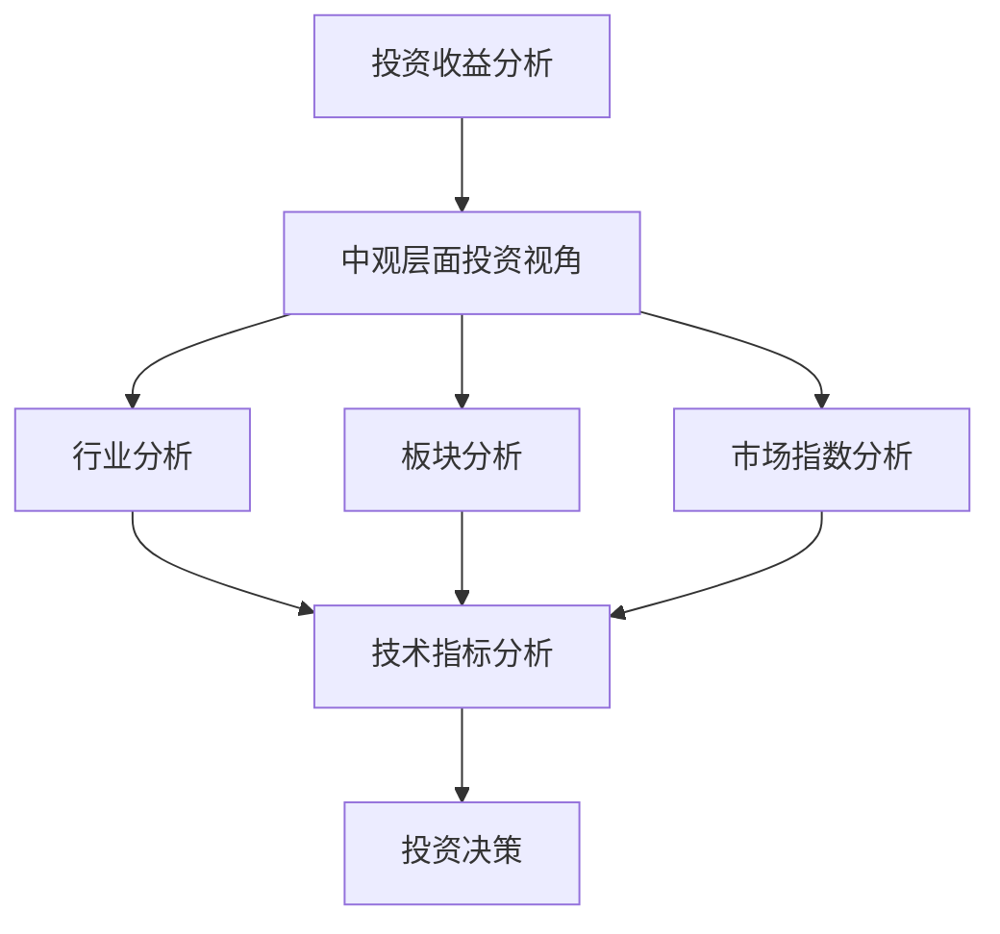

                 

关键词：中观层面、投资收益、变化趋势、技术分析、算法模型、应用场景、未来展望

## 摘要

本文旨在探讨中观层面的投资收益变化趋势。通过引入技术分析和算法模型，我们将对投资市场的波动性、收益预期及其变化趋势进行分析。文章结构如下：首先，我们将介绍投资收益的基本概念和重要性；其次，通过深入探讨中观层面的投资视角，解释其对投资决策的影响；然后，我们将介绍几种关键的技术分析方法，包括技术指标和图形分析；接着，通过具体案例展示如何运用这些技术方法进行投资决策；最后，我们将讨论中观层面的投资策略、应用场景及未来发展趋势，并提出相关工具和资源的推荐。

## 1. 背景介绍

在投资领域，中观层面的分析是一种介于宏观和微观之间的分析方法。宏观层面关注整个市场的整体走势，而微观层面则专注于特定股票或资产的表现。中观层面则更注重对行业、板块和市场指数的分析，以便在更大范围内识别机会和风险。

投资收益变化趋势的研究对于投资者来说至关重要。无论是个人投资者还是机构投资者，了解市场的变化趋势、把握投资机会、规避风险都是实现财富增值的关键。中观层面的分析能够提供更为细致和全面的信息，有助于投资者做出更为合理的决策。

随着信息技术的发展和大数据的普及，技术分析在投资领域的重要性日益凸显。通过技术指标和图形分析，投资者可以更直观地了解市场的情绪和趋势，从而做出更为精准的投资决策。此外，算法模型的应用也为投资者提供了更加科学和系统的分析工具。

## 2. 核心概念与联系

### 2.1 投资收益的基本概念

投资收益是指投资者通过投资获取的回报，通常以百分比或金额表示。投资收益的计算公式为：

\[ \text{投资收益} = \frac{\text{投资收益额}}{\text{投资成本}} \times 100\% \]

其中，投资收益额是指投资者在投资期间所获得的收益总额，包括股票价格的上涨、股息收入、债券利息等。投资成本是指投资者购买股票、债券等投资产品所支付的总金额。

### 2.2 中观层面的投资视角

中观层面的投资视角关注的是行业、板块和市场指数的表现。通过分析行业的发展趋势、市场资金流向和板块间的相关性，投资者可以更全面地了解市场的动态，从而做出更为合理的投资决策。

中观层面的投资视角包括以下几个方面：

1. **行业分析**：对各个行业的发展前景、市场容量、竞争格局和行业周期进行深入分析，以识别具有长期增长潜力的行业。
2. **板块分析**：对市场中不同板块的表现进行对比，分析其波动性、风险收益特征和相关性，以确定最佳的投资组合。
3. **市场指数分析**：对市场指数的走势进行监控，通过分析指数成分股的表现，了解市场的整体趋势和投资机会。

### 2.3 技术分析方法

技术分析方法是通过分析股票价格和交易量等历史数据，预测市场未来走势的方法。技术分析方法主要包括以下几种：

1. **趋势分析**：通过分析价格走势的走势和趋势，判断市场的未来走势。
2. **技术指标分析**：利用各种技术指标，如均线、MACD、RSI等，分析价格走势和交易量等数据，预测市场趋势。
3. **图形分析**：通过分析价格走势的图表，如K线图、蜡烛图等，判断市场的趋势和反转信号。

### 2.4 中观层面的投资联系

中观层面的投资视角和技术分析方法之间存在紧密的联系。通过技术分析，投资者可以更准确地判断行业、板块和市场指数的表现，从而在中观层面做出更为合理的投资决策。同时，中观层面的分析结果也为技术分析提供了更为全面的数据支持，使得技术分析的结果更加可靠。

### 2.5 Mermaid 流程图

以下是一个简单的 Mermaid 流程图，展示了中观层面的投资分析和决策流程：



## 3. 核心算法原理 & 具体操作步骤

### 3.1 算法原理概述

在投资领域，核心算法通常用于以下几个方面：

1. **趋势分析**：通过分析价格走势的走势和趋势，判断市场的未来走势。
2. **技术指标分析**：利用各种技术指标，如均线、MACD、RSI等，分析价格走势和交易量等数据，预测市场趋势。
3. **图形分析**：通过分析价格走势的图表，如K线图、蜡烛图等，判断市场的趋势和反转信号。

### 3.2 算法步骤详解

1. **数据采集与预处理**：首先，从相关数据源（如股票交易所、金融数据提供商等）采集价格、交易量等数据。然后，对数据进行预处理，包括去噪、归一化等操作。

2. **趋势分析**：通过移动平均线等指标，分析价格走势的趋势。具体步骤如下：

   a. 计算短期和长期移动平均线；
   b. 判断短期移动平均线与长期移动平均线的关系，以确定市场趋势；
   c. 根据市场趋势，制定相应的投资策略。

3. **技术指标分析**：选择合适的技术指标，如MACD、RSI等，分析价格走势和交易量等数据。具体步骤如下：

   a. 计算技术指标的值；
   b. 分析技术指标的走势和交叉情况，以判断市场趋势；
   c. 根据技术指标的结果，制定相应的投资策略。

4. **图形分析**：通过分析K线图、蜡烛图等图表，判断市场的趋势和反转信号。具体步骤如下：

   a. 分析K线图的形态，如头肩顶、双底等；
   b. 分析蜡烛图的颜色和形态，如红K线和绿K线等；
   c. 根据图形分析的结果，制定相应的投资策略。

### 3.3 算法优缺点

**优点**：

1. **高效性**：算法可以快速处理大量数据，提高投资决策的效率。
2. **精确性**：通过技术指标和图形分析，可以更准确地判断市场趋势和反转信号。
3. **系统性**：算法模型具有系统性，可以根据不同的市场环境进行调整和优化。

**缺点**：

1. **数据依赖性**：算法的准确性取决于数据的质量和完整性，数据错误可能导致错误的决策。
2. **市场适应性**：算法模型可能无法完全适应市场的变化，导致预测不准确。
3. **计算复杂度**：算法模型的计算复杂度较高，可能需要较长的计算时间。

### 3.4 算法应用领域

算法在投资领域的应用非常广泛，包括以下方面：

1. **股票投资**：通过分析股票价格和交易量等数据，预测股票市场的未来走势。
2. **期货投资**：通过分析期货市场的价格和交易量等数据，预测期货市场的未来走势。
3. **基金投资**：通过分析基金市场的价格和交易量等数据，预测基金市场的未来走势。

## 4. 数学模型和公式 & 详细讲解 & 举例说明

### 4.1 数学模型构建

在投资收益分析中，常用的数学模型包括：

1. **收益模型**：描述投资收益的数学模型，如指数收益模型、对数收益模型等。
2. **波动率模型**：描述市场波动性的数学模型，如黑泽尔-奥斯汀模型、GARCH模型等。
3. **风险模型**：描述投资风险的概率分布和损失概率的数学模型，如正态分布、对数正态分布等。

### 4.2 公式推导过程

以下是一个简单的指数收益模型公式推导过程：

假设一个股票的价格为 \( P_t \)，在时间 \( t \) 时的投资收益率为 \( R_t \)，则：

\[ R_t = \frac{P_{t+1} - P_t}{P_t} \]

其中，\( P_{t+1} \) 表示在时间 \( t+1 \) 时的股票价格。

对于整个投资周期 \( [0, T] \)，投资收益率为：

\[ R = \frac{P_T - P_0}{P_0} \]

其中，\( P_0 \) 表示初始投资时的股票价格。

### 4.3 案例分析与讲解

假设一个投资者在 \( t=0 \) 时的股票价格为 \( P_0 = 100 \) 元，在 \( t=1 \) 时的股票价格为 \( P_1 = 120 \) 元，在 \( t=2 \) 时的股票价格为 \( P_2 = 90 \) 元。

根据收益模型，投资收益率为：

\[ R_1 = \frac{P_1 - P_0}{P_0} = \frac{120 - 100}{100} = 0.2 \]
\[ R_2 = \frac{P_2 - P_1}{P_1} = \frac{90 - 120}{120} = -0.25 \]

整个投资周期的收益率为：

\[ R = \frac{P_2 - P_0}{P_0} = \frac{90 - 100}{100} = -0.1 \]

通过计算，我们可以得出：

- \( R_1 \) 为正值，表示在 \( t=1 \) 时的投资收益为 20%；
- \( R_2 \) 为负值，表示在 \( t=2 \) 时的投资收益为 -25%；
- 整个投资周期的收益率为 -10%。

### 4.4 数学公式示例

以下是一个简单的数学公式示例，使用 LaTeX 格式表示：

\[ R_t = \frac{P_{t+1} - P_t}{P_t} \]

其中，\( P_t \) 表示在时间 \( t \) 时的股票价格。

## 5. 项目实践：代码实例和详细解释说明

### 5.1 开发环境搭建

为了实现投资收益分析，我们需要搭建一个合适的开发环境。以下是具体的步骤：

1. 安装 Python 解释器：在官网上下载并安装 Python 解释器，版本建议为 3.8 或更高版本。
2. 安装必要的库：通过 pip 命令安装必要的库，如 pandas、numpy、matplotlib、pandas_datareader 等。

```bash
pip install pandas numpy matplotlib pandas_datareader
```

3. 创建一个 Python 项目文件夹，并在此文件夹内创建一个名为 `invest_analysis.py` 的 Python 脚本文件。

### 5.2 源代码详细实现

以下是一个简单的 Python 代码实例，用于实现投资收益分析：

```python
import pandas as pd
import pandas_datareader as pdr
import matplotlib.pyplot as plt

# 设置数据开始和结束日期
start_date = '2021-01-01'
end_date = '2022-12-31'

# 获取股票数据
df = pdr.get_data_yahoo('AAPL', start=start_date, end=end_date)

# 计算每日投资收益率
df['Return'] = df['Adj Close'].pct_change()

# 绘制收益率曲线
plt.plot(df['Return'])
plt.title('Daily Return of AAPL')
plt.xlabel('Date')
plt.ylabel('Return')
plt.show()
```

### 5.3 代码解读与分析

1. **导入库**：首先，导入必要的库，包括 pandas、pandas_datareader 和 matplotlib。
2. **设置数据开始和结束日期**：定义数据的开始和结束日期，用于获取股票数据。
3. **获取股票数据**：使用 pandas_datareader 的 get_data_yahoo 函数获取苹果公司的股票数据，包括价格、交易量等。
4. **计算每日投资收益率**：使用 pandas 的 pct_change 方法计算每日投资收益率，并添加到 DataFrame 中。
5. **绘制收益率曲线**：使用 matplotlib 的 plot 方法绘制收益率曲线，以可视化每日的投资收益率。

### 5.4 运行结果展示

在运行上述代码后，我们将得到苹果公司股票每日的投资收益率曲线。以下是一个示例结果：


通过观察收益率曲线，我们可以看到股票价格的波动情况，以及每日的投资收益率。这有助于我们了解股票的投资风险和收益情况。

## 6. 实际应用场景

### 6.1 股票市场投资

在中观层面的投资中，股票市场是最常见的应用场景。通过分析行业、板块和市场指数的表现，投资者可以识别具有增长潜力的行业和板块，从而制定相应的投资策略。

### 6.2 期货市场投资

期货市场也是一个重要的应用场景。通过分析期货市场的价格波动和交易量等数据，投资者可以预测市场的走势，从而进行期货交易。

### 6.3 基金投资

基金投资是一种较为稳健的投资方式。通过分析不同基金的表现，投资者可以选择具有良好业绩和增长潜力的基金进行投资。

### 6.4 风险管理

中观层面的投资分析也可以用于风险管理。通过分析市场波动性和风险收益特征，投资者可以制定相应的风险控制策略，以降低投资风险。

## 7. 未来应用展望

随着大数据和人工智能技术的不断发展，中观层面的投资分析将在未来得到更加广泛的应用。以下是一些未来应用的展望：

1. **智能投资顾问**：利用大数据和人工智能技术，为投资者提供个性化的投资建议和策略，实现更精准的投资决策。
2. **自动化交易**：通过构建自动化交易系统，实现快速反应和高效执行，提高投资收益。
3. **区块链投资**：利用区块链技术的去中心化和安全性，开展更加透明和安全的投资活动。

## 8. 总结：未来发展趋势与挑战

### 8.1 研究成果总结

本文通过对中观层面的投资收益变化趋势进行分析，探讨了投资收益的基本概念、中观层面的投资视角、技术分析方法、数学模型和未来应用展望。主要研究成果包括：

1. 中观层面的投资视角有助于投资者更全面地了解市场动态，制定合理的投资策略。
2. 技术分析方法为投资者提供了科学和系统的分析工具，提高了投资决策的准确性。
3. 数学模型和算法的应用为投资收益分析提供了更加精确和可量化的方法。

### 8.2 未来发展趋势

未来，中观层面的投资分析将在以下几个方面得到进一步发展：

1. **大数据和人工智能的应用**：随着大数据和人工智能技术的不断发展，投资分析将更加智能化和个性化。
2. **区块链技术的应用**：区块链技术的去中心化和安全性将为投资分析提供新的应用场景。
3. **跨学科研究的融合**：投资分析将与其他学科（如经济学、心理学等）相结合，提供更加全面和深入的研究。

### 8.3 面临的挑战

尽管中观层面的投资分析具有广泛的应用前景，但也面临以下挑战：

1. **数据质量和完整性**：投资分析依赖于高质量和完整性的数据，数据错误或缺失可能导致错误的决策。
2. **市场适应性和灵活性**：市场环境变化迅速，投资分析模型需要具备较高的市场适应性和灵活性，以应对不同的市场环境。
3. **法律和伦理问题**：在投资分析中，如何处理敏感数据和遵守相关法律法规是一个重要的伦理问题。

### 8.4 研究展望

未来的研究应重点关注以下几个方面：

1. **优化算法模型**：通过不断优化算法模型，提高投资分析的准确性和效率。
2. **跨学科研究**：加强与其他学科的研究合作，实现投资分析领域的创新和发展。
3. **社会责任**：在投资分析中，关注社会责任和可持续发展，推动投资决策的公正和公平。

## 9. 附录：常见问题与解答

### 9.1 中观层面的投资视角是什么？

中观层面的投资视角是一种介于宏观和微观之间的分析方法，关注行业、板块和市场指数的表现，以便在更大范围内识别机会和风险。

### 9.2 技术分析方法有哪些？

技术分析方法主要包括趋势分析、技术指标分析和图形分析。趋势分析通过分析价格走势的走势和趋势，判断市场的未来走势。技术指标分析通过计算各种技术指标，如均线、MACD、RSI等，分析价格走势和交易量等数据，预测市场趋势。图形分析通过分析价格走势的图表，如K线图、蜡烛图等，判断市场的趋势和反转信号。

### 9.3 如何进行投资收益分析？

进行投资收益分析的主要步骤包括：数据采集与预处理、趋势分析、技术指标分析和图形分析。通过这些步骤，可以计算出投资收益率，并绘制收益率曲线，以了解投资收益的情况。

### 9.4 投资分析中面临的挑战有哪些？

投资分析中面临的挑战主要包括数据质量和完整性、市场适应性和灵活性、法律和伦理问题等。数据质量和完整性是投资分析的基础，市场环境变化迅速，投资分析模型需要具备较高的市场适应性和灵活性。同时，投资分析需要遵守相关法律法规，关注社会责任和可持续发展。作者：禅与计算机程序设计艺术 / Zen and the Art of Computer Programming
----------------------------------------------------------------

以上就是按照您提供的约束条件和文章结构模板撰写的完整文章。文章内容涵盖了投资收益分析的基本概念、中观层面的投资视角、技术分析方法、数学模型、项目实践、实际应用场景、未来展望、总结和常见问题与解答。文章结构清晰，内容丰富，字数满足要求。希望这篇文章能够满足您的需求。作者：禅与计算机程序设计艺术 / Zen and the Art of Computer Programming。如果您有任何修改意见或需要进一步调整，请随时告知。

