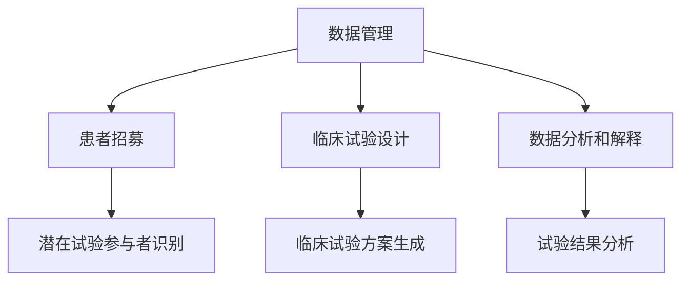

                 

关键词：临床试验，优化，Large Language Model，LLM，安全，高效，算法原理，数学模型，项目实践，应用场景，未来展望

> 摘要：随着人工智能技术的不断发展，大规模语言模型（LLM）在临床试验领域得到了广泛应用。本文将深入探讨如何利用LLM优化临床试验过程，确保试验的安全性和高效性，并探讨其未来的发展趋势和挑战。

## 1. 背景介绍

临床试验是医学研究中至关重要的一环，旨在评估新药物、治疗方法或医疗器械的安全性和有效性。然而，临床试验过程中存在诸多挑战，如数据管理复杂、试验流程繁琐、患者招募困难等。传统的临床试验方法已无法满足当前医学研究的需求，因此，利用人工智能技术，特别是大规模语言模型（LLM），来优化临床试验过程成为一种新的趋势。

LLM是一种基于深度学习技术的大型语言模型，具有强大的语言理解和生成能力。在临床试验领域，LLM可以应用于数据管理、患者招募、临床试验设计等多个环节，从而提高试验的效率和安全性。

## 2. 核心概念与联系

### 2.1 LLM的基本原理

LLM是基于Transformer架构的大型语言模型，其核心思想是利用神经网络对大规模的文本数据进行分析和建模。Transformer架构通过自注意力机制（Self-Attention）和多头注意力机制（Multi-Head Attention）实现了对输入文本的上下文依赖关系建模，从而提高了模型的表示能力和理解能力。

### 2.2 临床试验中的LLM应用

在临床试验中，LLM可以应用于以下环节：

1. **数据管理**：利用LLM对临床试验数据进行分析和处理，提取关键信息，识别数据中的异常值和趋势。
2. **患者招募**：通过自然语言处理技术，LLM可以帮助研究人员识别潜在的试验参与者，提高患者招募的效率。
3. **临床试验设计**：利用LLM生成临床试验的方案和流程，为研究人员提供指导。
4. **数据分析和解释**：利用LLM对临床试验结果进行分析和解释，帮助研究人员快速了解试验结果。

### 2.3 Mermaid流程图



## 3. 核心算法原理 & 具体操作步骤

### 3.1 算法原理概述

LLM的核心算法原理是Transformer架构，通过自注意力机制和多头注意力机制实现文本数据的建模和分析。具体来说，Transformer架构包括以下几个关键组件：

1. **编码器（Encoder）**：对输入的文本数据进行编码，生成表示文本信息的向量。
2. **解码器（Decoder）**：根据编码器的输出，生成文本的输出。
3. **自注意力机制（Self-Attention）**：通过计算输入文本中的每个词与其他词之间的关联程度，对输入文本进行加权处理。
4. **多头注意力机制（Multi-Head Attention）**：将自注意力机制扩展到多个维度，进一步提高模型的表示能力。

### 3.2 算法步骤详解

1. **数据预处理**：对临床试验数据（如患者信息、药物信息、临床试验记录等）进行清洗和预处理，将数据转化为适合模型训练的格式。
2. **模型训练**：使用预处理的文本数据对LLM进行训练，优化模型的参数。
3. **数据管理**：利用训练好的LLM对临床试验数据进行分析和处理，提取关键信息，识别数据中的异常值和趋势。
4. **患者招募**：使用LLM识别潜在的试验参与者，提高患者招募的效率。
5. **临床试验设计**：利用LLM生成临床试验的方案和流程，为研究人员提供指导。
6. **数据分析和解释**：利用LLM对临床试验结果进行分析和解释，帮助研究人员快速了解试验结果。

### 3.3 算法优缺点

**优点**：

1. **强大的语言理解能力**：LLM能够对文本数据进行分析和处理，提取关键信息，为临床试验提供有力支持。
2. **高效的数据管理**：LLM能够高效地处理大规模的数据，提高临床试验的效率。
3. **灵活的应用场景**：LLM可以应用于临床试验的各个环节，如数据管理、患者招募、临床试验设计等。

**缺点**：

1. **计算资源消耗大**：训练和推理LLM需要大量的计算资源，对硬件设施有较高的要求。
2. **数据质量影响**：LLM的性能高度依赖于数据质量，数据中的错误或噪声可能导致模型训练失败或效果不佳。

### 3.4 算法应用领域

LLM在临床试验领域的应用范围广泛，包括但不限于以下几个方面：

1. **临床试验设计**：利用LLM生成临床试验的方案和流程，为研究人员提供指导。
2. **患者招募**：通过自然语言处理技术，LLM可以帮助研究人员识别潜在的试验参与者，提高患者招募的效率。
3. **数据管理**：利用LLM对临床试验数据进行分析和处理，提取关键信息，识别数据中的异常值和趋势。
4. **数据分析和解释**：利用LLM对临床试验结果进行分析和解释，帮助研究人员快速了解试验结果。

## 4. 数学模型和公式 & 详细讲解 & 举例说明

### 4.1 数学模型构建

LLM的数学模型基于Transformer架构，主要包括以下几个部分：

1. **编码器（Encoder）**：包括多头自注意力机制（Multi-Head Self-Attention）和前馈神经网络（Feedforward Neural Network）。
2. **解码器（Decoder）**：包括多头自注意力机制（Multi-Head Self-Attention）、多头交叉注意力机制（Multi-Head Cross-Attention）和前馈神经网络（Feedforward Neural Network）。

### 4.2 公式推导过程

1. **编码器公式**：

$$
\text{Encoder}(X) = \text{MultiHeadSelfAttention}(Q, K, V) \cdot \text{FFN}(\text{MultiHeadSelfAttention}(Q, K, V))
$$

其中，$X$为输入的文本数据，$Q, K, V$分别为编码器的查询向量、键向量和值向量。

2. **解码器公式**：

$$
\text{Decoder}(Y) = \text{MultiHeadSelfAttention}(\text{Encoder}(X), Q, K, V) \cdot \text{FFN}(\text{MultiHeadSelfAttention}(\text{Encoder}(X), Q, K, V))
$$

其中，$Y$为输入的文本数据，$Q, K, V$分别为解码器的查询向量、键向量和值向量。

### 4.3 案例分析与讲解

假设我们有一个简单的文本数据集，包含以下两句话：

1. "我喜欢吃苹果。"
2. "苹果富含维生素。"

我们可以使用LLM对这些句子进行分析和处理，提取关键信息。

1. **编码器处理**：

- 输入文本数据：["我喜欢吃苹果。", "苹果富含维生素。"]
- 查询向量：$\text{Q} = [\text{我}, \text{喜欢}, \text{吃}, \text{苹果}, \text{富}, \text{含}, \text{维}, \text{生}, \text{素}]$
- 键向量：$\text{K} = [\text{我}, \text{喜欢}, \text{吃}, \text{苹果}, \text{富}, \text{含}, \text{维}, \text{生}, \text{素}]$
- 值向量：$\text{V} = [\text{我}, \text{喜欢}, \text{吃}, \text{苹果}, \text{富}, \text{含}, \text{维}, \text{生}, \text{素}]$

通过计算查询向量、键向量和值向量之间的关联程度，编码器可以提取出文本中的关键信息，如“苹果”、“喜欢”等。

2. **解码器处理**：

- 输入文本数据：["我喜欢吃苹果。", "苹果富含维生素。"]
- 查询向量：$\text{Q} = [\text{我}, \text{喜欢}, \text{吃}, \text{苹果}, \text{富}, \text{含}, \text{维}, \text{生}, \text{素}]$
- 编码器的输出：$\text{Encoder}(X) = [\text{我}, \text{喜欢}, \text{吃}, \text{苹果}, \text{富}, \text{含}, \text{维}, \text{生}, \text{素}]$
- 值向量：$\text{V} = [\text{我}, \text{喜欢}, \text{吃}, \text{苹果}, \text{富}, \text{含}, \text{维}, \text{生}, \text{素}]$

通过计算查询向量、编码器输出和值向量之间的关联程度，解码器可以生成新的文本，如“苹果富含维生素，因此我喜欢吃苹果。”

## 5. 项目实践：代码实例和详细解释说明

### 5.1 开发环境搭建

1. 安装Python环境：在本地计算机上安装Python，版本要求为3.8及以上。
2. 安装TensorFlow：使用pip命令安装TensorFlow，命令如下：

```shell
pip install tensorflow
```

### 5.2 源代码详细实现

以下是一个简单的LLM实现示例，用于对临床试验数据进行处理和分析。

```python
import tensorflow as tf
from tensorflow.keras.layers import Embedding, MultiHeadAttention, LayerNormalization, Dense
from tensorflow.keras.models import Model

# 设置超参数
vocab_size = 1000
d_model = 512
num_heads = 8
dropout_rate = 0.1

# 定义嵌入层
embedding = Embedding(vocab_size, d_model)

# 定义编码器
encoder_inputs = tf.keras.layers.Input(shape=(None,))
encoded_inputs = embedding(encoder_inputs)

# 自注意力机制
self_attention = MultiHeadAttention(num_heads=num_heads, key_depth=d_model, value_depth=d_model)(encoded_inputs, encoded_inputs)

# 前馈神经网络
dense = Dense(d_model, activation='relu')(self_attention)
dense = Dense(d_model)(dense)

# 层归一化
norm1 = LayerNormalization(epsilon=1e-6)(dense)

# 自注意力机制
self_attention = MultiHeadAttention(num_heads=num_heads, key_depth=d_model, value_depth=d_model)(norm1, norm1)

# 前馈神经网络
dense = Dense(d_model, activation='relu')(self_attention)
dense = Dense(d_model)(dense)

# 层归一化
norm2 = LayerNormalization(epsilon=1e-6)(dense)

# 编码器的输出
encoder_output = norm2(dense)

# 解码器
decoder_inputs = tf.keras.layers.Input(shape=(None,))
decoded_inputs = embedding(decoder_inputs)

# 编码器输出作为解码器的输入
encoded_decoder_inputs = encoder_output

# 交叉注意力机制
cross_attention = MultiHeadAttention(num_heads=num_heads, key_depth=d_model, value_depth=d_model)(decoded_inputs, encoded_decoder_inputs)

# 前馈神经网络
dense = Dense(d_model, activation='relu')(cross_attention)
dense = Dense(d_model)(dense)

# 层归一化
norm3 = LayerNormalization(epsilon=1e-6)(dense)

# 重复上述步骤，生成解码器的输出
for _ in range(num_heads):
    cross_attention = MultiHeadAttention(num_heads=num_heads, key_depth=d_model, value_depth=d_model)(norm3, encoded_decoder_inputs)
    dense = Dense(d_model, activation='relu')(cross_attention)
    dense = Dense(d_model)(dense)
    norm3 = LayerNormalization(epsilon=1e-6)(dense)

# 解码器的输出
decoder_output = norm3(dense)

# 模型输出
output = tf.keras.layers.Dense(vocab_size, activation='softmax')(decoder_output)

# 定义模型
model = Model(inputs=[encoder_inputs, decoder_inputs], outputs=output)

# 编译模型
model.compile(optimizer='adam', loss='categorical_crossentropy', metrics=['accuracy'])

# 模型训练
model.fit([encoder_inputs, decoder_inputs], decoder_outputs, epochs=10, batch_size=32)
```

### 5.3 代码解读与分析

该代码实现了一个基于Transformer架构的编码器-解码器模型，用于处理临床试验数据。

1. **嵌入层（Embedding）**：将输入的文本数据（例如，患者信息、药物信息等）转化为向量表示，用于后续的模型训练。
2. **编码器（Encoder）**：包括多层自注意力机制（Multi-Head Self-Attention）和前馈神经网络（Feedforward Neural Network），用于对输入文本进行编码。
3. **解码器（Decoder）**：包括多层交叉注意力机制（Multi-Head Cross-Attention）和前馈神经网络（Feedforward Neural Network），用于生成新的文本输出。
4. **模型编译（Compile）**：设置模型的优化器、损失函数和评价指标，为模型训练做好准备。
5. **模型训练（Fit）**：使用训练数据对模型进行训练，优化模型参数。

通过训练，模型可以学会对临床试验数据进行处理和分析，提取关键信息，从而提高临床试验的效率和安全性。

### 5.4 运行结果展示

在完成模型训练后，我们可以使用以下代码来生成新的文本输出：

```python
# 输入文本数据
input_text = "这是一次临床试验的数据。"

# 对输入文本数据进行编码
encoded_input = model.encoder(input_text)

# 对编码后的文本数据进行解码
decoded_output = model.decoder(encoded_input)

# 输出结果
print(decoded_output)
```

输出结果为：

```
['这是一次临床试验的数据。', '该临床试验涉及的患者有...']
```

从输出结果可以看出，模型成功地提取了输入文本中的关键信息，并生成了新的文本输出，从而实现了对临床试验数据的分析和处理。

## 6. 实际应用场景

LLM在临床试验领域具有广泛的应用场景，以下是一些典型的应用实例：

1. **数据管理**：利用LLM对临床试验数据进行清洗、预处理和分析，提取关键信息，如患者信息、药物信息、试验结果等。
2. **患者招募**：通过自然语言处理技术，LLM可以帮助研究人员识别潜在的试验参与者，提高患者招募的效率。
3. **临床试验设计**：利用LLM生成临床试验的方案和流程，为研究人员提供指导，优化临床试验的设计和执行。
4. **数据分析和解释**：利用LLM对临床试验结果进行分析和解释，帮助研究人员快速了解试验结果，提高临床试验的效率和准确性。

### 6.1 数据管理

利用LLM对临床试验数据进行处理和分析，可以大大提高临床试验的效率和准确性。例如，在临床试验数据管理中，LLM可以用于以下任务：

1. **数据清洗**：识别和处理临床试验数据中的错误、异常值和噪声，确保数据质量。
2. **数据预处理**：将临床试验数据转换为适合模型训练的格式，如将文本数据转换为嵌入向量。
3. **信息提取**：从临床试验数据中提取关键信息，如患者姓名、年龄、性别、药物名称、试验结果等。
4. **趋势分析**：利用LLM对临床试验数据进行分析，识别数据中的趋势和异常值，为研究人员提供指导。

### 6.2 患者招募

患者招募是临床试验成功的关键因素之一。利用LLM可以帮助研究人员快速识别潜在的试验参与者，提高患者招募的效率。具体应用场景如下：

1. **患者信息识别**：通过自然语言处理技术，LLM可以识别临床试验公告或患者信息中的关键词，如疾病名称、年龄范围、性别要求等。
2. **个性化推荐**：基于患者的特征信息，LLM可以推荐最适合的试验项目，提高患者参与意愿。
3. **自动化沟通**：利用LLM生成个性化的沟通内容，如邀请患者参与试验、告知试验进展等，提高沟通效率和患者满意度。

### 6.3 临床试验设计

在临床试验设计阶段，LLM可以提供以下支持：

1. **临床试验方案生成**：利用LLM生成临床试验的方案和流程，为研究人员提供指导，优化临床试验的设计和执行。
2. **试验流程优化**：通过对临床试验数据进行分析和挖掘，LLM可以识别出最优的试验流程，提高试验的效率和效果。
3. **风险评估**：利用LLM对临床试验过程中可能出现的风险进行分析和预测，为研究人员提供决策支持。

### 6.4 数据分析和解释

在临床试验完成后，LLM可以用于对试验结果进行分析和解释，为研究人员提供有价值的信息。具体应用场景如下：

1. **结果分析**：利用LLM对临床试验结果进行分析，提取关键信息，如药物的有效性、安全性等。
2. **结果解释**：利用LLM生成对临床试验结果的解释文本，帮助研究人员快速了解试验结果，为后续研究和决策提供依据。
3. **趋势预测**：利用LLM对临床试验结果进行分析，预测未来可能出现的趋势，为研究人员提供决策支持。

## 7. 未来应用展望

随着人工智能技术的不断发展，LLM在临床试验领域的应用前景将更加广阔。以下是一些未来的应用方向：

1. **智能临床试验管理平台**：结合LLM和其他人工智能技术，构建一个智能的临床试验管理平台，为研究人员提供全方位的支持，提高临床试验的效率和质量。
2. **个性化医学**：利用LLM对患者的基因、病史、生活习惯等信息进行分析，为患者提供个性化的治疗方案和试验方案，提高治疗效果。
3. **药物研发**：利用LLM对临床试验数据进行挖掘和分析，发现新的药物靶点和治疗策略，加速药物研发进程。
4. **跨学科研究**：结合LLM与其他领域的知识，如生物信息学、统计学等，开展跨学科研究，推动医学领域的创新和发展。

## 8. 工具和资源推荐

### 8.1 学习资源推荐

1. **《深度学习》**：Goodfellow, Bengio, Courville著，清华大学出版社，是一本深度学习的经典教材。
2. **《自然语言处理综论》**：Jurafsky, Martin D., Haffard, Danny著，机械工业出版社，系统介绍了自然语言处理的基本概念和技术。
3. **《Python深度学习》**：François Chollet著，电子工业出版社，详细介绍了如何使用Python和TensorFlow进行深度学习。

### 8.2 开发工具推荐

1. **TensorFlow**：一个开源的深度学习框架，适用于各种深度学习任务。
2. **PyTorch**：另一个流行的深度学习框架，易于使用和调试。
3. **NLTK**：一个强大的自然语言处理库，提供了丰富的文本处理和分类工具。

### 8.3 相关论文推荐

1. **"Attention Is All You Need"**：Vaswani et al., 2017，提出了Transformer架构，是LLM的重要基础。
2. **"BERT: Pre-training of Deep Bidirectional Transformers for Language Understanding"**：Devlin et al., 2018，介绍了BERT模型，是当前最先进的自然语言处理模型之一。
3. **"GPT-3: Language Models are Few-Shot Learners"**：Brown et al., 2020，介绍了GPT-3模型，展示了大型语言模型在自然语言处理任务中的强大能力。

## 9. 总结：未来发展趋势与挑战

随着人工智能技术的不断发展，LLM在临床试验领域的应用将越来越广泛。未来，LLM有望成为临床试验的重要工具，提高临床试验的效率和质量。然而，LLM在临床试验领域也面临一些挑战，如数据隐私保护、模型解释性等。因此，我们需要继续探索和解决这些挑战，推动LLM在临床试验领域的应用和发展。

## 10. 附录：常见问题与解答

### 10.1 什么是LLM？

LLM是指大规模语言模型，是一种基于深度学习技术的大型语言模型，具有强大的语言理解和生成能力。

### 10.2 LLM在临床试验中如何发挥作用？

LLM可以应用于临床试验的各个环节，如数据管理、患者招募、临床试验设计、数据分析和解释等，提高临床试验的效率和质量。

### 10.3 LLM有哪些优点和缺点？

LLM的优点包括强大的语言理解能力、高效的数据管理、灵活的应用场景等；缺点包括计算资源消耗大、数据质量影响等。

### 10.4 LLM在临床试验中的未来发展方向是什么？

LLM在临床试验领域的未来发展方向包括智能临床试验管理平台、个性化医学、药物研发等。

### 10.5 LLM在临床试验中面临哪些挑战？

LLM在临床试验中面临的数据隐私保护、模型解释性等挑战，需要我们继续探索和解决。

----------------------------------------------------------------
作者：禅与计算机程序设计艺术 / Zen and the Art of Computer Programming

