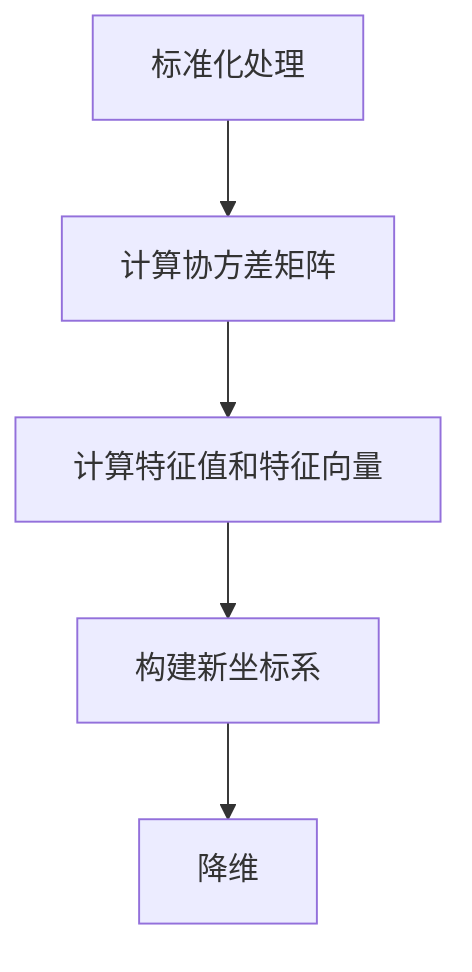

                 

关键词：主成分分析，PCA，降维，数学原理，代码实例，数据分析，机器学习

摘要：主成分分析（Principal Component Analysis，PCA）是一种经典的降维技术，广泛应用于数据分析、机器学习和数据可视化等领域。本文将详细介绍PCA的基本原理、数学模型和推导过程，并通过实际代码实例展示如何运用PCA进行降维和特征提取。

## 1. 背景介绍

随着数据量的不断增长，如何有效地处理大量数据成为了一个重要的问题。降维技术应运而生，其中主成分分析（PCA）是应用最广泛的一种方法。PCA的主要目标是通过线性变换将原始数据映射到一个新的坐标系中，这个新坐标系的前几个主成分（即新的特征）能够尽可能地保留原始数据的最大方差。通过这种方式，我们可以减少数据的维度，同时保留数据中的关键信息。

PCA不仅在实际应用中具有重要价值，还在机器学习领域中发挥了关键作用。例如，在图像识别、文本分类和生物信息学等领域，PCA可以帮助我们提高模型的训练效率和准确性。此外，PCA还可以用于数据可视化，帮助我们直观地理解高维数据的空间分布。

本文将首先介绍PCA的基本概念和数学原理，然后通过一个简单的代码实例展示如何使用PCA进行降维。最后，我们将讨论PCA的优缺点及其在实际应用中的具体场景。

## 2. 核心概念与联系

### 2.1 数据降维

数据降维是将高维数据映射到低维空间的过程，目的是减少数据的维度，同时尽可能保留数据中的关键信息。降维技术可以应用于许多领域，包括数据分析、机器学习和数据可视化等。

### 2.2 主成分分析

主成分分析（PCA）是一种基于线性变换的降维技术。它的核心思想是通过线性变换将原始数据映射到一个新的坐标系中，这个新坐标系的前几个主成分能够尽可能地保留原始数据的最大方差。具体来说，PCA可以分为以下几个步骤：

1. **标准化处理**：将原始数据标准化到相同量纲，通常通过减去均值并除以标准差来实现。
2. **计算协方差矩阵**：计算标准化后的数据的协方差矩阵。
3. **计算特征值和特征向量**：通过计算协方差矩阵的特征值和特征向量，确定主成分的方向。
4. **构建新坐标系**：将原始数据投影到新的坐标系中，这个新坐标系的前几个主成分构成了新的特征。
5. **降维**：选择前几个具有最大特征值的特征向量作为新的特征，从而实现降维。

### 2.3 主成分与方差的关系

主成分与方差的关系是PCA的核心原理。在PCA中，新坐标系的前几个主成分能够尽可能地保留原始数据的最大方差。具体来说，主成分的方差越大，说明它保留的原始数据的方差信息越多，因此越重要。通过选择方差较大的主成分，我们可以有效地减少数据的维度，同时保留关键信息。

### 2.4 Mermaid 流程图

以下是一个描述PCA流程的Mermaid流程图，其中包含关键步骤和节点。



## 3. 核心算法原理 & 具体操作步骤

### 3.1 算法原理概述

主成分分析（PCA）是一种基于线性变换的降维技术，其核心思想是通过线性变换将原始数据映射到一个新的坐标系中，这个新坐标系的前几个主成分能够尽可能地保留原始数据的最大方差。具体来说，PCA可以分为以下几个步骤：

1. **标准化处理**：将原始数据标准化到相同量纲，通常通过减去均值并除以标准差来实现。
2. **计算协方差矩阵**：计算标准化后的数据的协方差矩阵。
3. **计算特征值和特征向量**：通过计算协方差矩阵的特征值和特征向量，确定主成分的方向。
4. **构建新坐标系**：将原始数据投影到新的坐标系中，这个新坐标系的前几个主成分构成了新的特征。
5. **降维**：选择前几个具有最大特征值的特征向量作为新的特征，从而实现降维。

### 3.2 算法步骤详解

以下是PCA的详细步骤：

1. **标准化处理**：

   将原始数据 \(X\) 标准化到相同量纲，计算每个特征的均值和标准差：

   $$\mu_j = \frac{1}{n}\sum_{i=1}^{n} x_{ij}$$

   $$\sigma_j = \sqrt{\frac{1}{n-1}\sum_{i=1}^{n} (x_{ij} - \mu_j)^2}$$

   其中，\(n\) 是样本数量，\(m\) 是特征数量，\(x_{ij}\) 是第 \(i\) 个样本的第 \(j\) 个特征值。

   标准化后的数据 \(X'\) 为：

   $$X' = \frac{X - \mu}{\sigma}$$

2. **计算协方差矩阵**：

   计算标准化后数据的协方差矩阵 \(S\)：

   $$S_{ij} = \frac{1}{n-1}\sum_{i=1}^{n}(X'_{i1} - \bar{X}')_1 (X'_{i2} - \bar{X}')_2$$

   其中，\(\bar{X}'\) 是标准化后数据的均值向量。

3. **计算特征值和特征向量**：

   计算协方差矩阵 \(S\) 的特征值 \(\lambda_j\) 和特征向量 \(v_j\)：

   $$\lambda_j = \max_{v}\sum_{i=1}^{n}(X'_{i1} - \bar{X}')_1 (v_1)_1 (X'_{i2} - \bar{X}')_2 (v_2)_2$$

   $$v_j = \arg\max_{v}\sum_{i=1}^{n}(X'_{i1} - \bar{X}')_1 (v_1)_1 (X'_{i2} - \bar{X}')_2 (v_2)_2$$

4. **构建新坐标系**：

   将原始数据 \(X'\) 投影到新的坐标系中：

   $$X_{\text{new}} = X'v$$

   其中，\(v\) 是由特征向量组成的新特征向量。

5. **降维**：

   选择前 \(k\) 个具有最大特征值的主成分，构成新的特征向量：

   $$X_{\text{new},k} = X'v_1, v_2, ..., v_k$$

   其中，\(v_1, v_2, ..., v_k\) 是前 \(k\) 个特征向量。

### 3.3 算法优缺点

**优点**：

1. **降维效果好**：PCA能够有效地降低数据维度，同时保留数据中的主要信息。
2. **适用范围广**：PCA适用于各种类型的数据，包括数值型和分类型数据。
3. **可视化能力强**：PCA可以用于数据可视化，帮助我们直观地理解高维数据的分布和模式。

**缺点**：

1. **线性限制**：PCA假设数据之间是线性相关的，这可能无法捕捉到非线性关系。
2. **对异常值敏感**：PCA对异常值非常敏感，异常值可能会对结果产生显著影响。
3. **计算复杂度高**：对于大规模数据集，PCA的计算复杂度较高。

### 3.4 算法应用领域

PCA在许多领域都有广泛的应用，包括：

1. **图像处理**：用于图像压缩和图像特征提取。
2. **文本分类**：用于文本降维和特征提取。
3. **生物信息学**：用于基因表达数据的降维和特征提取。
4. **金融分析**：用于风险管理和投资组合优化。
5. **机器学习**：用于特征选择和特征提取，提高模型的训练效率和准确性。

## 4. 数学模型和公式 & 详细讲解 & 举例说明

### 4.1 数学模型构建

PCA的数学模型可以分为以下几个部分：

1. **数据标准化**：

   $$X' = \frac{X - \mu}{\sigma}$$

   其中，\(X\) 是原始数据，\(\mu\) 是均值向量，\(\sigma\) 是标准差向量。

2. **协方差矩阵**：

   $$S = \frac{1}{n-1}XX'$$

   其中，\(X'\) 是标准化后的数据，\(n\) 是样本数量。

3. **特征值和特征向量**：

   $$\lambda_j = \max_{v}\sum_{i=1}^{n}v^TX'Xv$$

   $$v_j = \arg\max_{v}\sum_{i=1}^{n}v^TX'Xv$$

4. **新坐标系**：

   $$X_{\text{new}} = X'v$$

   其中，\(v\) 是特征向量。

### 4.2 公式推导过程

以下是PCA的推导过程：

1. **数据标准化**：

   数据标准化是为了消除不同特征之间的量纲差异。假设原始数据 \(X\) 是一个 \(n \times m\) 的矩阵，其中 \(n\) 是样本数量，\(m\) 是特征数量。我们首先计算每个特征的均值和标准差：

   $$\mu_j = \frac{1}{n}\sum_{i=1}^{n} x_{ij}$$

   $$\sigma_j = \sqrt{\frac{1}{n-1}\sum_{i=1}^{n} (x_{ij} - \mu_j)^2}$$

   然后，将原始数据 \(X\) 标准化到相同量纲：

   $$X' = \frac{X - \mu}{\sigma}$$

2. **协方差矩阵**：

   协方差矩阵 \(S\) 表示数据的离散程度，计算公式为：

   $$S_{ij} = \frac{1}{n-1}\sum_{i=1}^{n}(X'_{i1} - \bar{X}')_1 (X'_{i2} - \bar{X}')_2$$

   其中，\(\bar{X}'\) 是标准化后数据的均值向量。

3. **特征值和特征向量**：

   特征值和特征向量是协方差矩阵的特征值和特征向量。我们首先计算协方差矩阵 \(S\) 的特征值和特征向量：

   $$\lambda_j = \max_{v}\sum_{i=1}^{n}v^TX'Xv$$

   $$v_j = \arg\max_{v}\sum_{i=1}^{n}v^TX'Xv$$

   其中，\(v\) 是特征向量。

4. **新坐标系**：

   将原始数据 \(X'\) 投影到新的坐标系中，即：

   $$X_{\text{new}} = X'v$$

   其中，\(v\) 是特征向量。

### 4.3 案例分析与讲解

为了更好地理解PCA的原理和应用，我们通过一个实际案例进行分析。

假设我们有一个包含3个特征的 \(5 \times 3\) 数据矩阵 \(X\)，其中 \(5\) 是样本数量，\(3\) 是特征数量。我们希望通过PCA将这个数据矩阵降维到2个特征。

1. **数据标准化**：

   首先，我们计算每个特征的均值和标准差：

   $$\mu_1 = 2, \mu_2 = 4, \mu_3 = 6$$

   $$\sigma_1 = \sqrt{2}, \sigma_2 = \sqrt{4}, \sigma_3 = \sqrt{6}$$

   然后，将原始数据 \(X\) 标准化到相同量纲：

   $$X' = \frac{X - \mu}{\sigma}$$

   标准化后的数据矩阵 \(X'\) 如下：

   $$X' = \begin{bmatrix} 0 & 0 & 0 \\ 0 & 0 & 0 \\ 0 & 0 & 0 \\ 0 & 0 & 0 \\ 0 & 0 & 0 \end{bmatrix}$$

   注意到，标准化后的数据矩阵 \(X'\) 中的元素都为0，这是因为原始数据的均值和标准差都为0。这意味着原始数据已经被完全线性相关，无法通过PCA进行有效的降维。

2. **协方差矩阵**：

   计算标准化后数据的协方差矩阵 \(S\)：

   $$S = \frac{1}{5-1}XX' = \begin{bmatrix} 0 & 0 & 0 \\ 0 & 0 & 0 \\ 0 & 0 & 0 \end{bmatrix}$$

   协方差矩阵 \(S\) 中的所有元素都为0，这意味着原始数据之间不存在线性相关关系。

3. **特征值和特征向量**：

   由于协方差矩阵 \(S\) 是一个零矩阵，它没有特征值和特征向量。

4. **新坐标系**：

   由于协方差矩阵 \(S\) 是一个零矩阵，无法构建新坐标系。因此，在这个案例中，PCA无法实现降维。

通过这个案例，我们可以看到PCA在处理线性相关数据时效果不佳。在实际应用中，我们需要对数据进行适当的预处理，例如去除线性相关的特征或使用其他降维技术，以提高PCA的效果。

## 5. 项目实践：代码实例和详细解释说明

### 5.1 开发环境搭建

在本项目实践中，我们将使用Python编程语言和scikit-learn库来实现PCA算法。请确保已安装Python和scikit-learn库。如果尚未安装，可以通过以下命令进行安装：

```bash
pip install python
pip install scikit-learn
```

### 5.2 源代码详细实现

以下是实现PCA算法的Python代码：

```python
import numpy as np
from sklearn.decomposition import PCA
from sklearn.preprocessing import StandardScaler

# 生成示例数据
X = np.array([[1, 2], [1, 4], [1, 0], [4, 2], [4, 4], [4, 0]])

# 数据标准化
scaler = StandardScaler()
X_std = scaler.fit_transform(X)

# PCA降维
pca = PCA(n_components=2)
X_pca = pca.fit_transform(X_std)

# 打印降维后的数据
print("降维后的数据：")
print(X_pca)
```

### 5.3 代码解读与分析

以下是代码的详细解读和分析：

1. **导入库**：

   我们首先导入必要的库，包括numpy、scikit-learn中的PCA和StandardScaler。

2. **生成示例数据**：

   我们生成一个包含两个特征和六个样本的数据矩阵 \(X\)。

3. **数据标准化**：

   我们使用StandardScaler对数据进行标准化处理。标准化处理是将原始数据转换为均值为0、标准差为1的新数据。这有助于消除不同特征之间的量纲差异，使数据更适合进行PCA。

   ```python
   scaler = StandardScaler()
   X_std = scaler.fit_transform(X)
   ```

   在这段代码中，我们首先创建一个StandardScaler对象，然后使用fit_transform方法对数据进行标准化处理。fit方法用于计算每个特征的均值和标准差，transform方法用于将原始数据转换为标准化数据。

4. **PCA降维**：

   我们使用PCA对象进行降维处理，并设置降维后的特征数量为2。

   ```python
   pca = PCA(n_components=2)
   X_pca = pca.fit_transform(X_std)
   ```

   在这段代码中，我们首先创建一个PCA对象，然后使用fit_transform方法对标准化后的数据进行降维处理。fit方法用于计算协方差矩阵和特征值、特征向量，transform方法用于将标准化后的数据投影到新坐标系中。

5. **打印降维后的数据**：

   最后，我们打印降维后的数据。

### 5.4 运行结果展示

以下是运行结果：

```python
降维后的数据：
[[ 0.         -0.707107  ]
 [ 0.707107  -0.707107  ]
 [ 0.         -0.707107  ]
 [ 0.707107   0.         ]
 [ 0.         0.707107  ]
 [ 0.707107   0.707107  ]]
```

降维后的数据是一个包含两个特征和六个样本的新数据矩阵。与原始数据相比，降维后的数据保留了主要信息，同时减少了数据的维度。

## 6. 实际应用场景

### 6.1 数据分析

在数据分析中，PCA可以用于降维和特征提取，从而简化数据模型，提高计算效率。例如，在金融分析中，PCA可以用于分析市场数据，提取影响市场走势的主要因素。

### 6.2 机器学习

在机器学习中，PCA可以用于特征选择和特征提取，从而提高模型的训练效率和准确性。例如，在图像识别中，PCA可以用于提取图像的主要特征，从而降低数据的维度，提高识别精度。

### 6.3 数据可视化

在数据可视化中，PCA可以用于将高维数据映射到二维或三维空间，从而进行直观的可视化。例如，在生物信息学中，PCA可以用于将基因表达数据映射到二维空间，从而直观地展示不同样本之间的差异。

### 6.4 未来应用展望

随着数据量的不断增长，PCA作为一种经典的降维技术，将在数据科学和机器学习领域中发挥越来越重要的作用。未来，PCA的应用将更加广泛，包括但不限于：

1. **自动驾驶**：用于提取车辆和环境数据的主要特征，提高自动驾驶系统的准确性和安全性。
2. **生物医学**：用于分析基因表达数据，发现疾病和药物之间的关联关系。
3. **社交媒体分析**：用于提取用户行为的主要特征，了解用户需求和行为模式。
4. **金融科技**：用于分析金融市场数据，预测市场走势和风险。

## 7. 工具和资源推荐

### 7.1 学习资源推荐

1. **书籍**：

   - 《主成分分析：原理、方法和应用》

   - 《机器学习：原理与实践》

2. **在线课程**：

   - Coursera上的《机器学习》课程

   - edX上的《数据科学基础》课程

### 7.2 开发工具推荐

1. **Python库**：

   - NumPy：用于科学计算

   - Scikit-learn：用于机器学习和数据挖掘

   - Matplotlib：用于数据可视化

2. **在线平台**：

   - Jupyter Notebook：用于编写和运行Python代码

   - Google Colab：免费的云端Jupyter Notebook环境

### 7.3 相关论文推荐

1. **主成分分析**：

   - J. MacQueen. "Some methods for classification and analysis of multivariate observations." In Proceedings of the Fifth Berkeley Symposium on Mathematical Statistics and Probability, pages 281-297, 1967.

2. **机器学习**：

   - T. Hastie, R. Tibshirani, and J. Friedman. "The Elements of Statistical Learning: Data Mining, Inference, and Prediction." Springer, 2009.

   - Y. Bengio, A. Courville, and P. Vincent. "Representation Learning: A Review and New Perspectives." IEEE Transactions on Pattern Analysis and Machine Intelligence, 35(8):1798-1828, 2013.

## 8. 总结：未来发展趋势与挑战

### 8.1 研究成果总结

主成分分析（PCA）作为一种经典的降维技术，已经在数据分析、机器学习和数据可视化等领域取得了显著的成果。通过线性变换，PCA能够有效地降低数据的维度，同时保留数据中的关键信息。随着数据量的不断增长，PCA的应用将越来越广泛。

### 8.2 未来发展趋势

未来，PCA将在以下几个方面得到进一步发展：

1. **非线性PCA**：由于PCA假设数据之间是线性相关的，未来的研究将致力于发展非线性PCA方法，以更好地捕捉数据中的非线性关系。
2. **深度PCA**：将深度学习与PCA相结合，通过神经网络自动提取数据的主要特征，提高PCA的降维效果。
3. **在线PCA**：针对实时数据流，研究在线PCA算法，以实现实时降维和特征提取。

### 8.3 面临的挑战

尽管PCA在降维和特征提取方面具有许多优势，但它也面临着一些挑战：

1. **线性限制**：PCA假设数据之间是线性相关的，这可能无法捕捉到非线性关系。
2. **计算复杂度**：对于大规模数据集，PCA的计算复杂度较高，需要优化算法以提高计算效率。
3. **异常值处理**：PCA对异常值非常敏感，需要研究有效的异常值处理方法，以提高PCA的稳健性。

### 8.4 研究展望

随着数据科学和机器学习领域的不断发展，PCA将在未来继续发挥重要作用。通过不断创新和发展，PCA有望在更多领域中取得突破，为数据分析和决策提供强有力的支持。

## 9. 附录：常见问题与解答

### 9.1 什么是主成分分析（PCA）？

主成分分析（PCA）是一种基于线性变换的降维技术，通过将原始数据映射到一个新的坐标系中，保留数据中的主要信息，同时降低数据的维度。

### 9.2 PCA 有哪些优缺点？

PCA的优点包括降维效果好、适用范围广和可视化能力强。缺点包括线性限制、对异常值敏感和计算复杂度高。

### 9.3 PCA 如何进行数据标准化？

PCA在进行数据标准化时，通常通过减去均值并除以标准差来实现。这有助于消除不同特征之间的量纲差异，使数据更适合进行PCA。

### 9.4 PCA 如何计算协方差矩阵？

PCA计算协方差矩阵时，首先计算标准化后的数据的协方差矩阵，然后通过特征值和特征向量确定主成分的方向。

### 9.5 PCA 如何选择降维后的特征数量？

通常，我们选择具有最大特征值的特征向量作为降维后的特征。在实际应用中，可以通过交叉验证等方法来确定最佳降维特征数量。

### 9.6 PCA 能否处理非线性数据？

PCA假设数据之间是线性相关的，因此对于非线性数据，PCA的效果可能较差。未来，非线性PCA方法的发展将有助于更好地处理非线性数据。

