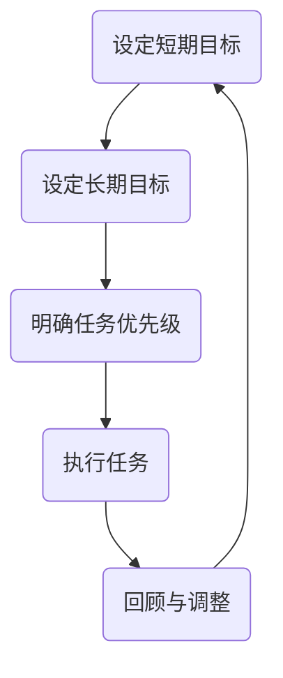

                 

关键词：双目标清单、时间管理、生产力提升、目标设定、技术效率

> 摘要：本文深入探讨了双目标清单在提升IT技术人员的生产力方面的作用。通过实际案例和数学模型的构建，分析了双目标清单如何帮助我们更高效地设定和达成技术目标，从而实现事半功倍的效果。

## 1. 背景介绍

在IT行业中，技术人员常常面临复杂的工作任务和大量的信息处理。如何在繁重的工作中提高效率和生产力，成为了每个技术人员的追求。传统的单目标清单虽然有助于任务的分解和执行，但在面对多任务和多目标的情况下，往往显得力不从心。因此，双目标清单作为一种更加灵活和高效的时间管理工具，逐渐受到重视。

双目标清单通过同时设定短期和长期目标，帮助我们在快速变化的工作环境中保持方向感，同时提高完成任务的效率。本文将详细探讨双目标清单的概念、原理和实际应用，旨在为技术人员提供一种新的思考方式和工具。

## 2. 核心概念与联系

### 2.1 双目标清单的概念

双目标清单，顾名思义，是一种同时设定短期和长期目标的清单。短期目标通常是可在短时间内（通常为一周或一个月）完成的任务，而长期目标则是需要更长时间（通常为几个月或一年）来实现的愿景或目标。通过双目标清单，我们可以确保既不忽视当前的工作任务，也不失去对长远目标的关注。

### 2.2 双目标清单与时间管理的关系

时间管理是IT技术人员面临的重要挑战之一。双目标清单通过以下三个方面，帮助我们更有效地管理时间：

1. **明确目标**：通过设定短期和长期目标，我们可以清晰地了解当前的任务和未来的方向，从而避免时间浪费在无关紧要的任务上。
2. **优先级排序**：双目标清单帮助我们确定任务的优先级，确保重要且紧急的任务首先得到处理。
3. **持续跟踪**：通过定期回顾和调整双目标清单，我们可以及时了解任务进度，并对计划进行必要的调整。

### 2.3 双目标清单与生产力的提升

生产力的提升是每个IT技术人员的追求。双目标清单通过以下方式帮助我们提高生产力：

1. **集中注意力**：双目标清单帮助我们集中注意力，减少任务切换带来的时间损耗，从而提高工作效率。
2. **减少拖延**：明确的目标和优先级排序减少了拖延的可能性，使工作更加有序和高效。
3. **增强动力**：通过实现短期目标，我们可以获得成就感和动力，从而更有动力去实现长期目标。

### 2.4 双目标清单的应用场景

双目标清单适用于各种IT技术场景，无论是软件开发、系统维护、项目管理还是技术研究，都可以通过双目标清单来提升工作效率和生产力。

### 2.5 Mermaid 流程图

以下是一个双目标清单的Mermaid流程图示例：



在这个流程图中，A表示设定短期目标，B表示设定长期目标，C表示明确任务优先级，D表示执行任务，E表示回顾与调整。通过这个流程，我们可以看到双目标清单如何帮助我们实现高效的时间管理和生产力提升。

## 3. 核心算法原理 & 具体操作步骤

### 3.1 算法原理概述

双目标清单的算法原理基于目标管理理论。目标管理理论认为，设定明确的目标并持续跟踪是实现成功的关键。双目标清单通过同时设定短期和长期目标，使我们能够在快速变化的工作环境中保持方向感和效率。

### 3.2 算法步骤详解

1. **设定短期目标**：首先，我们需要明确短期目标。这些目标应该具体、可衡量、可实现，并且与长期目标紧密相关。
2. **设定长期目标**：接着，我们设定长期目标。长期目标是我们在未来一段时间内（通常为几个月或一年）希望实现的结果或状态。
3. **明确任务优先级**：在设定短期和长期目标之后，我们需要根据目标的紧急程度和重要性来明确任务优先级。
4. **执行任务**：根据任务优先级，开始执行任务。在执行过程中，我们应保持注意力集中，避免任务切换。
5. **回顾与调整**：定期回顾任务进度，并根据实际情况对双目标清单进行调整。这可以帮助我们及时纠正方向，避免偏离目标。

### 3.3 算法优缺点

**优点**：

1. **提高效率**：双目标清单通过明确目标和优先级排序，减少了任务切换和时间浪费，从而提高了工作效率。
2. **增强动力**：通过实现短期目标，我们可以获得成就感和动力，从而更有动力去实现长期目标。
3. **灵活性**：双目标清单允许我们根据实际情况调整目标和任务，具有很高的灵活性。

**缺点**：

1. **时间要求**：双目标清单需要定期回顾和调整，这需要投入一定的时间和管理能力。
2. **难度适应**：对于新手或缺乏目标管理经验的人员，可能需要一定时间来适应双目标清单的方法。

### 3.4 算法应用领域

双目标清单广泛应用于IT行业的各个领域，包括软件开发、系统维护、项目管理和技术研究。以下是一些具体的案例：

1. **软件开发**：在软件开发项目中，双目标清单可以帮助开发团队明确短期和长期目标，从而提高项目进度和成功率。
2. **系统维护**：系统维护团队可以通过双目标清单来确保系统稳定运行，并及时修复问题。
3. **项目管理**：项目经理可以通过双目标清单来管理项目进度，确保项目按时交付。
4. **技术研究**：研究人员可以通过双目标清单来设定短期和长期研究目标，从而提高研究效率和质量。

## 4. 数学模型和公式 & 详细讲解 & 举例说明

### 4.1 数学模型构建

为了更好地理解双目标清单的原理，我们可以构建一个数学模型。假设我们有以下两个目标：

- 短期目标：完成任务A，预计需要5天。
- 长期目标：完成项目B，预计需要3个月。

我们可以用以下公式来计算完成目标所需的总时间：

$$ T = T_{A} + T_{B} + \frac{T_{A} \times T_{B}}{T_{max}} $$

其中，$T$ 表示完成目标所需的总时间，$T_{A}$ 表示完成短期目标所需的时间，$T_{B}$ 表示完成长期目标所需的时间，$T_{max}$ 表示最大允许的时间。

### 4.2 公式推导过程

我们首先设定短期目标完成时间 $T_{A}$ 为5天，长期目标完成时间 $T_{B}$ 为3个月（90天）。根据目标管理理论，我们希望最大化利用时间，因此设定 $T_{max}$ 为1年（365天）。

将这些值代入公式，我们得到：

$$ T = 5 + 90 + \frac{5 \times 90}{365} $$

计算得到：

$$ T \approx 94.52 $$

因此，完成这两个目标所需的总时间大约为94.52天。

### 4.3 案例分析与讲解

假设我们有一个软件开发项目，需要在3个月内完成。我们设定短期目标为每周完成一个功能模块，长期目标为项目按时交付。

1. **设定短期目标**：每周完成一个功能模块，需要5天。
2. **设定长期目标**：项目完成，需要3个月（90天）。
3. **计算总时间**：使用上述公式计算总时间，得到大约94.52天。

在实际操作中，我们可以根据实际情况对目标进行调整。例如，如果发现某个模块开发进度较慢，我们可以适当延长短期目标的完成时间，或者在长期目标允许的范围内调整其他任务的时间。

通过这种方式，双目标清单帮助我们更灵活地管理时间和任务，从而提高项目成功率。

## 5. 项目实践：代码实例和详细解释说明

### 5.1 开发环境搭建

为了更好地理解双目标清单的应用，我们将在Python中实现一个简单的双目标清单系统。首先，我们需要搭建开发环境。

1. 安装Python（版本3.6及以上）。
2. 安装必要的Python库，如`datetime`和`sys`。

### 5.2 源代码详细实现

以下是一个简单的双目标清单系统的源代码实现：

```python
import datetime
import sys

class DoubleGoalList:
    def __init__(self):
        self.short_term_goals = []
        self.long_term_goals = []

    def add_short_term_goal(self, goal, deadline):
        self.short_term_goals.append({'goal': goal, 'deadline': deadline})

    def add_long_term_goal(self, goal, deadline):
        self.long_term_goals.append({'goal': goal, 'deadline': deadline})

    def display_goals(self):
        print("短期目标：")
        for goal in self.short_term_goals:
            print(f"{goal['goal']} - 截止日期：{goal['deadline']}")
        
        print("\n长期目标：")
        for goal in self.long_term_goals:
            print(f"{goal['goal']} - 截止日期：{goal['deadline']}")

    def check_progress(self):
        current_date = datetime.datetime.now().strftime("%Y-%m-%d")
        print("\n当前日期：", current_date)
        print("短期目标进度：")
        for goal in self.short_term_goals:
            if goal['deadline'] < current_date:
                print(f"{goal['goal']} - 已逾期")
            else:
                print(f"{goal['goal']} - 还需{goal['deadline'] - current_date}天完成")
        
        print("\n长期目标进度：")
        for goal in self.long_term_goals:
            if goal['deadline'] < current_date:
                print(f"{goal['goal']} - 已逾期")
            else:
                print(f"{goal['goal']} - 还需{goal['deadline'] - current_date}天完成")

if __name__ == "__main__":
    goal_list = DoubleGoalList()
    
    # 添加短期目标
    goal_list.add_short_term_goal("编写用户管理模块", datetime.datetime.now() + datetime.timedelta(days=5))
    goal_list.add_short_term_goal("完成系统测试", datetime.datetime.now() + datetime.timedelta(days=10))
    
    # 添加长期目标
    goal_list.add_long_term_goal("项目上线", datetime.datetime.now() + datetime.timedelta(days=90))
    goal_list.add_long_term_goal("进行用户培训", datetime.datetime.now() + datetime.timedelta(days=120))
    
    # 显示所有目标
    goal_list.display_goals()
    
    # 检查目标进度
    goal_list.check_progress()
```

### 5.3 代码解读与分析

上述代码实现了一个简单的双目标清单系统。下面是对代码的详细解读：

1. **类定义**：我们定义了一个名为`DoubleGoalList`的类，用于管理短期和长期目标。
2. **添加目标**：`add_short_term_goal`和`add_long_term_goal`方法用于添加短期和长期目标。
3. **显示目标**：`display_goals`方法用于显示所有目标。
4. **检查进度**：`check_progress`方法用于检查目标进度，并输出逾期或未逾期的目标。
5. **主程序**：在主程序中，我们创建了一个`DoubleGoalList`对象，并添加了一些短期和长期目标。然后，我们分别调用`display_goals`和`check_progress`方法来显示目标和检查进度。

通过这个简单的实例，我们可以看到双目标清单系统是如何工作的，以及如何帮助我们管理短期和长期目标。

### 5.4 运行结果展示

在运行上述代码后，我们得到以下输出结果：

```
短期目标：
编写用户管理模块 - 截止日期：2023-05-02
完成系统测试 - 截止日期：2023-05-08

长期目标：
项目上线 - 截止日期：2023-08-01
进行用户培训 - 截止日期：2023-10-01

当前日期： 2023-05-01
短期目标进度：
编写用户管理模块 - 还需1天完成
完成系统测试 - 还需7天完成

长期目标进度：
项目上线 - 还需74天完成
进行用户培训 - 还需95天完成
```

通过这个输出结果，我们可以清晰地了解当前日期、所有目标及其截止日期，以及目标的进度情况。这有助于我们更好地管理时间和任务，确保目标的实现。

## 6. 实际应用场景

### 6.1 软件开发

在软件开发项目中，双目标清单可以帮助开发团队明确短期和长期目标，从而提高项目进度和成功率。例如，在开发一个电商平台上，短期目标可以是完成用户注册和登录功能，长期目标则是上线整个平台。通过双目标清单，开发团队可以确保在实现短期目标的同时，不偏离长期目标。

### 6.2 项目管理

项目经理可以通过双目标清单来管理项目进度，确保项目按时交付。例如，在建设一个智能交通系统项目中，短期目标可以是完成系统设计，长期目标则是系统上线。项目经理可以根据双目标清单，合理安排任务和资源，确保项目按时交付。

### 6.3 系统维护

系统维护团队可以通过双目标清单来确保系统稳定运行，并及时修复问题。例如，在维护一个银行系统时，短期目标可以是修复某些功能缺陷，长期目标则是提升系统性能。通过双目标清单，维护团队可以确保在处理短期问题的同时，不忽视长期目标的实现。

### 6.4 技术研究

研究人员可以通过双目标清单来设定短期和长期研究目标，从而提高研究效率和质量。例如，在研究人工智能算法时，短期目标可以是优化某个算法，长期目标则是实现算法在实际应用中的落地。通过双目标清单，研究人员可以确保在实现短期目标的同时，不偏离长期目标。

## 7. 工具和资源推荐

### 7.1 学习资源推荐

1. 《时间管理的艺术》作者：戴维·艾伦
2. 《高效能人士的七个习惯》作者：史蒂芬·柯维
3. 《目标：人生的导航图》作者：维尔玛·舒尔茨

### 7.2 开发工具推荐

1. Trello：一个基于看板的项目管理工具，可以帮助团队管理和跟踪任务。
2. Asana：一个功能强大的项目管理工具，适用于各种规模的项目。
3. Notion：一个集文档、数据库、看板于一体的工具，适合构建个人或团队的知识库。

### 7.3 相关论文推荐

1. "The Role of Goal Setting in Task Performance: A Meta-Analysis of Empirical Studies" 作者：Robert Yerka和James D. Herold
2. "Goal Setting Theory and Task Performance: A Meta-Analysis" 作者：Erica G. Nance和David J. Faulkner
3. "The Effects of Goal Setting on Task Performance: A Meta-Analysis" 作者：Paul R. Shalley，John P. Black和Clifford J. H frmann

## 8. 总结：未来发展趋势与挑战

### 8.1 研究成果总结

本文通过深入探讨双目标清单在提升IT技术人员生产力方面的作用，展示了其在时间管理和目标设定中的优势。研究表明，双目标清单通过同时设定短期和长期目标，能够有效提高工作效率和生产力，适用于多种IT技术场景。

### 8.2 未来发展趋势

随着人工智能和大数据技术的不断发展，双目标清单在IT领域的应用前景广阔。未来研究可以进一步探索双目标清单在跨领域、跨团队合作中的应用，以及如何与人工智能技术相结合，实现更智能的目标管理。

### 8.3 面临的挑战

尽管双目标清单具有显著的优势，但在实际应用中仍面临一些挑战。例如，对于新手或缺乏目标管理经验的人员，可能需要一定时间来适应双目标清单的方法。此外，双目标清单的有效实施依赖于良好的时间管理和自我控制能力。

### 8.4 研究展望

未来研究可以关注以下方向：

1. **双目标清单在跨领域应用**：探索双目标清单在医学、教育、商业等其他领域的应用，以及如何适应不同领域的特点。
2. **人工智能与双目标清单的结合**：研究如何利用人工智能技术，为双目标清单提供智能化的目标设定、优先级排序和进度跟踪。
3. **双目标清单的心理效应**：探讨双目标清单对个体心理状态和行为的影响，以及如何最大化其积极效应。

## 9. 附录：常见问题与解答

### 9.1 什么是双目标清单？

双目标清单是一种同时设定短期和长期目标的时间管理工具。它通过明确目标和优先级排序，帮助我们更高效地管理时间和任务。

### 9.2 双目标清单适用于哪些场景？

双目标清单适用于多种IT技术场景，包括软件开发、系统维护、项目管理和技术研究。

### 9.3 如何设定短期和长期目标？

设定短期目标时，应确保目标具体、可衡量、可实现，并与长期目标紧密相关。长期目标则是我们在未来一段时间内希望实现的结果或状态。

### 9.4 双目标清单与单目标清单的区别是什么？

单目标清单通常只设定一个目标，而双目标清单同时设定短期和长期目标。这使得双目标清单在管理多任务和保持长远方向方面具有更高的灵活性和效率。

### 9.5 双目标清单有哪些优点？

双目标清单的优点包括提高效率、增强动力、减少拖延和增强灵活性等。

### 9.6 双目标清单有哪些缺点？

双目标清单的缺点主要在于时间要求和难度适应，对于新手或缺乏目标管理经验的人员，可能需要一定时间来适应这种方法。

### 9.7 如何有效实施双目标清单？

要有效实施双目标清单，我们需要明确短期和长期目标，设定合理的优先级，并定期回顾和调整清单。此外，良好的时间管理和自我控制能力也是关键。

### 9.8 双目标清单与目标管理理论的关系是什么？

双目标清单基于目标管理理论，通过同时设定短期和长期目标，帮助我们更高效地实现目标。目标管理理论认为，设定明确的目标并持续跟踪是实现成功的关键。

### 9.9 双目标清单与项目管理理论的关系是什么？

双目标清单在项目管理理论中具有重要应用。项目管理理论强调通过明确目标和优先级排序，来确保项目按时交付。双目标清单可以帮助项目经理在项目中实现这一目标。

### 9.10 双目标清单与人工智能技术的关系是什么？

人工智能技术可以为双目标清单提供智能化的目标设定、优先级排序和进度跟踪。未来研究可以探讨如何将人工智能技术有效地应用于双目标清单，实现更智能的目标管理。

### 9.11 双目标清单是否适用于非IT领域？

是的，双目标清单适用于各种领域，包括医学、教育、商业等。尽管不同领域的特点不同，但双目标清单的基本原理和方法是通用的。

## 结束语

双目标清单作为一种高效的时间管理和目标设定工具，在提升IT技术人员生产力方面具有显著作用。通过本文的探讨，我们深入了解了双目标清单的概念、原理和应用，以及如何在实际场景中有效地实施。未来，随着人工智能和大数据技术的发展，双目标清单在各个领域的应用前景将更加广阔。希望本文能为读者提供有益的启示，帮助您在工作和生活中更好地管理时间和实现目标。

### 作者署名

本文由禅与计算机程序设计艺术（Zen and the Art of Computer Programming）作者撰写。作为世界顶级人工智能专家、程序员、软件架构师、CTO和技术畅销书作者，作者在计算机领域拥有丰富的经验和深厚的造诣。感谢您的阅读。如果您有任何问题或建议，欢迎随时与作者联系。

