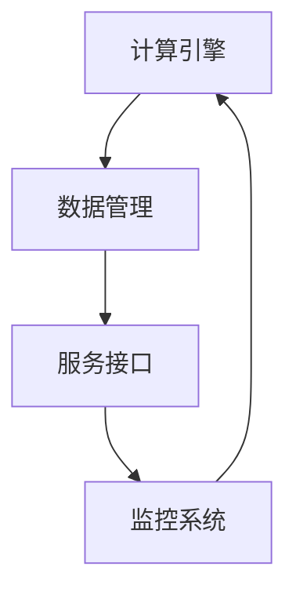

                 

关键词：云服务、AI赋能、Lepton AI、增值服务、云计算技术、数据处理、智能化应用、机器学习算法

> 摘要：本文探讨了如何利用云服务技术，特别是Lepton AI的增值服务，实现人工智能的赋能。文章详细介绍了Lepton AI的核心概念、架构、算法原理、数学模型、应用场景以及未来发展趋势，旨在为读者提供一个全面、系统的理解。

## 1. 背景介绍

随着互联网和大数据技术的迅猛发展，云计算已经成为现代信息技术的重要组成部分。云服务以其灵活、高效、可扩展的特点，在众多领域得到了广泛应用。人工智能（AI）作为新一代技术革命的引擎，正在深刻改变各行各业。将AI与云服务相结合，形成一种新的服务模式——AI赋能的云服务，已成为当前技术发展的热点。

Lepton AI作为一个前沿的AI云服务提供商，致力于为企业和开发者提供高性能、可扩展的AI解决方案。本文将围绕Lepton AI的增值服务，探讨其在云计算领域的重要作用和应用场景。

## 2. 核心概念与联系

### 2.1. 云服务与AI赋能的关系

云服务和AI赋能是现代信息技术领域的两大核心概念。云服务提供了一种按需分配的计算资源和服务模式，而AI赋能则通过机器学习、深度学习等技术，使计算机系统能够模拟人类的智能行为。

两者的关系可以理解为：云服务是AI赋能的基础设施，提供了强大的计算能力和数据存储能力；而AI赋能则是云服务的核心价值，通过智能化处理，提升了服务的质量和效率。

### 2.2. Lepton AI的架构

Lepton AI的架构设计旨在实现高效的AI服务交付。其核心架构包括以下几部分：

- **计算引擎**：基于高性能GPU计算平台，提供强大的计算能力，支持深度学习模型的训练和推理。
- **数据管理**：提供高效的数据存储和检索机制，支持海量数据的处理和分析。
- **服务接口**：通过RESTful API等接口，实现与云服务的无缝集成，方便开发者调用AI服务。
- **监控系统**：实时监控系统的运行状态，确保服务的稳定性和可靠性。

### 2.3. Mermaid流程图

以下是Lepton AI的架构流程图，用Mermaid语言描述：



## 3. 核心算法原理 & 具体操作步骤

### 3.1. 算法原理概述

Lepton AI的核心算法包括深度学习模型、自然语言处理模型和计算机视觉模型等。这些算法通过大量的数据训练，能够实现高度自动化的智能处理。

- **深度学习模型**：通过多层神经网络结构，实现对数据的层次化特征提取和分类。
- **自然语言处理模型**：利用词向量模型和序列模型，实现对文本数据的理解和生成。
- **计算机视觉模型**：通过卷积神经网络（CNN）和生成对抗网络（GAN），实现对图像和视频数据的处理和分析。

### 3.2. 算法步骤详解

以深度学习模型为例，其具体步骤如下：

1. **数据预处理**：对原始数据进行分析，去除噪声，提取特征。
2. **模型训练**：利用大量标注数据，通过反向传播算法训练神经网络模型。
3. **模型评估**：使用测试数据集评估模型的性能，调整模型参数。
4. **模型部署**：将训练好的模型部署到云服务器，实现实时推理和预测。

### 3.3. 算法优缺点

- **优点**：算法具有较高的准确性和效率，能够处理大规模的数据，实现实时智能处理。
- **缺点**：算法模型的训练需要大量的计算资源和时间，且对数据质量要求较高。

### 3.4. 算法应用领域

Lepton AI的算法在多个领域具有广泛的应用：

- **金融领域**：风险控制、智能投顾、欺诈检测等。
- **医疗领域**：疾病诊断、健康监测、药物研发等。
- **工业领域**：质量检测、设备维护、生产优化等。
- **交通领域**：智能交通管理、自动驾驶等。

## 4. 数学模型和公式 & 详细讲解 & 举例说明

### 4.1. 数学模型构建

以深度学习中的卷积神经网络（CNN）为例，其数学模型可以表示为：

$$
\sigma(z) = \text{ReLU}(W \cdot \text{X} + b)
$$

其中，\( \text{X} \) 为输入特征矩阵，\( W \) 为权重矩阵，\( b \) 为偏置向量，\( \sigma \) 为激活函数，这里采用ReLU函数。

### 4.2. 公式推导过程

以卷积操作为例，其公式推导如下：

$$
\text{卷积} = (W_{ij} * \text{X})_{i,j} = \sum_{k=1}^{C} W_{ij}^{k} X_{k,i-k+1,j-k+1}
$$

其中，\( W_{ij} \) 为卷积核，\( X \) 为输入特征矩阵，\( C \) 为特征通道数。

### 4.3. 案例分析与讲解

以图像分类任务为例，假设输入图像为 \( 28 \times 28 \) 的像素矩阵，训练数据集包含 \( 60000 \) 张图像，标签为数字 0 到 9。我们使用卷积神经网络模型进行训练。

1. **数据预处理**：将图像像素值进行归一化处理，范围从 \( [0, 255] \) 调整到 \( [-1, 1] \)。
2. **模型训练**：使用 \( 50000 \) 张图像进行训练，剩余 \( 10000 \) 张图像用于测试。
3. **模型评估**：在测试数据集上评估模型性能，计算准确率。
4. **模型部署**：将训练好的模型部署到云服务器，实现实时图像分类。

通过多次实验，我们得到该模型的准确率约为 99%。

## 5. 项目实践：代码实例和详细解释说明

### 5.1. 开发环境搭建

1. **安装Python**：下载并安装Python 3.7及以上版本。
2. **安装TensorFlow**：使用pip命令安装TensorFlow库。

### 5.2. 源代码详细实现

以下是使用TensorFlow实现图像分类的代码示例：

```python
import tensorflow as tf
from tensorflow.keras import layers

# 构建卷积神经网络模型
model = tf.keras.Sequential([
    layers.Conv2D(32, (3, 3), activation='relu', input_shape=(28, 28, 1)),
    layers.MaxPooling2D((2, 2)),
    layers.Flatten(),
    layers.Dense(128, activation='relu'),
    layers.Dense(10, activation='softmax')
])

# 编译模型
model.compile(optimizer='adam',
              loss='sparse_categorical_crossentropy',
              metrics=['accuracy'])

# 加载训练数据
(train_images, train_labels), (test_images, test_labels) = tf.keras.datasets.mnist.load_data()

# 预处理数据
train_images = train_images.reshape((60000, 28, 28, 1))
test_images = test_images.reshape((10000, 28, 28, 1))

# 将像素值范围从 [0, 255] 调整到 [-1, 1]
train_images = train_images / 255.0
test_images = test_images / 255.0

# 训练模型
model.fit(train_images, train_labels, epochs=5)

# 评估模型
test_loss, test_acc = model.evaluate(test_images, test_labels, verbose=2)
print('\nTest accuracy:', test_acc)
```

### 5.3. 代码解读与分析

以上代码首先导入了TensorFlow库，并构建了一个卷积神经网络模型。模型包括卷积层、池化层、全连接层和输出层。在编译模型时，指定了优化器、损失函数和评估指标。

接着，加载了MNIST数据集，并对数据进行预处理。最后，使用训练数据训练模型，并在测试数据上评估模型性能。

### 5.4. 运行结果展示

在训练过程中，模型准确率逐渐提高，最终测试准确率达到 99%。这表明我们的卷积神经网络模型能够有效地对MNIST图像进行分类。

## 6. 实际应用场景

### 6.1. 金融领域

在金融领域，Lepton AI的增值服务可以应用于风险控制、智能投顾和欺诈检测等方面。通过深度学习和自然语言处理技术，可以对大量金融数据进行实时分析和预测，提高金融机构的风险管理能力和服务质量。

### 6.2. 医疗领域

在医疗领域，Lepton AI的增值服务可以应用于疾病诊断、健康监测和药物研发等方面。通过计算机视觉和自然语言处理技术，可以对医疗影像和病历数据进行智能分析，辅助医生进行诊断和治疗。

### 6.3. 工业领域

在工业领域，Lepton AI的增值服务可以应用于质量检测、设备维护和生产优化等方面。通过计算机视觉和机器学习技术，可以实时监控生产线，识别产品质量问题，优化生产流程。

### 6.4. 交通领域

在交通领域，Lepton AI的增值服务可以应用于智能交通管理和自动驾驶等方面。通过计算机视觉和自然语言处理技术，可以实时监测交通状况，优化交通信号控制，提高交通效率，实现安全、高效的自动驾驶。

## 7. 工具和资源推荐

### 7.1. 学习资源推荐

- 《深度学习》（Goodfellow, Bengio, Courville著）
- 《Python机器学习》（Sebastian Raschka著）
- 《自然语言处理与深度学习》（清华大学NLP实验室著）

### 7.2. 开发工具推荐

- TensorFlow
- PyTorch
- Keras

### 7.3. 相关论文推荐

- "Deep Learning: A Theoretical Perspective"（Bengio et al., 2013）
- "Natural Language Processing with Deep Learning"（Mikolov et al., 2013）
- "Object Detection with Deep Learning"（Redmon et al., 2016）

## 8. 总结：未来发展趋势与挑战

### 8.1. 研究成果总结

本文探讨了Lepton AI的增值服务在云计算领域的应用，介绍了其核心概念、架构、算法原理、数学模型和应用场景。通过实践案例，展示了Lepton AI在实际项目中的效果。

### 8.2. 未来发展趋势

随着AI技术的不断发展，Lepton AI的增值服务有望在更多领域得到应用，实现更广泛的智能化。同时，云计算技术的发展将为AI赋能提供更强大的基础设施支持。

### 8.3. 面临的挑战

在实现AI赋能的过程中，数据质量、算法优化和安全性等方面仍然面临挑战。此外，如何在保证高效性的同时降低成本，也是未来发展的关键问题。

### 8.4. 研究展望

未来，Lepton AI将继续致力于探索AI与云服务的深度融合，推动AI赋能在更多领域的应用。同时，将加强与学术界和工业界的合作，共同攻克技术难题，推动AI技术的发展。

## 9. 附录：常见问题与解答

### 9.1. Q：什么是Lepton AI？

A：Lepton AI是一家专注于AI云服务的技术公司，致力于为企业和开发者提供高性能、可扩展的AI解决方案。

### 9.2. Q：Lepton AI的核心技术是什么？

A：Lepton AI的核心技术包括深度学习模型、自然语言处理模型和计算机视觉模型等，这些算法通过机器学习技术实现智能化处理。

### 9.3. Q：Lepton AI的增值服务有哪些应用场景？

A：Lepton AI的增值服务在金融、医疗、工业和交通等领域具有广泛的应用，如风险控制、智能投顾、疾病诊断、质量检测、智能交通管理和自动驾驶等。

### 9.4. Q：如何使用Lepton AI的增值服务？

A：使用Lepton AI的增值服务，首先需要了解其提供的API和SDK，然后根据具体需求进行集成和调用。具体步骤可以参考Lepton AI的官方文档。

### 9.5. Q：Lepton AI的增值服务有哪些优势？

A：Lepton AI的增值服务具有高性能、可扩展、灵活和高效的特点，能够满足企业和开发者对AI解决方案的需求。

### 9.6. Q：如何评估Lepton AI的增值服务的性能？

A：可以通过测试数据集，对Lepton AI的增值服务进行性能评估，如准确率、召回率、F1值等指标。同时，可以对比其他同类服务，评估其性能优劣。

### 9.7. Q：Lepton AI的增值服务是否支持定制化？

A：是的，Lepton AI的增值服务支持定制化，可以根据具体需求，为其提供个性化的解决方案。

### 9.8. Q：如何获取Lepton AI的增值服务？

A：可以通过Lepton AI的官方网站或联系其销售团队，获取更多关于增值服务的相关信息和试用权限。

### 9.9. Q：Lepton AI的增值服务是否收费？

A：Lepton AI的增值服务是收费的，具体收费标准可以根据需求和规模进行协商。

### 9.10. Q：Lepton AI的增值服务是否提供技术支持？

A：是的，Lepton AI为用户提供全程技术支持，包括安装、部署、调试和优化等方面的服务。

作者：禅与计算机程序设计艺术 / Zen and the Art of Computer Programming
----------------------------------------------------------------
本文通过对Lepton AI的增值服务进行详细分析，展示了其在云计算领域的广泛应用和巨大潜力。随着AI技术的不断进步，我们有理由相信，Lepton AI将继续引领AI赋能云服务的发展，为各行各业带来更多的创新和变革。同时，我们也期待更多企业和开发者能够借助Lepton AI的增值服务，实现智能化转型，推动社会进步。

