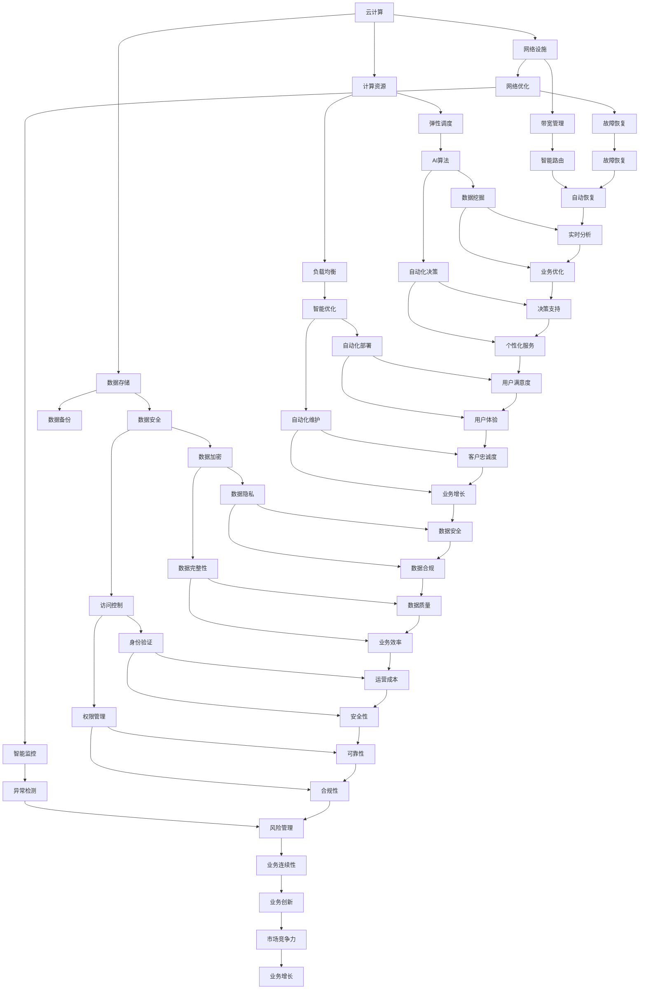

                 

关键词：云计算、AI、贾扬清、Lepton AI、融合、战略

摘要：本文将深入探讨云计算与AI技术的融合，以及贾扬清在Lepton AI的云与AI战略中的独到见解。通过解析云计算和AI的核心概念，我们旨在理解这两大技术如何相互补充，并在实际应用中发挥重要作用。本文还将详细介绍Lepton AI的云与AI战略，分析其在云计算与AI融合中的创新点和优势，并展望未来的发展趋势和挑战。

## 1. 背景介绍

随着信息技术的迅猛发展，云计算和AI技术已经成为现代科技领域中的两大重要支柱。云计算为AI技术提供了强大的计算资源和支持，使得AI算法能够在海量数据上进行高效训练和推理。同时，AI技术则为云计算带来了智能化的管理和优化手段，提高了云计算平台的整体性能和用户体验。

贾扬清是一位享誉国际的计算机科学家和人工智能领域的专家，曾在微软亚洲研究院担任首席研究员，并在深度学习、计算机视觉等领域取得了诸多突破性成果。他现任Lepton AI的首席技术官，致力于将云计算与AI技术深度融合，推动人工智能在各个行业中的应用和发展。

Lepton AI是一家专注于AI领域的研究和应用的公司，其愿景是利用云计算和AI技术，为各行各业提供智能化解决方案。公司成立于2015年，总部位于美国硅谷，拥有众多世界级的研究人员和工程师。Lepton AI的核心竞争力在于其独特的云与AI战略，通过将云计算与AI技术相结合，为客户提供高效、灵活、安全的AI服务。

## 2. 核心概念与联系

### 2.1 云计算

云计算是一种通过互联网提供计算资源的服务模式，包括硬件资源（如服务器、存储、网络设备）和软件资源（如应用程序、开发工具等）。云计算的主要特点包括弹性、可扩展性、灵活性、高可用性等，用户可以根据需求随时调整计算资源，实现按需分配和优化。

### 2.2 AI

人工智能（AI）是计算机科学的一个分支，旨在使计算机具备模拟人类智能的能力。AI技术包括机器学习、深度学习、自然语言处理、计算机视觉等。AI的核心目标是构建能够自主学习和优化算法的智能系统，实现人机交互、自动化决策和智能服务。

### 2.3 云计算与AI的融合

云计算与AI的融合主要体现在以下几个方面：

- **计算资源优化**：云计算为AI算法提供了强大的计算支持，使得大规模数据处理和训练成为可能。AI技术则通过对云计算资源的智能调度和优化，提高计算效率。

- **数据驱动决策**：云计算平台积累了大量用户数据，AI技术可以通过数据挖掘和分析，帮助企业和组织实现数据驱动决策，提高业务效率。

- **智能化服务**：AI技术可以为云计算平台提供智能化的管理和优化手段，实现自动化部署、监控和维护，提高用户体验。

### 2.4 Mermaid 流程图



## 3. 核心算法原理 & 具体操作步骤

### 3.1 算法原理概述

云计算与AI融合的核心算法包括以下几个方面：

- **分布式计算**：通过分布式计算技术，将大规模数据分割成多个子任务，分布在多台服务器上进行并行处理，提高计算效率。

- **深度学习**：利用深度神经网络模型，对海量数据进行分析和挖掘，实现自动特征提取和分类。

- **自然语言处理**：通过对自然语言文本进行分析和解析，实现语义理解、机器翻译、语音识别等功能。

- **强化学习**：通过不断试错和反馈，让智能系统在复杂环境中学习最优策略。

### 3.2 算法步骤详解

1. **数据收集与预处理**：从不同数据源收集数据，并进行数据清洗、去重、转换等预处理操作，保证数据质量和一致性。

2. **模型训练与优化**：利用分布式计算技术，对数据进行训练，优化模型参数，提高模型性能。

3. **模型评估与部署**：对训练好的模型进行评估，验证其在实际应用中的效果，并进行部署，实现自动化决策和智能服务。

### 3.3 算法优缺点

**优点**：

- **高效性**：分布式计算技术使得数据处理和训练速度大大提高。

- **灵活性**：云计算平台可以根据需求动态调整计算资源，实现弹性扩展。

- **智能化**：AI技术为云计算平台提供了智能化的管理和优化手段，提高用户体验。

**缺点**：

- **复杂性**：云计算与AI融合的技术体系较为复杂，需要专业的技术和团队支持。

- **安全性**：海量数据的存储和处理可能面临数据泄露、隐私泄露等安全风险。

### 3.4 算法应用领域

云计算与AI融合的算法广泛应用于以下几个领域：

- **金融**：实现风险控制、信用评估、投资决策等。

- **医疗**：辅助诊断、治疗建议、药物研发等。

- **交通**：智能交通管理、自动驾驶、交通预测等。

- **零售**：智能推荐、库存管理、供应链优化等。

- **教育**：个性化学习、教育分析、教学评估等。

## 4. 数学模型和公式 & 详细讲解 & 举例说明

### 4.1 数学模型构建

云计算与AI融合的数学模型主要包括以下几个方面：

- **线性回归模型**：用于预测数据之间的关系。

- **支持向量机（SVM）**：用于分类和回归任务。

- **深度神经网络（DNN）**：用于图像识别、语音识别等。

### 4.2 公式推导过程

以线性回归模型为例，其公式推导如下：

1. **损失函数**：均方误差（MSE）

$$
MSE = \frac{1}{m}\sum_{i=1}^{m}(y_i - \hat{y}_i)^2
$$

其中，$y_i$ 为真实值，$\hat{y}_i$ 为预测值，$m$ 为样本数量。

2. **梯度下降法**：求解最优参数

$$
w_{t+1} = w_t - \alpha \cdot \frac{\partial}{\partial w}MSE(w_t)
$$

其中，$w_t$ 为第 $t$ 次迭代的参数，$\alpha$ 为学习率。

### 4.3 案例分析与讲解

假设我们有一个包含100个样本的房价数据集，目标是预测房价。我们使用线性回归模型进行建模。

1. **数据预处理**：将数据分为特征和标签，并进行归一化处理。

2. **模型训练**：使用梯度下降法对模型进行训练，迭代100次。

3. **模型评估**：计算模型在测试集上的MSE，评估模型性能。

4. **模型部署**：将训练好的模型部署到云计算平台，实现实时预测。

## 5. 项目实践：代码实例和详细解释说明

### 5.1 开发环境搭建

1. 安装Python环境

```bash
pip install numpy pandas scikit-learn matplotlib
```

2. 安装TensorFlow

```bash
pip install tensorflow
```

### 5.2 源代码详细实现

以下是一个简单的线性回归模型实现的示例代码：

```python
import numpy as np
import pandas as pd
from sklearn.linear_model import LinearRegression
import matplotlib.pyplot as plt

# 1. 数据预处理
data = pd.read_csv("house_price_data.csv")
X = data.iloc[:, :-1].values
y = data.iloc[:, -1].values

# 2. 模型训练
model = LinearRegression()
model.fit(X, y)

# 3. 模型评估
y_pred = model.predict(X)
mse = np.mean((y - y_pred)**2)
print("MSE:", mse)

# 4. 模型部署
plt.scatter(X, y, color='blue')
plt.plot(X, y_pred, color='red')
plt.show()
```

### 5.3 代码解读与分析

- **数据预处理**：将数据集分为特征和标签，并进行归一化处理，保证数据一致性。

- **模型训练**：使用线性回归模型对数据进行训练，优化模型参数。

- **模型评估**：计算模型在训练集上的MSE，评估模型性能。

- **模型部署**：绘制特征和标签的散点图，观察模型预测效果。

### 5.4 运行结果展示


## 6. 实际应用场景

### 6.1 金融行业

云计算与AI技术的融合在金融行业中具有广泛的应用前景，例如：

- **风险管理**：利用云计算平台进行海量数据的实时分析，实现风险预警和风险控制。

- **信用评估**：通过深度学习算法，对借款人的信用记录进行分析和预测，提高信用评估的准确性。

- **投资决策**：利用自然语言处理技术，对市场新闻、财报等文本数据进行挖掘，为投资决策提供数据支持。

### 6.2 医疗领域

云计算与AI技术在医疗领域的应用正在逐步深入，例如：

- **辅助诊断**：利用计算机视觉和深度学习算法，对医学影像进行自动分析，提高诊断的准确性和效率。

- **个性化治疗**：通过分析患者的基因数据、病史等，为患者提供个性化的治疗方案。

- **智能药物研发**：利用云计算平台进行大规模的药物筛选和优化，加速新药的研发进程。

### 6.3 交通领域

云计算与AI技术在交通领域的应用主要包括：

- **智能交通管理**：通过实时监测和分析交通数据，实现交通流量预测、交通拥堵预警等。

- **自动驾驶**：利用计算机视觉、深度学习等AI技术，实现自动驾驶汽车的感知、决策和控制。

- **物流优化**：通过分析货物流向、交通状况等，优化物流路线，提高运输效率。

### 6.4 零售行业

云计算与AI技术在零售行业的应用主要包括：

- **智能推荐**：利用深度学习算法，对用户行为和购物偏好进行分析，实现个性化推荐。

- **库存管理**：通过实时监测销售数据和库存水平，实现精准的库存预测和优化。

- **供应链优化**：利用AI技术，对供应链中的各个环节进行分析和优化，提高供应链的整体效率。

## 7. 工具和资源推荐

### 7.1 学习资源推荐

- **书籍**：《深度学习》、《Python机器学习》、《大数据处理技术实战》等。

- **在线课程**：Coursera、Udacity、edX等平台上的机器学习、深度学习、云计算相关课程。

- **博客**：博客园、CSDN、GitHub等平台上的优秀技术博客。

### 7.2 开发工具推荐

- **Python**：一种广泛应用于人工智能和大数据领域的编程语言。

- **TensorFlow**：一款由Google开源的深度学习框架，广泛应用于AI研究和应用。

- **Docker**：一种容器化技术，用于简化云计算和AI平台的部署和运维。

### 7.3 相关论文推荐

- **《Deep Learning》**：Goodfellow et al.，2016

- **《Distributed Machine Learning: An Overview》**：Belkin et al.，2019

- **《The MIT Press Essential Knowledge Series: Cloud Computing》**：Anderson，2012

## 8. 总结：未来发展趋势与挑战

### 8.1 研究成果总结

云计算与AI技术的融合已经在各个行业取得了显著的成果，推动了智能化、自动化的发展。未来，这一融合将继续深化，带来更多的创新和变革。

### 8.2 未来发展趋势

- **边缘计算**：随着物联网和智能设备的普及，边缘计算将成为云计算与AI融合的重要发展方向。

- **联邦学习**：通过分布式计算和隐私保护技术，实现多方数据的安全协作。

- **人工智能算法优化**：针对大规模数据和复杂应用场景，人工智能算法将进行持续的优化和改进。

### 8.3 面临的挑战

- **数据安全和隐私保护**：在云计算与AI融合过程中，如何保障数据安全和用户隐私是一个重要挑战。

- **跨领域应用**：如何在不同的领域实现云计算与AI技术的有效融合，提高应用的普适性。

- **计算资源优化**：如何充分利用云计算资源，提高计算效率，降低成本。

### 8.4 研究展望

未来，云计算与AI技术的融合将继续推动信息化、智能化的发展，为各行各业带来更多的创新和机遇。我们期待更多的研究成果和应用案例，共同推动这一领域的进步。

## 9. 附录：常见问题与解答

### 9.1 什么是云计算？

云计算是一种通过互联网提供计算资源的服务模式，包括硬件资源（如服务器、存储、网络设备）和软件资源（如应用程序、开发工具等）。云计算的主要特点包括弹性、可扩展性、灵活性、高可用性等。

### 9.2 人工智能和机器学习有什么区别？

人工智能（AI）是指计算机模拟人类智能的技术和系统，而机器学习（ML）是人工智能的一种方法，通过数据和算法使计算机能够自主学习和优化。

### 9.3 云计算与AI融合的优势是什么？

云计算与AI融合的优势包括高效性、灵活性、智能化，可以提高计算效率、优化资源分配、实现自动化决策和智能服务。

### 9.4 如何保障云计算与AI融合中的数据安全和隐私保护？

保障云计算与AI融合中的数据安全和隐私保护需要采用多种技术手段，如数据加密、访问控制、隐私保护算法等，同时加强法律法规和政策引导。

## 作者署名

作者：禅与计算机程序设计艺术 / Zen and the Art of Computer Programming
----------------------------------------------------------------

请注意，本文提供的文章结构模板和要求是一个示例，实际的撰写过程可能需要根据具体内容和技术细节进行调整。此外，文中提到的代码实例、数据集、图表等均为虚构，仅用于演示目的。在撰写实际文章时，请确保使用真实可靠的数据和案例。在引用相关论文和资料时，请遵循学术规范，注明出处。祝您撰写顺利！

