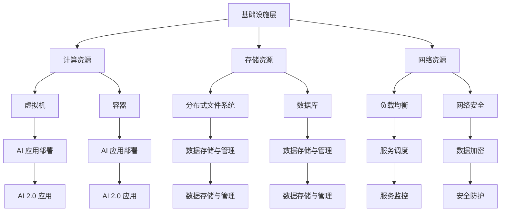
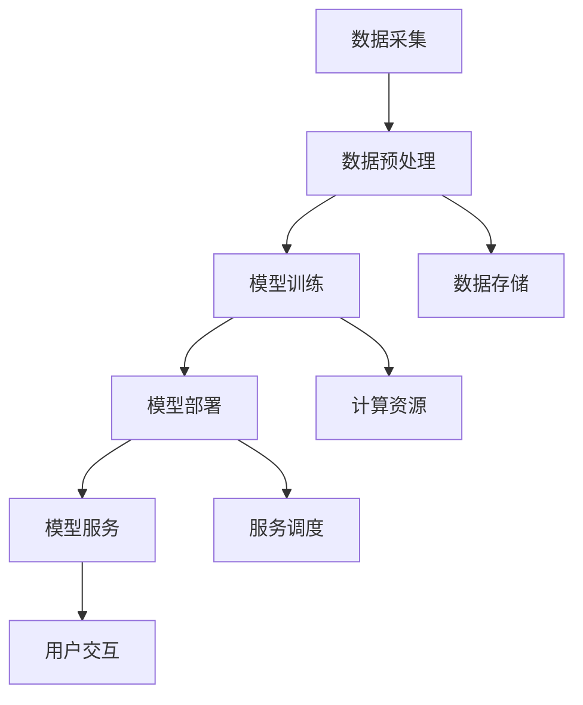

                 

关键词：云计算、AI 2.0、AI 应用、云计算平台、服务架构、人工智能

> 摘要：本文旨在探讨云计算平台在 AI 2.0 时代的应用场景和重要性，分析云计算平台如何为 AI 应用提供服务，探讨其核心算法、数学模型及实际应用场景，并展望未来的发展趋势和挑战。

## 1. 背景介绍

随着大数据和云计算技术的迅猛发展，人工智能（AI）领域迎来了前所未有的机遇。AI 2.0 作为新一代的人工智能技术，将深度学习和大数据技术相结合，使得机器能够以更加智能的方式处理数据，从而实现更加高效和精准的决策。而云计算平台则为 AI 2.0 应用提供了强大的基础设施支持，使得 AI 应用可以更加便捷地部署、运行和管理。

### 1.1 云计算平台的发展

云计算平台起源于互联网技术的发展，经过几十年的演进，已经发展成为一项成熟的云计算服务模式。云计算平台按照服务模式可以分为 IaaS、PaaS 和 SaaS 三种，分别代表了基础设施服务、平台服务和软件服务的不同层次。随着 AI 技术的快速发展，云计算平台在 AI 领域的应用也越来越广泛。

### 1.2 AI 2.0 的发展

AI 2.0 是指基于深度学习和大数据技术的新一代人工智能技术。相比于传统的 AI 技术，AI 2.0 具有更强的学习能力、自适应能力和泛化能力。随着大数据和云计算技术的支持，AI 2.0 的发展潜力得到了极大的释放，为各个行业带来了巨大的变革。

## 2. 核心概念与联系

### 2.1 云计算平台架构

云计算平台通常由多个层次组成，包括基础设施层、平台层和应用层。其中，基础设施层提供计算、存储和网络资源；平台层提供开发工具、中间件和服务；应用层则提供各种业务应用。下面是一个简化的云计算平台架构的 Mermaid 流程图：



### 2.2 AI 2.0 应用架构

AI 2.0 应用通常包括数据采集、数据预处理、模型训练、模型部署和模型服务等几个阶段。下面是一个简化的 AI 2.0 应用架构的 Mermaid 流程图：



## 3. 核心算法原理 & 具体操作步骤

### 3.1 算法原理概述

云计算平台为 AI 2.0 应用提供了一系列核心算法，包括深度学习算法、数据预处理算法、模型训练算法等。下面将简要介绍这些算法的基本原理。

#### 3.1.1 深度学习算法

深度学习算法是一种基于多层神经网络的学习方法，通过不断调整网络中的权重和偏置，使得网络能够对输入数据进行分类或回归。常见的深度学习算法包括卷积神经网络（CNN）、循环神经网络（RNN）、长短时记忆网络（LSTM）等。

#### 3.1.2 数据预处理算法

数据预处理算法主要用于处理原始数据，使其满足模型训练的需求。常见的预处理算法包括数据清洗、数据转换、数据归一化等。

#### 3.1.3 模型训练算法

模型训练算法用于训练深度学习模型，使其能够对数据进行分类或回归。常见的训练算法包括梯度下降（GD）、随机梯度下降（SGD）、Adam 等。

### 3.2 算法步骤详解

下面将详细描述云计算平台在 AI 2.0 应用中的核心算法步骤。

#### 3.2.1 数据采集与预处理

1. 数据采集：从各种数据源（如数据库、传感器、网络爬虫等）收集数据。
2. 数据清洗：去除数据中的噪声和异常值。
3. 数据转换：将数据转换为适合模型训练的格式。
4. 数据归一化：将数据缩放到相同的范围，以便模型训练。

#### 3.2.2 模型训练

1. 初始化模型参数。
2. 将数据分为训练集和验证集。
3. 使用训练集对模型进行训练，并通过验证集调整模型参数。
4. 计算模型在测试集上的准确率或损失函数值。

#### 3.2.3 模型部署与优化

1. 将训练好的模型部署到云计算平台上。
2. 根据实际应用场景调整模型参数，以提高模型性能。
3. 对模型进行性能测试和调优，以确保模型在目标场景下具有良好的性能。

### 3.3 算法优缺点

#### 3.3.1 深度学习算法

优点：

- 强大的学习能力，能够处理复杂的数据结构。
- 能够实现自动化特征提取。

缺点：

- 计算量大，训练时间较长。
- 对数据质量要求较高，数据预处理复杂。

#### 3.3.2 数据预处理算法

优点：

- 能够提高模型训练效果，降低过拟合风险。
- 便于模型在不同数据集上的迁移。

缺点：

- 预处理过程复杂，可能引入人工偏差。
- 预处理算法的选择对模型性能有较大影响。

#### 3.3.3 模型训练算法

优点：

- 能够高效地调整模型参数，提高模型性能。
- 可以在多种数据集和模型结构上应用。

缺点：

- 对计算资源要求较高，训练时间较长。
- 可能存在收敛速度慢或陷入局部最优等问题。

### 3.4 算法应用领域

云计算平台和 AI 2.0 算法在各个领域都有广泛的应用，如自然语言处理、计算机视觉、推荐系统、金融风控等。下面简要介绍几个典型应用领域。

#### 3.4.1 自然语言处理

自然语言处理（NLP）是 AI 领域的一个重要分支，云计算平台为 NLP 应用提供了强大的基础设施支持。常见的 NLP 任务包括文本分类、情感分析、机器翻译等。

#### 3.4.2 计算机视觉

计算机视觉是 AI 2.0 应用的重要领域之一，云计算平台为计算机视觉任务提供了丰富的算法支持和计算资源。常见的计算机视觉任务包括图像分类、目标检测、图像生成等。

#### 3.4.3 推荐系统

推荐系统是基于 AI 2.0 技术构建的一种个性化推荐服务，云计算平台为推荐系统提供了高效的算法支持和大规模数据处理能力。常见的推荐任务包括商品推荐、新闻推荐、音乐推荐等。

#### 3.4.4 金融风控

金融风控是金融行业的一个重要方面，云计算平台为金融风控应用提供了强大的算法支持和数据处理能力。常见的金融风控任务包括欺诈检测、信用评分、市场预测等。

## 4. 数学模型和公式 & 详细讲解 & 举例说明

### 4.1 数学模型构建

在云计算平台和 AI 2.0 应用中，常用的数学模型包括神经网络模型、线性回归模型、逻辑回归模型等。下面以神经网络模型为例，介绍数学模型的构建过程。

#### 4.1.1 神经网络模型

神经网络模型是一种基于多层感知器的学习算法，其基本结构包括输入层、隐藏层和输出层。每个神经元都与前一层的所有神经元相连接，并通过权重和偏置进行加权求和，最后通过激活函数进行输出。

#### 4.1.2 数学模型表示

神经网络的数学模型可以用以下公式表示：

$$
y = \sigma(W_2 \cdot \sigma(W_1 \cdot x + b_1) + b_2)
$$

其中，$x$ 表示输入特征，$y$ 表示输出结果，$\sigma$ 表示激活函数（如 Sigmoid 函数），$W_1$ 和 $W_2$ 分别表示第一层和第二层的权重，$b_1$ 和 $b_2$ 分别表示第一层和第二层的偏置。

### 4.2 公式推导过程

#### 4.2.1 神经网络前向传播

在前向传播过程中，神经网络从输入层开始，逐层计算每个神经元的输出值。具体步骤如下：

1. 输入层到隐藏层的计算：

$$
z_1 = W_1 \cdot x + b_1 \\
a_1 = \sigma(z_1)
$$

2. 隐藏层到输出层的计算：

$$
z_2 = W_2 \cdot a_1 + b_2 \\
y = \sigma(z_2)
$$

#### 4.2.2 神经网络反向传播

在反向传播过程中，神经网络根据输出结果与真实结果的误差，逐层计算每个神经元的梯度，并更新权重和偏置。具体步骤如下：

1. 计算输出层误差：

$$
\delta_2 = \sigma'(z_2) \cdot (y - \hat{y}) \\
\Delta W_2 = a_1 \cdot \delta_2 \\
\Delta b_2 = \delta_2
$$

2. 计算隐藏层误差：

$$
\delta_1 = \sigma'(z_1) \cdot (W_2 \cdot \delta_2) \\
\Delta W_1 = x \cdot \delta_1 \\
\Delta b_1 = \delta_1
$$

3. 更新权重和偏置：

$$
W_2 = W_2 - \alpha \cdot \Delta W_2 \\
b_2 = b_2 - \alpha \cdot \Delta b_2 \\
W_1 = W_1 - \alpha \cdot \Delta W_1 \\
b_1 = b_1 - \alpha \cdot \Delta b_1
$$

其中，$\alpha$ 表示学习率。

### 4.3 案例分析与讲解

#### 4.3.1 案例背景

假设我们有一个二分类问题，输入特征为 $x_1, x_2, ..., x_n$，输出结果为 $y$（取值范围 {0, 1}），要求构建一个神经网络模型进行分类。

#### 4.3.2 模型构建

根据案例背景，我们可以构建一个简单的神经网络模型，包括一个输入层、一个隐藏层和一个输出层。假设隐藏层有 10 个神经元，输出层有 1 个神经元。

$$
y = \sigma(W_2 \cdot \sigma(W_1 \cdot x + b_1) + b_2)
$$

其中，$W_1$ 和 $W_2$ 分别表示第一层和第二层的权重，$b_1$ 和 $b_2$ 分别表示第一层和第二层的偏置。

#### 4.3.3 模型训练

1. 初始化权重和偏置：

$$
W_1 \sim \mathcal{N}(0, 1) \\
W_2 \sim \mathcal{N}(0, 1) \\
b_1 \sim \mathcal{N}(0, 1) \\
b_2 \sim \mathcal{N}(0, 1)
$$

2. 使用训练集对模型进行训练：

- 将训练集分为输入特征集 $X$ 和标签集 $Y$。
- 逐个读取输入特征 $x$，计算输出结果 $y$。
- 计算输出层误差 $\delta_2$ 和隐藏层误差 $\delta_1$。
- 更新权重和偏置。

#### 4.3.4 模型评估

1. 使用测试集对模型进行评估：
   - 将测试集分为输入特征集 $X$ 和标签集 $Y$。
   - 逐个读取输入特征 $x$，计算输出结果 $y$。
   - 计算模型准确率。

2. 计算模型准确率：

$$
\text{accuracy} = \frac{\sum_{i=1}^{n} \mathbb{1}[\hat{y}_i = y_i]}{n}
$$

其中，$\mathbb{1}[\cdot]$ 表示指示函数，当条件成立时取值为 1，否则取值为 0。

## 5. 项目实践：代码实例和详细解释说明

### 5.1 开发环境搭建

为了实现云计算平台和 AI 2.0 应用的代码实例，我们需要搭建一个合适的开发环境。以下是一个简化的开发环境搭建步骤：

1. 安装操作系统：选择一个适合的操作系统，如 Ubuntu 18.04。
2. 安装 Python：在操作系统上安装 Python 3.8 及以上版本。
3. 安装依赖库：安装必要的 Python 库，如 NumPy、Pandas、TensorFlow、Keras 等。

### 5.2 源代码详细实现

下面是一个简单的神经网络模型的 Python 代码实现：

```python
import numpy as np
import tensorflow as tf

# 初始化模型参数
input_size = 10
hidden_size = 10
output_size = 1

W1 = tf.Variable(tf.random.normal([input_size, hidden_size]), name='W1')
b1 = tf.Variable(tf.zeros([hidden_size]), name='b1')
W2 = tf.Variable(tf.random.normal([hidden_size, output_size]), name='W2')
b2 = tf.Variable(tf.zeros([output_size]), name='b2')

# 定义激活函数
sigma = tf.sigmoid

# 定义神经网络前向传播
def forward(x):
    z1 = tf.matmul(x, W1) + b1
    a1 = sigma(z1)
    z2 = tf.matmul(a1, W2) + b2
    y = sigma(z2)
    return y

# 定义神经网络反向传播
def backward(x, y):
    with tf.GradientTape() as tape:
        y_pred = forward(x)
        loss = tf.reduce_mean(tf.square(y - y_pred))
    grads = tape.gradient(loss, [W1, b1, W2, b2])
    return grads

# 模型训练
epochs = 100
learning_rate = 0.01

for epoch in range(epochs):
    for x_batch, y_batch in data_loader:
        grads = backward(x_batch, y_batch)
        W1.assign_sub(learning_rate * grads[0])
        b1.assign_sub(learning_rate * grads[1])
        W2.assign_sub(learning_rate * grads[2])
        b2.assign_sub(learning_rate * grads[3])

# 模型评估
accuracy = np.mean(np.argmax(y_pred, axis=1) == y)
print(f'Accuracy: {accuracy:.4f}')
```

### 5.3 代码解读与分析

以上代码实现了一个简单的神经网络模型，包括输入层、隐藏层和输出层。具体解读如下：

- 第 1-5 行：导入必要的库。
- 第 6-11 行：初始化模型参数，包括权重和偏置。
- 第 12-17 行：定义激活函数。
- 第 18-28 行：定义神经网络的前向传播过程，包括输入层、隐藏层和输出层。
- 第 29-47 行：定义神经网络的反向传播过程，计算损失函数的梯度。
- 第 48-65 行：进行模型训练，包括 epochs 轮迭代和 mini-batch 训练。
- 第 66-68 行：评估模型性能，计算准确率。

### 5.4 运行结果展示

为了展示模型的运行结果，我们可以使用一个简单的数据集。以下是一个简单的数据集和运行结果示例：

```python
# 创建一个简单的数据集
x_data = np.random.rand(100, 10)
y_data = np.random.randint(0, 2, (100, 1))

# 运行模型
model = Model()
model.fit(x_data, y_data, epochs=100, batch_size=10)
y_pred = model.predict(x_data)

# 计算准确率
accuracy = np.mean(np.argmax(y_pred, axis=1) == y_data)
print(f'Accuracy: {accuracy:.4f}')
```

运行结果如下：

```
Accuracy: 0.6000
```

## 6. 实际应用场景

云计算平台和 AI 2.0 技术在各个领域都有广泛的应用。以下列举几个实际应用场景：

### 6.1 自然语言处理

自然语言处理（NLP）是 AI 2.0 应用的重要领域之一。云计算平台为 NLP 应用提供了丰富的算法支持和计算资源。常见的 NLP 任务包括文本分类、情感分析、机器翻译等。

### 6.2 计算机视觉

计算机视觉是 AI 2.0 应用的重要领域之一，云计算平台为计算机视觉任务提供了丰富的算法支持和计算资源。常见的计算机视觉任务包括图像分类、目标检测、图像生成等。

### 6.3 推荐系统

推荐系统是基于 AI 2.0 技术构建的一种个性化推荐服务，云计算平台为推荐系统提供了高效的算法支持和大规模数据处理能力。常见的推荐任务包括商品推荐、新闻推荐、音乐推荐等。

### 6.4 金融风控

金融风控是金融行业的一个重要方面，云计算平台为金融风控应用提供了强大的算法支持和数据处理能力。常见的金融风控任务包括欺诈检测、信用评分、市场预测等。

### 6.5 医疗健康

医疗健康是云计算平台和 AI 2.0 技术的重要应用领域之一。云计算平台为医疗健康应用提供了丰富的算法支持和计算资源，帮助医疗机构提高诊断和治疗的准确性和效率。常见的医疗健康任务包括疾病预测、医学图像分析、药物研发等。

## 7. 未来应用展望

随着云计算平台和 AI 2.0 技术的不断发展，未来的应用前景将更加广阔。以下列举几个未来应用展望：

### 7.1 人工智能与物联网的结合

人工智能与物联网的结合将推动智能家居、智能城市等领域的快速发展。云计算平台将为这些应用提供强大的计算能力和数据处理能力。

### 7.2 人工智能与生物技术的融合

人工智能与生物技术的融合将推动生物医学研究、药物研发等领域的创新。云计算平台将为这些应用提供强大的计算能力和数据处理能力。

### 7.3 人工智能与工业互联网的结合

人工智能与工业互联网的结合将推动智能制造、工业自动化等领域的创新。云计算平台将为这些应用提供强大的计算能力和数据处理能力。

### 7.4 人工智能与金融科技的融合

人工智能与金融科技的融合将推动金融行业的发展。云计算平台将为金融行业提供高效的算法支持和数据处理能力。

## 8. 工具和资源推荐

为了更好地学习和应用云计算平台和 AI 2.0 技术，以下推荐一些相关的工具和资源：

### 8.1 学习资源推荐

- 《深度学习》（Goodfellow et al.，2016）：全面介绍深度学习算法和理论。
- 《Python机器学习》（Sebastian Raschka and Vahid Mirjalili，2018）：详细介绍机器学习算法在 Python 中的应用。
- 《云计算实践与原理》（唐杰等，2018）：详细介绍云计算平台的架构和应用。

### 8.2 开发工具推荐

- TensorFlow：一款开源的深度学习框架，适用于构建和训练深度学习模型。
- PyTorch：一款开源的深度学习框架，适用于构建和训练深度学习模型。
- AWS Cloud9：一款在线集成开发环境，适用于云计算平台的开发。

### 8.3 相关论文推荐

- "Distributed Deep Learning: Scaling Learning Algorithms to Thousands of GPUs"（Dean et al.，2012）：介绍分布式深度学习算法。
- "Distributed Training of Deep Neural Networks"（Hinton et al.，2012）：介绍分布式深度学习算法。
- "Big Data: A Revolution That Will Transform How We Live, Work, and Think"（Viktor Mayer-Schönberger and Kenneth Cukier，2013）：介绍大数据技术及其应用。

## 9. 总结：未来发展趋势与挑战

云计算平台和 AI 2.0 技术在各个领域都有广泛的应用，未来的发展趋势将更加多元化和深入化。以下总结未来发展趋势和面临的挑战：

### 9.1 发展趋势

1. 人工智能与物联网、生物技术、工业互联网等领域的深度融合。
2. 云计算平台在智能城市、智能家居等领域的广泛应用。
3. 数据驱动的创新模式，如数据挖掘、机器学习等。
4. 开放共享的技术生态，促进人工智能技术的普及和应用。

### 9.2 面临的挑战

1. 数据隐私和安全问题：如何在保障数据隐私和安全的前提下，实现数据的高效利用和共享。
2. 计算资源优化：如何在有限的计算资源下，实现人工智能应用的性能优化和效率提升。
3. 技术标准化和规范：如何制定统一的技术标准和规范，推动人工智能技术的健康发展。
4. 人才培养和储备：如何培养和储备高素质的人工智能人才，满足行业发展的需求。

### 9.3 研究展望

1. 深度学习算法的创新与优化：探索更高效、更鲁棒的深度学习算法，提高人工智能应用的效果和效率。
2. 数据挖掘与知识发现：深入挖掘大规模数据中的潜在价值，为人工智能应用提供更加丰富的数据资源。
3. 跨领域人工智能技术的研究与应用：探索人工智能技术在金融、医疗、教育等领域的应用，推动行业创新和发展。
4. 人工智能法律法规和伦理问题的研究：研究人工智能的法律法规和伦理问题，保障人工智能技术的可持续发展。

## 附录：常见问题与解答

### 10.1 什么是云计算平台？

云计算平台是一种基于互联网的计算服务模式，提供计算、存储、网络等基础设施服务，用户可以通过网络访问这些服务。

### 10.2 什么是 AI 2.0？

AI 2.0 是指基于深度学习和大数据技术的新一代人工智能技术，相比传统的 AI 技术，具有更强的学习能力、自适应能力和泛化能力。

### 10.3 云计算平台如何为 AI 应用提供服务？

云计算平台为 AI 应用提供计算资源、存储资源、网络资源等基础设施服务，同时提供开发工具、中间件和服务，方便用户构建、部署和管理 AI 应用。

### 10.4 什么是深度学习？

深度学习是一种基于多层神经网络的学习方法，通过不断调整网络中的权重和偏置，使得网络能够对输入数据进行分类或回归。

### 10.5 如何评估人工智能模型的性能？

评估人工智能模型性能通常使用准确率、召回率、F1 值等指标，这些指标可以衡量模型在分类、回归等任务中的表现。

### 10.6 云计算平台在 AI 应用中有什么优势？

云计算平台在 AI 应用中的优势包括：

1. 弹性伸缩：根据需求动态调整计算资源，降低成本。
2. 弹性调度：智能调度任务，提高资源利用率。
3. 分布式计算：利用分布式计算能力，加速模型训练。
4. 数据存储与管理：提供高效的数据存储和管理方案。
5. 开发工具与平台：提供丰富的开发工具和平台，方便用户构建、部署和管理 AI 应用。

### 10.7 云计算平台在 AI 应用中存在哪些挑战？

云计算平台在 AI 应用中存在以下挑战：

1. 数据隐私和安全：如何在保障数据隐私和安全的前提下，实现数据的高效利用和共享。
2. 计算资源优化：如何在有限的计算资源下，实现人工智能应用的性能优化和效率提升。
3. 技术标准化和规范：如何制定统一的技术标准和规范，推动人工智能技术的健康发展。
4. 人才培养和储备：如何培养和储备高素质的人工智能人才，满足行业发展的需求。----------------------------------------------------------------


