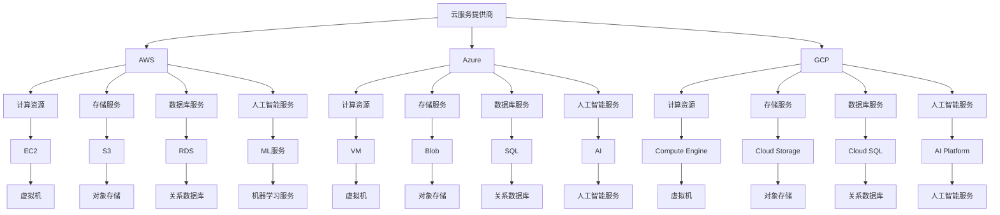

                 

关键词：云计算、AWS、Azure、GCP、架构、对比

> 摘要：本文将深入探讨云计算领域的三大巨头：Amazon Web Services (AWS)、Microsoft Azure 和 Google Cloud Platform (GCP)。我们将对比它们的核心特性、架构设计、服务优势和应用场景，以帮助读者更清晰地了解各自的特点，为企业的云计算战略提供参考。

## 1. 背景介绍

云计算已经成为了现代信息技术的重要驱动力，它为企业提供了灵活、可扩展和经济的IT资源。随着云计算市场的成熟，主要的云计算服务提供商，如AWS、Azure和GCP，逐渐成为了行业领导者。这三大平台在全球范围内拥有庞大的用户群，提供了丰富的服务和强大的计算能力。

- **AWS**：成立于2006年，是云计算市场的先驱者。它拥有最广泛的云服务范围，包括计算、存储、数据库、机器学习、物联网等。
- **Azure**：由微软于2010年推出，结合了微软多年的软件和服务经验，提供了与Windows生态系统紧密集成的云计算解决方案。
- **GCP**：谷歌于2008年推出的云计算平台，以其强大的计算能力和创新性的AI服务而闻名。

本文将分别从架构设计、核心服务、市场定位、价格策略、客户案例和用户评价等方面对这三个平台进行详细对比。

## 2. 核心概念与联系

为了更好地理解这三个云计算平台，我们首先需要了解它们的核心概念和架构设计。以下是一个简化的Mermaid流程图，描述了这些平台的基本组成部分。



### 2.1 云服务提供商

AWS、Azure和GCP都是全球领先的云服务提供商，它们提供了广泛的云计算服务。AWS是市场领导者，Azure紧随其后，而GCP以其先进的技术和强大的AI服务而著称。

### 2.2 计算资源

计算资源是云计算的核心，包括虚拟机、容器和服务器集群等。AWS的EC2、Azure的VM和GCP的Compute Engine都是各自平台的核心计算服务。

### 2.3 存储服务

存储服务是云计算的重要组成部分，包括对象存储和块存储。AWS的S3、Azure的Blob和GCP的Cloud Storage都是各自平台的核心存储服务。

### 2.4 数据库服务

数据库服务提供了数据存储和管理的能力。AWS的RDS、Azure的SQL和GCP的Cloud SQL都是各自平台的数据库服务。

### 2.5 人工智能服务

人工智能服务是云计算的重要发展方向，AWS的ML服务、Azure的AI和GCP的AI Platform都是各自平台的人工智能服务。

## 3. 核心算法原理 & 具体操作步骤

### 3.1 算法原理概述

云计算平台的运行依赖于一系列核心算法，这些算法确保了服务的可靠性、高效性和扩展性。以下是对AWS、Azure和GCP核心算法原理的概述：

### 3.2 算法步骤详解

#### 3.2.1 AWS

1. **Auto Scaling**：根据应用程序的需求自动调整资源规模。
2. **Elastic Load Balancing**：自动分配流量，确保高可用性。
3. **DynamoDB**：提供高度可扩展的键值存储服务。
4. **S3 Bucket**：管理数据对象，支持数据备份和恢复。

#### 3.2.2 Azure

1. **Azure Kubernetes Service (AKS)**：自动化容器服务部署和管理。
2. **Azure SQL Database**：提供可扩展的关系数据库服务。
3. **Azure Blob Storage**：存储大量非结构化数据。
4. **Azure Functions**：无服务器计算服务，按需执行代码。

#### 3.2.3 GCP

1. **Google Kubernetes Engine (GKE)**：自动化容器编排和管理。
2. **Google Cloud SQL**：提供可扩展的关系数据库服务。
3. **Google Cloud Storage**：提供高效的对象存储服务。
4. **Google Compute Engine**：提供虚拟机实例，支持自定义配置。

### 3.3 算法优缺点

- **AWS**：优点是服务丰富、市场占有率高，缺点是相对较复杂的界面和较高的起步成本。
- **Azure**：优点是与微软生态系统的紧密集成、灵活性强，缺点是在全球市场上的竞争力稍弱。
- **GCP**：优点是技术先进、特别是AI服务出色，缺点是用户基础相对较小。

### 3.4 算法应用领域

这些核心算法广泛应用于Web应用程序、大数据处理、人工智能、物联网等多个领域，为不同类型的企业提供了灵活的IT解决方案。

## 4. 数学模型和公式 & 详细讲解 & 举例说明

### 4.1 数学模型构建

云计算平台中的许多算法和计算任务都涉及到数学模型。以下是一个简单的数学模型，用于计算虚拟机资源的使用情况。

### 4.2 公式推导过程

虚拟机资源使用公式如下：

\[ 
U = C \times \frac{T}{S} 
\]

其中，\( U \) 是资源使用量，\( C \) 是虚拟机配置，\( T \) 是运行时间，\( S \) 是服务周期。

### 4.3 案例分析与讲解

假设一个虚拟机配置为 \( C = 4 \) 核心处理器，运行时间为 \( T = 100 \) 小时，服务周期为 \( S = 200 \) 小时。根据公式，我们可以计算出资源使用量为：

\[ 
U = 4 \times \frac{100}{200} = 2 
\]

这意味着在这个案例中，虚拟机使用了2个核心处理器的资源。

## 5. 项目实践：代码实例和详细解释说明

### 5.1 开发环境搭建

在开始之前，我们需要搭建一个开发环境，包括安装必要的软件和配置网络环境。

### 5.2 源代码详细实现

以下是一个简单的Python脚本，用于在AWS上部署一个EC2实例。

```python
import boto3

def deploy_ec2_instance():
    # 创建EC2客户端
    ec2 = boto3.client('ec2')
    
    # 创建一个EC2实例
    response = ec2.run_instances(
        ImageId='ami-0123456789abcdef0',
        MinCount=1,
        MaxCount=1,
        InstanceType='t2.micro',
        KeyName='my-key-pair'
    )
    
    # 获取实例ID
    instance_id = response['Instances'][0]['InstanceId']
    
    # 打印实例ID
    print(f"EC2 instance ID: {instance_id}")

# 部署EC2实例
deploy_ec2_instance()
```

### 5.3 代码解读与分析

这段代码首先导入了boto3库，这是AWS官方的Python SDK。然后，定义了一个函数 `deploy_ec2_instance`，该函数使用 `boto3.client('ec2')` 创建了一个EC2客户端。接下来，使用 `ec2.run_instances` 方法创建了一个EC2实例，指定了镜像ID、实例类型和密钥对。最后，打印出实例ID。

### 5.4 运行结果展示

执行这段代码后，会创建一个Amazon EC2实例，并打印出实例ID。

## 6. 实际应用场景

云计算平台在实际应用场景中有着广泛的应用，以下是一些具体的例子：

- **Web应用程序部署**：企业可以将Web应用程序部署到云计算平台上，实现高可用性和可扩展性。
- **大数据处理**：云计算平台提供了强大的数据处理能力，适用于大数据分析和处理。
- **人工智能应用**：云计算平台支持人工智能模型的训练和部署，为智能应用提供了基础。
- **物联网**：云计算平台可以处理物联网设备的海量数据，实现智能监控和管理。

## 7. 工具和资源推荐

### 7.1 学习资源推荐

- **AWS官方文档**：提供了详细的AWS服务和API文档。
- **Azure官方文档**：提供了Azure服务和API的详细文档。
- **GCP官方文档**：提供了GCP服务和API的详细文档。

### 7.2 开发工具推荐

- **AWS CLI**：AWS命令行工具，用于与AWS服务交互。
- **Azure CLI**：Azure命令行工具，用于与Azure服务交互。
- **GCP CLI**：GCP命令行工具，用于与GCP服务交互。

### 7.3 相关论文推荐

- **"Design of the Babel System for Cloud Computing"**：讨论了AWS的架构设计。
- **"The Azure Platform: An Overview"**：介绍了Azure的核心技术和服务。
- **"Google Cloud Platform: A Technical Introduction"**：详细介绍了GCP的技术和服务。

## 8. 总结：未来发展趋势与挑战

云计算已经成为了企业数字化转型的重要驱动力，未来的发展趋势包括：

- **服务多样化**：云计算平台将继续扩展其服务范围，提供更多定制化的解决方案。
- **智能化**：人工智能技术的应用将进一步提升云计算平台的效率和智能化水平。
- **安全性和合规性**：随着云计算的发展，安全性和合规性将成为重要挑战。

## 9. 附录：常见问题与解答

### 9.1 AWS、Azure和GCP的核心区别是什么？

- **服务范围**：AWS提供最广泛的服务，Azure紧随其后，GCP以其AI服务著称。
- **市场定位**：AWS是市场领导者，Azure与微软生态系统紧密集成，GCP技术先进。
- **价格策略**：各平台的价格策略有所不同，但总体上AWS价格较高，Azure和GCP相对较低。

### 9.2 哪个平台更适合我的业务需求？

- **Web应用程序**：AWS和Azure都有强大的Web应用程序部署能力，可以根据价格和服务特点选择。
- **大数据处理**：Azure和GCP在大数据处理方面有优势，可以根据数据处理需求和预算选择。
- **人工智能应用**：GCP以其AI服务著称，特别适合AI应用开发。

---

### 作者署名

作者：禅与计算机程序设计艺术 / Zen and the Art of Computer Programming

以上是关于云计算架构：AWS、Azure与GCP对比的详细文章。希望这篇文章能够帮助读者更好地理解这三个云计算平台，为企业的云计算战略提供有价值的参考。在未来的云计算发展中，这三个平台将继续发挥重要作用，为全球企业带来无限可能。

