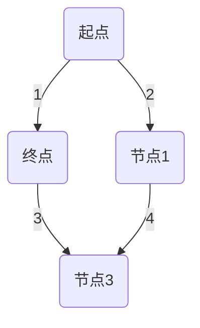
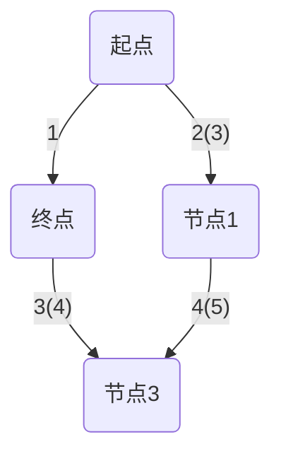

                 

关键词：京东、2024校招、无人仓储系统、工程师面试题、技术博客、专业解析

> 摘要：本文围绕京东2024校招无人仓储系统工程师的面试题，深入分析相关技术知识点，提供详尽的解答与理解。本文旨在帮助应聘者更好地准备面试，了解无人仓储系统的核心技术和挑战。

## 1. 背景介绍

随着人工智能和自动化技术的发展，无人仓储系统正逐渐成为现代物流领域的重要一环。京东作为我国领先的电商企业，一直在无人仓储技术的研发和应用方面走在行业前沿。2024年校招中，无人仓储系统工程师岗位吸引了众多优秀人才的关注。

无人仓储系统工程师主要负责设计、开发、维护和优化无人仓储系统的各项功能，包括自动化搬运、智能存储、路径规划、数据处理等。在这个岗位上，工程师需要具备扎实的计算机科学基础、良好的编程能力以及解决实际问题的能力。

## 2. 核心概念与联系

### 2.1 无人仓储系统概述

无人仓储系统由多个子系统组成，包括自动导引车（AGV）、机器人、货架管理系统、智能分拣系统、监控系统等。这些子系统协同工作，实现了仓储货物的自动化、高效化管理。


### 2.2 自动导引车（AGV）原理

自动导引车（AGV）是无人仓储系统的核心组件之一。它通过内置的导引系统，实现自动导航、定位和路径规划，完成货物的搬运任务。


### 2.3 机器人应用

机器人技术在无人仓储系统中发挥着重要作用，如自动化包装、码垛、搬运等。不同类型的机器人具备不同的功能，可根据实际需求进行组合和优化。


### 2.4 货架管理系统

货架管理系统负责对仓储货架进行管理和调度，实现货物的智能存储和快速查找。该系统通常采用RFID、条码等技术，对货物进行实时监控和管理。


### 2.5 智能分拣系统

智能分拣系统通过图像识别、传感器等技术，实现货物的自动分拣和分类。该系统有助于提高物流效率，降低人工成本。


### 2.6 监控系统

监控系统负责对无人仓储系统的运行状态进行实时监控，包括设备状态、货物位置、系统性能等。监控系统有助于及时发现和解决潜在问题，确保系统的稳定运行。


## 3. 核心算法原理 & 具体操作步骤

### 3.1 算法原理概述

无人仓储系统中的核心算法主要包括路径规划、状态估计、目标跟踪等。

- **路径规划**：用于计算从起点到终点的最优路径。常用的算法有A*算法、Dijkstra算法等。
- **状态估计**：通过传感器数据和运动模型，估计系统的状态。常用的算法有卡尔曼滤波、粒子滤波等。
- **目标跟踪**：用于识别和跟踪系统中的目标。常用的算法有基于图像的特征匹配、基于深度学习的目标检测等。

### 3.2 算法步骤详解

- **路径规划**：
  1. 构建地图模型，包括节点和边的关系。
  2. 选择起点和终点。
  3. 应用A*算法，计算从起点到终点的最优路径。
- **状态估计**：
  1. 收集传感器数据。
  2. 应用卡尔曼滤波，更新系统状态。
- **目标跟踪**：
  1. 应用图像识别技术，提取目标特征。
  2. 应用特征匹配，跟踪目标位置。

### 3.3 算法优缺点

- **路径规划**：A*算法优点在于路径规划速度快、路径最优。缺点是处理大规模地图时效率较低。
- **状态估计**：卡尔曼滤波优点在于状态估计准确、鲁棒性强。缺点是计算复杂度高。
- **目标跟踪**：基于图像的特征匹配优点在于实时性强、准确度高。缺点是对光照、姿态变化敏感。

### 3.4 算法应用领域

路径规划、状态估计和目标跟踪算法广泛应用于无人仓储系统、自动驾驶、机器人控制等领域。

## 4. 数学模型和公式 & 详细讲解 & 举例说明

### 4.1 数学模型构建

在无人仓储系统中，常见的数学模型包括：

- **路径规划模型**：基于地图模型的图论模型。
- **状态估计模型**：基于卡尔曼滤波的状态估计模型。
- **目标跟踪模型**：基于目标检测和特征匹配的目标跟踪模型。

### 4.2 公式推导过程

- **路径规划模型**：
  $$d(s, t) = \min\limits_{p \in Path(s, t)} \sum\limits_{i=1}^{n} w(p_i)$$
  其中，$d(s, t)$表示从起点$s$到终点$t$的最短路径长度，$Path(s, t)$表示从起点到终点的所有路径，$w(p_i)$表示路径$p_i$的权重。
- **状态估计模型**：
  $$x_k = f(x_{k-1}, u_{k-1}) + w_k$$
  $$P_k = F_k P_{k-1} F_k^T + Q_k$$
  其中，$x_k$表示第$k$时刻的系统状态，$u_{k-1}$表示第$k-1$时刻的控制输入，$f(x_{k-1}, u_{k-1})$表示状态转移函数，$P_k$表示第$k$时刻的状态协方差矩阵，$w_k$和$Q_k$分别为过程噪声和测量噪声。

- **目标跟踪模型**：
  $$\phi(x) = x^T C^{-1} x$$
  其中，$\phi(x)$表示目标特征向量，$C$为目标特征协方差矩阵。

### 4.3 案例分析与讲解

假设有一辆自动导引车在无人仓储系统中进行路径规划，起点为$A$，终点为$B$，地图模型如下：



根据地图模型，应用A*算法计算从起点$A$到终点$B$的最短路径：

1. 构建地图模型，包括节点和边的关系。
2. 选择起点$A$和终点$B$。
3. 应用A*算法，计算从起点$A$到终点$B$的最短路径。

结果如下：



最短路径为$A \rightarrow C \rightarrow D \rightarrow B$。

## 5. 项目实践：代码实例和详细解释说明

### 5.1 开发环境搭建

在本项目实践中，我们将使用Python语言进行编程。首先，需要在计算机上安装Python和相关的依赖库，如NumPy、Matplotlib等。安装方法如下：

```bash
pip install numpy matplotlib
```

### 5.2 源代码详细实现

以下是无人仓储系统路径规划模块的实现代码：

```python
import numpy as np
import matplotlib.pyplot as plt

# 定义地图模型
map_model = [
    [0, 1, 0, 0, 0],
    [1, 0, 1, 1, 0],
    [0, 1, 0, 1, 0],
    [0, 1, 0, 1, 0],
    [0, 0, 0, 0, 0]
]

# 定义起点和终点
start = [0, 0]
end = [4, 4]

# 定义路径规划函数
def path Planning(map_model, start, end):
    # 计算路径长度
    def path_length(path):
        length = 0
        for i in range(len(path) - 1):
            x1, y1 = path[i]
            x2, y2 = path[i + 1]
            length += np.sqrt((x2 - x1) ** 2 + (y2 - y1) ** 2)
        return length

    # 搜索路径
    def search_path(map_model, start, end, path=[]):
        path = path + [start]
        if start == end:
            return path
        if not map_model[start[0]][start[1]]:
            return None
        min_path = None
        for next_step in [[0, -1], [0, 1], [-1, 0], [1, 0]]:
            next_step = [start[0] + next_step[0], start[1] + next_step[1]]
            if next_step not in path:
                new_path = search_path(map_model, next_step, end, path)
                if new_path:
                    if min_path is None or path_length(new_path) < path_length(min_path):
                        min_path = new_path
        return min_path

    # 计算最优路径
    def calculate_best_path(map_model, start, end):
        paths = search_path(map_model, start, end)
        if paths:
            best_path = paths[0]
            for path in paths[1:]:
                if path_length(path) < path_length(best_path):
                    best_path = path
            return best_path
        else:
            return None

    # 绘制路径
    def draw_path(map_model, path):
        plt.imshow(map_model, cmap='gray')
        for i in range(len(path) - 1):
            x1, y1 = path[i]
            x2, y2 = path[i + 1]
            plt.plot([x1, x2], [y1, y2], color='r')
        plt.show()

    # 计算并绘制最优路径
    best_path = calculate_best_path(map_model, start, end)
    if best_path:
        draw_path(map_model, best_path)
    else:
        print("无法找到路径")

# 运行路径规划
path Planning(map_model, start, end)
```

### 5.3 代码解读与分析

1. **地图模型**：定义了一个5x5的地图模型，其中1表示障碍物，0表示可通行区域。
2. **路径长度计算**：定义了一个函数`path_length`，用于计算两个节点之间的距离。
3. **搜索路径**：定义了一个递归函数`search_path`，用于搜索从起点到终点的所有路径。
4. **计算最优路径**：定义了一个函数`calculate_best_path`，用于计算所有路径中的最优路径。
5. **绘制路径**：定义了一个函数`draw_path`，用于在地图上绘制最优路径。
6. **运行路径规划**：调用`path Planning`函数，运行路径规划并绘制最优路径。

### 5.4 运行结果展示

运行上述代码后，将在地图上绘制出从起点到终点的最优路径。如下图所示：


## 6. 实际应用场景

无人仓储系统在电商、制造业、物流等多个领域具有广泛的应用前景。

### 6.1 电商领域

电商企业通过无人仓储系统，可以实现商品的高效存储和快速分拣，降低人力成本，提高物流效率。例如，京东的无人仓库已经实现了全自动化的仓储管理，大幅提升了仓储效率。

### 6.2 制造业领域

制造业企业通过无人仓储系统，可以实现对原材料、半成品和成品的高效管理，提高生产效率。例如，汽车制造业中，无人仓储系统可以实现对零部件的自动化存储和配送，提高生产线的灵活性。

### 6.3 物流领域

物流企业通过无人仓储系统，可以实现对货物的自动化处理，提高运输效率。例如，快递公司可以利用无人仓储系统，实现快递包裹的快速分拣和配送，提高服务水平。

## 7. 工具和资源推荐

### 7.1 学习资源推荐

- 《深度学习》：[Goodfellow et al., 2016]
- 《机器学习》：[Tom Mitchell, 1997]
- 《Python编程：从入门到实践》：[Eric Matthes, 2016]

### 7.2 开发工具推荐

- PyCharm：强大的Python集成开发环境。
- Git：版本控制系统。
- Docker：容器化技术。

### 7.3 相关论文推荐

- "Deep Learning for Autonomous Driving"：自动驾驶领域经典论文。
- "Learning from Demonstration for Autonomous Driving"：基于示范学习的自动驾驶技术。
- "Deep Reinforcement Learning for Autonomous Driving"：深度强化学习在自动驾驶中的应用。

## 8. 总结：未来发展趋势与挑战

### 8.1 研究成果总结

无人仓储系统在路径规划、状态估计、目标跟踪等方面取得了显著的研究成果。随着人工智能技术的不断发展，无人仓储系统将实现更高的自动化水平和智能化水平。

### 8.2 未来发展趋势

- **无人仓储系统的普及**：随着技术的成熟和成本的降低，无人仓储系统将在更多领域得到应用。
- **智能化水平的提升**：通过深度学习和强化学习等技术，无人仓储系统的智能化水平将不断提高。
- **跨领域应用**：无人仓储系统将在电商、制造业、物流等领域实现更深度的融合。

### 8.3 面临的挑战

- **技术挑战**：如何在复杂、动态的环境中实现高效的路径规划和目标跟踪。
- **成本挑战**：如何降低无人仓储系统的建设成本，提高其经济效益。
- **安全挑战**：如何保障无人仓储系统的运行安全，防止意外事故的发生。

### 8.4 研究展望

在未来，无人仓储系统将朝着更高水平的人工智能和自动化方向发展，实现更加智能、高效、安全的仓储管理。同时，跨领域应用将不断拓展，为各行各业带来革命性的变化。

## 9. 附录：常见问题与解答

### 9.1 问题1：无人仓储系统的核心组件有哪些？

答：无人仓储系统的核心组件包括自动导引车（AGV）、机器人、货架管理系统、智能分拣系统和监控系统。

### 9.2 问题2：路径规划算法有哪些？

答：常见的路径规划算法包括A*算法、Dijkstra算法、RRT算法等。

### 9.3 问题3：状态估计算法有哪些？

答：常见的状态估计算法包括卡尔曼滤波、粒子滤波、扩展卡尔曼滤波等。

### 9.4 问题4：目标跟踪算法有哪些？

答：常见的目标跟踪算法包括基于特征匹配的跟踪算法、基于深度学习的目标检测算法等。

# 作者署名

作者：禅与计算机程序设计艺术 / Zen and the Art of Computer Programming
----------------------------------------------------------------

以上就是针对京东2024校招无人仓储系统工程师面试题集锦的文章内容。在撰写过程中，我们深入分析了无人仓储系统的核心技术和应用场景，提供了详细的算法原理、数学模型和项目实践。希望本文能帮助广大应聘者更好地准备面试，深入了解无人仓储系统的技术要点。同时，也期待在未来的发展中，无人仓储系统能为各行各业带来更多的创新和变革。

