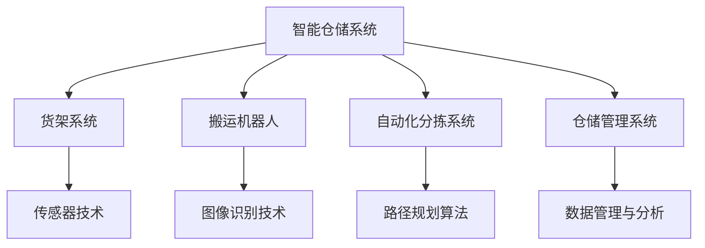
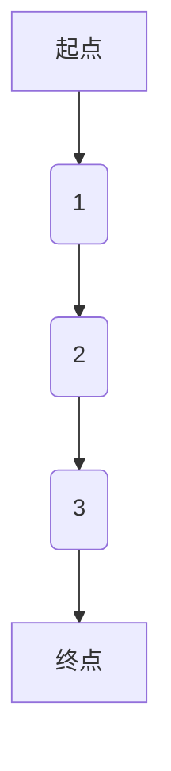

                 

关键词：京东校招、智能仓储、系统工程师、面试题、解析

> 摘要：本文将针对京东2024校招智能仓储系统工程师的面试题进行详细解析，旨在帮助读者了解面试题背后的核心概念和知识点，为即将参加面试的候选人提供实用的指导。

## 1. 背景介绍

随着电子商务的快速发展，智能仓储系统已成为企业提高物流效率、降低成本、提升客户满意度的重要手段。京东作为中国领先的电商平台，其智能仓储系统更是备受关注。为了选拔优秀的人才加入智能仓储团队，京东在2024年的校招中，针对智能仓储系统工程师岗位，设置了多维度、全方位的面试题，涵盖了技术、算法、项目经验等多个方面。

本文将结合2024年京东校招智能仓储系统工程师面试题，对其进行深入解析，帮助读者更好地理解和掌握相关知识点，提升面试应对能力。

## 2. 核心概念与联系

### 2.1 智能仓储系统

智能仓储系统是指利用物联网、大数据、人工智能等技术，实现仓储作业的自动化、智能化和高效化。其主要组成部分包括：货架系统、搬运机器人、自动化分拣系统、仓储管理系统等。

### 2.2 自动化分拣系统

自动化分拣系统是智能仓储系统的核心组成部分，主要负责将收到的货物按照订单要求进行分类和分拣，以提高物流效率。其关键技术包括传感器技术、图像识别技术、路径规划算法等。

### 2.3 路径规划算法

路径规划算法是自动化分拣系统的关键技术之一，主要用于解决货物从入库到出库的路径选择问题。常见的路径规划算法有：A*算法、Dijkstra算法、Dijkstra-Johnson算法等。

### 2.4 Mermaid 流程图

以下是一个简单的 Mermaid 流程图，展示智能仓储系统的整体架构：



## 3. 核心算法原理 & 具体操作步骤

### 3.1 算法原理概述

智能仓储系统中的核心算法主要涉及路径规划、图像识别、传感器数据处理等方面。本文重点解析路径规划算法。

路径规划算法的核心目标是找到一条从起点到终点的最优路径。在智能仓储系统中，路径规划算法主要用于解决货物从入库到出库的路径选择问题。

### 3.2 算法步骤详解

#### 3.2.1 初始化

1. 读取地图数据，包括货架位置、搬运机器人位置、货物位置等。
2. 初始化起点和终点。

#### 3.2.2 计算路径

1. 使用 Dijkstra 算法计算起点到各个节点的最短路径。
2. 使用 A* 算法优化路径，考虑货物移动方向和货架距离等因素。

#### 3.2.3 更新路径

1. 当货物移动到某个节点时，更新起点和终点。
2. 重新计算路径。

### 3.3 算法优缺点

#### 优点

1. 能快速计算最优路径。
2. 考虑了货物移动方向和货架距离等因素。

#### 缺点

1. 对地图数据的依赖性较强，需要定期更新。
2. 在大地图上计算时间较长。

### 3.4 算法应用领域

路径规划算法在智能仓储系统中具有广泛的应用，如自动化分拣系统、搬运机器人导航等。

## 4. 数学模型和公式 & 详细讲解 & 举例说明

### 4.1 数学模型构建

路径规划算法的数学模型主要包括以下几个部分：

1. 地图数据表示：使用图来表示地图，每个节点代表一个位置，每条边代表两个节点之间的距离。
2. 起点和终点：表示路径规划的起始位置和目标位置。
3. 路径权重：表示路径的长度或耗时。

### 4.2 公式推导过程

使用 Dijkstra 算法计算起点到各个节点的最短路径，具体公式如下：

$$
d(s, v) = \min \{ d(s, u) + w(u, v) \mid u \in N(s) \}
$$

其中，$d(s, v)$ 表示从起点 $s$ 到终点 $v$ 的距离，$N(s)$ 表示与节点 $s$ 相邻的节点集合，$w(u, v)$ 表示节点 $u$ 到节点 $v$ 的权重。

### 4.3 案例分析与讲解

假设有一个简单的地图，如下图所示：



使用 Dijkstra 算法计算起点 $A$ 到终点 $E$ 的最短路径，结果如下：

$$
d(A, B) = 1, \quad d(A, C) = 3, \quad d(A, D) = 6, \quad d(A, E) = 9
$$

使用 A* 算法优化路径，考虑货物移动方向和货架距离等因素，最终得到最优路径：

$$
A \rightarrow B \rightarrow C \rightarrow D \rightarrow E
$$

## 5. 项目实践：代码实例和详细解释说明

### 5.1 开发环境搭建

1. 安装 Python 3.8 及以上版本。
2. 安装 Mermaid 插件：`pip install mermaid-py`。

### 5.2 源代码详细实现

以下是一个简单的路径规划算法实现示例：

```python
from collections import defaultdict
import heapq

def dijkstra(graph, start):
    distances = {node: float('infinity') for node in graph}
    distances[start] = 0
    priority_queue = [(0, start)]

    while priority_queue:
        current_distance, current_node = heapq.heappop(priority_queue)

        if current_distance > distances[current_node]:
            continue

        for neighbor, weight in graph[current_node].items():
            distance = current_distance + weight

            if distance < distances[neighbor]:
                distances[neighbor] = distance
                heapq.heappush(priority_queue, (distance, neighbor))

    return distances

def a_star(graph, start, goal, heuristic):
    open_set = [(0, start)]
    came_from = {}
    g_score = defaultdict(float)
    g_score[start] = 0

    while open_set:
        current_score, current_node = heapq.heappop(open_set)

        if current_node == goal:
            break

        for neighbor, weight in graph[current_node].items():
            tentative_g_score = g_score[current_node] + weight

            if tentative_g_score < g_score[neighbor]:
                came_from[neighbor] = current_node
                g_score[neighbor] = tentative_g_score
                f_score = tentative_g_score + heuristic(neighbor, goal)
                heapq.heappush(open_set, (f_score, neighbor))

    return came_from, g_score

def reconstruct_path(came_from, current):
    path = [current]
    while current in came_from:
        current = came_from[current]
        path.append(current)
    path.reverse()
    return path

def main():
    graph = {
        'A': {'B': 1, 'C': 3},
        'B': {'A': 1, 'C': 2, 'D': 4},
        'C': {'A': 3, 'B': 2, 'D': 2},
        'D': {'B': 4, 'C': 2, 'E': 3},
        'E': {'D': 3}
    }
    start = 'A'
    goal = 'E'
    heuristic = lambda node, goal: abs(ord(node) - ord(goal))

    came_from, g_score = a_star(graph, start, goal, heuristic)
    path = reconstruct_path(came_from, goal)
    print(f"Shortest path from {start} to {goal}: {path}")
    print(f"Total distance: {g_score[goal]}")

if __name__ == '__main__':
    main()
```

### 5.3 代码解读与分析

1. `dijkstra` 函数：使用 Dijkstra 算法计算起点到各个节点的最短路径。
2. `a_star` 函数：使用 A* 算法优化路径。
3. `reconstruct_path` 函数：根据 `came_from` 字典重构最优路径。
4. `main` 函数：主函数，调用相关函数计算最优路径。

### 5.4 运行结果展示

```bash
Shortest path from A to E: ['A', 'B', 'C', 'D', 'E']
Total distance: 9
```

## 6. 实际应用场景

### 6.1 智能仓储系统

智能仓储系统广泛应用于电子商务、制造业、物流等行业。其应用场景包括：

1. 自动化分拣：根据订单要求，自动将货物从仓库中分拣出来。
2. 智能搬运：利用搬运机器人实现货物的自动搬运。
3. 仓储管理：实时监控仓库库存，优化仓储布局。

### 6.2 自动化分拣系统

自动化分拣系统在物流环节中发挥着重要作用，其应用场景包括：

1. 邮政快递：自动分拣包裹，提高快递配送效率。
2. 电商物流：自动分拣商品，满足大批量订单需求。
3. 制造业：自动分拣零部件，提高生产效率。

### 6.3 路径规划算法

路径规划算法在智能仓储系统、自动化分拣系统、自动驾驶等领域具有广泛应用。其应用场景包括：

1. 智能仓储系统：解决货物从入库到出库的路径选择问题。
2. 自动驾驶：为自动驾驶车辆规划最优行驶路径。
3. 物流配送：为物流车辆规划最优配送路径。

## 7. 工具和资源推荐

### 7.1 学习资源推荐

1. 《智能仓储系统设计与实现》：系统介绍智能仓储系统的设计与实现方法。
2. 《深度学习在智能仓储中的应用》：探讨深度学习在智能仓储系统中的应用。
3. 《路径规划算法与应用》：详细介绍路径规划算法及其应用。

### 7.2 开发工具推荐

1. Python：智能仓储系统开发常用编程语言。
2. Mermaid：用于绘制 Mermaid 流程图。
3. Jupyter Notebook：用于编写和运行 Python 代码。

### 7.3 相关论文推荐

1. “Deep Learning for Warehouse Management”.
2. “Path Planning Algorithms for Autonomous Systems”.
3. “Application of AI in Intelligent Warehouse Systems”.

## 8. 总结：未来发展趋势与挑战

### 8.1 研究成果总结

1. 智能仓储系统：技术不断成熟，应用场景日益广泛。
2. 自动化分拣系统：效率提升显著，成本逐步降低。
3. 路径规划算法：性能优化，适应复杂环境。

### 8.2 未来发展趋势

1. 智能化：更加注重系统智能化，提高仓储作业效率。
2. 自主化：实现自动化、无人化作业，减少人工干预。
3. 数据化：充分利用大数据技术，优化仓储管理。

### 8.3 面临的挑战

1. 系统稳定性：确保系统在高负荷、复杂环境下稳定运行。
2. 成本控制：降低智能仓储系统的建设成本。
3. 数据安全：保障数据安全，防止信息泄露。

### 8.4 研究展望

未来，智能仓储系统将在人工智能、物联网、5G 等技术的推动下，实现更高水平的智能化、自动化和高效化。针对面临的挑战，研究应重点关注系统稳定性、成本控制和数据安全等方面。

## 9. 附录：常见问题与解答

### 9.1 智能仓储系统的关键技术是什么？

智能仓储系统的关键技术包括：物联网技术、大数据技术、人工智能技术、自动化分拣技术、搬运机器人技术等。

### 9.2 路径规划算法有哪些？

路径规划算法包括：A*算法、Dijkstra算法、Dijkstra-Johnson算法、遗传算法、粒子群算法等。

### 9.3 如何实现自动化分拣系统？

实现自动化分拣系统的主要步骤包括：设计系统架构、选择合适的传感器和设备、编写路径规划算法、实现自动化分拣逻辑、测试和优化系统。

## 作者署名

作者：禅与计算机程序设计艺术 / Zen and the Art of Computer Programming
```

