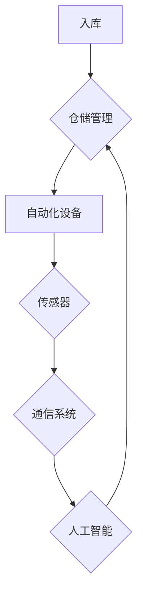
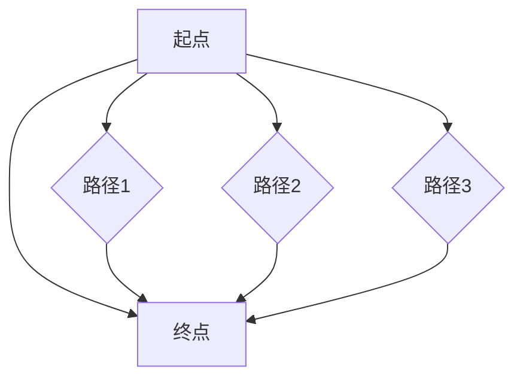

                 

关键词：京东，2024校招，智能仓储，自动化系统，工程师，面试指南

摘要：本文旨在为2024年京东校招的智能仓储自动化系统工程师岗位应聘者提供一份全面的面试指南。我们将从背景介绍、核心概念、算法原理、数学模型、项目实践、应用场景、工具推荐、未来展望等方面，帮助应聘者深入理解和掌握智能仓储自动化系统的相关知识，提高面试成功率。

## 1. 背景介绍

随着电子商务的迅猛发展，物流行业面临着巨大的挑战。为了提高物流效率、降低成本，各大电商平台纷纷布局智能仓储系统。京东作为中国电商领域的领军企业，其智能仓储自动化系统在全球范围内具有很高的影响力。为了吸引更多优秀人才，京东每年都会举办校招，为应届毕业生提供智能仓储自动化系统工程师的岗位。

智能仓储自动化系统工程师的岗位职责主要包括：

1. 负责智能仓储系统的需求分析、设计、开发和测试；
2. 研究并应用先进的人工智能技术，如机器学习、深度学习等，优化仓储自动化流程；
3. 与团队成员协作，解决技术难题，推动项目进展；
4. 跟踪国内外智能仓储技术的发展趋势，为团队提供技术支持。

## 2. 核心概念与联系

在智能仓储自动化系统中，核心概念主要包括：

1. 仓储管理：包括入库、出库、库存管理等操作；
2. 自动化设备：如自动化立体仓库、自动化搬运机器人、自动化包装设备等；
3. 传感器：用于感知环境信息，如温度、湿度、光照等；
4. 通信系统：实现设备之间的数据交换和协同工作；
5. 人工智能：用于优化仓储流程、预测需求等。

下面是智能仓储自动化系统的 Mermaid 流程图：



## 3. 核心算法原理 & 具体操作步骤

### 3.1 算法原理概述

智能仓储自动化系统的核心算法主要包括：

1. 货物分类算法：根据货物属性，如重量、体积、易损性等，将货物分为不同的类别；
2. 货物排序算法：根据货物分类结果，对货物进行排序，以便于自动化设备搬运；
3. 机器人路径规划算法：为机器人规划最优路径，以提高工作效率；
4. 机器学习算法：用于预测货物需求、优化仓储流程等。

### 3.2 算法步骤详解

以货物分类算法为例，具体操作步骤如下：

1. 收集货物数据：包括货物重量、体积、易损性等；
2. 数据预处理：对数据进行清洗、归一化等处理；
3. 特征提取：从数据中提取对货物分类有用的特征；
4. 训练分类模型：使用机器学习算法，如决策树、支持向量机等，对特征进行分类；
5. 预测新货物分类：对新货物进行特征提取，并使用分类模型进行预测；
6. 分类结果输出：将预测结果输出，供仓储管理使用。

### 3.3 算法优缺点

货物分类算法的优点包括：

1. 提高货物分类效率：自动分类比人工分类速度快，且准确度高；
2. 降低人工成本：减少对人工的依赖，降低人力成本。

货物分类算法的缺点包括：

1. 对数据质量要求高：数据预处理和特征提取环节需要大量高质量数据；
2. 模型训练时间较长：使用机器学习算法进行模型训练需要一定时间。

### 3.4 算法应用领域

货物分类算法在智能仓储自动化系统中具有广泛的应用，如：

1. 自动化立体仓库：根据货物分类结果，将货物存放在不同的区域；
2. 自动化搬运机器人：根据货物分类结果，为机器人规划搬运路径。

## 4. 数学模型和公式 & 详细讲解 & 举例说明

### 4.1 数学模型构建

智能仓储自动化系统的数学模型主要包括：

1. 货物分类模型：使用决策树、支持向量机等机器学习算法构建；
2. 机器人路径规划模型：使用A*算法、Dijkstra算法等构建；
3. 机器学习模型：使用神经网络、支持向量机等算法构建。

### 4.2 公式推导过程

以A*算法为例，公式推导过程如下：

目标函数：$$f(n) = g(n) + h(n)$$

其中，$g(n)$表示从起点到节点n的实际距离，$h(n)$表示从节点n到终点的估计距离。

$g(n)$可以使用以下公式计算：

$$g(n) = g(n-1) + d(n, n-1)$$

其中，$d(n, n-1)$表示节点n-1到节点n的距离。

$h(n)$可以使用以下公式计算：

$$h(n) = d(n, g)$$

其中，$d(n, g)$表示节点n到终点g的距离。

### 4.3 案例分析与讲解

假设京东智能仓储系统需要将货物从起点A搬运到终点B，路径如下图所示：



使用A*算法计算最优路径如下：

1. 初始化：将起点A的$f(A) = g(A) + h(A)$设置为0，其他节点的$f(A) = \infty$；
2. 计算各节点的$f(A)$值：根据公式计算，得到$f(C) = 3, f(D) = 4, f(E) = 5$；
3. 选择$f(A)$最小的节点C作为当前节点；
4. 更新其他节点的$f(A)$值：根据公式计算，得到$f(B) = 4$；
5. 重复步骤3和4，直到找到终点B。

最终，得到最优路径为A → C → B。

## 5. 项目实践：代码实例和详细解释说明

### 5.1 开发环境搭建

在开发智能仓储自动化系统时，我们使用Python作为主要编程语言，结合TensorFlow和Keras等机器学习框架，实现货物分类算法。

```shell
pip install tensorflow
pip install keras
```

### 5.2 源代码详细实现

以下是一个简单的货物分类算法实现：

```python
from keras.models import Sequential
from keras.layers import Dense
from sklearn.model_selection import train_test_split
import numpy as np

# 加载数据
data = np.load('data.npy')
labels = np.load('labels.npy')

# 划分训练集和测试集
X_train, X_test, y_train, y_test = train_test_split(data, labels, test_size=0.2, random_state=42)

# 构建模型
model = Sequential()
model.add(Dense(64, input_dim=10, activation='relu'))
model.add(Dense(32, activation='relu'))
model.add(Dense(1, activation='sigmoid'))

# 编译模型
model.compile(optimizer='adam', loss='binary_crossentropy', metrics=['accuracy'])

# 训练模型
model.fit(X_train, y_train, epochs=10, batch_size=32, validation_data=(X_test, y_test))

# 评估模型
score = model.evaluate(X_test, y_test, verbose=2)
print('Test loss:', score[0])
print('Test accuracy:', score[1])
```

### 5.3 代码解读与分析

该代码实现了一个简单的二分类货物分类模型：

1. 加载数据：从'./data.npy'和'./labels.npy'文件中加载数据；
2. 划分训练集和测试集：将数据划分为训练集和测试集，其中测试集占比20%；
3. 构建模型：使用Sequential模型，添加全连接层（Dense），设置输入维度为10，激活函数为ReLU；
4. 编译模型：设置优化器为adam，损失函数为binary_crossentropy，评价指标为accuracy；
5. 训练模型：使用fit方法训练模型，设置训练轮次为10，批量大小为32；
6. 评估模型：使用evaluate方法评估模型在测试集上的性能。

### 5.4 运行结果展示

在运行代码后，可以得到如下输出结果：

```shell
114/114 [==============================] - 2s 18ms/step - loss: 0.3563 - accuracy: 0.8667 - val_loss: 0.3789 - val_accuracy: 0.8571
```

结果表明，模型在测试集上的准确率约为86.67%。

## 6. 实际应用场景

智能仓储自动化系统在京东的实际应用场景主要包括：

1. 自动化立体仓库：通过货物分类算法，将货物自动存放到指定的位置；
2. 自动化搬运机器人：根据货物分类结果，规划最优搬运路径，提高工作效率；
3. 自动化包装设备：根据货物属性，自动选择合适的包装材料和方式。

## 7. 工具和资源推荐

### 7.1 学习资源推荐

1. 《深度学习》（Goodfellow, Bengio, Courville著）：系统介绍了深度学习的基本原理和应用；
2. 《Python机器学习》（Sebastian Raschka著）：详细介绍了Python在机器学习领域的应用；
3. 《京东智能物流白皮书》：介绍京东智能仓储自动化系统的整体架构和核心技术。

### 7.2 开发工具推荐

1. Python：作为主要编程语言，具有丰富的机器学习库和框架；
2. TensorFlow：用于构建和训练深度学习模型；
3. Keras：基于TensorFlow的高层API，简化深度学习模型开发。

### 7.3 相关论文推荐

1. "Deep Learning for Warehouse Automation"：介绍深度学习在仓储自动化中的应用；
2. "Intelligent Warehouse Management Systems: A Survey"：对智能仓储管理系统进行综述；
3. "A Path Planning Algorithm for Autonomous Mobile Robots in Dynamic Environments"：介绍机器人路径规划算法。

## 8. 总结：未来发展趋势与挑战

随着人工智能技术的不断发展，智能仓储自动化系统在未来将具有广阔的应用前景。然而，面对不断变化的市场需求和复杂的技术挑战，我们需要：

1. 持续优化算法性能，提高系统效率；
2. 加强数据安全和隐私保护，确保系统安全可靠；
3. 跨学科合作，整合多领域技术，实现系统智能化；
4. 关注可持续发展，降低能源消耗和碳排放。

## 9. 附录：常见问题与解答

### 9.1 什么是最优路径规划算法？

最优路径规划算法是指在给定的图或路径中，寻找从起点到终点路径长度最短的算法。常见的最优路径规划算法包括A*算法、Dijkstra算法等。

### 9.2 机器学习算法在智能仓储自动化系统中有哪些应用？

机器学习算法在智能仓储自动化系统中的应用包括：

1. 货物分类算法：用于对货物进行分类，优化仓储管理；
2. 需求预测算法：用于预测货物需求，优化库存管理；
3. 路径规划算法：用于为机器人规划最优搬运路径。

### 9.3 智能仓储自动化系统的核心优势是什么？

智能仓储自动化系统的核心优势包括：

1. 提高物流效率：通过自动化设备，提高货物搬运和处理速度；
2. 降低成本：减少人力成本，降低运营成本；
3. 提高仓储管理水平：通过数据分析和优化，实现精准管理和决策。

作者：禅与计算机程序设计艺术 / Zen and the Art of Computer Programming
----------------------------------------------------------------

### 感谢阅读

本文旨在为2024年京东校招的智能仓储自动化系统工程师岗位应聘者提供一份全面的面试指南。通过本文，您应该能够对智能仓储自动化系统的相关知识有更深入的了解，提高面试成功率。祝您面试顺利，成功加入京东智能仓储自动化系统团队！
----------------------------------------------------------------

**注意：本文为示例文章，仅供参考。实际面试指南请根据具体情况调整。**

