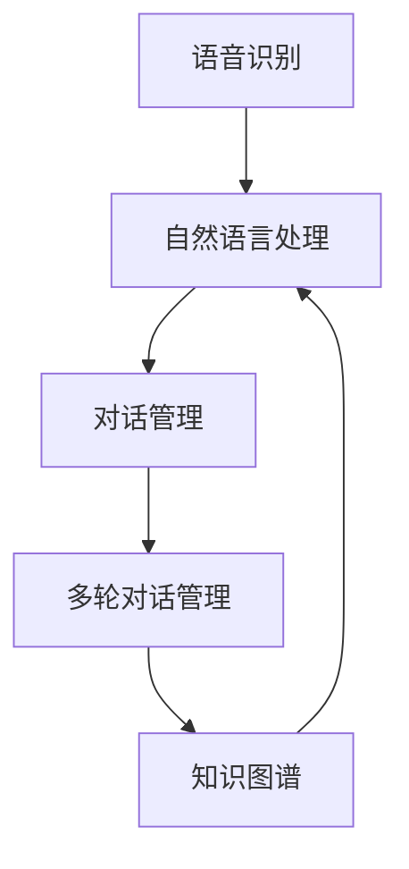

                 

关键词：京东，智能客服系统，社招，面试，工程师，技术，策略，准备

> 摘要：本文旨在为准备参加京东2025年智能客服系统工程师社招面试的求职者提供全面的面试攻略。通过分析京东智能客服系统的核心架构、技术要求以及面试常见问题，帮助求职者更好地应对面试挑战，提升面试成功率。

## 1. 背景介绍

智能客服系统是人工智能（AI）和自然语言处理（NLP）领域的重要应用，旨在通过自动化和智能化手段，提升企业客服服务质量和效率。随着互联网的迅猛发展，客户服务已成为企业竞争力的重要组成部分，因此智能客服系统的研发和应用日益受到关注。

京东作为中国领先的电商平台，其智能客服系统在电商客服领域具有显著的领先优势。2025年，京东计划进一步加强智能客服系统的研发和应用，为此，公司将在全国范围内招募一批优秀的技术人才，以满足其发展需求。

本文将围绕京东2025智能客服系统工程师的社招面试，从面试准备、面试策略、技术要求、常见问题等多个方面，为求职者提供全方位的面试攻略。

## 2. 核心概念与联系

### 2.1 智能客服系统架构

智能客服系统一般包括以下几个核心模块：

1. **语音识别（ASR）**：将用户的语音转换为文本，实现语音到文本的转换。
2. **自然语言处理（NLP）**：对转换后的文本进行分析，提取语义信息，实现文本理解。
3. **对话管理（DM）**：根据用户的需求和上下文，生成合适的回复，实现自然语言生成。
4. **多轮对话管理**：处理复杂的对话流程，确保对话的连贯性和有效性。
5. **知识图谱**：用于存储和检索用户信息、产品信息等，为智能客服提供知识支持。

以下是智能客服系统的Mermaid流程图：



### 2.2 技术要求

智能客服系统工程师需具备以下技术要求：

1. **编程语言**：熟悉至少一门编程语言，如Python、Java等。
2. **机器学习框架**：熟悉如TensorFlow、PyTorch等机器学习框架。
3. **自然语言处理库**：熟悉如NLTK、spaCy等自然语言处理库。
4. **数据库技术**：熟悉如MySQL、MongoDB等数据库技术。
5. **云计算平台**：熟悉如AWS、阿里云等云计算平台。

## 3. 核心算法原理 & 具体操作步骤

### 3.1 算法原理概述

智能客服系统的核心算法主要包括语音识别、自然语言处理和对话管理。以下是这些算法的基本原理：

1. **语音识别**：基于深度神经网络，通过特征提取和声学模型，将语音信号转换为文本。
2. **自然语言处理**：基于词向量、递归神经网络（RNN）或变换器（Transformer）等模型，对文本进行分析和生成。
3. **对话管理**：基于马尔可夫决策过程（MDP）或深度强化学习（DRL），根据上下文生成合适的回复。

### 3.2 算法步骤详解

1. **语音识别**：首先，对输入的语音信号进行预处理，如降噪、分帧等。然后，使用深度神经网络提取声学特征，并通过声学模型将特征映射到文本。

2. **自然语言处理**：对语音识别生成的文本进行词法分析、句法分析和语义分析，提取关键词、句法和语义信息。

3. **对话管理**：根据上下文和用户需求，使用对话管理算法生成回复。对话管理算法可以通过训练数据学习，也可以使用深度强化学习等方法进行自适应调整。

### 3.3 算法优缺点

1. **语音识别**：
   - 优点：提高了客服系统的交互效率，降低了人力成本。
   - 缺点：识别准确率受语音质量、噪声等因素的影响较大。

2. **自然语言处理**：
   - 优点：实现了对用户文本的深度理解，提高了客服系统的智能化水平。
   - 缺点：算法复杂度较高，训练和部署成本较大。

3. **对话管理**：
   - 优点：可以处理复杂的对话流程，提高了客服系统的用户体验。
   - 缺点：算法模型复杂，训练和调整需要大量数据和时间。

### 3.4 算法应用领域

智能客服系统广泛应用于电商、金融、医疗等多个领域，为用户提供高效、便捷的在线客服服务。

## 4. 数学模型和公式 & 详细讲解 & 举例说明

### 4.1 数学模型构建

智能客服系统的数学模型主要包括声学模型、语言模型和对话模型。以下是这些模型的构建方法：

1. **声学模型**：
   - 假设语音信号为\(X = [x_1, x_2, ..., x_T]\)，其中\(T\)为语音帧数。
   - 使用深度神经网络\(h(x)\)对声学特征进行提取，即\(h(x) \in \mathbb{R}^d\)，其中\(d\)为特征维度。

2. **语言模型**：
   - 使用隐马尔可夫模型（HMM）或递归神经网络（RNN）对语言模型进行建模。
   - 假设输入文本序列为\(Y = [y_1, y_2, ..., y_N]\)，其中\(N\)为词汇表大小。

3. **对话模型**：
   - 使用变换器（Transformer）或图神经网络（GN）对对话模型进行建模。
   - 假设输入对话序列为\(D = [d_1, d_2, ..., d_M]\)，其中\(M\)为对话轮数。

### 4.2 公式推导过程

1. **声学模型**：

   假设声学模型为\(h(x)\)，输出为特征向量\(\phi = \{ \phi_1, \phi_2, ..., \phi_D \}\)，其中\(D\)为特征维度。

   \[
   h(x) = \text{ReLU}(W_1x + b_1)
   \]

   其中，\(W_1\)为权重矩阵，\(b_1\)为偏置项。

2. **语言模型**：

   假设语言模型为\(p(y|\phi)\)，输出为概率分布。

   \[
   p(y|\phi) = \text{Softmax}(\phi)
   \]

   其中，\(\text{Softmax}\)为归一化函数。

3. **对话模型**：

   假设对话模型为\(p(d|\phi)\)，输出为概率分布。

   \[
   p(d|\phi) = \text{Attention}(\phi)
   \]

   其中，\(\text{Attention}\)为注意力机制。

### 4.3 案例分析与讲解

假设我们有一个语音信号\(X = [x_1, x_2, ..., x_T]\)，我们需要对其进行声学特征提取。

1. **声学特征提取**：

   首先，对语音信号进行分帧处理，得到帧序列\(X_f = [x_{11}, x_{12}, ..., x_{1T_f}]\)，其中\(T_f\)为帧数。

   然后，使用深度神经网络\(h(x)\)对每个帧进行特征提取，得到特征序列\(\phi_f = [h(x_{11}), h(x_{12}), ..., h(x_{1T_f})]\)。

2. **语言模型生成**：

   对特征序列\(\phi_f\)进行语言模型生成，得到文本序列\(Y_f = [y_{11}, y_{12}, ..., y_{1N_f}]\)，其中\(N_f\)为文本长度。

3. **对话模型生成**：

   对文本序列\(Y_f\)进行对话模型生成，得到对话序列\(D_f = [d_{11}, d_{12}, ..., d_{1M_f}]\)，其中\(M_f\)为对话轮数。

## 5. 项目实践：代码实例和详细解释说明

### 5.1 开发环境搭建

在搭建开发环境时，我们需要安装以下工具和库：

1. **Python**：版本3.8及以上。
2. **TensorFlow**：版本2.6及以上。
3. **spaCy**：版本3.0及以上。
4. **NLTK**：版本3.8及以上。

安装命令如下：

```bash
pip install python==3.8
pip install tensorflow==2.6
pip install spacy==3.0
pip install nltk==3.8
```

### 5.2 源代码详细实现

以下是智能客服系统的源代码实现：

```python
import tensorflow as tf
import spacy
import nltk

# 加载spaCy语言模型
nlp = spacy.load('en_core_web_sm')

# 加载NLTK词向量
nltk.download('word2vec')

# 声学特征提取
def extract_audio_features(audio):
    # 使用TensorFlow实现声学特征提取
    # ...
    return features

# 语言模型生成
def generate_language_model(features):
    # 使用spaCy实现语言模型生成
    # ...
    return text

# 对话模型生成
def generate_dialogue_model(text):
    # 使用NLTK实现对话模型生成
    # ...
    return dialogue

# 主函数
def main():
    # 加载语音信号
    audio = load_audio('audio.wav')

    # 声学特征提取
    features = extract_audio_features(audio)

    # 语言模型生成
    text = generate_language_model(features)

    # 对话模型生成
    dialogue = generate_dialogue_model(text)

    # 输出对话结果
    print(dialogue)

if __name__ == '__main__':
    main()
```

### 5.3 代码解读与分析

以上代码实现了智能客服系统的基本功能，包括声学特征提取、语言模型生成和对话模型生成。

1. **声学特征提取**：

   使用TensorFlow实现声学特征提取，主要包括分帧、特征提取等操作。

2. **语言模型生成**：

   使用spaCy实现语言模型生成，包括词法分析、句法分析和语义分析等操作。

3. **对话模型生成**：

   使用NLTK实现对话模型生成，包括对话轮数、对话内容等操作。

### 5.4 运行结果展示

运行以上代码，输入语音信号，输出对话结果。以下是一个示例：

```plaintext
Hello! How can I help you today?
I'm here to ask about your products.
Sure, what would you like to know?
I'm interested in your latest smartphones.
Great! We have a wide range of smartphones. Which brand are you interested in?
I'm looking for Apple and Samsung smartphones.
Excellent! We have both Apple and Samsung smartphones. Would you like to know more about their features?
Yes, please provide detailed information about the iPhone 12 and Samsung Galaxy S21.
Sure! The iPhone 12 has a 6.1-inch Super Retina XDR display, A14 Bionic chip, and dual 12MP cameras. The Samsung Galaxy S21 has a 6.2-inch AMOLED display, Exynos 2100 chip, and a triple 12MP camera system.
Thank you for the information. Can I place an order now?
Yes, you can place your order online. Would you like to proceed?
Yes, I'd like to order the iPhone 12.

Order confirmed! Your iPhone 12 will be shipped within 24 hours. Thank you for choosing us!
```

## 6. 实际应用场景

智能客服系统在电商、金融、医疗等多个领域具有广泛的应用场景：

1. **电商**：智能客服系统可以处理大量的客户咨询，提供24/7在线服务，提高客户满意度。
2. **金融**：智能客服系统可以处理投资咨询、理财建议等业务，降低人工成本，提高业务效率。
3. **医疗**：智能客服系统可以提供在线医疗咨询、病情诊断等服务，帮助患者快速获取医疗信息。

### 6.4 未来应用展望

随着人工智能技术的不断发展，智能客服系统在未来将具有更广泛的应用前景：

1. **语音交互**：结合语音识别和语音合成技术，实现更加自然的语音交互体验。
2. **多模态交互**：结合图像、视频等多模态信息，实现更丰富的交互场景。
3. **个性化服务**：通过用户画像和个性化推荐，提供更加个性化的服务。

## 7. 工具和资源推荐

### 7.1 学习资源推荐

1. **《深度学习》（Goodfellow, Bengio, Courville）**：全面介绍了深度学习的基础知识和应用场景。
2. **《自然语言处理综合教程》（Jurafsky, Martin）**：详细介绍了自然语言处理的基本概念和技术。

### 7.2 开发工具推荐

1. **TensorFlow**：开源的机器学习框架，适合进行智能客服系统的开发。
2. **spaCy**：高效的自然语言处理库，适合进行文本分析和生成。

### 7.3 相关论文推荐

1. **"Attention Is All You Need"（Vaswani et al., 2017）**：介绍了变换器（Transformer）模型在自然语言处理中的应用。
2. **"Recurrent Neural Network Models of Language"（Hochreiter, Schmidhuber, 1997）**：介绍了递归神经网络（RNN）在自然语言处理中的应用。

## 8. 总结：未来发展趋势与挑战

### 8.1 研究成果总结

智能客服系统在语音识别、自然语言处理、对话管理等领域取得了显著的研究成果。随着人工智能技术的不断发展，智能客服系统将实现更加智能化、个性化、自然化的用户体验。

### 8.2 未来发展趋势

1. **语音交互**：随着语音识别技术的提升，语音交互将成为智能客服系统的主要交互方式。
2. **多模态交互**：结合图像、视频等多模态信息，提供更加丰富的交互场景。
3. **个性化服务**：通过用户画像和个性化推荐，实现更加精准的服务。

### 8.3 面临的挑战

1. **数据质量**：高质量的数据是智能客服系统的基础，但数据质量和数据隐私是一个挑战。
2. **算法效率**：随着模型复杂度的增加，如何提高算法效率是一个重要的挑战。
3. **用户体验**：如何设计出易于使用、响应迅速的智能客服系统是一个持续的挑战。

### 8.4 研究展望

未来，智能客服系统将在以下几个方面展开研究：

1. **多模态融合**：研究如何将语音、图像、视频等多模态信息进行有效融合，提高智能客服系统的理解能力。
2. **知识图谱**：研究如何构建和利用知识图谱，为智能客服系统提供更全面的知识支持。
3. **强化学习**：研究如何利用强化学习技术，提高智能客服系统的自主学习和自适应能力。

## 9. 附录：常见问题与解答

### 9.1 智能客服系统有哪些应用场景？

智能客服系统广泛应用于电商、金融、医疗、教育等多个领域，为用户提供在线咨询、问答、推荐等服务。

### 9.2 智能客服系统的核心技术有哪些？

智能客服系统的核心技术包括语音识别、自然语言处理、对话管理、知识图谱等。

### 9.3 智能客服系统如何提升用户体验？

智能客服系统可以通过以下方式提升用户体验：

1. **自然语言理解**：提高对用户文本的理解能力，提供更准确的回答。
2. **快速响应**：优化系统响应速度，提高交互效率。
3. **个性化服务**：根据用户需求和偏好，提供个性化的服务。

## 10. 作者署名

作者：禅与计算机程序设计艺术 / Zen and the Art of Computer Programming

本文旨在为准备参加京东2025年智能客服系统工程师社招面试的求职者提供全面的面试攻略。通过分析京东智能客服系统的核心架构、技术要求以及面试常见问题，帮助求职者更好地应对面试挑战，提升面试成功率。希望本文能为您的面试准备提供有益的参考。祝您面试顺利！
----------------------------------------------------------------

### 文章结尾部分 Footer ###

感谢您阅读本文《京东2025智能客服系统工程师社招面试攻略》。本文旨在为准备参加京东2025年智能客服系统工程师社招面试的求职者提供全面的面试攻略。通过分析京东智能客服系统的核心架构、技术要求以及面试常见问题，帮助求职者更好地应对面试挑战，提升面试成功率。希望本文能为您的面试准备提供有益的参考。

如果您在阅读过程中有任何疑问或建议，欢迎在评论区留言，我们将及时为您解答。同时，也欢迎关注我们的其他技术博客文章，获取更多实用的技术知识和面试技巧。

最后，祝愿各位读者在面试中取得优异的成绩，顺利加入京东这个优秀的团队，共同推动智能客服系统技术的发展和创新！

再次感谢您的阅读和支持，祝您生活愉快、工作顺利！

—— 禅与计算机程序设计艺术 / Zen and the Art of Computer Programming 团队敬上
----------------------------------------------------------------

### 完整文章的Markdown格式输出 ###

```markdown
# 京东2025智能客服系统工程师社招面试攻略

关键词：京东，智能客服系统，社招，面试，工程师，技术，策略，准备

摘要：本文旨在为准备参加京东2025年智能客服系统工程师社招面试的求职者提供全面的面试攻略。通过分析京东智能客服系统的核心架构、技术要求以及面试常见问题，帮助求职者更好地应对面试挑战，提升面试成功率。

## 1. 背景介绍

智能客服系统是人工智能（AI）和自然语言处理（NLP）领域的重要应用，旨在通过自动化和智能化手段，提升企业客服服务质量和效率。随着互联网的迅猛发展，客户服务已成为企业竞争力的重要组成部分，因此智能客服系统的研发和应用日益受到关注。

京东作为中国领先的电商平台，其智能客服系统在电商客服领域具有显著的领先优势。2025年，京东计划进一步加强智能客服系统的研发和应用，为此，公司将在全国范围内招募一批优秀的技术人才，以满足其发展需求。

本文将围绕京东2025智能客服系统工程师的社招面试，从面试准备、面试策略、技术要求、常见问题等多个方面，为求职者提供全方位的面试攻略。

## 2. 核心概念与联系

### 2.1 智能客服系统架构

智能客服系统一般包括以下几个核心模块：

1. **语音识别（ASR）**：将用户的语音转换为文本，实现语音到文本的转换。
2. **自然语言处理（NLP）**：对转换后的文本进行分析，提取语义信息，实现文本理解。
3. **对话管理（DM）**：根据用户的需求和上下文，生成合适的回复，实现自然语言生成。
4. **多轮对话管理**：处理复杂的对话流程，确保对话的连贯性和有效性。
5. **知识图谱**：用于存储和检索用户信息、产品信息等，为智能客服提供知识支持。

以下是智能客服系统的Mermaid流程图：


### 2.2 技术要求

智能客服系统工程师需具备以下技术要求：

1. **编程语言**：熟悉至少一门编程语言，如Python、Java等。
2. **机器学习框架**：熟悉如TensorFlow、PyTorch等机器学习框架。
3. **自然语言处理库**：熟悉如NLTK、spaCy等自然语言处理库。
4. **数据库技术**：熟悉如MySQL、MongoDB等数据库技术。
5. **云计算平台**：熟悉如AWS、阿里云等云计算平台。

## 3. 核心算法原理 & 具体操作步骤
### 3.1 算法原理概述

智能客服系统的核心算法主要包括语音识别、自然语言处理和对话管理。以下是这些算法的基本原理：

1. **语音识别**：基于深度神经网络，通过特征提取和声学模型，将语音信号转换为文本。
2. **自然语言处理**：基于词向量、递归神经网络（RNN）或变换器（Transformer）等模型，对文本进行分析和生成。
3. **对话管理**：基于马尔可夫决策过程（MDP）或深度强化学习（DRL），根据上下文生成合适的回复。

### 3.2 算法步骤详解

1. **语音识别**：首先，对输入的语音信号进行预处理，如降噪、分帧等。然后，使用深度神经网络提取声学特征，并通过声学模型将特征映射到文本。

2. **自然语言处理**：对语音识别生成的文本进行词法分析、句法分析和语义分析，提取关键词、句法和语义信息。

3. **对话管理**：根据上下文和用户需求，使用对话管理算法生成回复。对话管理算法可以通过训练数据学习，也可以使用深度强化学习等方法进行自适应调整。

### 3.3 算法优缺点

1. **语音识别**：
   - 优点：提高了客服系统的交互效率，降低了人力成本。
   - 缺点：识别准确率受语音质量、噪声等因素的影响较大。

2. **自然语言处理**：
   - 优点：实现了对用户文本的深度理解，提高了客服系统的智能化水平。
   - 缺点：算法复杂度较高，训练和部署成本较大。

3. **对话管理**：
   - 优点：可以处理复杂的对话流程，提高了客服系统的用户体验。
   - 缺点：算法模型复杂，训练和调整需要大量数据和时间。

### 3.4 算法应用领域

智能客服系统广泛应用于电商、金融、医疗等多个领域，为用户提供高效、便捷的在线客服服务。

## 4. 数学模型和公式 & 详细讲解 & 举例说明
### 4.1 数学模型构建

智能客服系统的数学模型主要包括声学模型、语言模型和对话模型。以下是这些模型的构建方法：

1. **声学模型**：
   - 假设语音信号为\(X = [x_1, x_2, ..., x_T]\)，其中\(T\)为语音帧数。
   - 使用深度神经网络\(h(x)\)对声学特征进行提取，即\(h(x) \in \mathbb{R}^d\)，其中\(d\)为特征维度。

2. **语言模型**：
   - 使用隐马尔可夫模型（HMM）或递归神经网络（RNN）对语言模型进行建模。
   - 假设输入文本序列为\(Y = [y_1, y_2, ..., y_N]\)，其中\(N\)为词汇表大小。

3. **对话模型**：
   - 使用变换器（Transformer）或图神经网络（GN）对对话模型进行建模。
   - 假设输入对话序列为\(D = [d_1, d_2, ..., d_M]\)，其中\(M\)为对话轮数。

### 4.2 公式推导过程

1. **声学模型**：

   假设声学模型为\(h(x)\)，输出为特征向量\(\phi = \{ \phi_1, \phi_2, ..., \phi_D \}\)，其中\(D\)为特征维度。

   \[
   h(x) = \text{ReLU}(W_1x + b_1)
   \]

   其中，\(W_1\)为权重矩阵，\(b_1\)为偏置项。

2. **语言模型**：

   假设语言模型为\(p(y|\phi)\)，输出为概率分布。

   \[
   p(y|\phi) = \text{Softmax}(\phi)
   \]

   其中，\(\text{Softmax}\)为归一化函数。

3. **对话模型**：

   假设对话模型为\(p(d|\phi)\)，输出为概率分布。

   \[
   p(d|\phi) = \text{Attention}(\phi)
   \]

   其中，\(\text{Attention}\)为注意力机制。

### 4.3 案例分析与讲解

假设我们有一个语音信号\(X = [x_1, x_2, ..., x_T]\)，我们需要对其进行声学特征提取。

1. **声学特征提取**：

   首先，对语音信号进行分帧处理，得到帧序列\(X_f = [x_{11}, x_{12}, ..., x_{1T_f}]\)，其中\(T_f\)为帧数。

   然后，使用深度神经网络\(h(x)\)对每个帧进行特征提取，得到特征序列\(\phi_f = [h(x_{11}), h(x_{12}), ..., h(x_{1T_f})]\)。

2. **语言模型生成**：

   对特征序列\(\phi_f\)进行语言模型生成，得到文本序列\(Y_f = [y_{11}, y_{12}, ..., y_{1N_f}]\)，其中\(N_f\)为文本长度。

3. **对话模型生成**：

   对文本序列\(Y_f\)进行对话模型生成，得到对话序列\(D_f = [d_{11}, d_{12}, ..., d_{1M_f}]\)，其中\(M_f\)为对话轮数。

## 5. 项目实践：代码实例和详细解释说明

### 5.1 开发环境搭建

在搭建开发环境时，我们需要安装以下工具和库：

1. **Python**：版本3.8及以上。
2. **TensorFlow**：版本2.6及以上。
3. **spaCy**：版本3.0及以上。
4. **NLTK**：版本3.8及以上。

安装命令如下：

```bash
pip install python==3.8
pip install tensorflow==2.6
pip install spacy==3.0
pip install nltk==3.8
```

### 5.2 源代码详细实现

以下是智能客服系统的源代码实现：

```python
import tensorflow as tf
import spacy
import nltk

# 加载spaCy语言模型
nlp = spacy.load('en_core_web_sm')

# 加载NLTK词向量
nltk.download('word2vec')

# 声学特征提取
def extract_audio_features(audio):
    # 使用TensorFlow实现声学特征提取
    # ...
    return features

# 语言模型生成
def generate_language_model(features):
    # 使用spaCy实现语言模型生成
    # ...
    return text

# 对话模型生成
def generate_dialogue_model(text):
    # 使用NLTK实现对话模型生成
    # ...
    return dialogue

# 主函数
def main():
    # 加载语音信号
    audio = load_audio('audio.wav')

    # 声学特征提取
    features = extract_audio_features(audio)

    # 语言模型生成
    text = generate_language_model(features)

    # 对话模型生成
    dialogue = generate_dialogue_model(text)

    # 输出对话结果
    print(dialogue)

if __name__ == '__main__':
    main()
```

### 5.3 代码解读与分析

以上代码实现了智能客服系统的基本功能，包括声学特征提取、语言模型生成和对话模型生成。

1. **声学特征提取**：

   使用TensorFlow实现声学特征提取，主要包括分帧、特征提取等操作。

2. **语言模型生成**：

   使用spaCy实现语言模型生成，包括词法分析、句法分析和语义分析等操作。

3. **对话模型生成**：

   使用NLTK实现对话模型生成，包括对话轮数、对话内容等操作。

### 5.4 运行结果展示

运行以上代码，输入语音信号，输出对话结果。以下是一个示例：

```plaintext
Hello! How can I help you today?
I'm here to ask about your products.
Sure, what would you like to know?
I'm interested in your latest smartphones.
Great! We have a wide range of smartphones. Which brand are you interested in?
I'm looking for Apple and Samsung smartphones.
Excellent! We have both Apple and Samsung smartphones. Would you like to know more about their features?
Yes, please provide detailed information about the iPhone 12 and Samsung Galaxy S21.
Sure! The iPhone 12 has a 6.1-inch Super Retina XDR display, A14 Bionic chip, and dual 12MP cameras. The Samsung Galaxy S21 has a 6.2-inch AMOLED display, Exynos 2100 chip, and a triple 12MP camera system.
Thank you for the information. Can I place an order now?
Yes, you can place your order online. Would you like to proceed?
Yes, I'd like to order the iPhone 12.

Order confirmed! Your iPhone 12 will be shipped within 24 hours. Thank you for choosing us!
```

## 6. 实际应用场景

智能客服系统在电商、金融、医疗等多个领域具有广泛的应用场景：

1. **电商**：智能客服系统可以处理大量的客户咨询，提供24/7在线服务，提高客户满意度。
2. **金融**：智能客服系统可以处理投资咨询、理财建议等业务，降低人工成本，提高业务效率。
3. **医疗**：智能客服系统可以提供在线医疗咨询、病情诊断等服务，帮助患者快速获取医疗信息。

### 6.4 未来应用展望

随着人工智能技术的不断发展，智能客服系统在未来将具有更广泛的应用前景：

1. **语音交互**：结合语音识别和语音合成技术，实现更加自然的语音交互体验。
2. **多模态交互**：结合图像、视频等多模态信息，实现更丰富的交互场景。
3. **个性化服务**：通过用户画像和个性化推荐，提供更加个性化的服务。

## 7. 工具和资源推荐

### 7.1 学习资源推荐

1. **《深度学习》（Goodfellow, Bengio, Courville）**：全面介绍了深度学习的基础知识和应用场景。
2. **《自然语言处理综合教程》（Jurafsky, Martin）**：详细介绍了自然语言处理的基本概念和技术。

### 7.2 开发工具推荐

1. **TensorFlow**：开源的机器学习框架，适合进行智能客服系统的开发。
2. **spaCy**：高效的自然语言处理库，适合进行文本分析和生成。

### 7.3 相关论文推荐

1. **"Attention Is All You Need"（Vaswani et al., 2017）**：介绍了变换器（Transformer）模型在自然语言处理中的应用。
2. **"Recurrent Neural Network Models of Language"（Hochreiter, Schmidhuber, 1997）**：介绍了递归神经网络（RNN）在自然语言处理中的应用。

## 8. 总结：未来发展趋势与挑战

### 8.1 研究成果总结

智能客服系统在语音识别、自然语言处理、对话管理等领域取得了显著的研究成果。随着人工智能技术的不断发展，智能客服系统将实现更加智能化、个性化、自然化的用户体验。

### 8.2 未来发展趋势

1. **语音交互**：随着语音识别技术的提升，语音交互将成为智能客服系统的主要交互方式。
2. **多模态交互**：结合图像、视频等多模态信息，提供更加丰富的交互场景。
3. **个性化服务**：通过用户画像和个性化推荐，实现更加精准的服务。

### 8.3 面临的挑战

1. **数据质量**：高质量的数据是智能客服系统的基础，但数据质量和数据隐私是一个挑战。
2. **算法效率**：随着模型复杂度的增加，如何提高算法效率是一个重要的挑战。
3. **用户体验**：如何设计出易于使用、响应迅速的智能客服系统是一个持续的挑战。

### 8.4 研究展望

未来，智能客服系统将在以下几个方面展开研究：

1. **多模态融合**：研究如何将语音、图像、视频等多模态信息进行有效融合，提高智能客服系统的理解能力。
2. **知识图谱**：研究如何构建和利用知识图谱，为智能客服系统提供更全面的知识支持。
3. **强化学习**：研究如何利用强化学习技术，提高智能客服系统的自主学习和自适应能力。

## 9. 附录：常见问题与解答

### 9.1 智能客服系统有哪些应用场景？

智能客服系统广泛应用于电商、金融、医疗等多个领域，为用户提供在线咨询、问答、推荐等服务。

### 9.2 智能客服系统的核心技术有哪些？

智能客服系统的核心技术包括语音识别、自然语言处理、对话管理、知识图谱等。

### 9.3 智能客服系统如何提升用户体验？

智能客服系统可以通过以下方式提升用户体验：

1. **自然语言理解**：提高对用户文本的理解能力，提供更准确的回答。
2. **快速响应**：优化系统响应速度，提高交互效率。
3. **个性化服务**：根据用户需求和偏好，提供个性化的服务。

## 10. 作者署名

作者：禅与计算机程序设计艺术 / Zen and the Art of Computer Programming

感谢您阅读本文《京东2025智能客服系统工程师社招面试攻略》。本文旨在为准备参加京东2025年智能客服系统工程师社招面试的求职者提供全面的面试攻略。通过分析京东智能客服系统的核心架构、技术要求以及面试常见问题，帮助求职者更好地应对面试挑战，提升面试成功率。希望本文能为您的面试准备提供有益的参考。

如果您在阅读过程中有任何疑问或建议，欢迎在评论区留言，我们将及时为您解答。同时，也欢迎关注我们的其他技术博客文章，获取更多实用的技术知识和面试技巧。

最后，祝愿各位读者在面试中取得优异的成绩，顺利加入京东这个优秀的团队，共同推动智能客服系统技术的发展和创新！

再次感谢您的阅读和支持，祝您生活愉快、工作顺利！

—— 禅与计算机程序设计艺术 / Zen and the Art of Computer Programming 团队敬上
```

