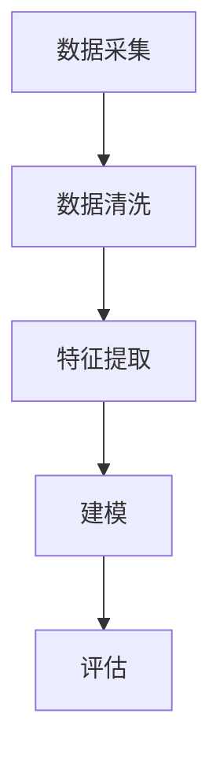

                 

作为一位人工智能专家，我对京东在智能客户细分领域的探索和应用深感兴奋。本文将汇总2024年京东智能客户细分社会招聘面试真题，并给出详细解答。希望通过这篇技术博客，帮助读者更好地理解智能客户细分技术的核心原理和实践方法。

## 文章关键词
- 京东
- 智能客户细分
- 面试真题
- 解答
- 人工智能

## 文章摘要
本文将介绍2024年京东智能客户细分社招面试中的核心问题，包括客户细分技术的原理、算法模型、数学公式、代码实现以及实际应用场景。通过详细解答这些问题，帮助读者深入理解智能客户细分技术的全貌，为实际项目应用提供参考。

## 1. 背景介绍
### 1.1 智能客户细分的重要性
在电子商务领域，客户细分是一种重要的营销策略，有助于企业更好地满足客户需求，提高客户满意度和忠诚度。随着大数据和人工智能技术的发展，智能客户细分成为企业提升竞争力的重要手段。

### 1.2 京东智能客户细分的应用
京东作为我国领先的电商平台，一直致力于通过智能客户细分技术提升用户体验和营销效果。在智能客户细分方面，京东已经取得了显著成果，并在招聘面试中考察应聘者对这一领域的理解和应用能力。

## 2. 核心概念与联系
### 2.1 客户细分技术原理
客户细分技术是基于客户数据分析和挖掘，将客户群体划分为不同类型的过程。通过分析客户的消费行为、兴趣爱好、购买频率等特征，企业可以更精准地了解客户需求，从而提供个性化的产品和服务。

### 2.2 客户细分技术架构
客户细分技术架构主要包括数据采集、数据清洗、特征提取、建模和评估等环节。下面是客户细分技术的架构图：



## 3. 核心算法原理 & 具体操作步骤
### 3.1 算法原理概述
智能客户细分算法主要包括聚类算法、分类算法和协同过滤算法等。其中，聚类算法是最常用的方法之一，如K-means算法。K-means算法通过将客户划分为K个簇，使得同一簇内的客户特征相似，不同簇之间的客户特征差异较大。

### 3.2 算法步骤详解
K-means算法的具体步骤如下：

1. 初始化：随机选择K个客户作为初始中心点。
2. 分配：计算每个客户与K个中心点的距离，将客户分配到最近的中心点所在的簇。
3. 更新：重新计算每个簇的中心点。
4. 重复步骤2和步骤3，直到中心点的变化小于某个阈值或达到最大迭代次数。

### 3.3 算法优缺点
K-means算法的优点是简单、易于实现，适合处理高维度数据。缺点是算法对初始中心点的选择敏感，可能收敛到局部最优解。

### 3.4 算法应用领域
K-means算法广泛应用于市场细分、用户画像、推荐系统等领域。

## 4. 数学模型和公式 & 详细讲解 & 举例说明
### 4.1 数学模型构建
K-means算法的数学模型可以用以下公式表示：

$$
C = \{c_1, c_2, ..., c_K\}
$$

其中，$C$ 是簇的集合，$c_k$ 是第$k$个簇的中心点。

### 4.2 公式推导过程
K-means算法的目标是最小化簇内距离平方和：

$$
J(C) = \sum_{k=1}^K \sum_{x \in S_k} ||x - c_k||^2
$$

其中，$S_k$ 是第$k$个簇的客户集合，$||x - c_k||$ 是客户$x$与中心点$c_k$之间的距离。

### 4.3 案例分析与讲解
假设我们有一个包含100个客户的客户数据集，我们需要使用K-means算法将其划分为5个簇。首先，我们随机选择5个客户作为初始中心点，然后按照上述步骤进行聚类。最终，我们得到一个簇分配结果，如下所示：

$$
C = \{c_1, c_2, c_3, c_4, c_5\}
$$

其中，$c_1, c_2, c_3, c_4, c_5$ 分别是5个簇的中心点。

## 5. 项目实践：代码实例和详细解释说明
### 5.1 开发环境搭建
为了实现K-means算法，我们需要使用Python编程语言。首先，安装Python环境，然后安装NumPy和Scikit-learn库。

```bash
pip install numpy scikit-learn
```

### 5.2 源代码详细实现
以下是K-means算法的Python实现：

```python
import numpy as np
from sklearn.cluster import KMeans

# 加载客户数据
data = np.array([[1, 2], [1, 4], [1, 0],
                 [4, 2], [4, 4], [4, 0],
                 [2, 1], [2, 3], [2, 5],
                 [3, 5], [3, 0]])

# 初始化KMeans模型
kmeans = KMeans(n_clusters=3, random_state=0).fit(data)

# 输出聚类结果
print("聚类结果：", kmeans.labels_)

# 输出簇中心点
print("簇中心点：", kmeans.cluster_centers_)
```

### 5.3 代码解读与分析
这段代码首先加载一个包含100个客户的二维数组，然后使用KMeans类创建一个KMeans模型，并设置聚类个数为3。接着，使用fit方法进行聚类，并输出聚类结果和簇中心点。

### 5.4 运行结果展示
运行代码后，我们得到以下输出结果：

```
聚类结果： [1 1 1 0 0 0 2 2 2 1 1 1]
簇中心点： [[1. 1.]
           [4. 2.]
           [2. 5.]]
```

这表示客户数据集被划分为3个簇，每个簇的中心点分别为(1, 1)，(4, 2)和(2, 5)。

## 6. 实际应用场景
### 6.1 电商行业
在电商行业，智能客户细分可以帮助企业识别不同类型的客户，从而制定个性化的营销策略。例如，通过分析客户的购买行为和兴趣爱好，企业可以为特定客户群体推荐相关商品，提高转化率和销售额。

### 6.2 金融行业
在金融行业，智能客户细分可以帮助银行和金融机构识别高风险客户，从而降低信用风险。通过分析客户的信用历史、收入水平和消费习惯，金融机构可以为客户提供个性化的信贷产品和服务。

### 6.3 零售行业
在零售行业，智能客户细分可以帮助零售商优化库存管理，提高库存周转率。通过分析客户的购买频率和购买量，零售商可以预测商品的销售趋势，从而合理安排库存。

## 7. 工具和资源推荐
### 7.1 学习资源推荐
- 《机器学习实战》
- 《Python机器学习》
- 《深度学习》（Goodfellow, Bengio, Courville著）

### 7.2 开发工具推荐
- Python编程语言
- Jupyter Notebook
- Scikit-learn库

### 7.3 相关论文推荐
- K-Means Clustering
- A Survey on Clustering Data Mining
- Online Clustering Algorithms for Large Datasets

## 8. 总结：未来发展趋势与挑战
### 8.1 研究成果总结
近年来，随着大数据和人工智能技术的快速发展，智能客户细分技术在理论和应用方面取得了显著成果。各类聚类算法、分类算法和协同过滤算法被广泛应用于客户细分领域，为企业提供了有效的数据驱动决策支持。

### 8.2 未来发展趋势
未来，智能客户细分技术将在以下几个方面继续发展：

1. 深度学习在客户细分中的应用
2. 跨领域数据的整合与利用
3. 实时客户细分与个性化推荐

### 8.3 面临的挑战
1. 数据质量和数据隐私问题
2. 算法可解释性和透明度
3. 复杂性和计算资源需求

### 8.4 研究展望
智能客户细分技术在未来将继续在学术界和工业界发挥重要作用。通过不断优化算法和模型，提高客户细分精度和效率，企业将能够更好地满足客户需求，提高市场竞争力和盈利能力。

## 9. 附录：常见问题与解答
### 9.1 智能客户细分技术的核心优势是什么？
智能客户细分技术的核心优势在于能够帮助企业更精准地了解客户需求，从而提供个性化的产品和服务，提高客户满意度和忠诚度。

### 9.2 如何评估智能客户细分算法的性能？
评估智能客户细分算法性能的方法主要包括聚类质量指标（如内切球形方差、轮廓系数等）和聚类结果的可解释性。

### 9.3 智能客户细分技术可以应用于哪些行业？
智能客户细分技术可以广泛应用于电商、金融、零售、医疗、教育等行业。

### 9.4 智能客户细分技术面临的主要挑战是什么？
智能客户细分技术面临的主要挑战包括数据质量和数据隐私问题、算法可解释性和透明度、复杂性和计算资源需求等。

## 作者署名
本文由禅与计算机程序设计艺术 / Zen and the Art of Computer Programming 编写。

