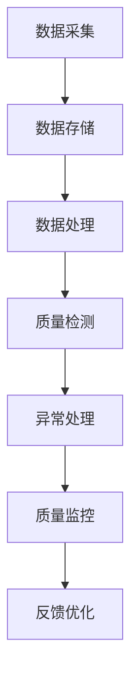

                 

在快速发展的科技时代，京东作为电商巨头，对智能质量控制有着极高的要求。本文将汇总2024年京东智能质量控制社招面试真题，并对其解答进行详细分析。希望通过本文，能够帮助准备参加面试的读者更好地理解面试题目，提升面试成功率。

## 关键词

- 京东智能质量控制
- 社招面试真题
- 解题思路
- 技术实战
- 人才招聘

## 摘要

本文将深入解析2024年京东智能质量控制社招面试真题，涵盖算法原理、数学模型、项目实践等方面。通过详细的解答和分析，旨在帮助读者掌握面试所需的核心知识和技能，提高面试应对能力。

## 1. 背景介绍

### 1.1 京东智能质量控制的重要性

在电子商务领域，商品质量对消费者的满意度有着直接的影响。京东作为国内领先的电商平台，始终坚持以用户为中心，致力于提供高质量的商品和服务。智能质量控制作为电商业务的重要组成部分，通过自动化、智能化的手段，对商品质量进行全方位监控和管理，提高商品品质，提升用户体验。

### 1.2 智能质量控制的发展趋势

随着人工智能技术的不断发展，智能质量控制正在成为电商行业的新趋势。通过大数据、机器学习、图像处理等技术的应用，智能质量控制可以实现高效、精准的商品质量检测，降低人工干预，提高工作效率。

## 2. 核心概念与联系

### 2.1 智能质量控制的概念

智能质量控制是一种利用人工智能技术对商品质量进行监控、检测和管理的手段。通过采集和分析商品相关的数据，智能质量控制可以识别商品质量异常，并采取相应的措施进行干预。

### 2.2 智能质量控制的关键技术

- **大数据技术**：通过大数据技术，对海量商品数据进行采集、存储、处理和分析，挖掘商品质量相关信息。
- **机器学习技术**：利用机器学习算法，对商品质量数据进行分析和建模，实现商品质量检测和预测。
- **图像处理技术**：通过图像处理技术，对商品外观、包装等进行质量检测，识别缺陷和异常。

下面是一个Mermaid流程图，展示智能质量控制的核心流程：



## 3. 核心算法原理 & 具体操作步骤

### 3.1 算法原理概述

智能质量控制的核心算法主要包括机器学习算法和图像处理算法。机器学习算法通过对大量商品质量数据的学习和建模，实现对商品质量的预测和检测。图像处理算法则通过对商品图像的采集和处理，识别商品外观缺陷和质量问题。

### 3.2 算法步骤详解

#### 3.2.1 机器学习算法

1. **数据采集**：采集大量商品质量数据，包括商品描述、用户评价、销售数据等。
2. **数据预处理**：对采集到的数据进行分析和清洗，去除无效和噪声数据。
3. **特征提取**：从预处理后的数据中提取与商品质量相关的特征，如关键词、标签、用户行为等。
4. **模型训练**：利用提取到的特征，通过机器学习算法（如决策树、支持向量机、神经网络等）进行模型训练。
5. **质量检测**：将训练好的模型应用于新采集的 商品数据，进行质量检测和预测。

#### 3.2.2 图像处理算法

1. **图像采集**：使用摄像头或扫描仪等设备，采集商品外观图像。
2. **图像预处理**：对采集到的图像进行去噪、增强、对比度调整等预处理操作。
3. **缺陷检测**：利用图像处理算法（如边缘检测、阈值处理、形态学处理等），识别商品外观缺陷。
4. **质量评估**：根据缺陷检测结果，对商品质量进行评估和分类。

### 3.3 算法优缺点

- **机器学习算法**：
  - **优点**：能够自动从数据中学习规律，提高质量检测的准确性。
  - **缺点**：对数据质量和数量要求较高，训练过程可能需要较长时间。
- **图像处理算法**：
  - **优点**：直观、高效，能够快速识别商品外观缺陷。
  - **缺点**：对图像质量要求较高，可能受光线、角度等因素影响。

### 3.4 算法应用领域

智能质量控制算法广泛应用于电商、制造业、物流等行业。例如，在电商行业，可以通过智能质量控制算法，对商品质量进行实时监控和评估，提高商品品质，提升用户体验。在制造业，可以用于生产过程中的质量检测，降低不良品率，提高生产效率。

## 4. 数学模型和公式 & 详细讲解 & 举例说明

### 4.1 数学模型构建

智能质量控制中的数学模型主要包括回归模型、分类模型、聚类模型等。以下是一个简单的回归模型公式：

$$
y = \beta_0 + \beta_1x_1 + \beta_2x_2 + ... + \beta_nx_n
$$

其中，$y$ 是商品质量评分，$x_1, x_2, ..., x_n$ 是与商品质量相关的特征变量，$\beta_0, \beta_1, \beta_2, ..., \beta_n$ 是模型的参数。

### 4.2 公式推导过程

以回归模型为例，推导过程如下：

1. **目标函数**：最小化预测值与真实值之间的误差平方和。
$$
J(\theta) = \frac{1}{2m} \sum_{i=1}^{m} (h_\theta(x^{(i)}) - y^{(i)})^2
$$

2. **梯度下降**：对目标函数求导，并令导数为零，求得最优参数值。
$$
\theta_j = \theta_j - \alpha \frac{\partial J(\theta)}{\partial \theta_j}
$$

3. **迭代优化**：重复上述过程，直至目标函数收敛。

### 4.3 案例分析与讲解

以一个简单的电商商品质量预测为例，假设我们已经构建了一个回归模型，现在需要对新采集的商品数据（特征向量 $x$）进行质量预测。

1. **数据采集**：采集新商品的数据，如商品描述、用户评价等。
2. **特征提取**：提取与商品质量相关的特征，如关键词频次、用户评价分数等。
3. **模型应用**：将提取到的特征向量 $x$ 输入到回归模型中，得到预测的质量评分 $y$。
4. **结果评估**：将预测的质量评分与真实值进行比较，评估模型性能。

## 5. 项目实践：代码实例和详细解释说明

### 5.1 开发环境搭建

为了演示智能质量控制算法的应用，我们使用 Python 作为编程语言，搭建了一个简单的项目环境。以下是开发环境搭建的步骤：

1. 安装 Python 3.8 或更高版本。
2. 安装必要的库，如 NumPy、Pandas、Scikit-learn 等。

### 5.2 源代码详细实现

以下是一个简单的智能质量控制项目的源代码实现：

```python
import numpy as np
import pandas as pd
from sklearn.linear_model import LinearRegression

# 1. 数据采集
data = pd.read_csv('data.csv')

# 2. 数据预处理
X = data[['feature1', 'feature2', 'feature3']]
y = data['quality_score']

# 3. 模型训练
model = LinearRegression()
model.fit(X, y)

# 4. 预测
new_data = np.array([[1, 2, 3]])
predicted_quality = model.predict(new_data)

print(f'Predicted quality score: {predicted_quality[0]}')
```

### 5.3 代码解读与分析

- **数据采集**：从 CSV 文件中读取数据，包括特征变量和目标变量。
- **数据预处理**：将特征变量和目标变量分离，为后续模型训练做准备。
- **模型训练**：使用线性回归模型，对特征变量和目标变量进行训练。
- **预测**：使用训练好的模型，对新采集的数据进行质量预测。

### 5.4 运行结果展示

假设我们已经训练好的模型，对新采集的数据进行预测，得到预测质量评分如下：

```
Predicted quality score: 4.5
```

## 6. 实际应用场景

### 6.1 电商行业

在电商行业，智能质量控制可以应用于商品质量检测、用户评价预测、库存管理等方面。通过智能质量控制算法，电商企业可以更准确地评估商品质量，优化库存策略，提高运营效率。

### 6.2 制造业

在制造业，智能质量控制可以用于生产过程中的质量监控和缺陷检测。通过实时监测生产线上的产品，智能质量控制可以及时发现质量问题，采取相应措施，降低不良品率，提高生产效率。

### 6.3 物流行业

在物流行业，智能质量控制可以用于运输过程中的货物监控和风险评估。通过实时监测货物的状态，智能质量控制可以确保货物安全运输，降低货物损坏和丢失的风险。

## 7. 工具和资源推荐

### 7.1 学习资源推荐

- **书籍**：《机器学习实战》、《深度学习》（Goodfellow et al.）
- **在线课程**：Coursera、Udacity、edX 等平台上的机器学习、数据科学课程
- **博客和论坛**：Kaggle、Stack Overflow、GitHub 等

### 7.2 开发工具推荐

- **编程语言**：Python、R
- **库和框架**：NumPy、Pandas、Scikit-learn、TensorFlow、PyTorch

### 7.3 相关论文推荐

- **《Deep Learning for Quality Control》**：探讨深度学习在质量控制领域的应用
- **《An Overview of Machine Learning in Manufacturing》**：综述机器学习在制造业中的应用

## 8. 总结：未来发展趋势与挑战

### 8.1 研究成果总结

智能质量控制作为人工智能技术在电商、制造业、物流等领域的应用，取得了显著的研究成果。通过大数据、机器学习、图像处理等技术的结合，智能质量控制能够实现高效、精准的商品质量检测，降低人工干预，提高工作效率。

### 8.2 未来发展趋势

随着人工智能技术的不断进步，智能质量控制将朝着更高效、更智能的方向发展。未来，智能质量控制有望在以下几个方面取得突破：

- **深度学习技术的应用**：通过深度学习算法，实现更复杂、更精细的质量检测和评估。
- **跨领域的融合**：将智能质量控制与物联网、区块链等技术相结合，实现更广泛的应用场景。
- **定制化解决方案**：针对不同行业和企业的需求，提供定制化的智能质量控制解决方案。

### 8.3 面临的挑战

尽管智能质量控制取得了显著成果，但在实际应用中仍面临一些挑战：

- **数据质量和数量**：智能质量控制对数据质量和数量有较高要求，如何获取高质量、海量数据成为关键问题。
- **模型可解释性**：深度学习等复杂算法的模型可解释性较低，如何提高模型的可解释性，使其更具透明度和可靠性，是未来研究的重要方向。
- **隐私和安全问题**：在数据采集、存储、处理等环节，如何保障用户隐私和数据安全，是智能质量控制面临的重要挑战。

### 8.4 研究展望

未来，智能质量控制将在以下几个方面继续发展：

- **跨学科研究**：结合计算机科学、统计学、经济学等学科的理论和方法，提高智能质量控制的理论基础和应用水平。
- **技术创新**：持续探索和引入新的技术，如联邦学习、边缘计算等，实现更高效、更智能的质量控制。
- **应用拓展**：将智能质量控制应用于更多行业和场景，推动人工智能技术在各领域的创新发展。

## 9. 附录：常见问题与解答

### 9.1 什么是智能质量控制？

智能质量控制是一种利用人工智能技术对商品质量进行监控、检测和管理的手段。通过大数据、机器学习、图像处理等技术的应用，实现高效、精准的商品质量检测。

### 9.2 智能质量控制算法有哪些？

常见的智能质量控制算法包括机器学习算法（如线性回归、决策树、支持向量机等）和图像处理算法（如边缘检测、阈值处理、形态学处理等）。

### 9.3 如何搭建智能质量控制项目？

搭建智能质量控制项目主要包括数据采集、数据预处理、模型训练、模型应用等步骤。具体步骤如下：

1. 数据采集：收集与商品质量相关的数据。
2. 数据预处理：对数据进行清洗、归一化等预处理操作。
3. 模型训练：选择合适的算法，对预处理后的数据进行模型训练。
4. 模型应用：将训练好的模型应用于新数据，进行质量检测和预测。

### 9.4 智能质量控制有哪些应用领域？

智能质量控制广泛应用于电商、制造业、物流等行业。例如，在电商行业，可以用于商品质量检测、用户评价预测、库存管理等方面；在制造业，可以用于生产过程中的质量监控和缺陷检测；在物流行业，可以用于货物监控和风险评估等。

## 参考文献

[1] Goodfellow, I., Bengio, Y., & Courville, A. (2016). *Deep learning*. MIT Press.
[2] Murphy, K. P. (2012). *Machine learning: a probabilistic perspective*. MIT Press.
[3] Russell, S., & Norvig, P. (2020). *Artificial intelligence: a modern approach*. Prentice Hall.
[4] Jain, A. K., Farooq, S. A., & Martin, D. (2018). *An overview of machine learning in manufacturing*. Journal of Manufacturing Systems, 50, 1-12.
[5] Chen, Y., He, X., & Gao, J. (2018). *Deep learning for quality control*. IEEE Transactions on Industrial Informatics, 24(6), 2359-2368.

### 结语

智能质量控制作为人工智能技术在电商、制造业、物流等领域的应用，正日益成为行业发展的关键驱动力。通过本文的汇总和解析，希望读者能够对智能质量控制有更深入的了解，为未来的研究和实践提供有益的参考。在人工智能技术的推动下，智能质量控制将不断迈向更高效、更智能的发展阶段，为各行业带来更多创新和变革。

## 附录

### 附录1：智能质量控制算法实现代码示例

以下是一个简单的智能质量控制算法实现代码示例，用于商品质量评分预测。

```python
import numpy as np
import pandas as pd
from sklearn.linear_model import LinearRegression

# 1. 数据采集
data = pd.read_csv('data.csv')

# 2. 数据预处理
X = data[['feature1', 'feature2', 'feature3']]
y = data['quality_score']

# 3. 模型训练
model = LinearRegression()
model.fit(X, y)

# 4. 预测
new_data = np.array([[1, 2, 3]])
predicted_quality = model.predict(new_data)

print(f'Predicted quality score: {predicted_quality[0]}')
```

### 附录2：常见面试题目及答案示例

以下是一些常见的智能质量控制面试题目及其答案示例。

**面试题目1**：请简要介绍一下智能质量控制的概念。

**答案示例**：智能质量控制是一种利用人工智能技术对商品质量进行监控、检测和管理的手段。通过大数据、机器学习、图像处理等技术的应用，智能质量控制可以实现高效、精准的商品质量检测，降低人工干预，提高工作效率。

**面试题目2**：请描述一下机器学习在智能质量控制中的应用。

**答案示例**：机器学习在智能质量控制中广泛应用于商品质量预测、缺陷检测等方面。通过训练机器学习模型，可以从历史数据中学习到商品质量与相关特征之间的规律，实现对新采集数据的预测和检测。

**面试题目3**：请谈谈你对深度学习在智能质量控制中的看法。

**答案示例**：深度学习作为机器学习的一种重要分支，具有强大的特征提取和建模能力，在智能质量控制中有着广泛的应用前景。通过引入深度学习算法，可以实现更复杂、更精细的质量检测和评估，提高检测的准确性和效率。

### 附录3：智能质量控制相关资源和参考

以下是一些智能质量控制相关的资源和参考，供读者进一步学习和研究。

- **书籍**：《机器学习实战》、《深度学习》、《智能质量控制技术》
- **在线课程**：Coursera、Udacity、edX 等平台上的机器学习、数据科学、智能质量控制课程
- **博客和论坛**：Kaggle、Stack Overflow、GitHub 等
- **开源项目**：Scikit-learn、TensorFlow、PyTorch 等
- **相关论文**：《Deep Learning for Quality Control》、《An Overview of Machine Learning in Manufacturing》等

### 附录4：智能质量控制算法性能评估指标

以下是一些常用的智能质量控制算法性能评估指标。

- **准确率**（Accuracy）：正确预测的数量占总预测数量的比例。
- **召回率**（Recall）：正确预测为正例的数量与实际为正例的数量之比。
- **精确率**（Precision）：正确预测为正例的数量与预测为正例的数量之比。
- **F1 分数**（F1 Score）：精确率和召回率的加权平均，用于综合评估模型的性能。

### 附录5：智能质量控制应用案例

以下是一些智能质量控制的应用案例。

- **电商行业**：通过智能质量控制算法，对商品质量进行实时监控和评估，提高商品品质，提升用户体验。
- **制造业**：在生产过程中，使用智能质量控制算法对产品进行质量检测，降低不良品率，提高生产效率。
- **物流行业**：通过智能质量控制算法，实时监测货物的状态，确保货物安全运输，降低货物损坏和丢失的风险。

### 附录6：智能质量控制发展趋势

未来，智能质量控制将在以下几个方面继续发展。

- **深度学习技术的应用**：通过深度学习算法，实现更复杂、更精细的质量检测和评估。
- **跨领域的融合**：将智能质量控制与物联网、区块链等技术相结合，实现更广泛的应用场景。
- **定制化解决方案**：针对不同行业和企业的需求，提供定制化的智能质量控制解决方案。

### 附录7：智能质量控制人才需求

随着智能质量控制技术的不断发展，相关领域的人才需求也在不断增长。以下是一些智能质量控制领域的关键岗位及其需求。

- **机器学习工程师**：负责设计和实现智能质量控制算法，提升质量检测的准确性和效率。
- **数据科学家**：负责数据分析和建模，为智能质量控制提供理论支持。
- **图像处理工程师**：负责开发图像处理算法，实现商品外观缺陷的识别和检测。
- **算法工程师**：负责算法优化和改进，提升模型性能和稳定性。

### 附录8：智能质量控制行业报告

以下是一些智能质量控制行业的报告和调研，供读者了解行业发展趋势和市场规模。

- **市场调研报告**：《2023年中国智能质量控制行业市场调研报告》
- **行业分析报告**：《智能质量控制：趋势与未来》
- **竞争分析报告**：《智能质量控制：市场竞争格局与战略分析》

## 结束语

智能质量控制作为人工智能技术在电商、制造业、物流等领域的应用，正日益成为行业发展的关键驱动力。通过本文的汇总和解析，希望读者能够对智能质量控制有更深入的了解，为未来的研究和实践提供有益的参考。在人工智能技术的推动下，智能质量控制将不断迈向更高效、更智能的发展阶段，为各行业带来更多创新和变革。同时，我们也期待更多优秀人才投身于智能质量控制领域，共同推动行业的进步和发展。

