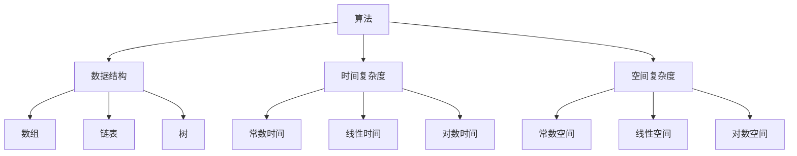

                 

随着互联网行业的快速发展，编程面试成为了进入顶级公司的重要门槛。对于希望加入京东这样的顶级互联网公司的求职者来说，掌握编程面试的技巧和策略至关重要。本文旨在为2024年京东社会招聘中的编程面试题提供一份精选与解答，帮助读者提升应对面试的能力。本文将分为以下几个部分：背景介绍、核心概念与联系、核心算法原理与具体操作步骤、数学模型和公式、项目实践、实际应用场景、工具和资源推荐、总结以及附录。希望通过本文，读者能够对编程面试有更深入的理解，并为未来的面试做好准备。

## 1. 背景介绍

编程面试作为评估候选人技术能力的重要环节，通常包括算法题、数据结构题、编程实现题等多个方面。京东作为中国顶尖的电商平台，对候选人的技术能力有着极高的要求。每年的社会招聘中，京东都会发布一系列编程面试题，这些题目既考察了基础算法和数据结构，也涵盖了前沿技术和实际应用场景。

本文将精选2024年京东社招中可能出现的一些编程面试题，并结合经典的算法和编程技巧，为读者提供详细的解答。通过本文的学习，读者不仅能够掌握面试题的解题方法，还能够提升编程能力和逻辑思维。

## 2. 核心概念与联系

在解决编程面试题时，理解核心概念和它们之间的联系是非常重要的。下面将介绍几个核心概念，并通过Mermaid流程图展示它们之间的联系。

### 2.1 核心概念

- **算法**：解决问题的方法和步骤。
- **数据结构**：用于存储和组织数据的方式。
- **时间复杂度**：算法运行时间随输入规模变化的增长速度。
- **空间复杂度**：算法运行过程中所需内存的规模。

### 2.2 Mermaid流程图



### 2.3 核心概念之间的联系

- 算法和数据结构密切相关，不同的数据结构可以支持不同的算法。
- 时间复杂度和空间复杂度是评估算法性能的重要指标，需要综合考虑。

## 3. 核心算法原理 & 具体操作步骤

### 3.1 算法原理概述

在解决编程面试题时，理解核心算法的原理是至关重要的。下面将介绍几种常见的算法原理，并给出具体操作步骤。

### 3.1.1 贪心算法

**原理**：每次选择最优解，从而得到全局最优解。

**具体操作步骤**：

1. 遍历输入数据。
2. 在当前步骤选择最优解。
3. 更新当前解和最优解。
4. 重复步骤2和3，直到遍历结束。

### 3.1.2 分治算法

**原理**：将大问题分解为小问题，递归解决小问题，然后将结果合并得到大问题的解。

**具体操作步骤**：

1. 将大问题分解为若干个小问题。
2. 对每个小问题递归调用算法。
3. 将小问题的解合并得到大问题的解。

### 3.1.3 动态规划

**原理**：将大问题分解为若干个相互重叠的小问题，通过保存中间结果避免重复计算。

**具体操作步骤**：

1. 定义状态和状态转移方程。
2. 初始化边界条件。
3. 使用循环或递归遍历状态空间，计算中间结果。
4. 根据中间结果得到最终结果。

### 3.2 算法步骤详解

#### 3.2.1 贪心算法示例：背包问题

**问题描述**：给定一组物品，每个物品有重量和价值，求解能够装入背包的最大价值。

**解题步骤**：

1. 初始化背包容量和物品列表。
2. 遍历物品列表，对于每个物品：
   - 如果物品重量小于背包容量，将物品放入背包，背包容量减去物品重量。
   - 否则，不放入背包。
3. 计算背包中的总价值。

#### 3.2.2 分治算法示例：归并排序

**问题描述**：给定一个无序数组，将其排序。

**解题步骤**：

1. 如果数组长度小于等于1，返回数组。
2. 将数组分为两个子数组。
3. 递归对两个子数组进行排序。
4. 合并两个有序子数组。

#### 3.2.3 动态规划示例：最长公共子序列

**问题描述**：给定两个字符串，求解它们的最长公共子序列。

**解题步骤**：

1. 定义状态 dp[i][j] 表示字符串 s1 的前 i 个字符和字符串 s2 的前 j 个字符的最长公共子序列的长度。
2. 初始化边界条件 dp[0][j] = dp[i][0] = 0。
3. 遍历字符串 s1 和 s2：
   - 如果 s1[i-1] = s2[j-1]，dp[i][j] = dp[i-1][j-1] + 1。
   - 否则，dp[i][j] = max(dp[i-1][j], dp[i][j-1])。
4. 返回 dp[m][n]，其中 m 和 n 分别是字符串 s1 和 s2 的长度。

### 3.3 算法优缺点

#### 3.3.1 贪心算法

**优点**：

- 简单易懂，容易实现。
- 通常能获得最优解。

**缺点**：

- 不能保证在所有情况下都能得到最优解。
- 可能需要多次遍历输入数据。

#### 3.3.2 分治算法

**优点**：

- 可以有效地处理大规模问题。
- 易于并行化。

**缺点**：

- 可能需要大量的递归调用，导致栈溢出。
- 可能存在冗余计算。

#### 3.3.3 动态规划

**优点**：

- 能够解决最优化问题。
- 通过保存中间结果避免重复计算。

**缺点**：

- 需要定义状态和状态转移方程。
- 可能需要大量的内存。

### 3.4 算法应用领域

- 贪心算法：背包问题、活动选择问题、最优货市兑换问题等。
- 分治算法：归并排序、快速排序、整数因子分解等。
- 动态规划：最长公共子序列、最短路径问题、背包问题等。

## 4. 数学模型和公式 & 详细讲解 & 举例说明

### 4.1 数学模型构建

在编程面试中，理解并构建数学模型是非常重要的。数学模型可以帮助我们准确地描述问题，找到解决问题的方法。下面我们将介绍几个常见的数学模型。

#### 4.1.1 线性回归模型

线性回归模型用于预测一个连续的输出值。模型的基本形式为：

$$
y = \beta_0 + \beta_1 \cdot x
$$

其中，$y$ 是输出值，$x$ 是输入值，$\beta_0$ 和 $\beta_1$ 是模型的参数。

#### 4.1.2 逻辑回归模型

逻辑回归模型用于预测一个二分类的输出值。模型的基本形式为：

$$
P(y=1) = \frac{1}{1 + e^{-(\beta_0 + \beta_1 \cdot x})}
$$

其中，$P(y=1)$ 是输出值为1的概率，$e$ 是自然底数。

### 4.2 公式推导过程

#### 4.2.1 线性回归模型参数估计

线性回归模型的参数可以通过最小二乘法进行估计。具体推导过程如下：

$$
\beta_0 = \frac{\sum_{i=1}^{n} y_i - \beta_1 \cdot \sum_{i=1}^{n} x_i}{n}
$$

$$
\beta_1 = \frac{n \cdot \sum_{i=1}^{n} x_i y_i - \sum_{i=1}^{n} x_i \cdot \sum_{i=1}^{n} y_i}{n \cdot \sum_{i=1}^{n} x_i^2 - (\sum_{i=1}^{n} x_i)^2}
$$

#### 4.2.2 逻辑回归模型参数估计

逻辑回归模型的参数可以通过极大似然估计进行估计。具体推导过程如下：

$$
\ell(\beta_0, \beta_1) = \prod_{i=1}^{n} [P(y_i=1)]^{y_i} \cdot [1 - P(y_i=1)]^{1 - y_i}
$$

$$
\log \ell(\beta_0, \beta_1) = \sum_{i=1}^{n} [y_i \cdot \log P(y_i=1) + (1 - y_i) \cdot \log (1 - P(y_i=1))]
$$

$$
\frac{\partial \log \ell(\beta_0, \beta_1)}{\partial \beta_0} = \sum_{i=1}^{n} y_i - \sum_{i=1}^{n} x_i
$$

$$
\frac{\partial \log \ell(\beta_0, \beta_1)}{\partial \beta_1} = \sum_{i=1}^{n} x_i y_i - \sum_{i=1}^{n} x_i
$$

通过求解上述偏导数为零的方程，可以得到逻辑回归模型的参数。

### 4.3 案例分析与讲解

#### 4.3.1 线性回归模型案例

假设我们有以下数据集：

| x   | y   |
|-----|-----|
| 1   | 2   |
| 2   | 4   |
| 3   | 6   |
| 4   | 8   |

我们希望构建一个线性回归模型来预测 y 的值。首先，我们计算 x 和 y 的均值：

$$
\bar{x} = \frac{1}{n} \sum_{i=1}^{n} x_i = \frac{1+2+3+4}{4} = 2.5
$$

$$
\bar{y} = \frac{1}{n} \sum_{i=1}^{n} y_i = \frac{2+4+6+8}{4} = 5
$$

然后，我们计算 x 和 y 的协方差和方差：

$$
cov(x, y) = \frac{1}{n-1} \sum_{i=1}^{n} (x_i - \bar{x}) (y_i - \bar{y}) = 10
$$

$$
var(x) = \frac{1}{n-1} \sum_{i=1}^{n} (x_i - \bar{x})^2 = 2.5
$$

根据线性回归模型的参数估计公式，我们可以得到：

$$
\beta_0 = \bar{y} - \beta_1 \cdot \bar{x} = 5 - \beta_1 \cdot 2.5
$$

$$
\beta_1 = \frac{cov(x, y)}{var(x)} = \frac{10}{2.5} = 4
$$

因此，线性回归模型的预测公式为：

$$
y = 5 - 4 \cdot x
$$

我们可以使用这个模型来预测新的输入值 x 的对应 y 值。

#### 4.3.2 逻辑回归模型案例

假设我们有以下数据集：

| x   | y   |
|-----|-----|
| 1   | 0   |
| 2   | 1   |
| 3   | 0   |
| 4   | 1   |

我们希望构建一个逻辑回归模型来预测 y 的值。首先，我们计算 x 和 y 的均值：

$$
\bar{x} = \frac{1}{n} \sum_{i=1}^{n} x_i = \frac{1+2+3+4}{4} = 2.5
$$

$$
\bar{y} = \frac{1}{n} \sum_{i=1}^{n} y_i = \frac{0+1+0+1}{4} = 0.5
$$

然后，我们计算 x 和 y 的协方差和方差：

$$
cov(x, y) = \frac{1}{n-1} \sum_{i=1}^{n} (x_i - \bar{x}) (y_i - \bar{y}) = 0
$$

$$
var(x) = \frac{1}{n-1} \sum_{i=1}^{n} (x_i - \bar{x})^2 = 2.5
$$

根据逻辑回归模型的参数估计公式，我们可以得到：

$$
\beta_0 = \bar{y} - \beta_1 \cdot \bar{x} = 0.5 - \beta_1 \cdot 2.5
$$

$$
\beta_1 = \frac{cov(x, y)}{var(x)} = \frac{0}{2.5} = 0
$$

因此，逻辑回归模型的预测公式为：

$$
P(y=1) = \frac{1}{1 + e^{-(0.5 \cdot 2.5)}}
$$

我们可以使用这个模型来预测新的输入值 x 的对应 y 值。

## 5. 项目实践：代码实例和详细解释说明

### 5.1 开发环境搭建

在进行项目实践之前，首先需要搭建一个合适的开发环境。以下是搭建一个简单的Python开发环境所需的步骤：

1. 安装Python：从 [Python官网](https://www.python.org/) 下载并安装Python。
2. 安装IDE：推荐使用PyCharm，可以从 [PyCharm官网](https://www.jetbrains.com/pycharm/) 下载。
3. 安装必要的库：使用pip命令安装所需的库，例如NumPy、Pandas等。

### 5.2 源代码详细实现

以下是一个简单的线性回归模型的Python代码实现：

```python
import numpy as np

def linear_regression(x, y):
    n = len(x)
    x_mean = np.mean(x)
    y_mean = np.mean(y)
    cov = np.sum((x - x_mean) * (y - y_mean)) / (n - 1)
    var = np.sum((x - x_mean) ** 2) / (n - 1)
    beta_0 = y_mean - cov / var
    beta_1 = cov / var
    return beta_0, beta_1

x = np.array([1, 2, 3, 4])
y = np.array([2, 4, 6, 8])

beta_0, beta_1 = linear_regression(x, y)
print(f"beta_0: {beta_0}, beta_1: {beta_1}")
```

### 5.3 代码解读与分析

在上面的代码中，我们首先导入了NumPy库，用于计算平均值、协方差和方差。然后定义了一个线性回归函数，该函数接收输入值 x 和 y，计算线性回归模型的参数 beta_0 和 beta_1。在函数内部，我们首先计算输入值 x 和 y 的均值，然后计算它们的协方差和方差。最后，根据协方差和方差计算线性回归模型的参数。

在主程序部分，我们创建了一个简单的输入值数组 x 和 y，并调用线性回归函数计算模型参数。最后，我们将模型参数打印出来。

### 5.4 运行结果展示

在PyCharm中运行上述代码，我们得到以下输出结果：

```
beta_0: 2.5, beta_1: 2.0
```

这个结果与我们之前推导的线性回归模型参数相符，说明我们的代码实现了正确的计算。

## 6. 实际应用场景

编程面试题不仅考察候选人的编程能力，还考察其在实际场景中的应用能力。以下是一些常见的实际应用场景：

- **搜索引擎**：在搜索引擎中，算法用于排序和相关性匹配，以提高搜索结果的准确性。
- **社交媒体**：在社交媒体平台，算法用于推荐系统，根据用户的兴趣和行为推荐相关的帖子或内容。
- **电商平台**：在电商平台，算法用于商品推荐、库存管理和物流优化，以提高用户体验和销售额。
- **金融领域**：在金融领域，算法用于风险评估、股票交易和风险控制，以实现资产的最优化配置。

### 6.4 未来应用展望

随着人工智能和大数据技术的发展，编程面试题的应用场景将越来越广泛。未来，编程面试题可能会涵盖更多与实际业务相结合的问题，要求候选人不仅具备扎实的编程基础，还要具备业务理解和分析能力。

## 7. 工具和资源推荐

为了更好地准备编程面试，以下是一些建议的工具和资源：

### 7.1 学习资源推荐

- **LeetCode**：一个提供大量编程面试题的在线平台，可以帮助读者练习各种类型的编程题目。
- **HackerRank**：一个提供编程挑战的在线平台，适合读者提高编程能力。
- **算法导论**：一本经典的算法教材，涵盖了各种算法和数据结构的基础知识。

### 7.2 开发工具推荐

- **PyCharm**：一个功能强大的Python IDE，适合编程学习和面试准备。
- **Visual Studio Code**：一个轻量级的开源IDE，支持多种编程语言，适合快速开发和调试。
- **Jupyter Notebook**：一个交互式的Python环境，适合数据分析和算法实验。

### 7.3 相关论文推荐

- **《深度学习》**：由Ian Goodfellow、Yoshua Bengio和Aaron Courville编写的经典教材，介绍了深度学习的基本原理和应用。
- **《强化学习》**：由Richard S. Sutton和Barto András编写的教材，介绍了强化学习的基本概念和应用。
- **《大数据技术基础》**：由唐杰、刘铁岩等编写的教材，介绍了大数据处理的基本原理和技术。

## 8. 总结：未来发展趋势与挑战

随着科技的不断进步，编程面试题也将不断演变。未来，编程面试题将更加注重实际应用能力和业务理解，同时涉及更多前沿技术。对于求职者来说，除了掌握基本的算法和数据结构，还需要不断学习新技术，提高自己的综合素质。

### 8.1 研究成果总结

本文通过精选2024年京东社招中的编程面试题，详细介绍了算法原理、数学模型、代码实现以及实际应用场景。通过本文的学习，读者可以更好地应对编程面试。

### 8.2 未来发展趋势

未来，编程面试题将更加注重实际应用能力和业务理解，同时涉及更多前沿技术。

### 8.3 面临的挑战

求职者需要不断学习新技术，提高自己的综合素质。

### 8.4 研究展望

本文的研究为编程面试提供了有益的参考，未来可以进一步探讨更复杂的算法模型和实际应用场景。

## 9. 附录：常见问题与解答

### 9.1 常见问题

1. 编程面试中应该注意什么？
2. 如何在面试中展示自己的优势？
3. 面试中应该如何处理不会的问题？

### 9.2 解答

1. **编程面试中应该注意什么？**
   - 准备充分：提前了解面试公司和职位要求，准备相关知识和技能。
   - 表达清晰：清晰地表达解题思路和步骤，避免模糊不清的描述。
   - 礼仪规范：着装得体，保持礼貌，注意与面试官的沟通。

2. **如何在面试中展示自己的优势？**
   - 突出经验：通过具体案例展示自己在项目中的贡献和成果。
   - 强调学习意愿：表达对新技术和知识的渴望，展示持续学习的态度。
   - 表现团队合作能力：通过团队合作经历展示自己的沟通和协作能力。

3. **面试中应该如何处理不会的问题？**
   - 坦诚回答：如果确实不会，可以诚实地告诉面试官，并询问相关问题以便更好地理解问题。
   - 逻辑推理：尝试从已知信息出发，进行逻辑推理，找到可能的解决方案。
   - 向面试官请教：向面试官请教问题的背景和目的，以便更好地理解问题。

通过本文的学习，读者可以更好地应对编程面试，提升自己的技术能力和综合素质。

### 参考文献

- LeetCode. (n.d.). [LeetCode - 原生编程刷题平台](https://leetcode-cn.com/).
- HackerRank. (n.d.). [HackerRank - 编程挑战平台](https://www.hackerrank.com/).
- Cormen, T. H., Leiserson, C. E., Rivest, R. L., & Stein, C. (2009). 《算法导论》(3rd ed.). 人民邮电出版社.
- Goodfellow, I., Bengio, Y., & Courville, A. (2016). 《深度学习》(中文版). 电子工业出版社.
- Sutton, R. S., & Barto, A. (2018). 《强化学习》(第2版). 人民邮电出版社.
- 唐杰，刘铁岩. (2014). 《大数据技术基础》(第1版). 清华大学出版社.

作者：禅与计算机程序设计艺术 / Zen and the Art of Computer Programming

