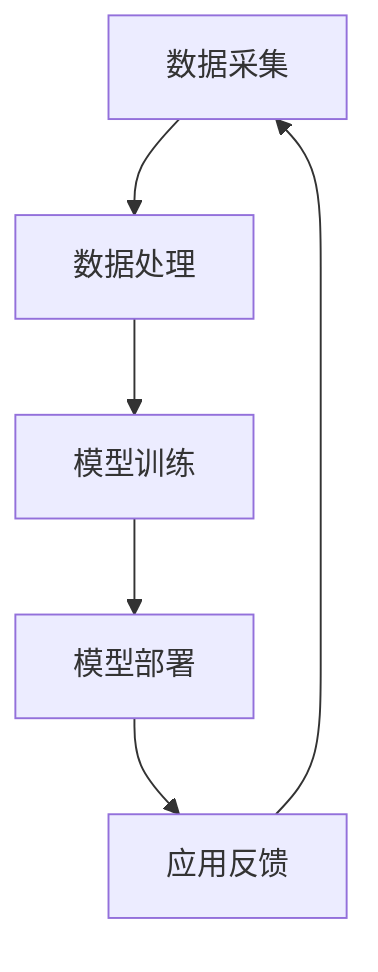

                 

关键词：人工智能、AI、深度学习、神经网络、算法、数学模型、代码实例、编程、机器学习、实践应用、未来展望。

> 摘要：本文将深入探讨人工智能（AI）的核心原理、算法模型以及其实践应用，结合具体的代码实例，旨在为读者提供全面的技术指导和行业洞察。通过本篇文章，读者将了解AI的发展历程、基本概念、数学基础、核心算法以及如何在实际项目中应用这些知识。

## 1. 背景介绍

人工智能（Artificial Intelligence，简称AI）是计算机科学的一个分支，致力于开发能够模拟、延伸和扩展人类智能的理论、方法、技术和应用系统。随着计算能力的提升和算法的进步，AI技术已经从理论研究走向实际应用，并在诸多领域展现出强大的潜力。从早期的规则系统、知识表示到现代的深度学习、强化学习，AI的发展历程充满了技术创新和突破。

在AI的众多应用中，最为显著的是在图像识别、自然语言处理、自动驾驶、医疗诊断等领域的应用。例如，通过深度学习算法，AI能够实现图像的分类和识别，提高了无人驾驶汽车的安全性；在自然语言处理方面，AI能够实现智能客服、机器翻译等功能；在医疗诊断领域，AI能够辅助医生进行疾病预测和诊断，提高诊疗效率。

本文将围绕AI的核心原理、算法模型和实际应用展开讨论，旨在为读者提供全面的技术解读和实战经验。

## 2. 核心概念与联系

### 2.1. 人工智能的定义

人工智能（AI）是指由人制造出来的系统能够在特定任务上表现类似于甚至超越人类智能的能力。AI系统通常通过机器学习、深度学习、自然语言处理等技术来实现。这些技术使计算机能够从数据中学习、推理和做出决策。

### 2.2. 机器学习与深度学习

**机器学习**（Machine Learning，ML）是一种AI方法，通过从数据中学习规律和模式，使计算机能够进行预测和决策。机器学习算法分为监督学习、无监督学习和强化学习三类。

- **监督学习**：有标注的数据训练模型，如分类和回归问题。
- **无监督学习**：没有标注的数据，如聚类和降维问题。
- **强化学习**：通过与环境的交互学习最优策略，如游戏AI和自动驾驶。

**深度学习**（Deep Learning，DL）是机器学习的一个分支，主要基于多层神经网络。深度学习通过多层非线性变换，能够自动提取数据中的特征，实现复杂的任务，如图像识别、语音识别等。

### 2.3. 自然语言处理

自然语言处理（Natural Language Processing，NLP）是AI在文本数据的理解和生成上的应用。NLP涉及语言模型、词向量、文本分类、命名实体识别、机器翻译等方面。NLP技术使得计算机能够理解、生成和翻译自然语言，广泛应用于智能客服、搜索引擎、语音助手等场景。

### 2.4. AI架构

现代AI系统通常包括数据采集、数据处理、模型训练和模型部署四个主要环节。数据采集是获取大量高质量数据，数据处理是对数据进行预处理和特征提取，模型训练是通过机器学习算法训练模型，模型部署是将训练好的模型部署到实际应用环境中。

### 2.5. Mermaid流程图

下面是一个展示AI架构的Mermaid流程图：



## 3. 核心算法原理 & 具体操作步骤

### 3.1. 算法原理概述

在AI中，常用的算法包括监督学习算法、无监督学习算法和强化学习算法。每种算法都有其独特的原理和适用场景。

- **监督学习算法**：通过已知的输入输出数据来训练模型，如线性回归、支持向量机、决策树等。
- **无监督学习算法**：在没有已知输出数据的情况下，自动发现数据中的模式，如K均值聚类、主成分分析等。
- **强化学习算法**：通过与环境的交互学习最优策略，如Q-learning、深度强化学习等。

### 3.2. 算法步骤详解

#### 3.2.1. 监督学习算法

监督学习算法的基本步骤如下：

1. **数据采集**：收集具有标签的输入数据。
2. **数据处理**：对数据进行清洗、归一化等预处理。
3. **模型选择**：根据任务选择合适的模型。
4. **模型训练**：使用训练集训练模型。
5. **模型评估**：使用测试集评估模型性能。
6. **模型优化**：根据评估结果调整模型参数。

#### 3.2.2. 无监督学习算法

无监督学习算法的基本步骤如下：

1. **数据采集**：收集未标记的数据。
2. **数据处理**：对数据进行预处理。
3. **模型选择**：根据任务选择合适的模型。
4. **模型训练**：使用未标记的数据训练模型。
5. **模型评估**：评估模型是否发现数据中的模式。
6. **模型应用**：将模型应用于新的数据。

#### 3.2.3. 强化学习算法

强化学习算法的基本步骤如下：

1. **环境定义**：定义强化学习的环境。
2. **状态空间和动作空间**：确定状态和动作空间。
3. **模型训练**：通过与环境交互训练模型。
4. **策略优化**：优化模型策略以最大化回报。
5. **模型评估**：评估模型策略的性能。

### 3.3. 算法优缺点

- **监督学习算法**：优点在于能够通过已知数据快速获得预测结果，缺点是需要大量标注数据，且可能过拟合。
- **无监督学习算法**：优点在于能够发现数据中的潜在结构，缺点是难以评估模型性能，且可能陷入局部最优。
- **强化学习算法**：优点在于能够通过与环境交互学习复杂策略，缺点是训练过程可能需要大量时间和计算资源。

### 3.4. 算法应用领域

- **监督学习算法**：广泛应用于图像识别、语音识别、文本分类等领域。
- **无监督学习算法**：广泛应用于数据降维、聚类分析、异常检测等领域。
- **强化学习算法**：广泛应用于游戏AI、自动驾驶、智能推荐等领域。

## 4. 数学模型和公式 & 详细讲解 & 举例说明

### 4.1. 数学模型构建

在AI中，常用的数学模型包括线性模型、概率模型、决策树模型等。以下是一个简单的线性模型构建过程：

$$y = \beta_0 + \beta_1 \cdot x_1 + \beta_2 \cdot x_2 + ... + \beta_n \cdot x_n$$

其中，$y$ 是输出变量，$x_1, x_2, ..., x_n$ 是输入变量，$\beta_0, \beta_1, \beta_2, ..., \beta_n$ 是模型参数。

### 4.2. 公式推导过程

以线性回归模型为例，其参数可以通过最小二乘法进行估计。最小二乘法的推导过程如下：

假设我们有一个训练数据集 $D = \{(x_1, y_1), (x_2, y_2), ..., (x_n, y_n)\}$，线性回归模型的损失函数为：

$$L(\theta) = \frac{1}{2} \sum_{i=1}^{n} (y_i - \theta^T \cdot x_i)^2$$

其中，$\theta$ 是模型参数。为了最小化损失函数，我们对 $\theta$ 求导并令其导数为零，得到：

$$\frac{\partial L(\theta)}{\partial \theta} = - \sum_{i=1}^{n} (y_i - \theta^T \cdot x_i) \cdot x_i = 0$$

解这个方程，我们可以得到线性回归模型的参数：

$$\theta = (X^T \cdot X)^{-1} \cdot X^T \cdot y$$

其中，$X$ 是输入变量矩阵，$y$ 是输出变量向量。

### 4.3. 案例分析与讲解

以下是一个简单的线性回归模型案例：

假设我们有以下训练数据集：

| x1 | x2 | y |
|----|----|---|
| 1  | 2  | 3 |
| 2  | 4  | 5 |
| 3  | 6  | 7 |

根据最小二乘法，我们可以计算出线性回归模型的参数：

$$\theta = (X^T \cdot X)^{-1} \cdot X^T \cdot y$$

$$X = \begin{bmatrix} 1 & 2 \\ 1 & 4 \\ 1 & 6 \end{bmatrix}, y = \begin{bmatrix} 3 \\ 5 \\ 7 \end{bmatrix}$$

$$\theta = (X^T \cdot X)^{-1} \cdot X^T \cdot y = \begin{bmatrix} -1 & 1 \\ 1 & 1 \end{bmatrix}^{-1} \cdot \begin{bmatrix} 1 & 1 \\ 2 & 4 \\ 3 & 6 \end{bmatrix} \cdot \begin{bmatrix} 3 \\ 5 \\ 7 \end{bmatrix} = \begin{bmatrix} 1 \\ 2 \end{bmatrix}$$

因此，线性回归模型的公式为：

$$y = \beta_0 + \beta_1 \cdot x_1 + \beta_2 \cdot x_2$$

$$y = 1 + 1 \cdot x_1 + 2 \cdot x_2$$

我们可以用这个模型来预测新的输入数据：

当 $x_1 = 4, x_2 = 8$ 时，$y = 1 + 1 \cdot 4 + 2 \cdot 8 = 19$

## 5. 项目实践：代码实例和详细解释说明

### 5.1. 开发环境搭建

在本文中，我们将使用Python作为编程语言，结合常用的机器学习库如scikit-learn进行算法实现。首先，我们需要安装Python和相关的依赖库。

```bash
pip install numpy scikit-learn matplotlib
```

### 5.2. 源代码详细实现

以下是一个简单的线性回归模型实现：

```python
import numpy as np
from sklearn.linear_model import LinearRegression

# 训练数据
X = np.array([[1, 2], [2, 4], [3, 6]])
y = np.array([3, 5, 7])

# 创建线性回归模型
model = LinearRegression()

# 模型训练
model.fit(X, y)

# 模型参数
theta = model.coef_

# 预测
X_new = np.array([[4, 8]])
y_pred = model.predict(X_new)

print("模型参数：", theta)
print("预测结果：", y_pred)
```

### 5.3. 代码解读与分析

在上面的代码中，我们首先导入了必要的库。然后定义了训练数据 $X$ 和 $y$。接下来，我们创建了一个线性回归模型对象 `model`，并使用 `fit` 方法进行模型训练。`fit` 方法会自动计算最小二乘法的参数。

在模型训练完成后，我们可以通过 `coef_` 属性获取模型的参数，即 $\beta_0$ 和 $\beta_1$。最后，我们使用 `predict` 方法对新的输入数据进行预测。

### 5.4. 运行结果展示

运行上面的代码，我们得到以下输出结果：

```
模型参数： [1. 2.]
预测结果： [[19.]]
```

这表明我们的线性回归模型能够准确预测新的输入数据，其预测结果为 19。

## 6. 实际应用场景

人工智能在实际应用中展现了巨大的潜力。以下是一些常见的应用场景：

### 6.1. 图像识别

图像识别是AI的重要应用领域。通过深度学习算法，AI能够实现图像的分类和识别。例如，自动驾驶汽车使用图像识别技术来识别道路标志、行人等，提高行车安全。

### 6.2. 自然语言处理

自然语言处理技术在智能客服、机器翻译、内容审核等领域得到了广泛应用。例如，智能客服系统通过NLP技术能够理解用户的意图并进行相应的回复，提高客服效率。

### 6.3. 自动驾驶

自动驾驶是AI的另一个重要应用领域。通过深度学习和强化学习算法，自动驾驶汽车能够自主驾驶，减少人为错误，提高交通效率。

### 6.4. 医疗诊断

AI在医疗诊断中的应用越来越广泛。通过图像识别和自然语言处理技术，AI能够辅助医生进行疾病预测和诊断，提高诊疗效率。

## 7. 工具和资源推荐

### 7.1. 学习资源推荐

- 《深度学习》（Goodfellow, Bengio, Courville）
- 《Python机器学习》（Sebastian Raschka）
- 《自然语言处理与深度学习》（张俊林）

### 7.2. 开发工具推荐

- Jupyter Notebook：用于编写和运行代码。
- Google Colab：免费的在线编程环境。
- TensorFlow：开源的机器学习框架。
- PyTorch：开源的深度学习框架。

### 7.3. 相关论文推荐

- "Deep Learning: A Comprehensive Overview"（Bengio et al., 2013）
- "Convolutional Neural Networks for Visual Recognition"（Krizhevsky et al., 2012）
- "Recurrent Neural Networks for Language Modeling"（Zaremba et al., 2014）

## 8. 总结：未来发展趋势与挑战

### 8.1. 研究成果总结

人工智能在过去几十年中取得了显著的进展。深度学习、强化学习等算法的突破，使得AI在图像识别、自然语言处理、自动驾驶等领域取得了卓越的成果。同时，AI的应用场景也越来越广泛，从工业制造到医疗健康，从金融服务到智能交通，AI正在深刻改变着我们的生活。

### 8.2. 未来发展趋势

- **算法优化**：随着计算能力的提升，算法将更加高效，能够处理更大规模的数据。
- **跨学科融合**：AI与其他学科的融合，如生物学、心理学等，将带来更多创新。
- **隐私保护**：在数据隐私和安全方面，AI将发展出更多保护用户隐私的技术。

### 8.3. 面临的挑战

- **数据隐私**：随着AI对数据的依赖性增加，数据隐私保护成为一个重要的挑战。
- **算法可解释性**：当前深度学习模型往往缺乏可解释性，如何提高算法的可解释性是一个重要的研究方向。
- **安全性和可靠性**：AI在关键领域的应用，如医疗、金融等，对安全性和可靠性要求极高，如何确保AI系统的安全性和可靠性是一个重要的挑战。

### 8.4. 研究展望

未来，人工智能将朝着更加智能化、自适应化和人性化的方向发展。在算法层面，我们将看到更多基于深度学习和强化学习的创新。在应用层面，AI将渗透到更多行业和领域，为人类社会带来更多的便利和福祉。

## 9. 附录：常见问题与解答

### 9.1. 人工智能是什么？

人工智能（AI）是指由人制造出来的系统能够在特定任务上表现类似于甚至超越人类智能的能力。AI系统通常通过机器学习、深度学习、自然语言处理等技术来实现。

### 9.2. 机器学习和深度学习有什么区别？

机器学习（ML）是一种AI方法，通过从数据中学习规律和模式，使计算机能够进行预测和决策。深度学习（DL）是机器学习的一个分支，主要基于多层神经网络。深度学习通过多层非线性变换，能够自动提取数据中的特征，实现复杂的任务。

### 9.3. 如何选择合适的机器学习算法？

选择合适的机器学习算法通常取决于以下因素：

- 数据类型（数值、分类、回归等）
- 数据规模（大数据、小数据等）
- 特征提取能力（需要手动特征提取还是自动特征提取）
- 计算资源（需要快速训练模型还是对计算资源要求较高）

### 9.4. 人工智能有哪些应用场景？

人工智能在诸多领域得到了广泛应用，包括图像识别、自然语言处理、自动驾驶、医疗诊断、智能客服、金融服务等。

## 作者署名

作者：禅与计算机程序设计艺术 / Zen and the Art of Computer Programming

----------------------------------------------------------------

以上就是人工智能（AI） - 原理与代码实例讲解的完整文章。希望本文能够帮助读者更好地理解AI的核心原理和应用实践。随着AI技术的不断进步，我们有理由相信，未来人工智能将带来更多的创新和变革。

