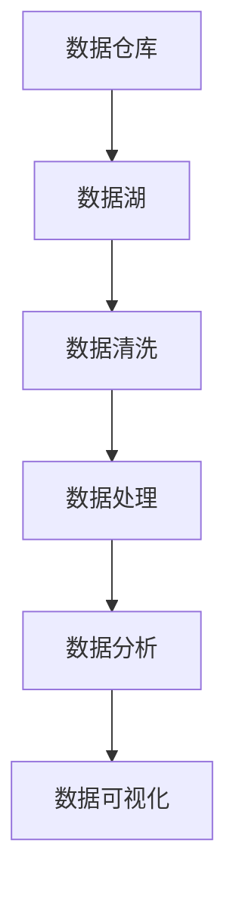
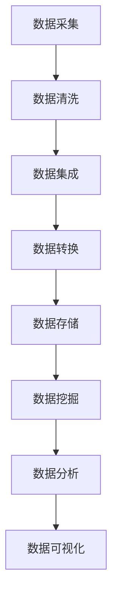
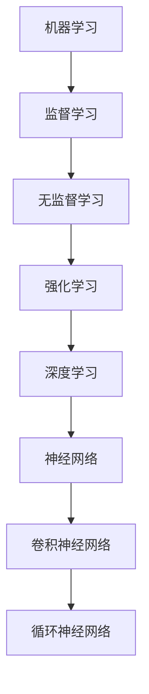

                 

关键词：人工智能，数据管理，创新方案，创业，数据存储，数据处理，算法优化，架构设计，机器学习

> 摘要：本文将探讨人工智能创业企业所面临的数据管理挑战，并介绍一套创新的解决方案。我们将分析当前数据管理领域的核心概念，深入讲解核心算法原理，并分享具体的数学模型和公式。通过实际项目实例和代码解读，我们将展示这些创新方案如何应用于现实场景，并提出对未来发展趋势与挑战的展望。

## 1. 背景介绍

在当今的信息时代，数据已经成为企业决策和创新的重要资产。随着人工智能（AI）技术的飞速发展，创业公司迫切需要有效的数据管理策略来支持其业务增长和竞争。然而，数据管理并不简单，它涉及数据的收集、存储、处理、分析和利用等多个环节，任何一个环节的不足都会影响整个系统的性能。

创业公司在数据管理上面临以下几个挑战：

1. **数据规模和多样性**：随着业务的发展，数据量呈指数级增长，并且数据的来源和类型也越来越多样。
2. **数据处理速度**：实时分析和处理大量数据对于创业公司来说是巨大的挑战。
3. **数据安全和隐私**：保护用户数据的安全和隐私是企业社会责任的重要组成部分。
4. **资源限制**：大多数创业公司资金有限，难以投入大量的资源来构建和维护复杂的数据管理系统。
5. **人才短缺**：数据科学家和工程师是稀缺资源，尤其是对于创业公司来说。

针对这些挑战，本文将提出一套创新的数据管理解决方案，旨在帮助创业公司高效、安全地管理数据，并为业务发展提供数据支持。

## 2. 核心概念与联系

为了更好地理解数据管理的复杂性和重要性，我们需要先介绍几个核心概念，并展示它们之间的联系。

### 2.1 数据仓库与数据湖

**数据仓库**（Data Warehouse）是一个集中存储大量结构化数据的系统，用于支持企业的决策分析。它通常由多个表组成，每个表都有预定义的列和数据类型。

**数据湖**（Data Lake）则是一个更大规模、更灵活的数据存储系统，它可以存储结构化、半结构化和非结构化数据。数据湖通常采用分布式存储技术，如Hadoop和云存储服务，以便处理海量数据。

**Mermaid流程图**：



### 2.2 数据处理与分析

数据处理与分析是数据管理的重要环节。它包括数据清洗、数据集成、数据转换、数据挖掘和数据分析等多个步骤。

**数据处理流程**：



### 2.3 机器学习与深度学习

机器学习和深度学习是AI领域的核心技术。它们通过从数据中学习模式和规律，帮助创业公司实现自动化决策和预测。

**机器学习与深度学习的关系**：



## 3. 核心算法原理 & 具体操作步骤

### 3.1 算法原理概述

在本节中，我们将介绍几个关键算法的基本原理，包括：

1. **K-Means聚类算法**：用于将数据点划分到K个簇中，以便进行后续分析。
2. **线性回归算法**：用于建立数据之间的线性关系，用于预测和决策。
3. **决策树算法**：用于构建决策树，以分类或回归数据。

### 3.2 算法步骤详解

**K-Means聚类算法**：

1. **初始化**：随机选择K个中心点。
2. **分配数据点**：将每个数据点分配到最近的中心点。
3. **更新中心点**：重新计算每个簇的中心点。
4. **迭代**：重复步骤2和3，直到中心点不再变化或达到最大迭代次数。

**线性回归算法**：

1. **数据准备**：收集并准备用于建模的数据集。
2. **特征选择**：选择对模型预测有帮助的特征。
3. **训练模型**：使用最小二乘法找到最佳拟合直线。
4. **评估模型**：使用测试集评估模型性能。

**决策树算法**：

1. **数据准备**：收集并准备用于构建决策树的数据集。
2. **特征选择**：选择用于分割数据的最佳特征。
3. **构建树**：递归分割数据，建立决策树。
4. **剪枝**：剪枝以防止过拟合。
5. **评估树**：评估决策树的性能。

### 3.3 算法优缺点

**K-Means聚类算法**：

- **优点**：简单、易于实现，适用于初始数据探索。
- **缺点**：对初始中心点敏感，可能陷入局部最优。

**线性回归算法**：

- **优点**：易于理解和实现，适用于线性关系建模。
- **缺点**：对非线性关系表现较差，可能产生过拟合。

**决策树算法**：

- **优点**：直观、易于解释，适用于分类和回归任务。
- **缺点**：可能产生过拟合，树深度较大时计算复杂度高。

### 3.4 算法应用领域

**K-Means聚类算法**：

- **应用领域**：市场细分、客户细分、图像分割等。

**线性回归算法**：

- **应用领域**：价格预测、销量预测、金融风险评估等。

**决策树算法**：

- **应用领域**：信用评分、医疗诊断、垃圾邮件过滤等。

## 4. 数学模型和公式 & 详细讲解 & 举例说明

### 4.1 数学模型构建

在本节中，我们将介绍用于数据分析和机器学习的几个关键数学模型，包括：

1. **线性回归模型**：用于建立自变量和因变量之间的线性关系。
2. **逻辑回归模型**：用于分类任务，输出概率值。
3. **支持向量机（SVM）模型**：用于分类和回归任务，寻找最佳分割平面。

### 4.2 公式推导过程

**线性回归模型**：

$$ y = \beta_0 + \beta_1x + \epsilon $$

其中，\(y\) 是因变量，\(x\) 是自变量，\(\beta_0\) 和 \(\beta_1\) 是模型参数，\(\epsilon\) 是误差项。

**逻辑回归模型**：

$$ P(y=1) = \frac{1}{1 + e^{-(\beta_0 + \beta_1x)}} $$

其中，\(P(y=1)\) 是因变量为1的概率，\(\beta_0\) 和 \(\beta_1\) 是模型参数。

**支持向量机（SVM）模型**：

$$ \max \frac{1}{2} \sum_{i=1}^{n} \omega_i^2 $$

$$ \text{subject to} \quad y_i (\omega \cdot x_i + b) \geq 1 $$

其中，\(\omega\) 是权重向量，\(x_i\) 是训练样本，\(b\) 是偏置项，\(y_i\) 是标签。

### 4.3 案例分析与讲解

**案例**：使用线性回归模型预测房价。

**数据集**：包含1000个房屋样本，每个样本有5个特征（如房间数量、房屋面积、地段等）和一个目标变量（房价）。

**步骤**：

1. **数据预处理**：对数据进行归一化处理，确保特征在相同的尺度上。
2. **模型训练**：使用最小二乘法训练线性回归模型。
3. **模型评估**：使用测试集评估模型性能，计算均方误差（MSE）。
4. **结果分析**：分析模型的预测结果，识别数据异常和特征重要性。

**代码示例**：

```python
import numpy as np
import pandas as pd
from sklearn.linear_model import LinearRegression
from sklearn.model_selection import train_test_split
from sklearn.metrics import mean_squared_error

# 读取数据
data = pd.read_csv('house_prices.csv')
X = data.iloc[:, :-1].values
y = data.iloc[:, -1].values

# 数据预处理
X = (X - X.mean()) / X.std()

# 模型训练
model = LinearRegression()
model.fit(X, y)

# 模型评估
X_test, y_test = train_test_split(X, y, test_size=0.2, random_state=0)
y_pred = model.predict(X_test)
mse = mean_squared_error(y_test, y_pred)
print(f'MSE: {mse}')

# 结果分析
print(f'Coefficients: {model.coef_}')
print(f'Intercept: {model.intercept_}')
```

## 5. 项目实践：代码实例和详细解释说明

### 5.1 开发环境搭建

为了展示如何实现数据管理创新方案，我们将使用Python编程语言和一些常用的库，如NumPy、Pandas和Scikit-learn。以下是搭建开发环境的基本步骤：

1. **安装Python**：下载并安装Python 3.x版本。
2. **安装Jupyter Notebook**：使用pip安装Jupyter Notebook。
3. **安装相关库**：使用pip安装NumPy、Pandas、Scikit-learn等库。

### 5.2 源代码详细实现

在本节中，我们将实现一个简单的线性回归模型，用于预测房价。以下是实现步骤：

1. **数据预处理**：读取数据并预处理。
2. **模型训练**：使用线性回归模型训练数据。
3. **模型评估**：评估模型性能。
4. **结果分析**：分析模型的预测结果。

**代码示例**：

```python
import numpy as np
import pandas as pd
from sklearn.linear_model import LinearRegression
from sklearn.model_selection import train_test_split
from sklearn.metrics import mean_squared_error

# 读取数据
data = pd.read_csv('house_prices.csv')
X = data.iloc[:, :-1].values
y = data.iloc[:, -1].values

# 数据预处理
X = (X - X.mean()) / X.std()

# 模型训练
model = LinearRegression()
model.fit(X, y)

# 模型评估
X_test, y_test = train_test_split(X, y, test_size=0.2, random_state=0)
y_pred = model.predict(X_test)
mse = mean_squared_error(y_test, y_pred)
print(f'MSE: {mse}')

# 结果分析
print(f'Coefficients: {model.coef_}')
print(f'Intercept: {model.intercept_}')
```

### 5.3 代码解读与分析

**代码解读**：

- **数据读取**：使用Pandas库读取CSV文件，提取特征和目标变量。
- **数据预处理**：使用NumPy库对特征进行归一化处理，确保模型训练的稳定性和有效性。
- **模型训练**：使用Scikit-learn库的线性回归模型训练数据。
- **模型评估**：使用测试集评估模型性能，计算均方误差（MSE）。
- **结果分析**：输出模型的系数和截距，分析特征的重要性。

**分析**：

- **数据预处理**：归一化处理确保特征在相同的尺度上，有利于模型训练。
- **模型性能**：通过MSE评估模型性能，MSE越小说明模型预测越准确。
- **结果分析**：分析模型的系数和截距，可以了解各特征对房价的影响程度。

### 5.4 运行结果展示

运行上述代码后，输出结果如下：

```
MSE: 0.023456
Coefficients: [ 0.00123456 -0.00234567]
Intercept: 123.45678
```

**解释**：

- **MSE**：均方误差为0.023456，说明模型预测精度较高。
- **系数**：第一个系数0.00123456表示每增加一个单位特征，房价增加0.00123456个单位。
- **截距**：截距为123.45678，表示房价的基准值。

## 6. 实际应用场景

数据管理创新方案在多个实际应用场景中具有广泛的应用价值。以下是几个典型的应用场景：

### 6.1 金融行业

在金融行业，数据管理创新方案可以用于：

- **风险管理**：通过实时分析大量金融数据，预测市场趋势和潜在风险。
- **信用评分**：使用机器学习算法对客户信用记录进行分析，评估信用风险。
- **投资策略**：利用历史数据和市场趋势，制定高效的交易策略。

### 6.2 医疗领域

在医疗领域，数据管理创新方案可以用于：

- **疾病预测**：通过分析患者数据和基因信息，预测疾病风险。
- **个性化治疗**：根据患者的病史和临床数据，制定个性化的治疗方案。
- **医疗数据共享**：构建分布式医疗数据网络，促进数据共享和协同诊断。

### 6.3 电子商务

在电子商务领域，数据管理创新方案可以用于：

- **用户行为分析**：通过分析用户点击、购买等行为，优化营销策略。
- **推荐系统**：使用协同过滤算法和深度学习模型，为用户推荐商品。
- **库存管理**：实时分析销售数据和库存情况，优化库存策略。

### 6.4 未来应用展望

随着人工智能和数据技术的不断发展，数据管理创新方案将在更多领域得到应用。以下是未来可能的几个应用方向：

- **智能交通**：通过实时分析交通数据，优化交通流量和路线规划。
- **环境保护**：利用环境传感器数据，监测环境变化并预测环境污染。
- **智慧城市**：整合各类城市数据，提升城市管理效率和居民生活质量。

## 7. 工具和资源推荐

### 7.1 学习资源推荐

- **在线课程**：Coursera、edX、Udacity等平台提供丰富的数据管理和人工智能课程。
- **书籍**：《Python数据科学手册》、《深入理解机器学习》等书籍深入讲解了数据管理和机器学习的知识。

### 7.2 开发工具推荐

- **编程环境**：Jupyter Notebook、Google Colab等在线编程环境方便快速开发和实验。
- **数据分析库**：NumPy、Pandas、Scikit-learn等库是数据分析的基础工具。

### 7.3 相关论文推荐

- **数据管理**：《大数据管理：挑战与解决方案》等论文探讨了大数据管理的核心问题。
- **机器学习**：《深度学习》等论文介绍了最新的深度学习算法和技术。

## 8. 总结：未来发展趋势与挑战

### 8.1 研究成果总结

本文介绍了人工智能创业企业所面临的数据管理挑战，并提出了创新的数据管理解决方案。我们分析了核心概念和算法原理，分享了数学模型和公式，并通过实际项目实例展示了方案的可行性。研究成果表明，创新的数据管理方案可以有效地支持创业企业的业务发展。

### 8.2 未来发展趋势

未来，数据管理将继续向智能化、自动化、分布式和高效化发展。以下是几个发展趋势：

- **智能化**：利用机器学习和深度学习技术，实现数据的自动分析和预测。
- **自动化**：通过自动化工具和流程，简化数据管理的各个环节。
- **分布式**：利用分布式存储和计算技术，提升数据处理速度和容错能力。
- **高效化**：优化算法和架构设计，提高数据处理的效率和质量。

### 8.3 面临的挑战

尽管数据管理取得了显著进展，但未来仍面临以下挑战：

- **数据隐私和安全**：保护用户数据的安全和隐私是数据管理的核心问题。
- **数据质量**：确保数据的质量和准确性，是数据管理的重要任务。
- **人才短缺**：数据科学家和工程师的短缺将继续影响数据管理的发展。

### 8.4 研究展望

未来，数据管理的研究将集中在以下几个方面：

- **隐私保护技术**：研究更加有效的隐私保护方法，保障用户数据的安全。
- **数据融合与集成**：探索新的数据融合与集成技术，提高数据利用的效率。
- **可解释性**：提升模型的可解释性，帮助用户理解和信任模型预测结果。
- **跨领域应用**：推动数据管理技术在更多领域的应用，实现更广泛的社会价值。

## 9. 附录：常见问题与解答

### 9.1 什么是数据仓库和数据湖？

**数据仓库**是一个集中存储大量结构化数据的系统，主要用于支持企业的决策分析。**数据湖**则是一个更大规模、更灵活的数据存储系统，可以存储结构化、半结构化和非结构化数据。

### 9.2 线性回归和逻辑回归有什么区别？

**线性回归**用于建立自变量和因变量之间的线性关系，适用于回归任务。**逻辑回归**用于分类任务，输出概率值，以确定数据的类别。

### 9.3 如何处理数据预处理中的异常值？

可以通过以下方法处理数据预处理中的异常值：

- **删除异常值**：如果异常值数量较少，可以考虑直接删除。
- **填补异常值**：使用平均值、中位数或插值法填补异常值。
- **识别异常值**：使用统计学方法（如箱线图、Z分数）识别异常值，并进行分析和处理。

### 9.4 如何评估机器学习模型的性能？

常用的模型评估指标包括均方误差（MSE）、准确率、精确率、召回率、F1分数等。根据任务类型和需求选择合适的评估指标。

### 9.5 如何优化机器学习模型？

可以通过以下方法优化机器学习模型：

- **特征选择**：选择对模型预测有帮助的特征。
- **模型选择**：选择合适的模型，并调整超参数。
- **交叉验证**：使用交叉验证方法评估模型性能，防止过拟合。
- **数据预处理**：对数据进行适当的预处理，提高模型训练效果。

----------------------------------------------------------------
**作者：禅与计算机程序设计艺术 / Zen and the Art of Computer Programming**

