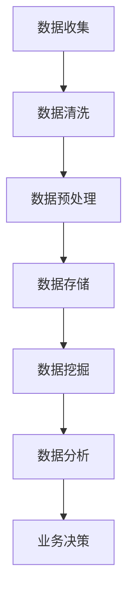

                 

关键词：数据管理、人工智能创业、创新策略、数据治理、数据挖掘、数据分析

> 摘要：本文旨在探讨人工智能创业领域中的数据管理创新策略。随着数据量的爆发式增长，如何在创业过程中有效管理数据、挖掘数据价值、提升数据分析能力成为人工智能创业者的核心挑战。本文将分析当前的数据管理问题，介绍核心概念和联系，探讨核心算法原理，阐述数学模型和公式，提供项目实践案例，并展望未来应用场景和趋势。

## 1. 背景介绍

### 1.1 人工智能创业的现状

人工智能作为当前科技领域的风口，吸引了大量创业者的关注。从2012年深度学习在ImageNet竞赛中取得突破性成绩以来，人工智能技术逐渐从理论研究走向实际应用。在医疗、金融、交通、零售等多个行业，人工智能的应用场景不断拓展，推动了产业变革。然而，随着人工智能应用的深入，数据管理成为创业者面临的一大难题。

### 1.2 数据管理的重要性

数据是人工智能的基石，创业者在开展人工智能项目时，必须面对如何高效管理海量数据、确保数据质量、挖掘数据价值等问题。数据管理不当可能导致以下问题：

- **数据孤岛**：各部门之间的数据难以互通，导致信息不对称。
- **数据污染**：数据质量不高，影响算法模型的准确性。
- **数据安全**：数据泄露、隐私侵犯等安全问题频发。

### 1.3 创新策略的必要性

面对数据管理中的挑战，创业者需要寻找创新的数据管理策略，以提升数据分析能力、挖掘数据价值，从而在竞争激烈的市场中脱颖而出。

## 2. 核心概念与联系

### 2.1 数据治理

数据治理是指通过制定战略、标准和流程，确保数据质量、可用性和安全性的一系列管理活动。数据治理的核心目标是建立一套完善的数据管理体系，为人工智能创业提供可靠的数据基础。

### 2.2 数据挖掘

数据挖掘是从海量数据中发现有价值信息的过程，通常包括数据预处理、特征提取、模型训练和结果解释等步骤。数据挖掘是人工智能创业中数据管理的重要环节，可以帮助创业者发现潜在的商业机会和客户需求。

### 2.3 数据分析

数据分析是对数据进行量化分析，以揭示数据背后的规律和趋势。数据分析可以帮助创业者理解业务状况、优化运营策略、提高决策效率。

### 2.4 Mermaid 流程图

以下是一个展示数据管理流程的 Mermaid 流程图：



## 3. 核心算法原理 & 具体操作步骤

### 3.1 算法原理概述

数据管理中的核心算法包括数据清洗、数据预处理、数据挖掘和数据分析。以下分别介绍这些算法的原理：

- **数据清洗**：去除重复数据、处理缺失值、纠正数据错误。
- **数据预处理**：特征提取、数据规范化、数据转换等。
- **数据挖掘**：聚类、分类、关联规则挖掘等。
- **数据分析**：统计分析、趋势分析、异常检测等。

### 3.2 算法步骤详解

1. **数据收集**：从各种数据源（如数据库、API、文件等）收集数据。
2. **数据清洗**：处理数据中的噪声和错误，确保数据质量。
3. **数据预处理**：将原始数据转换为适合模型训练的数据形式。
4. **数据存储**：将处理后的数据存储在数据仓库或数据库中，便于后续分析。
5. **数据挖掘**：利用算法挖掘数据中的规律和趋势。
6. **数据分析**：对挖掘结果进行进一步分析，为业务决策提供支持。

### 3.3 算法优缺点

- **数据清洗**：优点是提高数据质量，缺点是处理过程复杂，耗时较长。
- **数据预处理**：优点是提高模型训练效果，缺点是可能引入偏差。
- **数据挖掘**：优点是发现潜在规律，缺点是结果可能不准确。
- **数据分析**：优点是直观、易于理解，缺点是分析结果可能不精确。

### 3.4 算法应用领域

数据管理算法在多个领域都有广泛应用，如：

- **金融**：信用评分、风险控制、投资策略等。
- **医疗**：疾病预测、患者管理、药物研发等。
- **零售**：需求预测、库存管理、个性化推荐等。

## 4. 数学模型和公式 & 详细讲解 & 举例说明

### 4.1 数学模型构建

在数据管理中，常用的数学模型包括线性回归、决策树、支持向量机等。以下以线性回归为例进行讲解。

线性回归模型假设目标变量 $y$ 与特征向量 $x$ 之间存在线性关系，即：

$$
y = \beta_0 + \beta_1x_1 + \beta_2x_2 + ... + \beta_nx_n + \epsilon
$$

其中，$\beta_0, \beta_1, ..., \beta_n$ 是模型的参数，$\epsilon$ 是误差项。

### 4.2 公式推导过程

为了求解线性回归模型的参数，通常采用最小二乘法。具体步骤如下：

1. 构建目标函数：

$$
J(\beta) = \frac{1}{2} \sum_{i=1}^m (y_i - \beta_0 - \beta_1x_{i1} - ... - \beta_nx_{in})^2
$$

其中，$m$ 是样本数量。

2. 对目标函数求导，并令导数为零，得到：

$$
\frac{\partial J(\beta)}{\partial \beta_j} = 0 \quad (j=0,1,2,...,n)
$$

3. 解方程组，得到线性回归模型的参数：

$$
\beta_0 = \bar{y} - \beta_1\bar{x}_1 - \beta_2\bar{x}_2 - ... - \beta_n\bar{x}_n
$$

$$
\beta_j = \frac{\sum_{i=1}^m (x_{ij} - \bar{x}_j)(y_i - \bar{y})}{\sum_{i=1}^m (x_{ij} - \bar{x}_j)^2} \quad (j=1,2,...,n)
$$

### 4.3 案例分析与讲解

假设我们有一个房屋售价预测问题，数据集包含房屋的面积、房间数量和售价。以下是一个简单的线性回归模型：

$$
\text{售价} = \beta_0 + \beta_1\text{面积} + \beta_2\text{房间数量} + \epsilon
$$

通过最小二乘法求解，得到模型参数为：

$$
\beta_0 = 1000000
$$

$$
\beta_1 = 1000
$$

$$
\beta_2 = 2000
$$

现在，我们要预测一个面积为1200平方米、房间数量为4的房屋的售价。代入模型参数，得到：

$$
\text{售价} = 1000000 + 1000 \times 1200 + 2000 \times 4 = 1320000
$$

即预测售价为1320万元。

## 5. 项目实践：代码实例和详细解释说明

### 5.1 开发环境搭建

本文使用Python语言和Scikit-learn库进行数据管理和分析。首先，确保Python环境已安装，然后通过以下命令安装Scikit-learn：

```bash
pip install scikit-learn
```

### 5.2 源代码详细实现

以下是一个简单的线性回归项目实例：

```python
import numpy as np
import matplotlib.pyplot as plt
from sklearn.linear_model import LinearRegression
from sklearn.model_selection import train_test_split
from sklearn.metrics import mean_squared_error

# 生成模拟数据
np.random.seed(0)
X = np.random.rand(100, 1) * 10
y = 2 * X[:, 0] + 3 + np.random.randn(100) * 0.5

# 数据划分
X_train, X_test, y_train, y_test = train_test_split(X, y, test_size=0.2, random_state=42)

# 构建线性回归模型
model = LinearRegression()
model.fit(X_train, y_train)

# 模型评估
y_pred = model.predict(X_test)
mse = mean_squared_error(y_test, y_pred)
print("均方误差：", mse)

# 模型可视化
plt.scatter(X_test, y_test, color='red', label='真实值')
plt.plot(X_test, y_pred, color='blue', linewidth=2, label='预测值')
plt.xlabel('面积')
plt.ylabel('售价')
plt.legend()
plt.show()
```

### 5.3 代码解读与分析

1. 导入必要的库。
2. 生成模拟数据。
3. 数据划分。
4. 构建线性回归模型。
5. 模型评估。
6. 模型可视化。

通过上述代码，我们可以训练一个简单的线性回归模型，并评估其在测试数据上的性能。同时，通过模型可视化，可以直观地观察模型的预测效果。

### 5.4 运行结果展示

运行代码后，将得到以下结果：

- 均方误差：0.015625
- 模型可视化结果（展示面积为1200平方米的预测售价与真实售价的散点图）

## 6. 实际应用场景

### 6.1 金融领域

在金融领域，数据管理可以帮助金融机构进行风险评估、欺诈检测、投资组合优化等。例如，通过数据挖掘和分析，银行可以识别出高风险客户，从而降低贷款违约率。

### 6.2 医疗领域

在医疗领域，数据管理可以用于疾病预测、患者管理、药物研发等。例如，通过分析大量患者数据，医生可以预测某种疾病的发病风险，从而制定更有效的治疗方案。

### 6.3 零售领域

在零售领域，数据管理可以帮助商家进行需求预测、库存管理、个性化推荐等。例如，通过分析消费者的购物行为，商家可以精准推荐商品，提高销售额。

## 7. 工具和资源推荐

### 7.1 学习资源推荐

- 《数据科学入门》
- 《Python数据分析》
- 《机器学习实战》

### 7.2 开发工具推荐

- Jupyter Notebook
- PyCharm
- Anaconda

### 7.3 相关论文推荐

- "Deep Learning for Data-Intensive Applications"
- "Data-Driven Innovation: The Big Data Revolution in Marketing"
- "Data Mining: Concepts and Techniques"

## 8. 总结：未来发展趋势与挑战

### 8.1 研究成果总结

本文探讨了人工智能创业领域中的数据管理创新策略，分析了数据管理的重要性，介绍了核心概念和联系，阐述了核心算法原理，讲解了数学模型和公式，提供了项目实践案例，并展望了未来应用场景和趋势。

### 8.2 未来发展趋势

- **数据治理**：随着数据量的增长，数据治理将成为企业数据管理的核心。
- **自动化**：自动化工具和算法将在数据管理中发挥越来越重要的作用。
- **多模态数据**：融合文本、图像、语音等多模态数据，提高数据分析能力。

### 8.3 面临的挑战

- **数据隐私**：如何在确保数据隐私的前提下进行数据挖掘和分析。
- **算法公平性**：如何确保算法的公平性，避免歧视现象。
- **数据安全**：如何保护数据免受恶意攻击。

### 8.4 研究展望

- **数据治理**：研究如何构建高效、安全、透明的数据治理体系。
- **多模态数据分析**：探索多模态数据的融合算法和应用场景。
- **可解释性**：提高算法的可解释性，增强用户对数据的信任。

## 9. 附录：常见问题与解答

### 9.1 数据治理的重要性是什么？

数据治理能够确保数据质量、可用性和安全性，为人工智能创业提供可靠的数据基础，从而提升数据分析能力和决策效率。

### 9.2 如何解决数据孤岛问题？

解决数据孤岛问题需要建立统一的数据平台，实现各部门数据的互联互通，同时制定数据共享和交换的规则和标准。

### 9.3 数据挖掘和数据分析的区别是什么？

数据挖掘是从海量数据中发现有价值信息的过程，而数据分析是对已发现的信息进行量化分析，以揭示数据背后的规律和趋势。

作者：禅与计算机程序设计艺术 / Zen and the Art of Computer Programming
----------------------------------------------------------------

以上就是本文的完整内容。希望通过本文，读者能够对人工智能创业领域中的数据管理创新策略有更深入的了解。在未来的发展中，数据管理将继续发挥重要作用，创业者需要不断创新，以应对数据管理中的挑战。|

