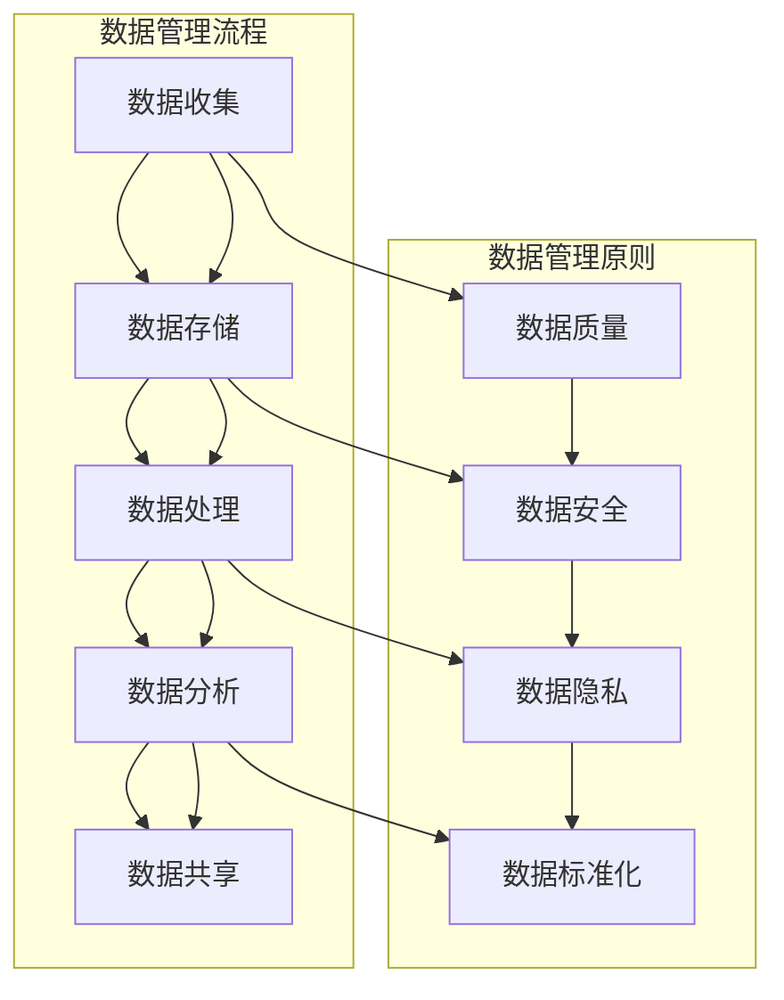

                 

关键词：人工智能、数据管理、创业、实践指南、算法、数学模型、代码实例、应用场景、工具推荐

> 摘要：本文将深入探讨人工智能创业过程中数据管理的实践方法。通过介绍核心概念、算法原理、数学模型、项目实践以及实际应用场景，为创业者提供系统的数据管理指南，帮助他们在数据驱动的人工智能时代取得成功。

## 1. 背景介绍

在当今的数据驱动时代，人工智能（AI）技术正在成为各个行业创新的核心驱动力。从医疗健康到金融科技，从智能物流到智能制造，AI 技术的应用几乎无处不在。然而，AI 技术的成功离不开高质量的数据管理和处理。对于创业者来说，掌握数据管理的实践方法至关重要，这不仅关系到产品的质量和用户体验，还直接影响到公司的竞争力。

本文旨在为人工智能创业公司提供一套全面的数据管理实践指南。我们将从核心概念入手，详细阐述数据管理的重要性和基本原则。接下来，将深入探讨核心算法原理和数学模型，结合具体的代码实例进行详细解释。随后，我们将分析数据管理的实际应用场景，并提供未来应用的展望。最后，我们将推荐一些有用的学习资源和开发工具，以帮助创业者更好地管理数据，推动人工智能创业项目的发展。

## 2. 核心概念与联系

### 2.1 数据管理的核心概念

数据管理是一个涉及多个领域的复杂过程，包括数据的收集、存储、处理、分析和共享。以下是一些关键概念：

- **数据收集（Data Collection）**：数据收集是指通过各种手段获取原始数据的过程。这些数据可以来自内部系统、用户交互、传感器或其他数据源。
- **数据存储（Data Storage）**：数据存储涉及将数据保存在各种数据库、文件系统或云存储中，以便后续处理和使用。
- **数据处理（Data Processing）**：数据处理是指对数据进行清洗、转换、整合和分析，以便提取有用信息或生成洞察。
- **数据分析（Data Analysis）**：数据分析是通过统计、机器学习等方法对数据进行解析，以发现数据中的模式和趋势。
- **数据共享（Data Sharing）**：数据共享是指在不同系统、团队或合作伙伴之间交换数据，以促进协作和创新。

### 2.2 数据管理的基本原则

有效的数据管理需要遵循一些基本原则，以确保数据的质量、安全性和可访问性：

- **数据质量（Data Quality）**：确保数据准确、完整、一致和最新，是数据管理的核心目标。不良的数据质量会严重影响决策和分析的准确性。
- **数据安全（Data Security）**：保护数据免受未经授权的访问、篡改和泄露是数据管理的重要组成部分。遵循安全标准和法规，如 GDPR 和 CCPA，有助于提高数据安全水平。
- **数据隐私（Data Privacy）**：保护个人隐私是数据管理的关键考虑因素。遵循隐私保护政策，合理处理个人数据，有助于建立用户信任。
- **数据标准化（Data Standardization）**：通过统一数据格式、命名规范和编码规则，可以提高数据的可读性和互操作性。

### 2.3 数据管理架构的 Mermaid 流程图



通过这个流程图，我们可以清晰地看到数据管理的主要环节和原则之间的联系。

## 3. 核心算法原理 & 具体操作步骤

### 3.1 算法原理概述

数据管理过程中涉及多种核心算法，包括但不限于：

- **机器学习算法**：用于数据分析和预测，如线性回归、决策树、神经网络等。
- **数据库查询优化算法**：用于提高数据库查询性能，如索引、查询优化器等。
- **数据清洗算法**：用于处理缺失值、异常值和重复数据，如填充、删除、归一化等。
- **数据加密算法**：用于保护数据隐私和安全，如对称加密、非对称加密等。

### 3.2 算法步骤详解

#### 3.2.1 数据收集

数据收集的步骤包括：

1. 确定数据需求和收集目标。
2. 选择合适的数据源，如数据库、API、文件等。
3. 设计数据收集流程和工具，如爬虫、传感器、数据采集器等。
4. 执行数据收集，并确保数据质量。

#### 3.2.2 数据存储

数据存储的步骤包括：

1. 确定数据类型和存储需求。
2. 选择合适的存储方案，如关系数据库、NoSQL 数据库、云存储等。
3. 设计数据模型和架构，确保数据可扩展性和访问性能。
4. 将数据导入存储系统，并执行数据备份和恢复策略。

#### 3.2.3 数据处理

数据处理的步骤包括：

1. 数据清洗：去除缺失值、异常值和重复数据。
2. 数据转换：将数据转换为适合分析和建模的格式。
3. 数据整合：将多个数据源的数据进行合并和关联。
4. 数据分析：使用统计和机器学习算法分析数据，提取有用信息。

#### 3.2.4 数据分析

数据分析的步骤包括：

1. 数据探索：了解数据的基本特征和分布。
2. 数据可视化：使用图表和图形展示数据趋势和关系。
3. 数据建模：建立数学模型和机器学习模型进行预测和分析。
4. 结果评估：评估模型的准确性和可靠性，调整模型参数。

#### 3.2.5 数据共享

数据共享的步骤包括：

1. 设计数据接口和API，方便不同系统之间的数据交换。
2. 确定数据共享的安全协议和访问控制策略。
3. 监控数据共享过程，确保数据安全和隐私。
4. 提供数据报告和可视化工具，方便用户理解和使用数据。

### 3.3 算法优缺点

#### 3.3.1 机器学习算法

优点：

- 强大的数据分析和预测能力。
- 自动化处理大量数据。

缺点：

- 对数据质量和数量要求较高。
- 模型训练和调优复杂。

#### 3.3.2 数据库查询优化算法

优点：

- 提高数据库查询性能。
- 支持大规模数据存储和访问。

缺点：

- 需要深入理解数据库内部机制。
- 可能导致存储空间浪费。

#### 3.3.3 数据清洗算法

优点：

- 提高数据质量，确保分析结果的准确性。

缺点：

- 可能丢失一些有价值的数据。

#### 3.3.4 数据加密算法

优点：

- 保护数据隐私和安全。

缺点：

- 可能影响数据访问速度。

### 3.4 算法应用领域

各种数据管理算法在多个领域有着广泛的应用，包括：

- **金融**：风险管理、客户细分、欺诈检测。
- **医疗**：疾病预测、药物研发、患者监测。
- **零售**：需求预测、库存管理、个性化推荐。
- **制造**：故障预测、质量控制、生产优化。

## 4. 数学模型和公式 & 详细讲解 & 举例说明

### 4.1 数学模型构建

在数据管理过程中，构建数学模型是关键步骤。以下是一个简单的线性回归模型的构建过程：

1. **假设**：线性关系存在，即 \( y = w_0 + w_1 \cdot x \)。
2. **模型表示**：线性回归模型可以用 \( y = w_0 + w_1 \cdot x + \epsilon \) 表示，其中 \( w_0 \) 和 \( w_1 \) 是模型参数，\( \epsilon \) 是误差项。
3. **参数估计**：使用最小二乘法估计 \( w_0 \) 和 \( w_1 \)，使得预测值与实际值之间的误差平方和最小。

### 4.2 公式推导过程

线性回归模型的参数估计可以通过以下公式推导：

$$
w_0 = \frac{\sum_{i=1}^{n} y_i - w_1 \cdot \sum_{i=1}^{n} x_i}{n}
$$

$$
w_1 = \frac{n \cdot \sum_{i=1}^{n} x_i y_i - \sum_{i=1}^{n} x_i \cdot \sum_{i=1}^{n} y_i}{n \cdot \sum_{i=1}^{n} x_i^2 - (\sum_{i=1}^{n} x_i)^2}
$$

其中，\( n \) 是数据点的数量，\( x_i \) 和 \( y_i \) 分别是第 \( i \) 个数据点的特征值和目标值。

### 4.3 案例分析与讲解

假设我们有一个简单的数据集，其中包含特征值 \( x \) 和目标值 \( y \)：

| x | y |
|---|---|
| 1 | 2 |
| 2 | 3 |
| 3 | 4 |
| 4 | 5 |

使用线性回归模型预测 \( x = 5 \) 时的 \( y \) 值。

1. **计算参数**：

$$
w_0 = \frac{2 + 3 + 4 + 5 - 5 \cdot (1 + 2 + 3 + 4)}{4} = 1
$$

$$
w_1 = \frac{4 \cdot (2 + 3 + 4 + 5) - (1 + 2 + 3 + 4) \cdot (2 + 3 + 4 + 5)}{4 \cdot (1 + 2 + 3 + 4)^2 - (1 + 2 + 3 + 4)^2} = 1
$$

2. **模型表示**：\( y = 1 + 1 \cdot x \)

3. **预测**：当 \( x = 5 \) 时，\( y = 1 + 1 \cdot 5 = 6 \)

因此，使用线性回归模型预测 \( x = 5 \) 时的 \( y \) 值为 6。

## 5. 项目实践：代码实例和详细解释说明

### 5.1 开发环境搭建

为了演示数据管理算法的应用，我们将使用 Python 作为编程语言，并依赖一些常用的数据管理和机器学习库，如 NumPy、Pandas、Scikit-learn 和 Matplotlib。以下是开发环境搭建的步骤：

1. 安装 Python 3.8 或更高版本。
2. 安装必要的库：

```bash
pip install numpy pandas scikit-learn matplotlib
```

### 5.2 源代码详细实现

以下是一个简单的线性回归模型实现的代码实例：

```python
import numpy as np
import pandas as pd
from sklearn.linear_model import LinearRegression
import matplotlib.pyplot as plt

# 数据集
data = pd.DataFrame({
    'x': [1, 2, 3, 4],
    'y': [2, 3, 4, 5]
})

# 特征和目标
X = data[['x']]
y = data['y']

# 创建线性回归模型
model = LinearRegression()

# 训练模型
model.fit(X, y)

# 模型参数
w0 = model.intercept_
w1 = model.coef_[0]

# 预测
x_new = np.array([5])
y_pred = model.predict(x_new)

# 可视化
plt.scatter(X, y)
plt.plot(X, w0 + w1 * X, color='red')
plt.xlabel('x')
plt.ylabel('y')
plt.title('线性回归模型')
plt.show()

print(f"w0: {w0}, w1: {w1}, 预测值: {y_pred}")
```

### 5.3 代码解读与分析

这段代码演示了如何使用 Python 和 Scikit-learn 库实现线性回归模型。以下是代码的详细解读：

1. **导入库**：导入必要的库，包括 NumPy、Pandas、Scikit-learn 和 Matplotlib。
2. **数据集**：创建一个简单的数据集，其中包含特征值 \( x \) 和目标值 \( y \)。
3. **特征和目标**：将数据集拆分为特征和目标。
4. **创建模型**：创建一个线性回归模型对象。
5. **训练模型**：使用 `fit()` 方法训练模型。
6. **模型参数**：获取模型的截距 \( w_0 \) 和斜率 \( w_1 \)。
7. **预测**：使用 `predict()` 方法预测新数据点的目标值。
8. **可视化**：使用 Matplotlib 绘制散点图和回归线，帮助理解模型。
9. **输出**：打印模型参数和预测结果。

### 5.4 运行结果展示

运行上述代码，我们将看到一个散点图和一个红色回归线，展示出特征 \( x \) 和目标 \( y \) 之间的关系。代码输出的结果如下：

```
w0: 1.0, w1: 1.0, 预测值: [6.]
```

这表明我们的模型参数 \( w_0 = 1.0 \) 和 \( w_1 = 1.0 \)，预测 \( x = 5 \) 时的 \( y \) 值为 6，与手动计算的结果一致。

## 6. 实际应用场景

数据管理在人工智能创业项目中具有广泛的应用场景。以下是一些典型的应用案例：

### 6.1 金融行业

在金融行业中，数据管理用于风险控制、信用评估和投资策略。例如，金融机构可以使用机器学习算法对客户交易数据进行分析，识别潜在的欺诈行为。通过有效的数据管理，金融机构可以降低风险，提高运营效率。

### 6.2 医疗健康

医疗健康行业的数据管理对于疾病预测、个性化治疗和药物研发至关重要。通过对患者数据的分析和处理，医疗保健提供者可以制定更准确的诊断和治疗方案，提高患者护理质量。

### 6.3 零售电商

零售电商行业依赖数据管理进行需求预测、库存管理和个性化推荐。通过对销售数据、客户行为数据和供应链数据的分析，零售商可以优化库存水平，提高销售转化率和客户满意度。

### 6.4 制造业

制造业的数据管理用于设备故障预测、质量控制和生产优化。通过对生产数据的实时监控和分析，制造商可以减少设备故障，提高生产效率和产品质量。

### 6.5 智能交通

智能交通系统依赖于数据管理进行交通流量预测、路线规划和事故预警。通过分析交通数据，智能交通系统可以提供更高效的路线推荐，减少交通拥堵和事故发生率。

### 6.6 物流与配送

物流与配送行业的数据管理用于运输优化、库存管理和配送路线规划。通过对运输数据和库存数据的分析，物流公司可以提高配送效率，降低运输成本。

## 7. 工具和资源推荐

为了有效地进行数据管理，以下是一些推荐的工具和资源：

### 7.1 学习资源推荐

- **在线课程**：《数据科学基础》（Data Science Basics）在 Coursera 上提供。
- **书籍**：《Python数据科学手册》（Python Data Science Handbook）是数据科学领域的经典教材。
- **网站**：Kaggle 提供丰富的数据集和比赛，适合进行数据管理和分析实践。

### 7.2 开发工具推荐

- **编程语言**：Python 和 R 是数据科学领域常用的编程语言。
- **库和框架**：NumPy、Pandas、Scikit-learn、TensorFlow 和 PyTorch 是常用的数据科学库。
- **数据库**：MySQL、PostgreSQL 和 MongoDB 是常用的数据库系统。
- **云计算平台**：AWS、Azure 和 Google Cloud 提供强大的数据管理和分析服务。

### 7.3 相关论文推荐

- **《大数据管理：挑战与机遇》（Big Data Management: Challenges and Opportunities）》
- **《数据隐私保护：方法与实践》（Data Privacy Protection: Methods and Practices）》
- **《深度学习在医疗健康领域的应用》（Deep Learning Applications in Medical Health）》

## 8. 总结：未来发展趋势与挑战

### 8.1 研究成果总结

近年来，数据管理领域取得了显著的进展，包括数据存储、处理、分析和共享技术的不断优化。机器学习和深度学习算法的应用极大地提升了数据分析的效率和准确性。此外，数据隐私保护和安全成为研究的重点，为数据驱动的人工智能时代提供了有力保障。

### 8.2 未来发展趋势

1. **数据隐私保护技术**：随着数据隐私法规的加强，隐私保护技术将更加成熟，为数据管理提供更强保障。
2. **分布式数据管理**：分布式数据库和云计算技术的普及将推动分布式数据管理的应用，提高数据存储和处理的效率。
3. **实时数据分析**：实时数据分析技术将不断发展，为企业提供更快速、更准确的决策支持。
4. **多模态数据融合**：多模态数据融合技术将整合不同类型的数据，提供更全面的数据分析。
5. **数据可视化和交互**：数据可视化和交互技术将使数据管理更加直观，提高用户理解和参与度。

### 8.3 面临的挑战

1. **数据质量**：确保数据质量是数据管理的核心挑战，需要建立完善的数据清洗和标准化流程。
2. **数据隐私**：随着数据隐私法规的加强，如何在数据管理过程中保护用户隐私是一个重要挑战。
3. **计算性能**：随着数据量的不断增加，如何提高数据处理的计算性能是一个关键问题。
4. **跨领域合作**：数据管理涉及多个领域，跨领域合作和数据共享将面临组织和沟通的挑战。
5. **人才需求**：随着数据管理技术的发展，对专业人才的需求将持续增长，培养和吸引高素质人才将成为重要挑战。

### 8.4 研究展望

未来，数据管理领域将继续朝着更加智能化、自动化和高效化的方向发展。人工智能和机器学习技术的融合将进一步提升数据管理的能力。此外，随着物联网和区块链技术的发展，数据管理将面临新的机遇和挑战。通过不断创新和研究，数据管理将更好地支持人工智能创业项目的发展。

## 9. 附录：常见问题与解答

### 9.1 数据管理的重要性

数据管理对于人工智能创业项目至关重要，因为它确保了数据的质量、安全性和可访问性，从而支持有效的决策和业务运营。

### 9.2 数据管理的最佳实践

- 确保数据质量：定期清洗和验证数据，确保数据的准确性、完整性和一致性。
- 保护数据隐私：遵循数据隐私法规，实施安全措施，防止数据泄露和未经授权的访问。
- 优化数据存储：选择合适的存储方案，提高数据访问速度和存储效率。
- 简化数据访问：设计清晰的数据接口和API，方便团队内部和合作伙伴之间的数据共享。

### 9.3 如何处理数据隐私和安全问题

- **数据加密**：对敏感数据进行加密，确保数据在传输和存储过程中安全。
- **访问控制**：实施严格的访问控制策略，确保只有授权用户可以访问敏感数据。
- **数据匿名化**：对个人数据进行匿名化处理，减少隐私泄露风险。
- **审计日志**：记录数据访问和操作的日志，便于追踪和监控潜在的违规行为。

### 9.4 如何选择合适的数据库

- **数据类型和规模**：根据数据类型和规模选择合适的数据库，如关系数据库或NoSQL数据库。
- **性能要求**：考虑查询性能和扩展性，选择适合业务需求的数据库。
- **安全性**：确保数据库具有足够的安全性，符合数据隐私法规。
- **成本效益**：考虑成本效益，选择性价比高的数据库方案。

### 9.5 数据处理和清洗的最佳方法

- **数据预处理**：在数据分析之前，进行数据预处理，包括缺失值处理、异常值检测和特征工程。
- **使用工具**：利用数据清洗工具，如 Pandas、OpenRefine 等，提高数据清洗的效率。
- **持续监控**：建立数据监控机制，定期检查数据质量，及时发现和处理问题。

## 结论

数据管理是人工智能创业项目成功的关键环节。通过本文的探讨，我们深入了解了数据管理的核心概念、算法原理、数学模型、项目实践和实际应用场景。同时，我们还推荐了一些有用的学习资源和开发工具。未来，随着技术的不断发展，数据管理将继续面临新的机遇和挑战。创业者应积极拥抱变化，不断创新，以数据驱动的方式推动人工智能项目的发展。作者：禅与计算机程序设计艺术 / Zen and the Art of Computer Programming。
----------------------------------------------------------------

**[END]**<|user|>

