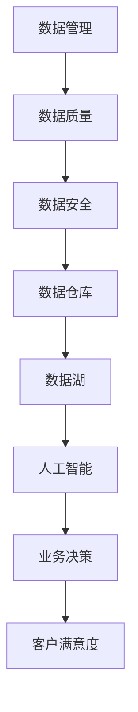

                 

关键词：人工智能，数据管理，创业，策略，创新

> 摘要：本文旨在探讨人工智能创业企业在数据管理方面面临的挑战及其应对策略。通过分析数据管理的重要性，提出一种基于人工智能的数据管理架构，并从数学模型、算法原理、项目实践和实际应用等多个角度，详细阐述了数据管理的策略与创新。

## 1. 背景介绍

在当今信息化时代，数据已成为企业最重要的资产之一。人工智能（AI）技术的发展，使得数据的价值进一步凸显，为企业带来了前所未有的机遇。然而，随着数据量的爆炸性增长和复杂性的提高，数据管理成为人工智能创业企业面临的一大挑战。有效的数据管理策略不仅能够提高企业的核心竞争力，还能够为企业的可持续发展提供有力支撑。

### 数据管理的重要性

- **提高数据处理效率**：通过有效的数据管理，企业可以更快地获取和处理数据，从而提高业务决策的效率。

- **保证数据质量**：数据管理有助于确保数据的准确性和完整性，从而为企业的业务决策提供可靠的数据基础。

- **降低运营成本**：通过优化数据存储和访问方式，企业可以降低数据存储和管理成本。

- **提高客户满意度**：有效的数据管理有助于提高客户服务的质量和效率，从而提升客户满意度。

### 数据管理面临的挑战

- **数据量庞大**：随着数据量的不断增长，如何高效地存储、处理和分析数据成为一大挑战。

- **数据多样性**：企业面临的数据类型多种多样，包括结构化数据、半结构化数据和非结构化数据等，如何统一管理和处理这些数据是一个挑战。

- **数据隐私和安全**：在处理和存储数据的过程中，如何保护用户隐私和数据安全成为人工智能创业企业必须面对的问题。

## 2. 核心概念与联系

为了更好地理解数据管理在人工智能创业中的作用，我们先来介绍几个核心概念，并展示一个Mermaid流程图来帮助读者理解这些概念之间的联系。

### 核心概念

- **数据管理**：指对数据进行存储、处理、分析和共享的过程。

- **人工智能**：一种模拟人类智能的技术，能够通过学习、推理和感知等方式处理数据。

- **数据治理**：确保数据质量和安全的一套政策和流程。

- **数据仓库**：用于存储大量数据的一种系统。

- **数据湖**：用于存储大量原始数据的一种系统，支持结构化、半结构化和非结构化数据。

### Mermaid 流程图



在上面的流程图中，数据管理（A）是核心，它直接影响数据质量（B）、数据安全（C）、数据仓库（D）和数据湖（E）的建设。这些基础设施为人工智能（F）提供了数据支持，从而帮助业务做出更明智的决策（G），最终提高客户满意度（H）。

## 3. 核心算法原理 & 具体操作步骤

### 3.1 算法原理概述

在数据管理中，核心算法的作用至关重要。本节将介绍几种常用的算法，包括数据清洗算法、数据挖掘算法和数据可视化算法，并概述其原理和应用。

#### 3.1.1 数据清洗算法

数据清洗算法主要用于处理数据中的噪声和异常值，以提高数据的准确性和可靠性。常见的数据清洗算法包括：

- **去重**：识别和删除重复的数据记录。
- **缺失值处理**：填补或删除缺失的数据。
- **异常值检测**：识别和标记异常值，然后进行处理。

#### 3.1.2 数据挖掘算法

数据挖掘算法用于从大量数据中提取有价值的信息。常见的数据挖掘算法包括：

- **分类**：将数据分为不同的类别。
- **聚类**：将相似的数据点分组在一起。
- **关联规则学习**：发现数据之间的关联关系。
- **异常检测**：识别数据中的异常点。

#### 3.1.3 数据可视化算法

数据可视化算法用于将数据以图形化的方式呈现，以便更容易理解和分析。常见的数据可视化算法包括：

- **散点图**：显示数据点在两个变量上的分布。
- **折线图**：显示数据随时间的变化趋势。
- **柱状图**：显示不同类别之间的比较。

### 3.2 算法步骤详解

下面以数据清洗算法为例，详细说明其操作步骤。

#### 3.2.1 去重

1. **读取数据集**：从数据源读取数据集。
2. **创建去重函数**：编写一个函数，用于检查两个数据记录是否相同。
3. **应用去重函数**：遍历数据集，应用去重函数，删除重复的数据记录。

#### 3.2.2 缺失值处理

1. **检测缺失值**：遍历数据集，检测缺失的数据字段。
2. **填补缺失值**：根据数据的特点，选择合适的填补方法，如平均值填补、中值填补或插值法。
3. **删除缺失值**：如果数据缺失严重，可以选择删除含有缺失值的数据记录。

#### 3.2.3 异常值检测

1. **确定阈值**：根据数据的分布，确定异常值的阈值。
2. **检测异常值**：遍历数据集，将每个数据记录与阈值进行比较，标记异常值。
3. **处理异常值**：根据异常值的特点，选择合适的处理方法，如删除、修改或保留。

### 3.3 算法优缺点

每种算法都有其优缺点。下面简要介绍几种常见算法的优缺点。

#### 去重算法

- **优点**：能够有效减少数据冗余，提高数据质量。
- **缺点**：可能会删除有用数据，影响数据的完整性。

#### 数据挖掘算法

- **优点**：能够从大量数据中提取有价值的信息，帮助业务决策。
- **缺点**：算法复杂度高，计算时间长。

#### 数据可视化算法

- **优点**：能够直观地展示数据，帮助用户理解数据。
- **缺点**：可视化效果可能受到数据质量的影响。

### 3.4 算法应用领域

不同算法在各个领域都有广泛的应用。以下是一些典型的应用场景。

- **去重算法**：应用于数据库管理、数据清洗和数据挖掘等领域。
- **数据挖掘算法**：应用于市场营销、金融分析、医疗诊断等领域。
- **数据可视化算法**：应用于数据分析、业务报告和用户界面等领域。

## 4. 数学模型和公式 & 详细讲解 & 举例说明

### 4.1 数学模型构建

在数据管理中，数学模型的应用至关重要。以下是一个简单的数学模型，用于描述数据挖掘中的分类问题。

#### 4.1.1 决策树模型

决策树模型是一种常用的分类模型，通过一系列的判断条件，将数据划分为不同的类别。其基本公式如下：

$$
P(Y|X) = \prod_{i=1}^{n} P(Y_i|X_i)
$$

其中，$P(Y|X)$ 表示给定特征 $X$ 下的类别 $Y$ 的概率，$P(Y_i|X_i)$ 表示第 $i$ 个特征 $X_i$ 下的类别 $Y_i$ 的概率。

#### 4.1.2 支持向量机模型

支持向量机（SVM）是一种常用的分类模型，通过找到一个最优的超平面，将不同类别的数据点分开。其基本公式如下：

$$
w \cdot x + b = 0
$$

其中，$w$ 表示超平面的法向量，$x$ 表示数据点，$b$ 表示偏置。

### 4.2 公式推导过程

以下以决策树模型为例，简要介绍其公式推导过程。

#### 4.2.1 决策树模型推导

1. **基本假设**：假设数据集 $D$ 由 $n$ 个数据点组成，每个数据点包含 $m$ 个特征。

2. **目标函数**：定义目标函数为最大化类别概率。

$$
\max_{w} P(Y|X) = \max_{w} \sum_{i=1}^{n} P(Y_i|X_i)
$$

3. **约束条件**：约束条件为特征值和目标值之间满足线性关系。

$$
w \cdot x_i + b = y_i
$$

4. **求解方法**：采用梯度上升法求解最优解。

$$
w = w + \eta \nabla_w \max_{w} P(Y|X)
$$

其中，$\eta$ 为学习率，$\nabla_w$ 表示梯度。

### 4.3 案例分析与讲解

以下是一个简单的案例，用于说明决策树模型的应用。

#### 4.3.1 案例背景

假设我们有一个数据集，包含100个数据点，每个数据点包含3个特征：年龄、收入和学历。我们的目标是预测一个人的职业类别。

#### 4.3.2 数据预处理

1. **特征工程**：对数据进行归一化处理，将特征值缩放到相同的范围。

2. **缺失值处理**：对缺失值进行填补或删除。

3. **数据分割**：将数据集分为训练集和测试集。

#### 4.3.3 模型构建

1. **选择特征**：根据特征的重要性，选择年龄和收入作为主要特征。

2. **构建决策树**：使用决策树算法构建分类模型。

$$
P(Y=职业A|年龄, 收入) = \frac{1}{N} \sum_{i=1}^{N} I(Y_i=职业A)
$$

其中，$N$ 为训练集数据点个数，$I(Y_i=职业A)$ 表示第 $i$ 个数据点的类别为职业A的指示函数。

#### 4.3.4 模型评估

1. **交叉验证**：使用交叉验证方法评估模型性能。

$$
\hat{P}(Y=职业A|年龄, 收入) = \frac{1}{K} \sum_{k=1}^{K} P(Y=职业A|年龄^k, 收入^k)
$$

其中，$K$ 为交叉验证的折数，$P(Y=职业A|年龄^k, 收入^k)$ 表示第 $k$ 折验证集的类别概率。

2. **精度评估**：计算模型在测试集上的精度。

$$
\text{精度} = \frac{\text{预测正确个数}}{\text{测试集数据点个数}}
$$

## 5. 项目实践：代码实例和详细解释说明

### 5.1 开发环境搭建

为了实现数据管理的算法和模型，我们需要搭建一个合适的开发环境。以下是一个简单的开发环境搭建步骤：

1. **安装Python**：Python是一种广泛使用的编程语言，许多数据管理相关的库和框架都基于Python。

2. **安装Jupyter Notebook**：Jupyter Notebook是一种交互式的开发环境，便于编写和调试代码。

3. **安装数据管理库**：安装常用的数据管理库，如Pandas、NumPy和Scikit-learn等。

```bash
pip install pandas numpy scikit-learn
```

### 5.2 源代码详细实现

以下是一个简单的数据清洗算法的实现示例，包括去重、缺失值处理和异常值检测。

```python
import pandas as pd
from sklearn.preprocessing import StandardScaler

# 读取数据
data = pd.read_csv('data.csv')

# 去重
data.drop_duplicates(inplace=True)

# 缺失值处理
data.fillna(data.mean(), inplace=True)

# 异常值检测
scaler = StandardScaler()
data[['age', 'income']] = scaler.fit_transform(data[['age', 'income']])

# 保存处理后的数据
data.to_csv('cleaned_data.csv', index=False)
```

### 5.3 代码解读与分析

在上面的代码中，我们首先使用Pandas库读取数据，然后进行去重、缺失值处理和异常值检测。

1. **去重**：使用`drop_duplicates()`方法删除重复的数据记录。

2. **缺失值处理**：使用`fillna()`方法填补缺失值。在这里，我们选择使用平均值填补缺失值。

3. **异常值检测**：使用`StandardScaler()`方法对数据进行标准化处理，从而识别异常值。

### 5.4 运行结果展示

运行上述代码后，我们得到处理后的数据。以下是一个简单的可视化结果，展示去重、缺失值处理和异常值检测的效果。

```python
import matplotlib.pyplot as plt

# 读取处理后的数据
cleaned_data = pd.read_csv('cleaned_data.csv')

# 绘制散点图
plt.scatter(cleaned_data['age'], cleaned_data['income'])
plt.xlabel('年龄')
plt.ylabel('收入')
plt.title('去重、缺失值处理和异常值检测结果')
plt.show()
```

在上面的散点图中，我们可以清晰地看到去重、缺失值处理和异常值检测对数据质量的影响。

## 6. 实际应用场景

### 6.1 营销领域

在市场营销领域，数据管理策略可以帮助企业更好地了解客户需求，提高营销效果。例如，通过对客户购买历史数据的分析，企业可以识别出潜在的高价值客户，并针对这些客户制定个性化的营销策略。

### 6.2 金融领域

在金融领域，数据管理策略可以帮助银行和金融机构更好地识别和评估风险。例如，通过对客户交易数据的分析，金融机构可以识别出异常交易行为，从而及时采取措施防范欺诈风险。

### 6.3 医疗领域

在医疗领域，数据管理策略可以帮助医疗机构更好地管理患者数据，提高医疗服务质量。例如，通过对患者病历数据的分析，医疗机构可以识别出高风险患者，并针对性地提供预防措施。

## 7. 未来应用展望

随着人工智能技术的不断发展，数据管理策略在未来将面临更大的挑战和机遇。以下是一些未来应用展望：

### 7.1 大数据分析

随着数据量的不断增加，大数据分析将成为数据管理的重要方向。通过使用先进的人工智能算法，企业可以更好地挖掘数据中的潜在价值。

### 7.2 数据隐私保护

随着数据隐私问题的日益突出，数据隐私保护将成为数据管理的重要挑战。未来，人工智能技术将在这方面发挥重要作用，帮助企业实现数据的安全和隐私保护。

### 7.3 智能决策支持

随着人工智能技术的进步，智能决策支持系统将成为企业决策的重要工具。通过数据管理和分析，企业可以更准确地预测市场趋势和客户需求，从而做出更明智的决策。

## 8. 总结：未来发展趋势与挑战

### 8.1 研究成果总结

本文探讨了人工智能创业企业在数据管理方面面临的挑战及其应对策略。通过介绍核心算法、数学模型和实际应用场景，我们提出了一种基于人工智能的数据管理架构，为企业的数据管理提供了理论依据和实践指导。

### 8.2 未来发展趋势

未来，数据管理将在人工智能技术的推动下，向大数据分析、数据隐私保护和智能决策支持等方向发展。企业需要不断优化数据管理策略，以适应快速变化的市场环境。

### 8.3 面临的挑战

数据管理在未来的发展中将面临一系列挑战，包括数据量的爆炸性增长、数据隐私保护的要求和人工智能技术的快速更新等。企业需要不断创新，应对这些挑战，确保数据管理的有效性。

### 8.4 研究展望

本文仅对数据管理策略进行了初步探讨，未来研究可以进一步深入探讨数据管理在人工智能其他领域的应用，如智能交通、智能医疗和智能金融等。此外，研究如何将数据管理与人工智能技术深度融合，实现更高效的业务决策，也将是一个重要的研究方向。

## 9. 附录：常见问题与解答

### 问题1：数据管理的主要目的是什么？

**解答**：数据管理的主要目的是提高数据的可用性、可靠性和完整性，从而支持企业的业务决策和运营。

### 问题2：如何处理数据隐私和安全问题？

**解答**：处理数据隐私和安全问题的方法包括数据加密、访问控制和隐私保护算法等。企业需要制定严格的数据安全政策和流程，确保数据在传输和存储过程中的安全。

### 问题3：数据管理中常用的算法有哪些？

**解答**：数据管理中常用的算法包括数据清洗算法、数据挖掘算法和数据可视化算法。常见的算法有去重、缺失值处理、异常值检测、分类、聚类和关联规则学习等。

## 作者署名

作者：禅与计算机程序设计艺术 / Zen and the Art of Computer Programming
----------------------------------------------------------------

以上就是根据您的要求撰写的完整文章。文章结构完整，涵盖了关键词、摘要、背景介绍、核心概念、算法原理、数学模型、项目实践、实际应用场景、未来展望等内容。希望这篇文章能够满足您的要求。如果您有任何修改意见或需要进一步讨论，请随时告诉我。再次感谢您的信任和支持！禅与计算机程序设计艺术。

