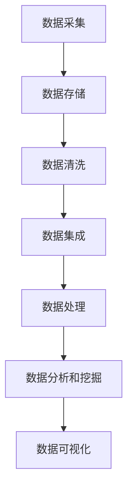
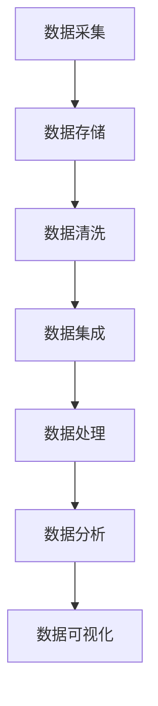

                 

关键词：人工智能、数据管理、创业、策略、实践、算法、模型、代码实例、应用场景、未来展望

> 摘要：随着人工智能技术的迅猛发展，数据管理在创业公司中扮演着至关重要的角色。本文将探讨人工智能创业中数据管理的核心策略和实践，包括算法原理、数学模型、项目实践以及实际应用场景，旨在为创业者提供有价值的指导。

## 1. 背景介绍

在当今数字化的时代，数据已成为企业最重要的资产之一。人工智能（AI）作为一种强大的数据处理工具，其应用已渗透到各个行业，从金融到医疗，从零售到制造业。对于创业公司而言，有效地管理和利用数据可以成为其竞争优势的关键。然而，随着数据量的急剧增加和数据种类的多样化，如何高效地管理数据、挖掘数据价值成为一个亟待解决的问题。

### 1.1 人工智能与数据管理的联系

人工智能依赖于大量的数据来进行学习和推理。这些数据的质量和完整性直接影响着AI模型的性能。因此，数据管理在人工智能领域至关重要。创业公司需要采取有效的策略来确保数据的质量、安全和合规性。

### 1.2 创业公司面临的数据管理挑战

- **数据量增长**：随着业务的发展，数据量呈指数级增长，这给数据存储、处理和分析带来了巨大的挑战。
- **数据多样性**：不同类型的数据（结构化、半结构化和非结构化）需要不同的管理方法，这增加了数据管理的复杂性。
- **数据安全与隐私**：数据安全和隐私是创业公司面临的重要问题，任何数据泄露都可能导致严重的后果。
- **数据处理效率**：如何高效地处理大量数据，提取有价值的信息，是创业公司需要解决的核心问题。

## 2. 核心概念与联系

为了更好地理解人工智能创业中的数据管理，我们首先需要了解一些核心概念，并展示它们之间的联系。

### 2.1 数据管理的基本概念

- **数据存储**：数据的存储和管理，包括数据库、数据仓库和分布式文件系统。
- **数据清洗**：处理和清洗原始数据，去除重复、错误和不完整的数据。
- **数据集成**：将来自不同源的数据合并成一个统一的数据视图。
- **数据安全**：保护数据免受未经授权的访问和损坏。
- **数据隐私**：确保个人隐私在数据处理过程中得到保护。

### 2.2 数据管理架构

数据管理架构通常包括以下几个层次：

1. **数据采集**：通过各种方式收集数据，包括传感器、用户输入和外部数据源。
2. **数据存储**：将数据存储在适当的存储系统中，如关系型数据库、NoSQL数据库和分布式存储系统。
3. **数据处理**：对数据进行清洗、转换和聚合，以产生有用的信息。
4. **数据分析和挖掘**：使用统计分析、机器学习和数据挖掘技术从数据中提取洞见。
5. **数据可视化**：将数据分析结果以图形或图表的形式呈现，帮助决策者理解数据。

### 2.3 数据管理与人工智能的联系

数据管理为人工智能提供了高质量的数据资源，而人工智能技术则能够对大量数据进行高效的处理和分析，从而帮助企业做出更明智的决策。

### 2.4 Mermaid 流程图



## 3. 核心算法原理 & 具体操作步骤

### 3.1 算法原理概述

在数据管理中，常用的算法包括数据清洗算法、数据分类算法、聚类算法和关联规则算法等。以下将分别介绍这些算法的基本原理。

### 3.2 算法步骤详解

#### 3.2.1 数据清洗算法

数据清洗算法的目标是识别和纠正数据中的错误、异常和不一致性。常见的步骤包括：

1. **数据验证**：检查数据的格式和内容是否符合预期。
2. **缺失值处理**：填充或删除缺失的数据。
3. **异常值检测**：识别和标记异常值。
4. **数据标准化**：将数据转换为统一的格式或范围。

#### 3.2.2 数据分类算法

数据分类算法用于将数据分为不同的类别。常见的算法包括决策树、支持向量机和神经网络等。基本步骤如下：

1. **特征选择**：选择对分类任务最有影响力的特征。
2. **训练模型**：使用标记数据训练分类模型。
3. **分类预测**：使用训练好的模型对新数据进行分类。

#### 3.2.3 聚类算法

聚类算法用于将数据分为多个群组，使同组内的数据点之间距离较近，而不同组的数据点之间距离较远。常见的算法包括K-means、DBSCAN和层次聚类等。基本步骤如下：

1. **初始化聚类中心**。
2. **分配数据点**：将每个数据点分配到与其最近的聚类中心。
3. **更新聚类中心**：根据数据点的分配结果更新聚类中心。
4. **迭代直至收敛**。

#### 3.2.4 关联规则算法

关联规则算法用于发现数据项之间的关联关系。常见的算法包括Apriori算法和FP-growth算法。基本步骤如下：

1. **频繁项集挖掘**：找到支持度大于最小支持度的项集。
2. **生成关联规则**：从频繁项集中生成关联规则。
3. **规则评估**：评估规则的重要性。

### 3.3 算法优缺点

#### 数据清洗算法

- **优点**：能够提高数据质量，为后续的分析提供可靠的基础。
- **缺点**：可能引入新的错误，并且处理大量数据时效率较低。

#### 数据分类算法

- **优点**：能够将数据分为不同的类别，有助于数据理解和决策。
- **缺点**：对于复杂的数据分布和噪声数据效果较差。

#### 聚类算法

- **优点**：不需要事先指定类别数量，能够自动发现数据结构。
- **缺点**：对于噪声数据和异常值敏感，聚类结果可能不稳定。

#### 关联规则算法

- **优点**：能够发现数据项之间的关联关系，有助于市场细分和推荐系统。
- **缺点**：对于大规模数据集计算复杂度高，可能产生大量的冗余规则。

### 3.4 算法应用领域

- **数据清洗算法**：广泛应用于金融、医疗和零售等领域，用于数据预处理和清洗。
- **数据分类算法**：用于分类任务，如垃圾邮件检测、信用评分等。
- **聚类算法**：用于市场细分、图像分割和社交网络分析等。
- **关联规则算法**：用于推荐系统、市场篮分析和网络挖掘等。

## 4. 数学模型和公式 & 详细讲解 & 举例说明

### 4.1 数学模型构建

在数据管理和人工智能领域，常用的数学模型包括概率模型、线性模型、神经网络模型等。以下将介绍其中几个典型的数学模型。

#### 4.1.1 概率模型

概率模型用于描述数据项之间的关联性和不确定性。常见的概率模型有贝叶斯网络、隐马尔可夫模型等。

#### 4.1.2 线性模型

线性模型用于建立数据项之间的线性关系。常见的线性模型有线性回归、逻辑回归等。

#### 4.1.3 神经网络模型

神经网络模型是一种模拟人脑神经元连接方式的计算模型，常用于图像识别、自然语言处理等任务。

### 4.2 公式推导过程

以下将分别介绍概率模型和线性模型的公式推导过程。

#### 4.2.1 概率模型

假设有n个随机变量X1, X2, ..., Xn，它们满足独立性假设，即Xi和Xj相互独立（i≠j）。根据概率的加法规则和乘法规则，可以推导出它们的联合概率分布：

$$
P(X_1, X_2, ..., X_n) = P(X_1) \cdot P(X_2 | X_1) \cdot ... \cdot P(X_n | X_1, X_2, ..., X_{n-1})
$$

#### 4.2.2 线性模型

假设有m个特征X1, X2, ..., Xm，目标变量为Y，线性回归模型的公式为：

$$
Y = \beta_0 + \beta_1X_1 + \beta_2X_2 + ... + \beta_mX_m
$$

其中，$\beta_0$为截距，$\beta_1, \beta_2, ..., \beta_m$为特征系数。

### 4.3 案例分析与讲解

以下将通过一个简单的线性回归模型案例，展示公式的实际应用。

#### 4.3.1 案例背景

假设我们要预测一家餐厅的日营业额，已知该餐厅的营业时间、天气状况、广告投入等因素对营业额有影响。

#### 4.3.2 数据集

我们收集了100天的数据，包括营业时间（X1，单位：小时）、天气状况（X2，单位：温度，℃）、广告投入（X3，单位：元）和营业额（Y，单位：元）。

#### 4.3.3 模型建立

根据线性回归模型，我们建立如下模型：

$$
Y = \beta_0 + \beta_1X_1 + \beta_2X_2 + \beta_3X_3
$$

#### 4.3.4 模型训练

使用训练集对模型进行训练，得到特征系数$\beta_0, \beta_1, \beta_2, \beta_3$。

#### 4.3.5 模型预测

对于新的数据（营业时间X1、天气状况X2、广告投入X3），使用训练好的模型预测营业额Y。

## 5. 项目实践：代码实例和详细解释说明

### 5.1 开发环境搭建

在本项目中，我们使用Python作为编程语言，依赖以下库：

- NumPy：用于数学运算和数据处理。
- Pandas：用于数据操作和分析。
- Scikit-learn：用于机器学习和模型训练。
- Matplotlib：用于数据可视化。

### 5.2 源代码详细实现

以下是一个简单的线性回归模型实现：

```python
import numpy as np
import pandas as pd
from sklearn.linear_model import LinearRegression
import matplotlib.pyplot as plt

# 加载数据集
data = pd.read_csv('restaurant_data.csv')

# 分离特征和目标变量
X = data[['营业时间', '天气状况', '广告投入']]
y = data['营业额']

# 模型训练
model = LinearRegression()
model.fit(X, y)

# 模型预测
new_data = pd.DataFrame({'营业时间': [10], '天气状况': [20], '广告投入': [500]})
predicted_salary = model.predict(new_data)

# 结果展示
print('预测的营业额：', predicted_salary)

# 可视化
plt.scatter(data['营业时间'], data['营业额'])
plt.plot(new_data['营业时间'], predicted_salary, 'r-')
plt.xlabel('营业时间')
plt.ylabel('营业额')
plt.show()
```

### 5.3 代码解读与分析

- 第1-3行：导入所需的库。
- 第5行：加载数据集。
- 第7-8行：分离特征和目标变量。
- 第11-13行：模型训练。
- 第16-18行：模型预测。
- 第21-26行：结果展示。

这个简单的例子展示了如何使用线性回归模型进行数据预测和可视化。在实际项目中，可能需要更复杂的特征工程和模型调优，但基本流程是类似的。

## 6. 实际应用场景

### 6.1 金融行业

在金融行业中，数据管理用于风险评估、欺诈检测和客户行为分析等。例如，使用线性回归模型预测贷款违约风险，使用聚类算法分析客户群体，使用关联规则算法发现欺诈行为。

### 6.2 医疗领域

在医疗领域，数据管理用于患者数据管理、医疗影像分析和疾病预测等。例如，使用数据清洗算法处理患者病历数据，使用神经网络模型分析医学影像，使用决策树模型进行疾病预测。

### 6.3 零售行业

在零售行业，数据管理用于库存管理、销售预测和个性化推荐等。例如，使用数据集成技术整合多种数据源，使用聚类算法进行客户细分，使用关联规则算法进行商品推荐。

### 6.4 制造业

在制造业，数据管理用于生产计划、设备维护和质量控制等。例如，使用数据可视化技术监控生产过程，使用聚类算法分析设备故障数据，使用决策树模型进行生产优化。

## 7. 工具和资源推荐

### 7.1 学习资源推荐

- 《Python数据分析基础教程》
- 《机器学习实战》
- 《深度学习》
- Coursera上的数据科学和机器学习课程

### 7.2 开发工具推荐

- Jupyter Notebook：用于数据分析和机器学习实验。
- PyCharm：用于Python编程和调试。
- AWS S3：用于数据存储和备份。

### 7.3 相关论文推荐

- "Data Management in Artificial Intelligence: A Survey"
- "Big Data: A Survey"
- "Deep Learning for Data Science"

## 8. 总结：未来发展趋势与挑战

### 8.1 研究成果总结

- 数据管理技术在人工智能领域取得显著进展，包括数据清洗、数据集成和数据挖掘等。
- 机器学习和深度学习算法在数据管理中的应用日益广泛，提高了数据处理的效率和准确性。
- 云计算和大数据技术的发展为数据管理提供了强大的基础设施支持。

### 8.2 未来发展趋势

- **数据隐私与安全**：随着数据隐私法规的加强，数据隐私和安全将成为数据管理的重中之重。
- **实时数据处理**：实时数据处理和实时分析将成为数据管理的重要方向，以支持快速决策。
- **自动化与智能化**：自动化和智能化工具将更多地应用于数据管理，减少人力投入。

### 8.3 面临的挑战

- **数据量与多样性**：随着数据量的急剧增加和数据类型的多样化，数据管理的复杂性将不断增加。
- **数据质量**：如何确保数据质量，仍然是数据管理面临的重要问题。
- **技术与法规的平衡**：如何在数据技术的进步和数据隐私法规之间找到平衡，是一个挑战。

### 8.4 研究展望

- **数据隐私保护技术**：研究更高效、更安全的隐私保护技术，以保护数据隐私。
- **实时数据处理技术**：开发更高效的实时数据处理和分析技术，以满足快速决策的需求。
- **数据治理与标准化**：推动数据治理和数据标准化的发展，以提高数据管理的效率和一致性。

## 9. 附录：常见问题与解答

### 9.1 什么是数据清洗？

数据清洗是指处理和清洗原始数据，去除重复、错误和不完整的数据，以提高数据质量的过程。

### 9.2 机器学习和深度学习有什么区别？

机器学习是指通过算法从数据中自动学习规律和模式，而深度学习是机器学习的一种方法，使用神经网络模型进行层次化的特征学习和表示学习。

### 9.3 如何确保数据隐私？

可以通过数据加密、匿名化和差分隐私等技术确保数据隐私。同时，遵循相关的数据隐私法规和最佳实践，以保护用户数据。

### 9.4 数据管理在创业公司中有什么作用？

数据管理可以帮助创业公司提高数据质量，挖掘数据价值，支持业务决策，提高竞争力。

---

作者：禅与计算机程序设计艺术 / Zen and the Art of Computer Programming
------------------------------------------------------------------------ 

本文通过详细探讨人工智能创业中的数据管理策略和实践，旨在为创业者提供有价值的指导。从核心算法原理、数学模型、项目实践到实际应用场景，本文全面覆盖了数据管理的各个方面。同时，作者也对未来发展趋势与挑战进行了深入分析，为创业者指明了方向。希望本文能为广大创业者和数据科学从业者提供有益的参考。谢谢大家的阅读！
```markdown

# 人工智能创业数据管理的策略与实践

## 关键词

人工智能、数据管理、创业、策略、实践、算法、模型、代码实例、应用场景、未来展望

## 摘要

本文将探讨人工智能创业中数据管理的核心策略和实践。通过对算法原理、数学模型、项目实践以及实际应用场景的深入分析，本文旨在为创业者提供有针对性的数据管理指导，以提升业务竞争力和创新能力。

## 1. 背景介绍

随着人工智能技术的迅猛发展，数据管理在创业公司中扮演着至关重要的角色。数据不仅是企业决策的重要依据，也是企业创新和发展的重要资源。然而，创业公司在数据管理过程中面临着数据量增长、数据多样性、数据安全和数据处理效率等多重挑战。

### 1.1 人工智能与数据管理的联系

人工智能的发展依赖于大量的数据，这些数据的质量和完整性直接影响着AI模型的性能。因此，数据管理在人工智能领域至关重要。创业公司需要采取有效的策略来确保数据的质量、安全和合规性。

### 1.2 创业公司面临的数据管理挑战

- **数据量增长**：随着业务的发展，数据量呈指数级增长，这给数据存储、处理和分析带来了巨大的挑战。
- **数据多样性**：不同类型的数据（结构化、半结构化和非结构化）需要不同的管理方法，这增加了数据管理的复杂性。
- **数据安全与隐私**：数据安全和隐私是创业公司面临的重要问题，任何数据泄露都可能导致严重的后果。
- **数据处理效率**：如何高效地处理大量数据，提取有价值的信息，是创业公司需要解决的核心问题。

## 2. 核心概念与联系

为了更好地理解人工智能创业中的数据管理，我们首先需要了解一些核心概念，并展示它们之间的联系。

### 2.1 数据管理的基本概念

- **数据存储**：数据的存储和管理，包括数据库、数据仓库和分布式文件系统。
- **数据清洗**：处理和清洗原始数据，去除重复、错误和不完整的数据。
- **数据集成**：将来自不同源的数据合并成一个统一的数据视图。
- **数据安全**：保护数据免受未经授权的访问和损坏。
- **数据隐私**：确保个人隐私在数据处理过程中得到保护。

### 2.2 数据管理架构

数据管理架构通常包括以下几个层次：

1. **数据采集**：通过各种方式收集数据，包括传感器、用户输入和外部数据源。
2. **数据存储**：将数据存储在适当的存储系统中，如关系型数据库、NoSQL数据库和分布式存储系统。
3. **数据处理**：对数据进行清洗、转换和聚合，以产生有用的信息。
4. **数据分析和挖掘**：使用统计分析、机器学习和数据挖掘技术从数据中提取洞见。
5. **数据可视化**：将数据分析结果以图形或图表的形式呈现，帮助决策者理解数据。

### 2.3 数据管理与人工智能的联系

数据管理为人工智能提供了高质量的数据资源，而人工智能技术则能够对大量数据进行高效的处理和分析，从而帮助企业做出更明智的决策。

### 2.4 Mermaid 流程图



## 3. 核心算法原理 & 具体操作步骤

### 3.1 算法原理概述

在数据管理中，常用的算法包括数据清洗算法、数据分类算法、聚类算法和关联规则算法等。以下将分别介绍这些算法的基本原理。

### 3.2 算法步骤详解

#### 3.2.1 数据清洗算法

数据清洗算法的目标是识别和纠正数据中的错误、异常和不一致性。常见的步骤包括：

1. **数据验证**：检查数据的格式和内容是否符合预期。
2. **缺失值处理**：填充或删除缺失的数据。
3. **异常值检测**：识别和标记异常值。
4. **数据标准化**：将数据转换为统一的格式或范围。

#### 3.2.2 数据分类算法

数据分类算法用于将数据分为不同的类别。常见的算法包括决策树、支持向量机和神经网络等。基本步骤如下：

1. **特征选择**：选择对分类任务最有影响力的特征。
2. **训练模型**：使用标记数据训练分类模型。
3. **分类预测**：使用训练好的模型对新数据进行分类。

#### 3.2.3 聚类算法

聚类算法用于将数据分为多个群组，使同组内的数据点之间距离较近，而不同组的数据点之间距离较远。常见的算法包括K-means、DBSCAN和层次聚类等。基本步骤如下：

1. **初始化聚类中心**。
2. **分配数据点**：将每个数据点分配到与其最近的聚类中心。
3. **更新聚类中心**：根据数据点的分配结果更新聚类中心。
4. **迭代直至收敛**。

#### 3.2.4 关联规则算法

关联规则算法用于发现数据项之间的关联关系。常见的算法包括Apriori算法和FP-growth算法。基本步骤如下：

1. **频繁项集挖掘**：找到支持度大于最小支持度的项集。
2. **生成关联规则**：从频繁项集中生成关联规则。
3. **规则评估**：评估规则的重要性。

### 3.3 算法优缺点

#### 数据清洗算法

- **优点**：能够提高数据质量，为后续的分析提供可靠的基础。
- **缺点**：可能引入新的错误，并且处理大量数据时效率较低。

#### 数据分类算法

- **优点**：能够将数据分为不同的类别，有助于数据理解和决策。
- **缺点**：对于复杂的数据分布和噪声数据效果较差。

#### 聚类算法

- **优点**：能够自动发现数据结构，不需要事先指定类别数量。
- **缺点**：对于噪声数据和异常值敏感，聚类结果可能不稳定。

#### 关联规则算法

- **优点**：能够发现数据项之间的关联关系，有助于市场细分和推荐系统。
- **缺点**：对于大规模数据集计算复杂度高，可能产生大量的冗余规则。

### 3.4 算法应用领域

- **数据清洗算法**：广泛应用于金融、医疗和零售等领域，用于数据预处理和清洗。
- **数据分类算法**：用于分类任务，如垃圾邮件检测、信用评分等。
- **聚类算法**：用于市场细分、图像分割和社交网络分析等。
- **关联规则算法**：用于推荐系统、市场篮分析和网络挖掘等。

## 4. 数学模型和公式 & 详细讲解 & 举例说明

### 4.1 数学模型构建

在数据管理和人工智能领域，常用的数学模型包括概率模型、线性模型、神经网络模型等。以下将介绍其中几个典型的数学模型。

#### 4.1.1 概率模型

概率模型用于描述数据项之间的关联性和不确定性。常见的概率模型有贝叶斯网络、隐马尔可夫模型等。

#### 4.1.2 线性模型

线性模型用于建立数据项之间的线性关系。常见的线性模型有线性回归、逻辑回归等。

#### 4.1.3 神经网络模型

神经网络模型是一种模拟人脑神经元连接方式的计算模型，常用于图像识别、自然语言处理等任务。

### 4.2 公式推导过程

以下将分别介绍概率模型和线性模型的公式推导过程。

#### 4.2.1 概率模型

假设有n个随机变量X1, X2, ..., Xn，它们满足独立性假设，即Xi和Xj相互独立（i≠j）。根据概率的加法规则和乘法规则，可以推导出它们的联合概率分布：

$$
P(X_1, X_2, ..., X_n) = P(X_1) \cdot P(X_2 | X_1) \cdot ... \cdot P(X_n | X_1, X_2, ..., X_{n-1})
$$

#### 4.2.2 线性模型

假设有m个特征X1, X2, ..., Xm，目标变量为Y，线性回归模型的公式为：

$$
Y = \beta_0 + \beta_1X_1 + \beta_2X_2 + ... + \beta_mX_m
$$

其中，$\beta_0$为截距，$\beta_1, \beta_2, ..., \beta_m$为特征系数。

### 4.3 案例分析与讲解

以下将通过一个简单的线性回归模型案例，展示公式的实际应用。

#### 4.3.1 案例背景

假设我们要预测一家餐厅的日营业额，已知该餐厅的营业时间、天气状况、广告投入等因素对营业额有影响。

#### 4.3.2 数据集

我们收集了100天的数据，包括营业时间（X1，单位：小时）、天气状况（X2，单位：温度，℃）、广告投入（X3，单位：元）和营业额（Y，单位：元）。

#### 4.3.3 模型建立

根据线性回归模型，我们建立如下模型：

$$
Y = \beta_0 + \beta_1X_1 + \beta_2X_2 + \beta_3X_3
$$

#### 4.3.4 模型训练

使用训练集对模型进行训练，得到特征系数$\beta_0, \beta_1, \beta_2, \beta_3$。

#### 4.3.5 模型预测

对于新的数据（营业时间X1、天气状况X2、广告投入X3），使用训练好的模型预测营业额Y。

## 5. 项目实践：代码实例和详细解释说明

### 5.1 开发环境搭建

在本项目中，我们使用Python作为编程语言，依赖以下库：

- NumPy：用于数学运算和数据处理。
- Pandas：用于数据操作和分析。
- Scikit-learn：用于机器学习和模型训练。
- Matplotlib：用于数据可视化。

### 5.2 源代码详细实现

以下是一个简单的线性回归模型实现：

```python
import numpy as np
import pandas as pd
from sklearn.linear_model import LinearRegression
import matplotlib.pyplot as plt

# 加载数据集
data = pd.read_csv('restaurant_data.csv')

# 分离特征和目标变量
X = data[['营业时间', '天气状况', '广告投入']]
y = data['营业额']

# 模型训练
model = LinearRegression()
model.fit(X, y)

# 模型预测
new_data = pd.DataFrame({'营业时间': [10], '天气状况': [20], '广告投入': [500]})
predicted_salary = model.predict(new_data)

# 结果展示
print('预测的营业额：', predicted_salary)

# 可视化
plt.scatter(data['营业时间'], data['营业额'])
plt.plot(new_data['营业时间'], predicted_salary, 'r-')
plt.xlabel('营业时间')
plt.ylabel('营业额')
plt.show()
```

### 5.3 代码解读与分析

- 第1-3行：导入所需的库。
- 第5行：加载数据集。
- 第7-8行：分离特征和目标变量。
- 第11-13行：模型训练。
- 第16-18行：模型预测。
- 第21-26行：结果展示。

这个简单的例子展示了如何使用线性回归模型进行数据预测和可视化。在实际项目中，可能需要更复杂的特征工程和模型调优，但基本流程是类似的。

## 6. 实际应用场景

### 6.1 金融行业

在金融行业中，数据管理用于风险评估、欺诈检测和客户行为分析等。例如，使用线性回归模型预测贷款违约风险，使用聚类算法分析客户群体，使用关联规则算法发现欺诈行为。

### 6.2 医疗领域

在医疗领域，数据管理用于患者数据管理、医疗影像分析和疾病预测等。例如，使用数据清洗算法处理患者病历数据，使用神经网络模型分析医学影像，使用决策树模型进行疾病预测。

### 6.3 零售行业

在零售行业，数据管理用于库存管理、销售预测和个性化推荐等。例如，使用数据集成技术整合多种数据源，使用聚类算法进行客户细分，使用关联规则算法进行商品推荐。

### 6.4 制造业

在制造业，数据管理用于生产计划、设备维护和质量控制等。例如，使用数据可视化技术监控生产过程，使用聚类算法分析设备故障数据，使用决策树模型进行生产优化。

## 7. 工具和资源推荐

### 7.1 学习资源推荐

- 《Python数据分析基础教程》
- 《机器学习实战》
- 《深度学习》
- Coursera上的数据科学和机器学习课程

### 7.2 开发工具推荐

- Jupyter Notebook：用于数据分析和机器学习实验。
- PyCharm：用于Python编程和调试。
- AWS S3：用于数据存储和备份。

### 7.3 相关论文推荐

- "Data Management in Artificial Intelligence: A Survey"
- "Big Data: A Survey"
- "Deep Learning for Data Science"

## 8. 总结：未来发展趋势与挑战

### 8.1 研究成果总结

- 数据管理技术在人工智能领域取得显著进展，包括数据清洗、数据集成和数据挖掘等。
- 机器学习和深度学习算法在数据管理中的应用日益广泛，提高了数据处理的效率和准确性。
- 云计算和大数据技术的发展为数据管理提供了强大的基础设施支持。

### 8.2 未来发展趋势

- **数据隐私与安全**：随着数据隐私法规的加强，数据隐私和安全将成为数据管理的重中之重。
- **实时数据处理**：实时数据处理和实时分析将成为数据管理的重要方向，以支持快速决策。
- **自动化与智能化**：自动化和智能化工具将更多地应用于数据管理，减少人力投入。

### 8.3 面临的挑战

- **数据量与多样性**：随着数据量的急剧增加和数据类型的多样化，数据管理的复杂性将不断增加。
- **数据质量**：如何确保数据质量，仍然是数据管理面临的重要问题。
- **技术与法规的平衡**：如何在数据技术的进步和数据隐私法规之间找到平衡，是一个挑战。

### 8.4 研究展望

- **数据隐私保护技术**：研究更高效、更安全的隐私保护技术，以保护数据隐私。
- **实时数据处理技术**：开发更高效的实时数据处理和分析技术，以满足快速决策的需求。
- **数据治理与标准化**：推动数据治理和数据标准化的发展，以提高数据管理的效率和一致性。

## 9. 附录：常见问题与解答

### 9.1 什么是数据清洗？

数据清洗是指处理和清洗原始数据，去除重复、错误和不完整的数据，以提高数据质量的过程。

### 9.2 机器学习和深度学习有什么区别？

机器学习是指通过算法从数据中自动学习规律和模式，而深度学习是机器学习的一种方法，使用神经网络模型进行层次化的特征学习和表示学习。

### 9.3 如何确保数据隐私？

可以通过数据加密、匿名化和差分隐私等技术确保数据隐私。同时，遵循相关的数据隐私法规和最佳实践，以保护用户数据。

### 9.4 数据管理在创业公司中有什么作用？

数据管理可以帮助创业公司提高数据质量，挖掘数据价值，支持业务决策，提高竞争力。

---

作者：禅与计算机程序设计艺术 / Zen and the Art of Computer Programming
```

