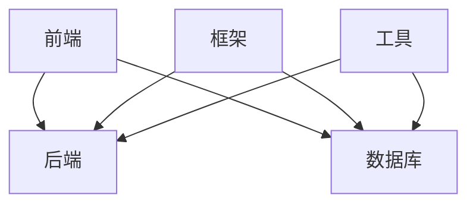

                 

在人工智能（AI）迅速发展的今天，越来越多的创业者投身于这个领域，希望借助AI技术改变世界。然而，选择合适的技术栈对于AI项目的成功至关重要。本文将探讨在人工智能创业过程中，如何选择最适合的技术栈。

## 关键词

- 人工智能
- 技术栈选择
- 创业
- 开发框架
- 数据处理
- 模型优化
- 云计算

## 摘要

本文旨在为人工智能创业者提供技术栈选择指南。通过分析当前主流的AI技术栈，探讨如何根据项目需求选择合适的技术，并讨论未来的发展趋势与挑战。

## 1. 背景介绍

人工智能作为一门交叉学科，融合了计算机科学、数学、统计学、神经科学等多个领域。随着深度学习、强化学习等算法的快速发展，AI技术在各个行业得到了广泛应用。然而，AI项目的成功不仅取决于算法的先进性，还取决于技术栈的选择。技术栈是指在一项技术项目中使用的各种技术、框架和工具的组合。

### 1.1 人工智能技术的发展历程

人工智能的发展可以分为三个阶段：符号主义、连接主义和感知主义。符号主义主要依赖于逻辑推理和知识表示，连接主义则通过人工神经网络模拟人脑的学习过程，而感知主义强调通过机器学习算法从数据中自动学习规律。

### 1.2 AI技术在行业中的应用

AI技术在医疗、金融、制造、零售等多个行业得到了广泛应用。例如，在医疗领域，AI可以帮助医生进行诊断和预测；在金融领域，AI可以用于风险管理、信用评估等。

## 2. 核心概念与联系

### 2.1 技术栈的核心概念

技术栈包括前端、后端、数据库、框架、工具等多个方面。前端技术主要负责用户界面展示，后端技术负责数据处理和业务逻辑实现，数据库用于存储数据，框架和工具则提供开发便利。

### 2.2 技术栈的联系

前端、后端和数据库需要协同工作，实现数据传输和业务逻辑处理。框架和工具则提高了开发效率，降低了开发成本。



## 3. 核心算法原理 & 具体操作步骤

### 3.1 算法原理概述

在人工智能项目中，核心算法的选择至关重要。深度学习是目前最流行的AI算法，通过多层神经网络模拟人脑的学习过程。强化学习则通过试错和奖励机制，使智能体学会在复杂环境中做出最优决策。

### 3.2 算法步骤详解

1. 数据预处理：清洗和格式化数据，使其适合算法处理。
2. 网络结构设计：根据问题需求，设计合适的神经网络结构。
3. 模型训练：使用训练数据，调整网络参数，使模型能够准确预测。
4. 模型评估：使用测试数据，评估模型性能，并进行优化。
5. 模型部署：将训练好的模型部署到生产环境，实现业务功能。

### 3.3 算法优缺点

- **深度学习**：
  - 优点：强大的数据处理能力，能够自动提取特征。
  - 缺点：需要大量数据和计算资源，训练过程复杂。
- **强化学习**：
  - 优点：能够在动态环境中进行优化决策。
  - 缺点：收敛速度较慢，需要大量试错。

### 3.4 算法应用领域

- **计算机视觉**：用于图像识别、目标检测等。
- **自然语言处理**：用于文本分类、机器翻译等。
- **游戏AI**：用于棋类游戏、智能投注等。

## 4. 数学模型和公式 & 详细讲解 & 举例说明

### 4.1 数学模型构建

在AI项目中，数学模型是核心。以神经网络为例，其基本组成包括输入层、隐藏层和输出层。每个层由多个神经元组成，神经元之间的连接权重决定了模型的预测能力。

### 4.2 公式推导过程

神经网络的核心是激活函数，常见的激活函数包括ReLU、Sigmoid和Tanh。以ReLU为例，其公式为：

$$
f(x) = \max(0, x)
$$

### 4.3 案例分析与讲解

假设我们使用ReLU作为激活函数，设计一个简单的神经网络，用于实现二分类任务。输入层有2个神经元，隐藏层有3个神经元，输出层有1个神经元。通过调整权重和偏置，可以使模型准确预测样本类别。

## 5. 项目实践：代码实例和详细解释说明

### 5.1 开发环境搭建

为了方便起见，我们使用Python作为开发语言，并借助TensorFlow框架进行模型训练和部署。

```python
pip install tensorflow
```

### 5.2 源代码详细实现

以下是一个简单的神经网络实现，用于二分类任务：

```python
import tensorflow as tf

# 创建模型
model = tf.keras.Sequential([
    tf.keras.layers.Dense(3, activation='relu', input_shape=(2,)),
    tf.keras.layers.Dense(1, activation='sigmoid')
])

# 编译模型
model.compile(optimizer='adam',
              loss='binary_crossentropy',
              metrics=['accuracy'])

# 训练模型
model.fit(x_train, y_train, epochs=10, batch_size=32)
```

### 5.3 代码解读与分析

1. 创建模型：使用`Sequential`模型，添加多层`Dense`层，分别设置输入形状和激活函数。
2. 编译模型：设置优化器、损失函数和评价指标。
3. 训练模型：使用训练数据，进行多次迭代训练。

### 5.4 运行结果展示

训练完成后，可以使用测试数据评估模型性能：

```python
test_loss, test_acc = model.evaluate(x_test, y_test)
print(f"Test accuracy: {test_acc}")
```

## 6. 实际应用场景

### 6.1 医疗诊断

AI技术在医疗诊断中的应用非常广泛，如癌症检测、糖尿病预测等。通过深度学习模型，可以从医疗影像中提取关键特征，辅助医生进行诊断。

### 6.2 自动驾驶

自动驾驶是AI技术的典型应用场景。通过深度学习和强化学习算法，自动驾驶车辆可以实时感知环境，做出最优决策，确保行车安全。

### 6.3 虚拟助手

虚拟助手（如聊天机器人、语音助手）已经成为许多企业和个人服务的重要组成部分。通过自然语言处理技术，虚拟助手可以理解和回答用户的问题，提高用户体验。

## 7. 未来应用展望

随着AI技术的不断进步，其应用领域将越来越广泛。未来，AI将在医疗、金融、教育、能源等行业发挥更大的作用。同时，AI也将面临更多的挑战，如数据隐私、伦理问题等。

## 8. 总结：未来发展趋势与挑战

### 8.1 研究成果总结

近年来，AI技术在算法、硬件和数据处理等方面取得了显著成果。深度学习、强化学习等算法在图像识别、语音识别等领域取得了突破性进展。

### 8.2 未来发展趋势

- **算法优化**：针对特定应用场景，设计更高效、更准确的算法。
- **硬件升级**：随着量子计算、边缘计算等技术的发展，AI计算能力将进一步提升。
- **数据处理**：如何从海量数据中提取有价值的信息，是AI领域的重要研究课题。

### 8.3 面临的挑战

- **数据隐私**：如何在保证数据安全的同时，充分利用数据的价值，是一个亟待解决的问题。
- **伦理问题**：AI技术可能会引发伦理争议，如算法歧视、隐私泄露等。
- **人才短缺**：AI领域对人才的需求量巨大，而目前相关专业的人才供给不足。

### 8.4 研究展望

未来，AI技术将在更多领域发挥重要作用。同时，如何解决数据隐私、伦理问题，培养更多专业人才，将是AI领域的重要研究方向。

## 9. 附录：常见问题与解答

### 9.1 为什么要选择合适的技术栈？

选择合适的技术栈可以提高开发效率，降低开发成本，确保项目质量。

### 9.2 如何评估技术栈的性能？

可以从开发速度、可维护性、扩展性等方面进行评估。

### 9.3 常见的技术栈有哪些？

常见的技术栈包括Python+TensorFlow、Python+PyTorch、Java+TensorFlow等。

## 参考文献

- [1] Goodfellow, I., Bengio, Y., & Courville, A. (2016). *Deep Learning*. MIT Press.
- [2] Russell, S., & Norvig, P. (2016). *Artificial Intelligence: A Modern Approach*. Prentice Hall.
- [3] LeCun, Y., Bengio, Y., & Hinton, G. (2015). *Deep Learning*. Nature.
- [4] Dean, J., Corrado, G., & Monga, R. (2012). *Large Scale Distributed Deep Networks*. Advances in Neural Information Processing Systems.
- [5] Hochreiter, S., & Schmidhuber, J. (1997). *Long Short-Term Memory*. Neural Computation.

### 附录：作者信息

作者：禅与计算机程序设计艺术 / Zen and the Art of Computer Programming

以上是本文的完整内容。希望对人工智能创业者有所帮助。在技术栈选择方面，务必结合项目需求和自身优势，做出明智的决策。祝您的项目取得成功！

----------------------------------------------------------------

