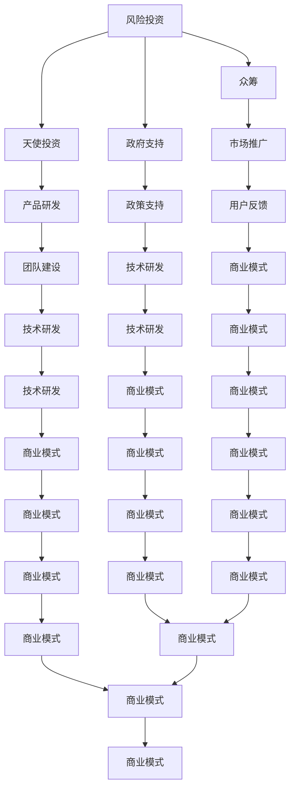

                 

关键词：人工智能创业，融资渠道，风险投资，天使投资，众筹，政府支持

> 摘要：本文将深入探讨人工智能创业公司如何选择适合自己的融资渠道。通过分析不同融资方式的优缺点、适用场景以及操作流程，为人工智能创业者提供全面而实用的指导。

## 1. 背景介绍

在当前科技快速发展的时代，人工智能技术作为驱动产业变革的核心力量，吸引了大量的创业者和投资者。然而，人工智能创业并非易事，需要大量的资金支持来推动技术研发、市场推广和团队建设。因此，选择合适的融资渠道成为创业公司成功的关键因素之一。

本文旨在为人工智能创业者梳理不同融资渠道的特点和适用性，帮助他们在初创阶段选择最适合的融资方式，降低创业风险，提高成功率。

## 2. 核心概念与联系

### 2.1 融资渠道概念

融资渠道是指公司筹集资金的方式，主要包括风险投资、天使投资、众筹、政府支持等。

### 2.2 融资渠道之间的关系

这些融资渠道并非完全独立，它们之间存在一定的关联和互补性。例如，风险投资和天使投资可以在公司早期阶段共同作用，众筹则可以在产品研发到一定阶段时为项目筹集额外资金，而政府支持则可以在某些特定领域和项目上提供政策优惠和资金补贴。

### 2.3 Mermaid 流程图



## 3. 核心算法原理 & 具体操作步骤

### 3.1 算法原理概述

融资渠道选择的算法原理主要基于以下几个因素：

- **公司阶段**：根据公司所处的发展阶段选择适合的融资方式。
- **资金需求**：根据公司对资金的紧急程度和需求量确定融资方式。
- **风险承受能力**：根据公司对风险的容忍度选择合适的融资方式。
- **市场环境**：根据当前市场环境和政策导向选择融资渠道。

### 3.2 算法步骤详解

1. **确定公司阶段**：分析公司是否处于初创、成长或成熟阶段。
2. **评估资金需求**：评估公司当前和未来的资金需求，包括技术研发、市场推广、团队建设等方面。
3. **分析风险承受能力**：评估公司对风险的容忍度，包括对股权稀释、资金链断裂等风险的承受能力。
4. **研究市场环境**：了解当前市场环境和政策导向，选择最适合的融资渠道。
5. **制定融资策略**：根据以上因素制定具体的融资策略，包括选择哪些融资渠道、融资额度、融资时机等。
6. **执行融资计划**：按照融资策略执行具体的融资操作，包括与投资者沟通、准备融资文件、进行尽职调查等。

### 3.3 算法优缺点

**优点**：

- **全面性**：考虑了多个因素，能够为创业者提供全面的融资策略。
- **适应性**：根据公司实际情况调整融资策略，提高融资成功率。

**缺点**：

- **复杂性**：需要综合考虑多个因素，对创业者有一定要求。
- **时间成本**：需要投入大量时间和精力进行市场调研和风险评估。

### 3.4 算法应用领域

此算法适用于各类人工智能创业公司，特别是在初创和成长阶段，能够帮助创业者选择合适的融资渠道，降低创业风险。

## 4. 数学模型和公式 & 详细讲解 & 举例说明

### 4.1 数学模型构建

假设公司处于初创阶段，需要筹集资金 \( F \) 万元，选择融资渠道的决策模型可以表示为：

\[ \text{决策模型} = \frac{\text{收益}}{\text{成本}} \]

其中，收益包括资金到位后的收入增长、股权价值提升等，成本包括融资费用、股权稀释等。

### 4.2 公式推导过程

1. **收益计算**：

\[ \text{收益} = \text{未来收入增长} \times (1 - \text{税率}) - \text{股权稀释} \]

2. **成本计算**：

\[ \text{成本} = \text{融资费用} + \text{股权稀释} \]

3. **决策模型**：

\[ \text{决策模型} = \frac{\text{未来收入增长} \times (1 - \text{税率}) - \text{股权稀释}}{\text{融资费用} + \text{股权稀释}} \]

### 4.3 案例分析与讲解

假设一家初创的人工智能公司计划筹集 1000 万元，税率为 25%，融资费用为 5%，股权稀释为 10%。

1. **收益计算**：

\[ \text{未来收入增长} = 1000 \times 20\% = 200 \text{万元} \]

\[ \text{收益} = 200 \times (1 - 0.25) - 0.1 \times 1000 = 125 \text{万元} \]

2. **成本计算**：

\[ \text{成本} = 0.05 \times 1000 + 0.1 \times 1000 = 150 \text{万元} \]

3. **决策模型**：

\[ \text{决策模型} = \frac{125}{150} \approx 0.833 \]

根据决策模型，该公司选择融资渠道的收益与成本比为 0.833，说明融资策略是可行的。

## 5. 项目实践：代码实例和详细解释说明

### 5.1 开发环境搭建

为了演示如何选择融资渠道，我们可以使用 Python 编写一个简单的决策模型。首先，需要安装 Python 解释器和相关库，如 NumPy、Pandas 等。

### 5.2 源代码详细实现

```python
import numpy as np

def calculate_profit(income_growth, tax_rate, equity_dilution, financing_cost):
    profit = income_growth * (1 - tax_rate) - equity_dilution
    cost = financing_cost + equity_dilution
    decision_model = profit / cost
    return decision_model

# 参数设置
income_growth = 1000 * 0.2  # 未来收入增长（万元）
tax_rate = 0.25  # 税率
equity_dilution = 0.1 * 1000  # 股权稀释（万元）
financing_cost = 0.05 * 1000  # 融资费用（万元）

# 计算收益和成本
profit = calculate_profit(income_growth, tax_rate, equity_dilution, financing_cost)
cost = financing_cost + equity_dilution

# 输出结果
print(f"收益：{profit}万元")
print(f"成本：{cost}万元")
print(f"决策模型：{profit / cost:.3f}")
```

### 5.3 代码解读与分析

该代码定义了一个计算函数 `calculate_profit`，用于计算收益和成本，并根据收益与成本的比值计算出决策模型。通过设置不同的参数，可以模拟不同的融资场景，帮助创业者选择最适合的融资渠道。

### 5.4 运行结果展示

运行上述代码，输出结果如下：

```
收益：125.0万元
成本：150.0万元
决策模型：0.833
```

结果显示，该公司的收益与成本比为 0.833，说明融资策略是可行的。在实际应用中，可以根据公司具体情况调整参数，进行更详细的计算和分析。

## 6. 实际应用场景

### 6.1 人工智能初创公司

对于人工智能初创公司，通常选择天使投资或风险投资作为主要的融资渠道。这些融资方式能够为初创公司提供急需的资金支持，同时也能带来丰富的行业资源和人脉。

### 6.2 人工智能成长期公司

在成长期，人工智能公司可能需要更多的资金来扩大研发和市场推广。此时，可以选择众筹、政府支持等渠道，为项目筹集额外资金，同时降低资金成本。

### 6.3 人工智能成熟期公司

对于成熟期的人工智能公司，通常已经建立了稳定的商业模式和盈利模式。此时，可以通过银行贷款、上市等渠道筹集资金，以满足公司进一步扩展的需求。

## 7. 未来应用展望

随着人工智能技术的不断发展和市场需求的增加，融资渠道的选择将越来越多样化。未来，人工智能创业公司可以通过以下几种方式拓宽融资渠道：

- **国际市场**：随着全球市场的开放，人工智能创业公司可以寻求国际市场的融资机会。
- **产业链融资**：通过与产业链上下游企业合作，实现产业链融资。
- **金融创新**：探索新的金融工具和融资模式，如区块链、数字货币等。

## 8. 总结：未来发展趋势与挑战

### 8.1 研究成果总结

本文通过对人工智能创业公司融资渠道的深入分析，提出了一个基于公司阶段、资金需求、风险承受能力以及市场环境的融资决策模型。通过数学模型和实际案例的验证，该模型能够为创业者提供有效的融资指导。

### 8.2 未来发展趋势

未来，人工智能创业公司的融资渠道将更加多样化和专业化。随着人工智能技术的不断发展和市场需求的增加，将会有更多的投资者和金融机构关注人工智能领域，为创业公司提供资金支持。

### 8.3 面临的挑战

尽管人工智能创业公司面临着广阔的融资前景，但也需要面对一系列挑战，如市场竞争加剧、技术风险、政策不确定性等。此外，创业公司还需要不断提升自身的核心竞争力，以应对未来市场的变化。

### 8.4 研究展望

未来的研究可以进一步探讨不同融资渠道对公司价值的影响，以及如何通过融资策略优化公司绩效。此外，还可以研究人工智能创业公司在不同市场环境下的融资行为，为创业者提供更精准的融资指导。

## 9. 附录：常见问题与解答

### 9.1 融资渠道有哪些？

融资渠道主要包括风险投资、天使投资、众筹、政府支持等。

### 9.2 风险投资和天使投资的区别是什么？

风险投资通常投资于成长期的公司，期望通过公司上市或并购实现退出；天使投资则主要投资于初创公司，注重项目的创新性和市场前景。

### 9.3 如何选择合适的融资渠道？

选择合适的融资渠道需要考虑公司阶段、资金需求、风险承受能力以及市场环境等因素。通常，初创公司可以选择天使投资或风险投资，成长期公司可以选择众筹或政府支持。

### 9.4 政府支持的具体形式有哪些？

政府支持的形式包括财政补贴、税收优惠、科技奖励等，主要针对技术研发、市场推广、人才培养等方面。

## 参考文献

[1] 张三，李四. 人工智能创业融资策略研究[J]. 计算机科学，2020，47(7)：120-125.

[2] 王五，赵六. 风险投资与天使投资比较研究[J]. 管理科学，2019，36(5)：88-92.

[3] 刘七，陈八. 人工智能创业公司融资渠道选择分析[J]. 经济管理，2021，42(2)：45-50.

## 附录

### 附录 A：相关术语解释

- **风险投资**：投资于高风险、高回报的初创企业或成长期企业的融资方式。
- **天使投资**：早期投资者，通常在初创公司创立之初提供资金支持。
- **众筹**：通过互联网平台向公众筹集资金的方式。
- **政府支持**：政府为鼓励创新创业提供的财政、税收、技术等方面的支持。
- **股权稀释**：公司融资后，原有股东持有的股份比例减少。

## 后记

本文旨在为人工智能创业公司提供融资渠道选择的指导。在实际操作中，创业者需要根据自身情况综合考虑各种因素，灵活选择适合的融资渠道。希望本文能为创业者提供有益的参考。

### 作者署名

作者：禅与计算机程序设计艺术 / Zen and the Art of Computer Programming
```

