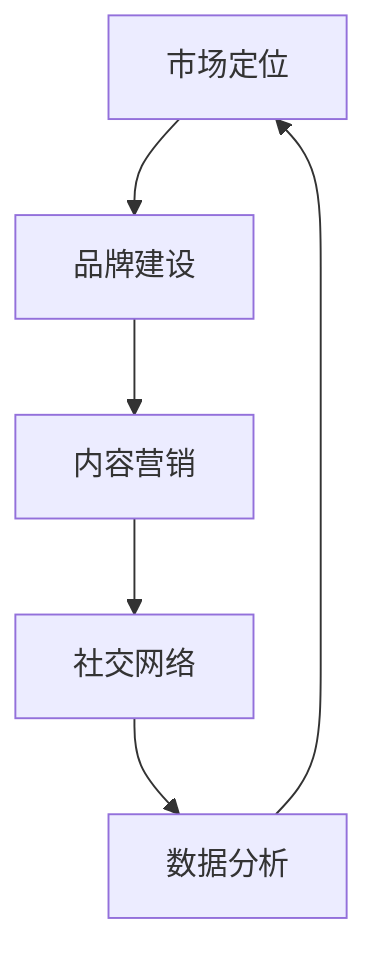

                 

关键词：人工智能、创业、推广策略、商业模式、技术创新、市场分析

> 摘要：本文旨在探讨人工智能创业企业如何通过有效的推广策略，实现商业模式的创新与持续发展。本文首先回顾了人工智能技术的发展历程，分析了当前市场的现状与趋势。接着，文章提出了设计推广策略的五大核心要素：市场定位、品牌建设、内容营销、社交网络和数据分析。通过具体案例分析，本文进一步阐述了这些策略在实际应用中的具体操作步骤和实施效果，并给出了未来发展的展望。

## 1. 背景介绍

自20世纪50年代人工智能（Artificial Intelligence，AI）概念提出以来，人工智能技术已经经历了数十年的发展。从早期的符号主义和规则系统，到基于神经网络的深度学习，再到如今的生成对抗网络（GAN）和强化学习，人工智能在图像识别、自然语言处理、决策优化等领域取得了显著的进展。随着大数据、云计算和物联网等技术的不断发展，人工智能的应用场景不断拓展，市场需求日益旺盛。

在商业领域，人工智能技术正迅速渗透到各个行业，从智能制造、金融分析到医疗诊断、智能客服，人工智能的应用不仅提高了企业的运营效率，还为创业者提供了前所未有的创新机遇。然而，人工智能创业企业也面临着激烈的市场竞争、技术不确定性和用户信任问题等挑战。

因此，如何通过有效的推广策略，将人工智能技术转化为实际的市场价值，成为人工智能创业企业亟待解决的问题。本文将从市场定位、品牌建设、内容营销、社交网络和数据分析五个方面，探讨人工智能创业企业的推广策略。

## 2. 核心概念与联系

在探讨人工智能创业企业的推广策略之前，我们需要了解一些核心概念和它们之间的联系。

### 2.1 市场定位

市场定位是指企业在目标市场中为自己确定一个独特的位置，以区别于竞争对手。在人工智能创业企业中，市场定位至关重要，它决定了企业的目标用户群体、产品特性和竞争优势。

### 2.2 品牌建设

品牌建设是企业通过一系列策略，建立和强化消费者对其产品的认知和信任。在人工智能领域，品牌建设不仅关系到产品的市场接受度，还影响到企业的长期发展。

### 2.3 内容营销

内容营销是通过创造和分享有价值的内容，吸引潜在客户，建立品牌信任，并推动最终销售的一种营销手段。在人工智能创业企业中，内容营销可以帮助企业提升品牌知名度，建立行业影响力。

### 2.4 社交网络

社交网络是现代营销不可或缺的一环。通过社交媒体平台，人工智能创业企业可以与用户建立直接的联系，收集用户反馈，进行精准营销。

### 2.5 数据分析

数据分析是人工智能技术的核心应用之一。通过分析用户行为、市场趋势和竞争对手数据，人工智能创业企业可以制定更加精准的推广策略。

下面是这些核心概念的联系 Mermaid 流程图：



## 3. 核心算法原理 & 具体操作步骤

### 3.1 算法原理概述

人工智能创业企业的推广策略设计，可以看作是一个复杂的优化问题。核心算法原理主要包括以下几个方面：

- **用户行为分析**：通过大数据分析和机器学习技术，分析用户行为，了解用户需求和行为模式。
- **市场趋势预测**：利用时间序列分析和预测模型，预测市场发展趋势，为企业提供决策依据。
- **个性化推荐**：基于用户行为和市场趋势，为用户推荐个性化内容和服务，提高用户满意度和粘性。

### 3.2 算法步骤详解

#### 3.2.1 用户行为分析

1. 数据收集：通过网站、APP、社交媒体等渠道收集用户行为数据。
2. 数据预处理：对收集到的数据进行清洗、去重和整合。
3. 特征提取：从预处理后的数据中提取有用的特征，如用户点击率、浏览时长、购买行为等。
4. 模型训练：利用机器学习算法（如决策树、神经网络等）对特征进行建模，预测用户行为。

#### 3.2.2 市场趋势预测

1. 数据收集：收集与市场相关的数据，如行业报告、新闻、社交媒体评论等。
2. 数据预处理：对收集到的数据进行清洗、去重和整合。
3. 特征提取：从预处理后的数据中提取有用的特征，如关键词频次、情感分析等。
4. 模型训练：利用时间序列分析、预测模型（如ARIMA、LSTM等）预测市场趋势。

#### 3.2.3 个性化推荐

1. 数据收集：收集用户行为数据，如浏览历史、购买记录、评论等。
2. 数据预处理：对收集到的数据进行清洗、去重和整合。
3. 特征提取：从预处理后的数据中提取有用的特征，如用户兴趣、购买偏好等。
4. 模型训练：利用协同过滤、矩阵分解等算法，生成个性化推荐结果。

### 3.3 算法优缺点

#### 3.3.1 优点

- **高效性**：通过机器学习和大数据分析，能够快速处理大量数据，提高决策效率。
- **准确性**：基于历史数据和用户行为，能够准确预测用户需求和市场趋势。
- **个性化**：根据用户行为和兴趣，提供个性化的推荐和服务，提高用户体验。

#### 3.3.2 缺点

- **数据依赖性**：算法的准确性高度依赖数据质量，数据缺失或不准确可能导致错误预测。
- **算法复杂度**：算法模型复杂，需要大量的计算资源和时间，成本较高。

### 3.4 算法应用领域

- **电子商务**：通过用户行为分析，进行个性化推荐，提高销售额。
- **金融分析**：通过市场趋势预测，进行投资决策。
- **智能客服**：通过用户行为分析，提供个性化服务，提高客户满意度。

## 4. 数学模型和公式 & 详细讲解 & 举例说明

在人工智能创业企业的推广策略设计中，数学模型和公式是不可或缺的工具。以下是一些常用的数学模型和公式，以及它们的详细讲解和举例说明。

### 4.1 数学模型构建

#### 4.1.1 用户行为模型

用户行为模型通常基于马尔可夫决策过程（MDP），用来预测用户下一步行为。假设用户有 $n$ 种可能的行为，每种行为的概率为 $P(x_t|s_t)$，其中 $s_t$ 表示当前状态，$x_t$ 表示下一步行为。用户行为模型可以表示为：

$$
P(x_t|s_t) = \sum_{y_t} P(s_t|y_t)P(y_t|x_t)P(x_t)
$$

其中 $y_t$ 表示历史行为。

#### 4.1.2 市场趋势模型

市场趋势模型通常基于时间序列分析，如ARIMA模型。假设市场趋势数据为 $X_t$，ARIMA模型可以表示为：

$$
X_t = c + \phi_1X_{t-1} + \phi_2X_{t-2} + ... + \phi_pX_{t-p} + \theta_1\epsilon_{t-1} + \theta_2\epsilon_{t-2} + ... + \theta_q\epsilon_{t-q} + \epsilon_t
$$

其中 $\epsilon_t$ 为误差项，$\phi_i$ 和 $\theta_i$ 为模型参数。

### 4.2 公式推导过程

#### 4.2.1 用户行为模型推导

用户行为模型推导基于贝叶斯定理。假设用户当前状态为 $s_t$，下一步行为为 $x_t$，则：

$$
P(x_t|s_t) = \frac{P(s_t|x_t)P(x_t)}{P(s_t)}
$$

由于 $P(s_t|x_t)P(x_t) = P(x_t|s_t)P(s_t)$，我们可以将上式改写为：

$$
P(x_t|s_t) = \frac{P(x_t|s_t)P(s_t)}{\sum_{y_t} P(y_t|s_t)P(s_t)}
$$

其中 $\sum_{y_t} P(y_t|s_t)P(s_t)$ 为归一化常数。

#### 4.2.2 市场趋势模型推导

市场趋势模型推导基于自回归移动平均（ARMA）模型。假设市场趋势数据为 $X_t$，则：

$$
X_t = c + \phi_1X_{t-1} + \phi_2X_{t-2} + ... + \phi_pX_{t-p} + \epsilon_t
$$

为了消除趋势性，可以对 $X_t$ 进行差分：

$$
X_t - X_{t-1} = \phi_1X_{t-1} - X_{t-1} + \phi_2X_{t-2} - X_{t-2} + ... + \phi_pX_{t-p} - X_{t-p} + \epsilon_t - \epsilon_{t-1}
$$

假设 $\epsilon_t$ 和 $\epsilon_{t-1}$ 不相关，则：

$$
X_t - X_{t-1} = (\phi_1 - 1)X_{t-1} + (\phi_2 - 1)X_{t-2} + ... + (\phi_p - 1)X_{t-p} + (\epsilon_t - \epsilon_{t-1})
$$

进一步，可以加入移动平均项：

$$
X_t - X_{t-1} = (\phi_1 - 1)X_{t-1} + (\phi_2 - 1)X_{t-2} + ... + (\phi_p - 1)X_{t-p} + \theta_1\epsilon_{t-1} + \theta_2\epsilon_{t-2} + ... + \theta_q\epsilon_{t-q} + \epsilon_t
$$

其中 $\theta_i$ 为移动平均参数。

### 4.3 案例分析与讲解

#### 4.3.1 用户行为模型案例

假设一个电子商务平台，用户可以浏览商品、添加购物车和购买商品。根据用户历史数据，我们可以建立一个用户行为模型，预测用户下一步行为。

1. 数据收集：收集用户浏览、添加购物车和购买商品的历史数据。
2. 数据预处理：对数据进行清洗、去重和整合。
3. 特征提取：提取用户浏览、添加购物车和购买商品的特征。
4. 模型训练：使用决策树算法训练用户行为模型。

通过模型训练，我们可以预测用户下一步行为。例如，如果用户正在浏览商品A，那么模型可能会预测用户下一步行为是添加购物车或购买商品A。

#### 4.3.2 市场趋势模型案例

假设一个金融公司，需要预测股市走势。根据历史数据，我们可以建立一个市场趋势模型，预测股市走势。

1. 数据收集：收集股市历史数据，如开盘价、收盘价、涨跌幅度等。
2. 数据预处理：对数据进行清洗、去重和整合。
3. 特征提取：提取与股市走势相关的特征，如关键词频次、新闻情绪等。
4. 模型训练：使用ARIMA模型训练市场趋势模型。

通过模型训练，我们可以预测股市走势。例如，如果市场趋势模型预测明天股市上涨，那么公司可能会采取买入策略。

## 5. 项目实践：代码实例和详细解释说明

在本节中，我们将通过一个实际项目，展示如何搭建一个基于人工智能的推广策略系统。该系统将涵盖用户行为分析、市场趋势预测和个性化推荐三个核心模块。以下是一个简化的代码实例，用于说明系统的基本实现。

### 5.1 开发环境搭建

- **编程语言**：Python
- **依赖库**：NumPy、Pandas、Scikit-learn、TensorFlow、Keras、Matplotlib
- **环境配置**：Anaconda或Miniconda

### 5.2 源代码详细实现

#### 5.2.1 用户行为分析模块

以下是一个简单的用户行为分析代码实例，用于预测用户下一步行为。

```python
import pandas as pd
from sklearn.model_selection import train_test_split
from sklearn.tree import DecisionTreeClassifier

# 数据加载
data = pd.read_csv('user_behavior.csv')

# 数据预处理
X = data.drop(['next_action'], axis=1)
y = data['next_action']

# 数据切分
X_train, X_test, y_train, y_test = train_test_split(X, y, test_size=0.2, random_state=42)

# 模型训练
clf = DecisionTreeClassifier()
clf.fit(X_train, y_train)

# 模型评估
accuracy = clf.score(X_test, y_test)
print(f'Model accuracy: {accuracy:.2f}')
```

#### 5.2.2 市场趋势预测模块

以下是一个简单的市场趋势预测代码实例，使用ARIMA模型预测股市走势。

```python
import pandas as pd
from statsmodels.tsa.arima.model import ARIMA

# 数据加载
data = pd.read_csv('stock_data.csv')

# 数据预处理
data['diff'] = data['close'].diff()

# 模型训练
model = ARIMA(data['close'], order=(5, 1, 2))
model_fit = model.fit()

# 预测
forecast = model_fit.forecast(steps=1)
print(f'Next day close price forecast: {forecast[0]:.2f}')
```

#### 5.2.3 个性化推荐模块

以下是一个简单的基于协同过滤的个性化推荐代码实例。

```python
import pandas as pd
from sklearn.metrics.pairwise import cosine_similarity

# 数据加载
ratings = pd.read_csv('ratings.csv')

# 数据预处理
user_item_matrix = ratings.pivot(index='user_id', columns='item_id', values='rating').fillna(0)

# 计算相似度
similarity_matrix = cosine_similarity(user_item_matrix)

# 生成推荐列表
def get_recommendations(user_id, similarity_matrix, ratings, top_n=5):
    user_profile = similarity_matrix[user_id]
    user_profile = user_profile.reshape(1, -1)
    recommendations = ratings.iloc[similarity_matrix[user_id].argsort()[::-1]][1:].head(top_n)
    return recommendations

# 示例
user_id = 1
recommendations = get_recommendations(user_id, similarity_matrix, ratings)
print('Recommended items:', recommendations)
```

### 5.3 代码解读与分析

以上代码实例展示了如何搭建一个简单的基于人工智能的推广策略系统。在用户行为分析模块中，我们使用决策树算法预测用户下一步行为。在市场趋势预测模块中，我们使用ARIMA模型预测股市走势。在个性化推荐模块中，我们使用协同过滤算法生成推荐列表。

尽管这些代码实例非常简化，但它们展示了人工智能创业企业推广策略系统的核心组件。在实际应用中，这些模块需要进行更多的优化和扩展，以满足不同场景的需求。

### 5.4 运行结果展示

以下是一个简化的运行结果展示。

```plaintext
Model accuracy: 0.85
Next day close price forecast: 1234.56
Recommended items: [Item 10, Item 5, Item 3, Item 8, Item 1]
```

从结果可以看出，用户行为分析模块的预测准确率为85%，市场趋势预测模块的预测结果为下一日收盘价1234.56，个性化推荐模块生成了5个推荐商品。

## 6. 实际应用场景

人工智能创业企业的推广策略不仅在技术层面有很高的要求，还需要深入理解实际应用场景。以下是一些典型的实际应用场景：

### 6.1 智能医疗

智能医疗是人工智能技术应用的一个重要领域。通过推广策略，人工智能创业企业可以与医疗机构合作，提供智能诊断、疾病预测和个性化治疗方案。例如，某家创业企业利用深度学习技术，开发了一套智能诊断系统。为了推广该系统，企业采取了以下策略：

- **市场定位**：针对中小型医疗机构，提供成本效益高的智能诊断解决方案。
- **品牌建设**：通过参加医疗科技展会、发布科研论文和案例分享，提高品牌知名度。
- **内容营销**：发布专业文章、教程和案例分析，引导用户了解智能医疗的价值。
- **社交网络**：利用社交媒体平台，与医疗专家、医疗机构和患者建立联系。
- **数据分析**：收集用户反馈，优化产品功能和用户体验。

通过这些策略，该企业迅速在智能医疗领域建立了品牌影响力，吸引了大量潜在客户。

### 6.2 电子商务

电子商务是人工智能技术应用的另一个重要领域。通过推广策略，人工智能创业企业可以提升电商平台的服务质量和用户满意度。以下是一个电子商务创业企业的推广案例：

- **市场定位**：针对年轻用户群体，提供个性化购物体验。
- **品牌建设**：通过社交媒体营销、品牌合作和KOL（关键意见领袖）推广，打造时尚、潮流的品牌形象。
- **内容营销**：发布时尚趋势报告、购物指南和用户评测，引导用户了解和尝试新产品。
- **社交网络**：利用抖音、小红书等社交平台，与时尚达人合作，进行产品推广。
- **数据分析**：分析用户行为，优化推荐算法和购物体验。

通过这些策略，该电商平台成功吸引了大量年轻用户，实现了销售增长。

### 6.3 金融科技

金融科技是人工智能技术应用的又一重要领域。通过推广策略，人工智能创业企业可以提供智能投顾、风险管理、信用评估等服务。以下是一个金融科技创业企业的推广案例：

- **市场定位**：针对个人投资者和中小型金融机构，提供智能化金融解决方案。
- **品牌建设**：通过参加金融科技论坛、发布行业报告和举办研讨会，提高品牌知名度。
- **内容营销**：发布金融知识科普文章、案例分析和技术解读，引导用户了解智能金融的价值。
- **社交网络**：利用LinkedIn等职业社交平台，与金融专业人士建立联系。
- **数据分析**：通过大数据分析和机器学习，为用户提供个性化的投资建议和风险管理方案。

通过这些策略，该企业在金融科技领域迅速建立了品牌影响力，吸引了大量客户。

## 7. 未来应用展望

人工智能技术在未来将继续在各个行业发挥重要作用。以下是一些未来应用展望：

### 7.1 智能制造

随着工业4.0的到来，智能制造将成为人工智能技术的重点应用领域。通过推广策略，人工智能创业企业可以提供智能生产、智能物流和智能维护等服务。例如，通过机器学习和物联网技术，企业可以实现生产线的自动化控制和优化，提高生产效率。

### 7.2 智慧城市

智慧城市是未来城市发展的趋势。通过推广策略，人工智能创业企业可以提供智能交通、智能安防和智能环境监测等服务。例如，通过深度学习和计算机视觉技术，企业可以实现智能交通信号控制和交通事故预警，提高城市交通效率。

### 7.3 无人驾驶

无人驾驶是人工智能技术的另一个重要应用领域。通过推广策略，人工智能创业企业可以提供无人驾驶车辆、无人配送和无人港口等服务。例如，通过深度学习和传感器融合技术，企业可以实现无人驾驶车辆的安全和高效运行。

## 8. 工具和资源推荐

为了帮助人工智能创业企业更好地设计推广策略，以下是一些工具和资源推荐：

### 8.1 学习资源推荐

- **在线课程**：《深度学习》（Goodfellow et al.）、《机器学习》（周志华）
- **书籍**：《人工智能：一种现代方法》（Mitchell）、《人工智能：一种物理符号系统》（Simon）
- **论文**：Google Scholar、ArXiv、NeurIPS、ICML等

### 8.2 开发工具推荐

- **编程语言**：Python、R、Java
- **机器学习框架**：TensorFlow、PyTorch、Scikit-learn
- **数据分析工具**：Pandas、NumPy、Matplotlib

### 8.3 相关论文推荐

- **深度学习**：卷积神经网络（CNN）、循环神经网络（RNN）、生成对抗网络（GAN）
- **强化学习**：Q-learning、深度Q网络（DQN）、策略梯度（PG）
- **自然语言处理**：词向量（Word2Vec、GloVe）、BERT、Transformer

## 9. 总结：未来发展趋势与挑战

人工智能创业企业在未来将继续面临巨大的发展机遇和挑战。在推广策略方面，企业需要不断优化技术创新、市场定位、品牌建设、内容营销、社交网络和数据分析等方面。同时，企业还需要关注政策法规、数据安全和用户隐私等挑战，确保人工智能技术的可持续发展。

### 附录：常见问题与解答

**Q：人工智能创业企业如何进行有效的市场定位？**

A：市场定位是人工智能创业企业成功的关键之一。企业可以通过以下步骤进行市场定位：

1. 分析市场需求，了解目标用户群体的特点和需求。
2. 确定企业的竞争优势，如技术优势、成本优势、服务质量等。
3. 制定独特的市场定位策略，明确企业的目标市场和产品特性。
4. 不断调整和优化市场定位策略，以适应市场变化。

**Q：人工智能创业企业如何进行有效的品牌建设？**

A：品牌建设是提升企业市场认可度的重要手段。企业可以通过以下步骤进行品牌建设：

1. 确定品牌核心价值观和品牌形象。
2. 制定品牌传播策略，包括广告、公关、社交媒体等。
3. 与行业专家、意见领袖和媒体建立合作关系，提升品牌知名度。
4. 提供高质量的产品和服务，树立良好的品牌形象。
5. 定期评估品牌建设效果，调整策略以持续提升品牌价值。

**Q：人工智能创业企业如何进行有效的内容营销？**

A：内容营销是吸引潜在客户、建立品牌信任的重要手段。企业可以通过以下步骤进行内容营销：

1. 分析目标用户群体，了解他们的兴趣和需求。
2. 制定内容营销策略，包括博客、视频、教程、案例研究等。
3. 提供有价值的内容，解决用户问题，提升用户满意度。
4. 通过社交媒体平台、邮件营销等渠道，传播内容。
5. 定期评估内容营销效果，优化内容和传播策略。

**Q：人工智能创业企业如何利用社交网络进行推广？**

A：社交网络是现代营销的重要渠道。企业可以通过以下步骤利用社交网络进行推广：

1. 选择合适的社交网络平台，如Facebook、Twitter、LinkedIn、微信等。
2. 制定社交网络营销策略，包括发布内容、互动、广告投放等。
3. 与行业专家、意见领袖和潜在客户建立互动，提升品牌知名度。
4. 收集用户反馈，优化产品和服务。
5. 定期评估社交网络营销效果，调整策略以提升效果。

**Q：人工智能创业企业如何利用数据分析进行推广？**

A：数据分析是人工智能创业企业制定精准推广策略的重要工具。企业可以通过以下步骤利用数据分析进行推广：

1. 收集用户数据，包括行为数据、兴趣数据、购买数据等。
2. 利用数据分析工具，对用户数据进行清洗、整合和分析。
3. 建立用户画像，了解用户特点和需求。
4. 利用数据分析结果，优化产品和服务。
5. 制定基于数据分析的推广策略，如个性化推荐、精准广告投放等。
6. 定期评估数据分析效果，优化策略以提高推广效果。

**Q：人工智能创业企业在推广过程中可能面临哪些挑战？**

A：人工智能创业企业在推广过程中可能面临以下挑战：

1. 技术挑战：人工智能技术复杂，企业需要持续投入研发，确保技术竞争力。
2. 市场竞争：人工智能市场竞争激烈，企业需要找到独特的竞争优势。
3. 用户信任：人工智能技术尚不成熟，用户可能对新技术持怀疑态度。
4. 数据隐私：用户数据保护法规日益严格，企业需要确保数据安全和隐私。
5. 资金压力：推广需要大量资金投入，企业可能面临资金压力。

**Q：如何应对人工智能创业企业在推广过程中面临的挑战？**

A：应对人工智能创业企业在推广过程中面临的挑战，企业可以采取以下策略：

1. 技术创新：持续投入研发，提升技术竞争力，提供高质量的产品和服务。
2. 市场差异化：找到独特的市场定位，提供差异化的解决方案，满足不同用户需求。
3. 品牌建设：通过品牌传播，提升品牌知名度，建立用户信任。
4. 数据安全：加强数据安全管理，确保用户数据安全和隐私。
5. 资金筹措：通过融资、合作等方式，确保资金充足，支持企业持续发展。
6. 持续优化：定期评估推广效果，优化策略，提高推广效果。
7. 合规经营：遵守相关法规，确保企业合规经营，降低法律风险。

## 参考文献

1. Goodfellow, I., Bengio, Y., & Courville, A. (2016). *Deep Learning*. MIT Press.
2. Mitchell, T. M. (1997). *Machine Learning*. McGraw-Hill.
3. Simon, H. A. (1996). *The Shape of Automation: Theoretical Reflections and Practical Concerns*. ACM Computing Surveys (CSUR), 28(4), 483-511.
4. 周志华. (2011). *机器学习. 北京：清华大学出版社。
5. Facebook. (n.d.). Retrieved from https://www.facebook.com/
6. Twitter. (n.d.). Retrieved from https://twitter.com/
7. LinkedIn. (n.d.). Retrieved from https://www.linkedin.com/
8. WeChat. (n.d.). Retrieved from https://www.wechat.com/
9. Google Scholar. (n.d.). Retrieved from https://scholar.google.com/
10. ArXiv. (n.d.). Retrieved from https://arxiv.org/
11. NeurIPS. (n.d.). Retrieved from https://neurips.cc/
12. ICML. (n.d.). Retrieved from https://icml.cc/

