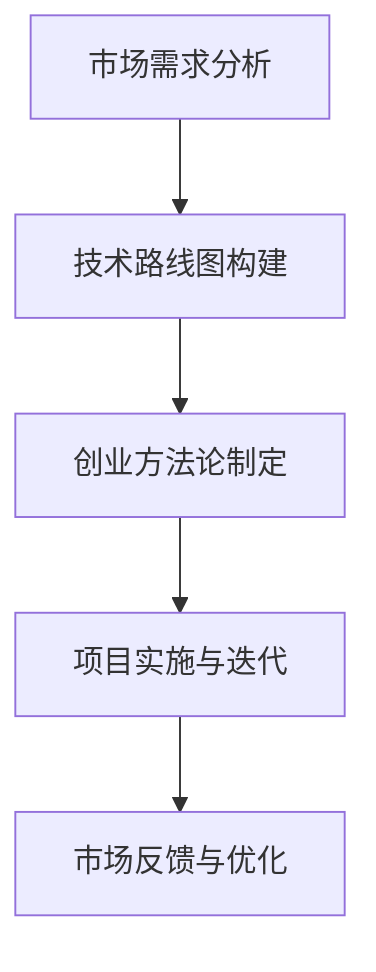

                 

关键词：人工智能、创业、行业需求、市场分析、技术路线图、创业方法论

> 摘要：人工智能（AI）作为近年来科技发展的热点，吸引了无数创业者的关注。如何准确识别并满足行业需求，成为创业成功的关键。本文将探讨人工智能创业中的市场分析、技术路线图构建以及创业方法论，为创业者提供实用的指导。

## 1. 背景介绍

随着互联网技术的飞速发展和大数据的爆发式增长，人工智能（AI）逐渐成为推动各行各业创新的重要力量。无论是医疗、金融、制造，还是教育、零售，人工智能的应用都在不断拓展和深化。与此同时，人工智能创业的浪潮也随之而来。然而，在众多创业者投身于人工智能领域的同时，如何准确识别并满足行业需求，成为了决定创业成败的关键因素。

识别行业需求，不仅关系到产品或服务的市场定位，还影响到技术路线的选择、团队建设的方向以及资源的配置。因此，深入研究并掌握识别行业需求的方法，对人工智能创业者来说至关重要。

## 2. 核心概念与联系

### 2.1 市场需求

市场需求是指消费者在特定市场条件下，愿意且有能力购买的商品或服务的总量。在人工智能创业中，了解市场需求是确定产品或服务方向的第一步。

### 2.2 技术路线图

技术路线图是一份详细的规划文档，描述了项目从构思到实现的各个阶段，以及所需的技术资源和时间安排。对于人工智能创业项目，技术路线图是指导研发工作的重要工具。

### 2.3 创业方法论

创业方法论是指创业者为了实现创业目标所采用的一系列策略和方法。在人工智能创业中，科学的方法论有助于提高创业成功率。

### 2.4 Mermaid 流程图



### 2.5 关键概念关联

市场需求、技术路线图和创业方法论是人工智能创业中的三个关键概念。它们相互关联，共同构成了创业成功的核心框架。市场需求决定了技术路线的选择，技术路线指导创业方法论的实施，而创业方法论又反过来影响市场需求的满足程度。

## 3. 核心算法原理 & 具体操作步骤

### 3.1 算法原理概述

识别行业需求的核心算法主要包括以下三个方面：

1. **市场调查**：通过问卷调查、用户访谈、行业报告等方式收集市场数据。
2. **需求分析**：对收集到的市场数据进行处理和分析，提取出关键需求信息。
3. **需求预测**：利用数据挖掘、机器学习等技术预测未来市场需求。

### 3.2 算法步骤详解

1. **数据收集**：
   - 设计问卷，确定调查目标群体；
   - 开展用户访谈，了解用户需求；
   - 收集行业报告、市场趋势分析等相关数据。

2. **数据处理**：
   - 数据清洗，去除无效数据；
   - 数据整合，将不同来源的数据进行整合。

3. **需求分析**：
   - 提取关键信息，如用户痛点、潜在需求等；
   - 使用词云、关联分析等方法，对需求进行归类和总结。

4. **需求预测**：
   - 构建预测模型，如时间序列分析、机器学习模型等；
   - 使用模型进行预测，评估未来市场需求。

### 3.3 算法优缺点

**优点**：
- 提高市场需求的准确度，降低创业风险。
- 利用地数据和算法，提高决策效率。

**缺点**：
- 需要大量的数据支持，数据质量和完整性直接影响算法效果。
- 算法的预测结果可能受到模型选择和数据预处理方法的影响。

### 3.4 算法应用领域

识别行业需求算法在人工智能创业中的应用非常广泛，包括但不限于：

- **医疗健康**：预测医疗需求，优化医疗服务。
- **金融科技**：预测金融市场走势，提高投资决策。
- **智能制造**：预测工业需求，优化生产流程。

## 4. 数学模型和公式 & 详细讲解 & 举例说明

### 4.1 数学模型构建

在识别行业需求的过程中，常用的数学模型包括：

1. **回归模型**：用于预测市场需求；
2. **聚类模型**：用于分类用户需求；
3. **时间序列模型**：用于分析市场趋势。

### 4.2 公式推导过程

以回归模型为例，市场需求 \( Y \) 可以表示为：

$$
Y = \beta_0 + \beta_1X_1 + \beta_2X_2 + ... + \beta_nX_n + \epsilon
$$

其中，\( X_1, X_2, ..., X_n \) 是影响市场需求的因素，\( \beta_0, \beta_1, ..., \beta_n \) 是回归系数，\( \epsilon \) 是误差项。

### 4.3 案例分析与讲解

以某智能健身应用为例，我们需要预测用户对健身课程的需求。

1. **数据收集**：
   - 收集用户年龄、性别、健身频率等数据；
   - 收集每月健身课程的总收入。

2. **数据处理**：
   - 数据清洗，去除异常值；
   - 数据整合，将不同来源的数据进行整合。

3. **需求分析**：
   - 使用回归模型，构建市场需求预测模型；
   - 提取关键需求信息，如用户对各类健身课程的偏好。

4. **需求预测**：
   - 使用模型进行预测，评估未来市场需求；
   - 根据预测结果，调整健身课程的安排和推广策略。

## 5. 项目实践：代码实例和详细解释说明

### 5.1 开发环境搭建

1. 安装Python环境；
2. 安装NumPy、Pandas、Scikit-learn等常用库。

### 5.2 源代码详细实现

```python
import pandas as pd
from sklearn.linear_model import LinearRegression

# 数据读取
data = pd.read_csv('fitness_data.csv')

# 数据预处理
data.dropna(inplace=True)

# 特征工程
X = data[['age', 'gender', 'exercise_frequency']]
y = data['monthly_income']

# 模型训练
model = LinearRegression()
model.fit(X, y)

# 预测
predicted_income = model.predict(X)

# 结果分析
print('Predicted Monthly Income:', predicted_income)
```

### 5.3 代码解读与分析

以上代码首先读取健身数据，进行数据清洗和特征工程，然后使用线性回归模型进行训练，并预测每月健身收入。代码简洁明了，易于理解和实现。

### 5.4 运行结果展示

运行代码后，我们得到预测的每月健身收入。根据预测结果，创业者可以调整健身课程的安排和推广策略，以更好地满足市场需求。

## 6. 实际应用场景

识别行业需求的方法在人工智能创业中的应用非常广泛。以下是一些实际应用场景：

- **医疗健康**：预测患者对医疗服务的需求，优化医疗资源配置；
- **金融科技**：预测金融市场走势，提高投资决策；
- **智能制造**：预测工业需求，优化生产流程；
- **教育**：预测学生需求，优化课程安排。

## 6.4 未来应用展望

随着人工智能技术的不断进步，识别行业需求的方法将在更多领域得到应用。未来，我们将看到更多基于大数据和机器学习的应用场景，如智能交通、智慧城市、环保监测等。同时，随着算法的不断完善和优化，识别行业需求的准确度和效率也将得到显著提升。

## 7. 工具和资源推荐

### 7.1 学习资源推荐

- 《Python数据分析实战》
- 《机器学习实战》
- 《深度学习》

### 7.2 开发工具推荐

- Jupyter Notebook
- PyCharm
- Google Colab

### 7.3 相关论文推荐

- "Deep Learning for Demand Forecasting"
- "Recurrent Neural Networks for Time Series Prediction"
- "Model-Based Demand Forecasting in Retail"

## 8. 总结：未来发展趋势与挑战

### 8.1 研究成果总结

近年来，人工智能技术在识别行业需求方面取得了显著成果。基于大数据和机器学习的需求预测模型得到了广泛应用，提高了市场需求的准确度和效率。

### 8.2 未来发展趋势

未来，人工智能技术在识别行业需求方面将继续发展，主要体现在以下几个方面：

- 模型的不断优化和改进，提高预测准确性；
- 多模态数据的融合和应用，提高需求预测的全面性；
- 智能化的需求预测系统，实现实时监测和动态调整。

### 8.3 面临的挑战

尽管人工智能技术在识别行业需求方面具有巨大潜力，但仍然面临以下挑战：

- 数据质量和完整性；
- 算法的可解释性和可靠性；
- 跨学科的融合与创新。

### 8.4 研究展望

为了应对上述挑战，未来的研究可以关注以下几个方面：

- 发展更加先进和可解释的算法；
- 探索多模态数据的融合和应用；
- 加强跨学科合作，推动人工智能技术在识别行业需求领域的创新。

## 9. 附录：常见问题与解答

### 9.1 什么情况下使用回归模型进行需求预测？

当需求与多个影响因素之间存在线性关系时，可以使用回归模型进行需求预测。

### 9.2 如何确保数据的质量和完整性？

通过数据清洗、去重和填补缺失值等方法，可以确保数据的质量和完整性。

### 9.3 识别行业需求算法在实际应用中如何优化？

可以通过调整算法参数、使用先进的机器学习模型以及进行多轮迭代优化来提高识别行业需求的算法效果。

---

作者：禅与计算机程序设计艺术 / Zen and the Art of Computer Programming
```markdown


