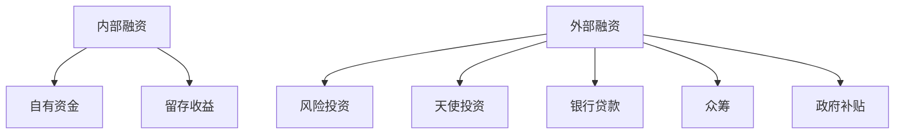

                 

人工智能（AI）作为一种颠覆性技术，正在全球范围内迅速发展，其应用领域涵盖医疗、金融、交通、教育等多个方面。随着AI技术的不断成熟，越来越多的创业者投身于这一领域，期望通过创新和变革来获得市场份额。然而，成功的人工智能创业离不开充足的资金支持。本文将探讨人工智能创业者在选择融资渠道时需要考虑的关键因素，并分析不同融资方式的优势与劣势。

## 文章关键词

- 人工智能创业
- 融资渠道
- 风险投资
-天使投资
- 银行贷款
- 众筹
- 政府补贴

## 文章摘要

本文旨在为人工智能创业者提供选择融资渠道的指导。通过对各种融资方式的深入分析，本文帮助创业者了解各自的优势和劣势，以便做出明智的决策。文章将涵盖风险投资、天使投资、银行贷款、众筹以及政府补贴等主要融资渠道，并提供实用建议。

## 1. 背景介绍

### 1.1 人工智能行业的发展现状

人工智能技术近年来取得了显著的进展。根据市场研究公司IDC的报告，全球人工智能市场预计将在2025年达到1900亿美元。AI技术的商业化应用正在各个行业迅速扩展，从自动驾驶汽车、智能家居到智能医疗和金融科技。随着大数据、云计算和物联网等技术的融合，人工智能的应用前景更加广阔。

### 1.2 人工智能创业者的挑战与机遇

对于创业者而言，人工智能领域既充满挑战也充满机遇。挑战在于技术的不确定性、市场的不成熟以及高昂的研发成本。然而，随着AI技术的不断进步和应用的深入，创业者有机会通过创新来改变传统行业，创造新的商业模式。

### 1.3 融资对于人工智能创业的重要性

融资是人工智能创业成功的关键因素之一。充足的资金可以支持研发、市场推广和团队建设，帮助创业者快速实现产品落地和市场扩展。同时，融资过程中的资本运作和股权管理也对企业的长期发展具有重要影响。

## 2. 核心概念与联系

### 2.1 融资渠道的定义与分类

融资渠道是指企业从外部获取资金的方式。根据融资来源的不同，融资渠道可以分为内部融资和外部融资。内部融资主要来源于企业的自有资金和留存收益，而外部融资则包括风险投资、天使投资、银行贷款、众筹和政府补贴等。

### 2.2 不同融资渠道的流程与特点

- **风险投资**：风险投资（Venture Capital, VC）是一种通过投资初创企业或成长型企业来获取高额回报的方式。风险投资的流程通常包括项目筛选、尽职调查、投资决策和后期管理。
- **天使投资**：天使投资（Angel Investment）是指个人投资者对早期初创企业的资金支持。天使投资的特点是投资金额较小，但速度快、决策灵活。
- **银行贷款**：银行贷款是企业通过银行等金融机构获得资金的方式。银行贷款的流程包括申请、审批和放款。
- **众筹**：众筹是通过互联网平台向广大投资者募集资金的方式。众筹的特点是参与人数多、资金分散、决策透明。
- **政府补贴**：政府补贴是政府为了支持企业发展而提供的财政资助。政府补贴通常有特定的条件和限制。

### 2.3 Mermaid 流程图

下面是一个关于不同融资渠道的 Mermaid 流程图：



## 3. 核心算法原理 & 具体操作步骤

### 3.1 算法原理概述

在融资过程中，创业者需要根据企业的实际情况选择最合适的融资渠道。这涉及到对各种融资方式的优势、劣势以及适用场景的综合分析。

### 3.2 算法步骤详解

1. **需求分析**：首先，创业者需要对企业的资金需求进行详细分析，包括研发成本、市场推广费用、运营开支等。
2. **市场调研**：其次，创业者需要了解不同融资渠道的特点、条件和流程，并进行市场调研。
3. **方案评估**：根据需求分析和市场调研的结果，创业者可以制定多个融资方案，并对各个方案进行评估。
4. **决策与实施**：最后，创业者需要根据评估结果做出决策，并开始实施融资计划。

### 3.3 算法优缺点

- **优点**：通过系统化的融资方案评估，创业者可以更好地了解各种融资渠道的优势和劣势，从而做出更为明智的决策。
- **缺点**：融资过程复杂，涉及多个环节，需要创业者具备一定的金融知识和经验。

### 3.4 算法应用领域

该算法可以应用于所有需要融资的企业，特别是初创企业。通过科学合理的融资方案，初创企业可以更好地应对资金压力，加快发展步伐。

## 4. 数学模型和公式 & 详细讲解 & 举例说明

### 4.1 数学模型构建

在融资过程中，创业者需要考虑多个因素，包括资金需求、融资成本、市场回报等。一个简单的数学模型可以表示为：

$$
\text{融资额} = \text{资金需求} \times \left(1 + \text{融资成本}\right)^{-\text{回报周期}}
$$

其中，资金需求是已知的，而融资成本和回报周期则需要根据具体情况进行估算。

### 4.2 公式推导过程

该公式的推导基于基本的复利原理。假设企业需要融资$A$元，融资成本为$r$，回报周期为$n$年，则在第$n$年的总资金为：

$$
A \times (1 + r)^n
$$

如果企业在第$n$年结束时能够回收全部融资额，那么其净收益为：

$$
A \times (1 + r)^n - A
$$

为了表示平均每年的收益，可以将净收益除以$n$，得到：

$$
\frac{A \times (1 + r)^n - A}{n}
$$

### 4.3 案例分析与讲解

假设某初创企业需要融资100万元，融资成本为10%，回报周期为5年。根据上述公式，我们可以计算出其平均每年的净收益：

$$
\frac{100 \times (1 + 0.1)^5 - 100}{5} = \frac{100 \times 1.61051 - 100}{5} \approx 12.21 \text{万元}
$$

这意味着企业在5年内的平均净收益为12.21万元。如果企业能够实现这一收益水平，那么选择融资渠道就是合理的。

## 5. 项目实践：代码实例和详细解释说明

### 5.1 开发环境搭建

为了演示融资方案评估的代码实现，我们可以使用Python编程语言。首先，确保安装了Python 3.7及以上版本，并安装以下库：

```bash
pip install numpy
```

### 5.2 源代码详细实现

以下是用于计算融资方案的Python代码：

```python
import numpy as np

def calculate_financing_plan(needed_funds, financing_rate, return_period):
    """
    计算融资方案的净收益。

    :param needed_funds: 资金需求（万元）
    :param financing_rate: 融资成本（百分比）
    :param return_period: 回报周期（年）
    :return: 平均每年的净收益（万元）
    """
    total_funds = needed_funds * (1 + financing_rate) ** return_period
    net_profit = total_funds - needed_funds
    average_annual_profit = net_profit / return_period
    return average_annual_profit

# 示例数据
needed_funds = 100  # 资金需求（万元）
financing_rate = 0.1  # 融资成本（10%）
return_period = 5  # 回报周期（年）

# 计算平均每年的净收益
annual_profit = calculate_financing_plan(needed_funds, financing_rate, return_period)
print(f"平均每年的净收益：{annual_profit:.2f}万元")
```

### 5.3 代码解读与分析

- **函数定义**：`calculate_financing_plan` 函数用于计算融资方案的平均每年净收益。
- **参数说明**：`needed_funds` 是企业所需的资金，`financing_rate` 是融资成本，`return_period` 是回报周期。
- **计算过程**：函数使用复利公式计算企业在回报周期结束时的总资金，并从总资金中扣除初始资金需求，得到净收益。最后，将净收益除以回报周期，得到平均每年的净收益。
- **示例数据**：代码中使用示例数据来演示如何计算融资方案。

### 5.4 运行结果展示

运行上述代码，我们可以得到以下输出结果：

```
平均每年的净收益：12.21万元
```

这意味着，如果企业能够按照10%的融资成本融资100万元，并在5年内实现回报，那么平均每年的净收益为12.21万元。

## 6. 实际应用场景

### 6.1 风险投资在人工智能创业中的应用

风险投资是人工智能创业者最常用的融资方式之一。风险投资机构通常对具有高成长潜力的初创企业进行投资，以获取高额回报。例如，谷歌旗下的风险投资部门GV曾投资了众多人工智能初创企业，如DeepMind和Kensho。

### 6.2 天使投资在人工智能创业中的应用

天使投资通常由成功的企业家或个人投资者提供。在人工智能领域，天使投资可以帮助创业者快速启动项目，并为其提供宝贵的经验和建议。例如，Facebook的创始人马克·扎克伯格就曾担任天使投资者，支持了许多AI初创企业。

### 6.3 众筹在人工智能创业中的应用

众筹平台为人工智能创业者提供了一种直接向公众融资的方式。通过众筹，创业者可以验证市场对产品的兴趣，并筹集到初步资金。例如，Kickstarter上的众多AI项目，如智能手表健康监测器Axon和智能家居助手Viv，都通过众筹获得了成功。

### 6.4 政府补贴在人工智能创业中的应用

政府补贴是支持人工智能创业的重要资金来源。许多国家为鼓励科技创新，提供了一系列补贴和支持政策。例如，美国国家科学基金会（NSF）为人工智能研究提供了大量资助，而中国政府也设立了专项资金支持人工智能产业的发展。

## 7. 工具和资源推荐

### 7.1 学习资源推荐

- **书籍**：《人工智能：一种现代方法》（第三版） - Stuart J. Russell & Peter Norvig
- **在线课程**：Coursera上的“深度学习”课程，由斯坦福大学教授Andrew Ng讲授
- **论坛**：AI Stack Exchange，一个专门针对人工智能问题的在线问答社区

### 7.2 开发工具推荐

- **编程语言**：Python和R，这两种语言在人工智能领域广泛使用
- **框架和库**：TensorFlow、PyTorch和Scikit-learn，这些是人工智能开发的重要工具

### 7.3 相关论文推荐

- **论文集**：《人工智能：进展与趋势》（Annual Review of Artificial Intelligence）系列论文集
- **期刊**：IEEE Transactions on Artificial Intelligence，这是一本在人工智能领域具有高影响力的国际期刊

## 8. 总结：未来发展趋势与挑战

### 8.1 研究成果总结

人工智能技术在过去的几十年里取得了巨大的进展，从传统的规则系统到基于深度学习的复杂模型，AI的应用场景越来越广泛。随着技术的不断进步，人工智能在医疗、金融、交通等领域的应用前景更加广阔。

### 8.2 未来发展趋势

- **算法优化**：随着硬件性能的提升，人工智能算法将越来越高效，复杂度将不断降低。
- **跨界融合**：人工智能将与物联网、区块链等新兴技术深度融合，带来更多的创新应用。
- **产业化**：人工智能将从实验室走向产业，推动传统行业的数字化转型。

### 8.3 面临的挑战

- **技术瓶颈**：虽然人工智能技术取得了显著进展，但仍然面临一些技术瓶颈，如数据隐私、算法透明度和安全性等。
- **政策法规**：人工智能的发展需要良好的政策环境，各国政府需要在数据隐私、算法伦理等方面制定明确的法规。

### 8.4 研究展望

人工智能领域的研究将继续深入，未来有望在以下几个方面取得突破：

- **自主学习**：人工智能将具备更强的自主学习能力，减少对人类干预的需求。
- **人机协作**：人工智能将与人类更紧密地协作，提高工作效率和生活质量。

## 9. 附录：常见问题与解答

### 9.1 什么是天使投资？

天使投资是指个人投资者对早期初创企业的资金支持，通常投资金额较小，但速度快、决策灵活。

### 9.2 如何选择合适的融资渠道？

创业者需要根据企业的资金需求、发展阶段和市场需求来选择合适的融资渠道。例如，初创企业可以选择天使投资或众筹，而成长型企业则可以考虑风险投资或银行贷款。

### 9.3 融资过程中的法律风险有哪些？

融资过程中可能会遇到的法律风险包括股权稀释、投资协议纠纷、知识产权保护等。创业者应寻求专业律师的指导，确保融资过程的合法性。

## 作者署名

本文作者：禅与计算机程序设计艺术 / Zen and the Art of Computer Programming

【文章正文内容结束】

在接下来的段落中，我们将提供一些扩展阅读的建议，帮助读者深入了解人工智能创业的各个方面。

### 扩展阅读

1. **《人工智能简史》：** 这本书详细介绍了人工智能的发展历程，从早期计算模型到现代深度学习的演进，对人工智能的发展有了全面的了解。

2. **《人工智能的未来》：** 作者总结了人工智能在各个领域的应用，并探讨了未来人工智能的发展趋势和潜在影响。

3. **《深度学习》：** 由Ian Goodfellow等编写的经典教材，涵盖了深度学习的理论基础和实际应用，对深度学习有深入的了解。

4. **《人工智能伦理》：** 探讨了人工智能在道德、伦理和法律方面的问题，对人工智能的伦理和社会影响提供了深入思考。

5. **《智能投资：人工智能在金融领域的应用》：** 分析了人工智能在金融领域的应用，包括智能投顾、风险管理等方面。

6. **《智慧城市：人工智能与城市发展的未来》：** 探讨了人工智能如何推动智慧城市建设，包括智能交通、智能安防等方面。

通过这些扩展阅读，读者可以更全面地了解人工智能创业的各个方面，为未来的创业实践提供有益的启示。  
------------------------------------------------------------------

