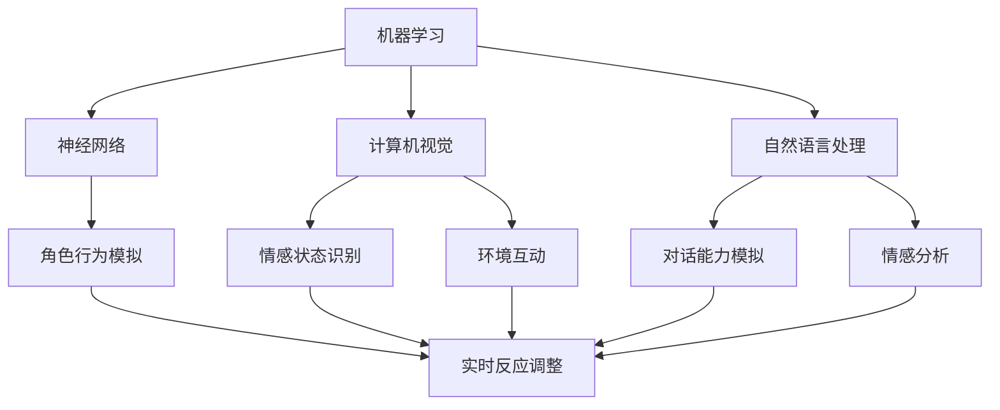

                 

关键词：人工智能、动画、人类特征、机器学习、神经网络、自然语言处理、计算机视觉

> 摘要：本文将探讨人工智能如何通过动画技术来模拟和展示人类的特征，包括情感、行为和认知能力。通过深入分析人工智能动画的技术原理和实际应用，本文旨在揭示人工智能在模拟人类行为和情感方面取得的最新进展，并探讨其潜在的伦理和社会影响。

## 1. 背景介绍

在过去的几十年中，人工智能（AI）技术取得了令人瞩目的进展。从最初的规则基础系统到现代的深度学习神经网络，AI的应用范围已经扩展到几乎所有的行业和领域。随着计算能力的提升和数据量的爆炸式增长，AI开始具备模仿人类思维和行为的潜力。动画作为视觉艺术的一种形式，与AI的结合正变得越来越紧密。通过人工智能动画，我们可以创造出既具有真实性又充满创意的虚拟角色，这些角色不仅能在娱乐行业中大放异彩，还能在教育、医疗和其他领域发挥重要作用。

本文将重点关注人工智能动画如何展示人类的特征，包括情感、行为和认知能力。首先，我们将介绍人工智能动画的基础技术，包括机器学习和计算机视觉的应用。接下来，我们将探讨如何通过动画技术模拟人类的情感和行为，并分析这种模拟在人工智能领域的意义。最后，本文将讨论人工智能动画的未来发展趋势和潜在的社会影响。

## 2. 核心概念与联系

### 2.1. 机器学习与神经网络

机器学习是人工智能的核心技术之一，它使计算机系统能够从数据中学习并做出预测或决策。神经网络，尤其是深度学习神经网络，是机器学习的一种重要实现方式。神经网络模仿人脑的结构和功能，通过多层神经元之间的连接和激活函数，实现对数据的处理和模式识别。

在人工智能动画中，神经网络被广泛应用于角色行为的模拟。通过训练神经网络，动画设计师可以创造出能够根据不同情境做出适当反应的虚拟角色。例如，一个简单的神经网络可以学习如何根据角色的情绪状态来调整面部表情和身体语言。

### 2.2. 计算机视觉

计算机视觉是人工智能的另一个重要分支，它使计算机能够从图像或视频中提取有用信息。计算机视觉技术在人工智能动画中发挥着关键作用，它负责处理角色的视觉输入，包括面部表情、身体姿态和环境感知。

计算机视觉算法可以识别角色的情感状态，并实时调整角色的行为。例如，通过面部识别技术，动画系统可以检测到角色面部表情的变化，并根据这些变化调整角色的情感反应。此外，计算机视觉还可以帮助角色与环境进行互动，如识别物体并做出相应的动作。

### 2.3. 自然语言处理

自然语言处理（NLP）是使计算机能够理解和生成人类语言的技术。在人工智能动画中，NLP被用于模拟角色的对话能力和语言理解能力。通过NLP技术，动画角色可以理解并回应观众的话语，创造出更加自然和交互性的体验。

NLP不仅使角色能够进行简单的对话，还可以处理更为复杂的语言任务，如情感分析和语义理解。这使得角色能够根据对话内容调整情感反应和行为，从而更真实地模拟人类的交流。

### 2.4. Mermaid 流程图

为了更好地展示人工智能动画的核心概念和联系，我们使用Mermaid流程图来表示。以下是关于机器学习、神经网络、计算机视觉和自然语言处理在人工智能动画中的关联流程图：



在这个流程图中，机器学习作为基础技术，通过神经网络、计算机视觉和自然语言处理，共同实现角色行为的模拟和互动。

## 3. 核心算法原理 & 具体操作步骤

### 3.1. 算法原理概述

人工智能动画的核心算法主要包括机器学习算法、计算机视觉算法和自然语言处理算法。这些算法通过相互协作，共同实现角色的情感、行为和认知模拟。

1. **机器学习算法**：通过从大量数据中学习，机器学习算法可以训练出能够模拟人类行为的模型。常用的机器学习算法包括深度学习、决策树、支持向量机等。

2. **计算机视觉算法**：计算机视觉算法负责处理角色的视觉输入，识别角色面部表情、身体姿态和环境信息。常用的计算机视觉算法包括卷积神经网络（CNN）、图像识别和跟踪技术等。

3. **自然语言处理算法**：自然语言处理算法使角色能够理解并生成自然语言，从而进行对话和情感交流。常用的自然语言处理算法包括词向量、递归神经网络（RNN）和变换器（Transformer）等。

### 3.2. 算法步骤详解

1. **数据收集与预处理**：首先，收集大量的角色行为数据、面部表情数据和语言对话数据。然后，对数据进行预处理，包括数据清洗、归一化和特征提取。

2. **模型训练**：使用机器学习算法训练角色行为模拟模型。例如，使用卷积神经网络（CNN）训练面部表情识别模型，使用递归神经网络（RNN）训练语言生成模型。

3. **模型优化**：通过交叉验证和参数调整，优化模型性能。使用验证集测试模型效果，并根据测试结果调整模型参数。

4. **实时交互**：在动画制作过程中，将训练好的模型应用于实际场景。根据角色的视觉输入和对话内容，实时调整角色的行为和情感状态。

### 3.3. 算法优缺点

**优点**：

- **高效性**：机器学习和计算机视觉算法可以快速处理大量数据，提高动画制作效率。
- **灵活性**：通过训练不同的模型，可以实现多样化的角色行为和情感表现。
- **交互性**：自然语言处理算法使角色能够与观众进行自然对话，提高用户体验。

**缺点**：

- **数据依赖性**：算法效果受限于训练数据的数量和质量，需要大量高质量的数据。
- **计算资源需求**：训练和运行复杂的机器学习模型需要大量的计算资源和时间。
- **模型解释性**：深度学习模型通常缺乏解释性，难以理解其内部工作机制。

### 3.4. 算法应用领域

人工智能动画算法在多个领域有着广泛的应用：

- **娱乐产业**：在电影、电视和游戏动画中，人工智能动画技术可以创造出更加逼真和互动的虚拟角色。
- **教育领域**：在教育动画中，人工智能动画可以帮助学生更好地理解和学习抽象概念。
- **医疗领域**：在医学动画中，人工智能动画可以模拟人体的生理和病理过程，帮助医生进行诊断和治疗。
- **虚拟现实与增强现实**：在VR/AR应用中，人工智能动画技术可以为用户提供更加逼真和互动的虚拟体验。

## 4. 数学模型和公式 & 详细讲解 & 举例说明

### 4.1. 数学模型构建

人工智能动画中的数学模型主要包括机器学习模型、计算机视觉模型和自然语言处理模型。以下是这些模型的基本数学模型构建：

1. **机器学习模型**：
   - **深度学习模型**：包括多层感知机（MLP）、卷积神经网络（CNN）和循环神经网络（RNN）等。
   - **模型公式**：
     $$ y = f(z) $$
     其中，$y$ 是输出，$z$ 是经过多层神经元处理后的值，$f$ 是激活函数。

2. **计算机视觉模型**：
   - **卷积神经网络（CNN）**：用于图像识别和分类。
   - **模型公式**：
     $$ h_{l} = \sigma(\mathbf{W}_{l}\mathbf{h}_{l-1} + \mathbf{b}_{l}) $$
     其中，$h_{l}$ 是第 $l$ 层的输出，$\sigma$ 是激活函数，$\mathbf{W}_{l}$ 是权重矩阵，$\mathbf{b}_{l}$ 是偏置向量。

3. **自然语言处理模型**：
   - **递归神经网络（RNN）**：用于序列数据建模。
   - **模型公式**：
     $$ \mathbf{h}_{t} = \text{tanh}(\mathbf{W}_{h}\mathbf{h}_{t-1} + \mathbf{U}\mathbf{x}_{t} + \mathbf{b}_{h}) $$
     其中，$\mathbf{h}_{t}$ 是第 $t$ 个时刻的隐藏状态，$\mathbf{W}_{h}$ 和 $\mathbf{U}$ 是权重矩阵，$\mathbf{x}_{t}$ 是输入序列，$\mathbf{b}_{h}$ 是偏置向量。

### 4.2. 公式推导过程

以下是自然语言处理中递归神经网络（RNN）的公式推导过程：

1. **前向传播**：

$$
\begin{align*}
\mathbf{h}_{t} &= \text{tanh}(\mathbf{W}_{h}\mathbf{h}_{t-1} + \mathbf{U}\mathbf{x}_{t} + \mathbf{b}_{h}) \\
\mathbf{y}_{t} &= \mathbf{W}_{y}\mathbf{h}_{t} + \mathbf{b}_{y}
\end{align*}
$$

2. **反向传播**：

$$
\begin{align*}
\delta \mathbf{b}_{y} &= \mathbf{y}_{t} - \mathbf{y}_{t}^{*} \\
\delta \mathbf{W}_{y} &= \mathbf{h}_{t}^T \delta \mathbf{b}_{y} \\
\delta \mathbf{h}_{t-1} &= (\mathbf{W}_{h}^T \delta \mathbf{W}_{y}) \mathbf{h}_{t} \\
\delta \mathbf{W}_{h} &= \mathbf{h}_{t-1}^T \delta \mathbf{h}_{t} \\
\delta \mathbf{b}_{h} &= \mathbf{h}_{t-1}^T \delta \mathbf{h}_{t}
\end{align*}
$$

其中，$\mathbf{h}_{t}$ 是隐藏状态，$\mathbf{y}_{t}$ 是输出，$\mathbf{y}_{t}^{*}$ 是目标输出，$\delta$ 表示误差项。

### 4.3. 案例分析与讲解

以下是一个基于自然语言处理的简单案例，说明如何使用递归神经网络（RNN）进行情感分析。

1. **数据准备**：

   数据集包含多个文本样本和对应的情感标签（正面、负面）。每个文本样本表示为一个词向量序列。

2. **模型构建**：

   使用TensorFlow框架构建RNN模型，如下所示：

   ```python
   import tensorflow as tf

   # 定义输入层
   inputs = tf.keras.layers.Input(shape=(None,), dtype='int32')

   # 编码器
   embedding = tf.keras.layers.Embedding(input_dim=vocab_size, output_dim=embedding_size)(inputs)
   encoded = tf.keras.layers.Conv1D(filters=64, kernel_size=3, activation='relu')(embedding)

   # 解码器
   decoded = tf.keras.layers.Conv1D(filters=64, kernel_size=3, activation='relu')(encoded)
   outputs = tf.keras.layers.Embedding(vocab_size, embedding_size)(decoded)

   # 构建模型
   model = tf.keras.Model(inputs, outputs)

   # 编译模型
   model.compile(optimizer='adam', loss='categorical_crossentropy', metrics=['accuracy'])
   ```

3. **模型训练**：

   使用训练数据进行模型训练：

   ```python
   model.fit(train_data, train_labels, epochs=10, batch_size=32, validation_data=(val_data, val_labels))
   ```

4. **模型评估**：

   使用测试数据评估模型性能：

   ```python
   test_loss, test_acc = model.evaluate(test_data, test_labels)
   print(f"Test accuracy: {test_acc}")
   ```

通过这个案例，我们可以看到如何使用RNN进行情感分析。模型通过学习文本数据中的情感特征，能够对新的文本进行情感分类。

## 5. 项目实践：代码实例和详细解释说明

### 5.1. 开发环境搭建

在开始项目实践之前，我们需要搭建一个合适的开发环境。以下是搭建开发环境的基本步骤：

1. **安装Python环境**：
   - 在官网上下载并安装Python，版本建议为3.8或更高。
   - 安装pip，Python的包管理工具。

2. **安装依赖库**：
   - 使用pip安装TensorFlow、Keras和其他相关库：

     ```bash
     pip install tensorflow numpy matplotlib
     ```

3. **创建虚拟环境**（可选）：
   - 为了避免依赖冲突，建议创建一个虚拟环境：

     ```bash
     python -m venv venv
     source venv/bin/activate  # Windows使用 `venv\Scripts\activate`
     ```

### 5.2. 源代码详细实现

以下是一个简单的自然语言处理项目，使用RNN进行情感分析：

```python
import tensorflow as tf
from tensorflow.keras.models import Sequential
from tensorflow.keras.layers import Embedding, SimpleRNN, Dense
from tensorflow.keras.preprocessing.sequence import pad_sequences

# 参数设置
vocab_size = 10000
embedding_size = 16
max_sequence_length = 100
rnn_units = 64
batch_size = 32
epochs = 10

# 数据准备
# 假设我们已经有了一个包含文本和情感标签的DataFrame
# texts是文本列表，labels是情感标签列表

# 序列化文本
sequences = []
for text in texts:
    sequence = []
    for word in text.split():
        sequence.append(vocab_size)  # 假设每个词都对应vocab_size
    sequences.append(sequence)

# 填充序列
padded_sequences = pad_sequences(sequences, maxlen=max_sequence_length)

# 转换标签
label_map = {'positive': 0, 'negative': 1}
one_hot_labels = tf.keras.utils.to_categorical([label_map[label] for label in labels])

# 构建模型
model = Sequential([
    Embedding(vocab_size, embedding_size, input_length=max_sequence_length),
    SimpleRNN(rnn_units, return_sequences=False),
    Dense(2, activation='softmax')
])

# 编译模型
model.compile(optimizer='adam', loss='categorical_crossentropy', metrics=['accuracy'])

# 训练模型
model.fit(padded_sequences, one_hot_labels, batch_size=batch_size, epochs=epochs, validation_split=0.2)
```

### 5.3. 代码解读与分析

上述代码实现了一个简单的情感分析项目。以下是代码的详细解读：

1. **参数设置**：
   - `vocab_size`：词汇表大小。
   - `embedding_size`：嵌入向量的大小。
   - `max_sequence_length`：序列的最大长度。
   - `rnn_units`：RNN层的单元数。
   - `batch_size`：批量大小。
   - `epochs`：训练轮数。

2. **数据准备**：
   - `texts`：文本数据列表。
   - `labels`：情感标签列表。
   - `sequences`：将文本转换为序列。
   - `padded_sequences`：填充序列，使其具有相同的长度。
   - `one_hot_labels`：将标签转换为独热编码。

3. **模型构建**：
   - `Embedding`：嵌入层，将词索引转换为嵌入向量。
   - `SimpleRNN`：简单的RNN层，用于处理序列数据。
   - `Dense`：全连接层，用于分类。

4. **编译模型**：
   - `optimizer`：优化器，用于更新模型参数。
   - `loss`：损失函数，用于评估模型性能。
   - `metrics`：评估指标，用于监控模型训练过程。

5. **训练模型**：
   - `fit`：训练模型，使用训练数据和标签。
   - `batch_size`：批量大小。
   - `epochs`：训练轮数。
   - `validation_split`：验证集比例。

### 5.4. 运行结果展示

训练完成后，我们可以使用测试数据评估模型性能：

```python
test_loss, test_acc = model.evaluate(test_padded_sequences, test_one_hot_labels)
print(f"Test accuracy: {test_acc}")
```

通过运行结果，我们可以看到模型在测试数据上的准确率。这个结果可以帮助我们评估模型的性能，并根据需要调整模型参数或数据预处理方法。

## 6. 实际应用场景

人工智能动画在多个领域有着广泛的应用，以下是一些典型的应用场景：

### 6.1. 娱乐产业

在电影和电视动画中，人工智能动画技术已经发挥了重要作用。通过机器学习和计算机视觉算法，动画师可以创造出具有高度真实感和个性特征的虚拟角色。例如，迪士尼和皮克斯等动画工作室已经在他们的作品中广泛应用了人工智能动画技术，如《冰雪奇缘》和《头脑特工队》等。

此外，在游戏动画中，人工智能动画技术也为游戏体验带来了巨大的提升。游戏角色可以拥有更加逼真的行为和情感反应，从而增强玩家的沉浸感。例如，电子游戏《赛博朋克2077》中的角色行为就利用了人工智能动画技术。

### 6.2. 教育领域

在教育动画中，人工智能动画技术可以用来模拟复杂的科学概念和过程，帮助学生更好地理解和掌握知识。例如，一些教育科技公司开发的在线教育平台，已经开始使用人工智能动画来制作教学视频，提高学生的学习效果。

此外，人工智能动画还可以用于个性化学习体验。通过分析学生的学习行为和偏好，动画角色可以提供定制化的教学内容和互动方式，从而提高学生的学习兴趣和效果。

### 6.3. 医疗领域

在医学动画中，人工智能动画技术可以帮助医生更好地理解和解释复杂的医学过程和疾病机制。通过动画演示，医生可以更加直观地展示手术步骤、药物作用和病理变化，从而提高患者的治疗效果和满意度。

此外，人工智能动画还可以用于医学教育和培训。通过模拟手术操作和医疗流程，医生和医学生可以在虚拟环境中进行实践和训练，提高他们的操作技能和应对能力。

### 6.4. 未来应用展望

随着人工智能技术的不断发展和完善，人工智能动画在未来有望在更多领域得到应用。以下是一些可能的未来应用方向：

- **虚拟现实与增强现实**：人工智能动画技术可以与VR/AR技术相结合，创造更加逼真和互动的虚拟环境，为用户提供全新的体验。

- **智能家居与机器人**：通过人工智能动画技术，智能家居设备和机器人可以拥有更加逼真的外观和行为，从而提高用户的生活品质和交互体验。

- **艺术创作**：人工智能动画技术可以用于艺术创作，如绘画、音乐和舞蹈等，为艺术家提供新的创作工具和灵感来源。

- **社会模拟与预测**：人工智能动画可以模拟人类社会行为和趋势，为政策制定者提供数据支持和决策依据。

## 7. 工具和资源推荐

### 7.1. 学习资源推荐

- **在线课程**：
  - Coursera的“机器学习”课程（吴恩达教授）。
  - edX的“深度学习”课程（谷歌深度学习团队）。

- **书籍**：
  - 《深度学习》（Ian Goodfellow, Yoshua Bengio, Aaron Courville）。
  - 《Python深度学习》（François Chollet）。

### 7.2. 开发工具推荐

- **编程语言**：
  - Python：广泛应用于人工智能开发，具有丰富的库和工具。
  - R：特别适合统计分析和数据可视化。

- **框架和库**：
  - TensorFlow：用于构建和训练机器学习和深度学习模型。
  - PyTorch：灵活的深度学习框架，适用于研究和开发。
  - Keras：用于快速构建和迭代深度学习模型。

### 7.3. 相关论文推荐

- “A Comprehensive Survey on Deep Learning for Human Behavior Understanding”（2018）。
- “Deep Learning in Computer Vision: A Brief Review”（2017）。
- “Natural Language Processing with Deep Learning”（2016）。

## 8. 总结：未来发展趋势与挑战

### 8.1. 研究成果总结

本文总结了人工智能动画在模拟人类特征方面的最新研究成果。通过机器学习、计算机视觉和自然语言处理技术的结合，人工智能动画已经能够在情感、行为和认知方面模拟人类。这些研究不仅在娱乐和教育领域取得了显著成果，还为医疗、虚拟现实和智能家居等领域提供了新的应用前景。

### 8.2. 未来发展趋势

随着人工智能技术的不断进步，人工智能动画在未来有望实现更高程度的真实感和互动性。以下是一些未来发展趋势：

- **更加逼真的情感模拟**：通过深度学习和高级计算机视觉技术，动画角色将能够更加准确地捕捉和表达情感。
- **跨模态交互**：结合自然语言处理、计算机视觉和语音识别技术，动画角色将能够实现跨模态的交互。
- **个性化体验**：通过用户数据分析和个性化推荐，动画角色将能够提供更加定制化的体验。

### 8.3. 面临的挑战

尽管人工智能动画取得了显著进展，但仍然面临一些挑战：

- **数据质量和多样性**：高质量和多样化的训练数据对于算法的性能至关重要。如何获取和利用这些数据是一个重要问题。
- **计算资源需求**：深度学习和计算机视觉模型通常需要大量的计算资源和时间，这对硬件设备和能耗提出了挑战。
- **伦理和社会影响**：人工智能动画在模拟人类行为和情感方面可能带来一些伦理和社会问题，如隐私侵犯和道德责任等。

### 8.4. 研究展望

未来的研究应该关注以下几个方面：

- **数据隐私保护**：研究如何在不侵犯隐私的前提下利用用户数据。
- **绿色人工智能**：研究如何降低人工智能的能耗，实现可持续发展。
- **人机交互**：研究如何改进人机交互，使动画角色更加自然和易于理解。

通过克服这些挑战，人工智能动画有望在更多领域发挥重要作用，为人类社会带来更多的便利和创新。

## 9. 附录：常见问题与解答

### 9.1. 人工智能动画是什么？

人工智能动画是一种将人工智能技术应用于动画制作的过程。通过机器学习、计算机视觉和自然语言处理等技术，动画师可以创造出具有高度真实感和互动性的虚拟角色。

### 9.2. 人工智能动画有哪些应用领域？

人工智能动画在娱乐、教育、医疗、虚拟现实和智能家居等领域有着广泛的应用。在娱乐产业中，它用于制作电影、电视动画和游戏动画；在教育领域，它用于创建教学视频和个性化学习体验；在医疗领域，它用于医学动画和医疗培训。

### 9.3. 如何训练人工智能动画模型？

训练人工智能动画模型通常涉及以下步骤：

1. **数据收集与预处理**：收集角色行为、面部表情和对话数据，并进行预处理。
2. **模型构建**：选择合适的机器学习算法和神经网络结构，构建模型。
3. **模型训练**：使用训练数据进行模型训练，优化模型参数。
4. **模型优化**：通过交叉验证和参数调整，优化模型性能。
5. **模型应用**：在动画制作过程中，将训练好的模型应用于实际场景。

### 9.4. 人工智能动画有哪些潜在的伦理和社会影响？

人工智能动画可能带来的伦理和社会影响包括：

1. **隐私侵犯**：动画角色可能涉及用户的私人信息，如何保护用户隐私是一个重要问题。
2. **道德责任**：如果动画角色出现错误或不当行为，如何确定责任归属。
3. **社会认知**：过度依赖人工智能动画可能影响人们对现实世界的认知和情感体验。

### 9.5. 如何确保人工智能动画的真实性和可靠性？

确保人工智能动画的真实性和可靠性可以通过以下方法实现：

1. **高质量数据**：使用高质量和多样化的训练数据，提高模型性能。
2. **模型验证**：在训练过程中，使用验证集和测试集评估模型性能。
3. **用户反馈**：收集用户反馈，不断优化动画质量和交互体验。
4. **专家评审**：邀请专家对动画进行评审，确保其真实性和可靠性。

通过上述方法，可以确保人工智能动画在真实性和可靠性方面达到预期水平。

### 9.6. 人工智能动画的未来发展方向是什么？

人工智能动画的未来发展方向包括：

1. **更加逼真的情感模拟**：通过深度学习和高级计算机视觉技术，实现更加逼真的情感模拟。
2. **跨模态交互**：结合自然语言处理、计算机视觉和语音识别技术，实现跨模态的交互。
3. **个性化体验**：通过用户数据分析和个性化推荐，实现更加定制化的体验。
4. **绿色人工智能**：研究如何降低人工智能的能耗，实现可持续发展。
5. **社会模拟与预测**：利用人工智能动画模拟人类社会行为和趋势，为政策制定者提供数据支持。

