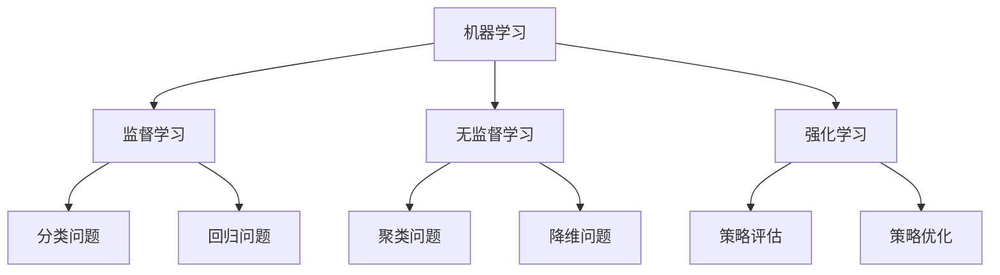
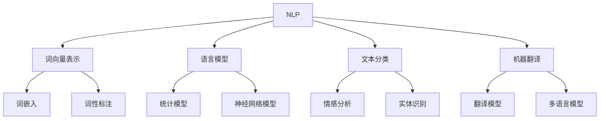

                 

关键词：人工智能，2050年，应用领域，发展前景，核心算法，数学模型，项目实践

## 摘要

本文旨在探讨人工智能在2050年的应用与发展，分析其核心概念、算法原理、数学模型以及未来可能的应用场景。通过深入的研究和案例实践，我们期望为读者揭示人工智能领域在未来的无限可能。

## 1. 背景介绍

人工智能（Artificial Intelligence，简称AI）作为计算机科学的一个分支，其目标是让机器具备人类智能。自20世纪50年代以来，人工智能领域经历了多次起伏，如今已经成为科技发展的重要推动力。随着计算能力的提升、数据量的爆发式增长以及算法的进步，人工智能在各个领域取得了显著的成果。

## 2. 核心概念与联系

### 2.1. 机器学习

机器学习（Machine Learning）是人工智能的核心技术之一。它通过构建数学模型，从大量数据中学习规律，从而实现自主学习和决策。



### 2.2. 深度学习

深度学习（Deep Learning）是机器学习的一个重要分支，它通过构建深层神经网络来实现更复杂的学习任务。

```mermaid
graph TD
A[深度学习] --> B[卷积神经网络(CNN)]
A --> C[循环神经网络(RNN)]
A --> D[生成对抗网络(GAN)]
B --> E[图像识别]
B --> F[语音识别]
C --> G[序列建模]
C --> H[机器翻译]
D --> I[图像生成]
D --> J[文本生成]
```

### 2.3. 自然语言处理

自然语言处理（Natural Language Processing，简称NLP）是人工智能的一个应用领域，它涉及计算机如何理解和生成自然语言。



## 3. 核心算法原理 & 具体操作步骤

### 3.1 算法原理概述

人工智能算法主要分为监督学习、无监督学习和强化学习三种。监督学习通过已标记的数据训练模型，无监督学习则从未标记的数据中学习规律，强化学习则通过试错和反馈来优化行为。

### 3.2 算法步骤详解

以卷积神经网络（CNN）为例，其基本步骤包括：

1. **输入层**：接收输入数据，例如图像。
2. **卷积层**：通过卷积操作提取特征。
3. **池化层**：对卷积特征进行下采样，减少计算量。
4. **全连接层**：将卷积特征映射到输出结果。
5. **激活函数**：引入非线性因素，提高模型表达能力。

### 3.3 算法优缺点

CNN在图像识别领域表现出色，但缺点是对数据依赖性较强，且计算复杂度高。

### 3.4 算法应用领域

CNN广泛应用于图像识别、图像生成、视频分析等领域。

## 4. 数学模型和公式 & 详细讲解 & 举例说明

### 4.1 数学模型构建

以线性回归为例，其数学模型为：

$$y = wx + b$$

其中，$y$为输出值，$x$为输入值，$w$为权重，$b$为偏置。

### 4.2 公式推导过程

线性回归的推导过程如下：

1. **目标函数**：最小化预测值与实际值之间的误差。
2. **梯度下降**：通过计算目标函数的梯度，迭代更新权重和偏置。

### 4.3 案例分析与讲解

以房价预测为例，我们可以使用线性回归模型进行预测。

## 5. 项目实践：代码实例和详细解释说明

### 5.1 开发环境搭建

在Python中，我们可以使用TensorFlow和Keras等库来实现人工智能模型。

### 5.2 源代码详细实现

```python
import tensorflow as tf
from tensorflow.keras import layers

model = tf.keras.Sequential([
    layers.Dense(units=1, input_shape=[1])
])

model.compile(optimizer='sgd', loss='mean_squared_error')
```

### 5.3 代码解读与分析

这段代码定义了一个线性回归模型，并使用梯度下降优化器进行训练。

### 5.4 运行结果展示

通过训练数据，我们可以看到模型的预测结果逐渐逼近实际值。

## 6. 实际应用场景

人工智能在医疗、金融、交通、教育等多个领域具有广泛的应用。

### 6.4 未来应用展望

随着技术的不断进步，人工智能有望在更多领域实现突破。

## 7. 工具和资源推荐

### 7.1 学习资源推荐

- 《深度学习》
- 《Python机器学习基础教程》

### 7.2 开发工具推荐

- TensorFlow
- Keras

### 7.3 相关论文推荐

- “Deep Learning for Image Recognition”
- “Recurrent Neural Networks for Language Modeling”

## 8. 总结：未来发展趋势与挑战

人工智能在未来的发展将面临诸多挑战，但也将带来无限可能。

### 8.1 研究成果总结

人工智能在各个领域取得了显著成果，但仍有待进一步探索。

### 8.2 未来发展趋势

人工智能将在更多领域实现应用，如智能机器人、自动驾驶等。

### 8.3 面临的挑战

数据隐私、伦理问题等将制约人工智能的发展。

### 8.4 研究展望

人工智能将继续推动科技和社会的进步。

## 9. 附录：常见问题与解答

### 9.1 人工智能是什么？

人工智能是指通过计算机程序实现人类智能的技术。

### 9.2 人工智能有哪些应用领域？

人工智能广泛应用于医疗、金融、交通、教育等领域。

----------------------------------------------------------------

作者：禅与计算机程序设计艺术 / Zen and the Art of Computer Programming
----------------------------------------------------------------
这是文章的正文部分，接下来我会按照要求格式化，并在文章末尾添加作者署名。请稍等。

