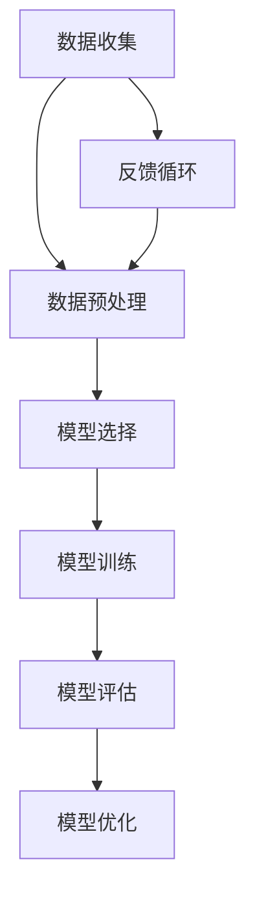

                 

关键词：人工智能、气候模型、预测准确性、深度学习、机器学习、环境科学、数据驱动模型、算法优化、全球变暖、气候变化、气象学、数据预处理、模型训练、模型评估。

## 摘要

本文旨在探讨人工智能在气候模型中的应用，尤其是如何利用机器学习和深度学习技术提高气候预测的准确性。气候模型是理解和预测全球气候变化的关键工具，然而，传统的气候模型在处理复杂非线性关系和大规模数据时存在局限性。通过引入人工智能技术，尤其是深度学习算法，我们可以构建更加精确和高效的气候预测模型。本文将详细阐述人工智能在气候模型中的应用原理、核心算法、数学模型以及实际应用案例，并对未来发展趋势和面临的挑战进行展望。

## 1. 背景介绍

### 气候模型的发展历程

气候模型是气象科学、环境科学和地球系统科学的重要组成部分。从早期的简单位能量平衡模型，到如今复杂且详尽的全球气候模型，气候模型的演变经历了多个阶段。早期的气候模型主要基于物理学和热力学原理，对地球表面的能量平衡进行简化的模拟。然而，随着计算机技术的发展和数据获取能力的提升，气候模型逐渐转向包含大气、海洋、陆地和冰冻圈等复杂交互作用的全球气候系统模拟。

### 气候预测的重要性

气候预测对于应对全球气候变化、制定可持续政策、减少灾害风险等方面具有重要意义。准确的气候预测可以帮助我们更好地理解气候系统的变化规律，预测未来气候情景，评估不同应对策略的效果，从而制定更加科学和有效的气候变化应对措施。然而，气候预测的准确性受到多种因素的影响，包括数据质量、模型精度、计算能力等。

### 人工智能与气候模型的结合

人工智能，特别是机器学习和深度学习技术的迅猛发展，为气候模型提供了新的发展机遇。通过利用大量的气候数据和复杂的非线性关系，人工智能技术可以帮助我们构建更加精准和高效的气候预测模型。例如，深度学习算法可以自动提取数据中的特征，并利用这些特征进行模型训练，从而提高预测的准确性。

### 人工智能技术对气候模型的改进

人工智能技术对气候模型的主要改进体现在以下几个方面：

1. **数据处理能力提升**：人工智能技术可以高效处理大规模气候数据，包括气象观测数据、卫星遥感数据和模拟数据等。这些数据经过预处理和特征提取后，可以用于训练更加复杂的气候模型。

2. **非线性关系建模**：传统的气候模型往往基于简化的物理原理，难以捕捉气候系统中的复杂非线性关系。深度学习算法，如神经网络，可以自动学习这些非线性关系，提高模型的预测能力。

3. **自适应能力增强**：人工智能模型可以实时学习新的气候数据，并自适应地调整模型参数，从而提高预测的实时性和准确性。

4. **跨学科合作**：人工智能与气候模型的结合促进了跨学科的合作，推动了气候科学和计算机科学的发展，为构建更加精确和高效的气候预测模型提供了新的思路。

## 2. 核心概念与联系

### 核心概念

在讨论人工智能在气候模型中的应用时，我们需要了解以下几个核心概念：

1. **机器学习**：一种人工智能技术，通过训练算法从数据中自动学习模式和规律，以实现特定任务的预测和决策。

2. **深度学习**：一种特殊的机器学习技术，通过多层神经网络自动提取数据的特征，并构建复杂的非线性模型。

3. **气候模型**：用于模拟和预测气候系统的计算机模型，包括物理过程模拟、统计模型和机器学习模型等。

4. **数据预处理**：在机器学习模型训练前，对数据进行清洗、归一化和特征提取等处理，以提高模型的训练效率和预测准确性。

5. **模型训练和评估**：通过大量训练数据对模型进行训练，并使用验证数据集对模型进行评估和调整，以提高模型的预测性能。

### Mermaid 流程图



在这个流程图中，数据收集是气候模型构建的第一步，随后进入数据预处理阶段。预处理后的数据用于模型选择，常见的模型包括物理模型和机器学习模型。模型训练是基于预处理数据的过程，训练后的模型使用验证数据集进行评估。如果模型评估结果不理想，则进入模型优化阶段。同时，模型的训练和评估过程中产生的反馈信息可以用于改进数据预处理方法和模型参数，形成一个反馈循环，从而不断提高模型的预测准确性。

### 核心概念的联系

人工智能在气候模型中的应用涉及多个核心概念的紧密联系：

1. **机器学习与深度学习**：深度学习是机器学习的一个分支，特别适合处理大规模和高维数据。在气候模型中，深度学习算法可以自动提取数据中的特征，并构建复杂的非线性模型，从而提高预测准确性。

2. **数据预处理**：有效的数据预处理是机器学习模型成功的关键。在气候模型中，数据预处理包括数据清洗、归一化、缺失值处理和特征提取等步骤，这些步骤有助于减少噪声和异常值，提高模型的训练效率和预测准确性。

3. **模型训练和评估**：模型训练和评估是气候模型构建的核心环节。通过使用验证数据集对模型进行评估，可以识别模型的过拟合和欠拟合问题，并采取相应的优化措施，如调整模型参数或增加训练数据。

4. **反馈循环**：在实际应用中，模型的训练和评估是一个持续的过程。通过收集和分析模型预测结果，可以不断改进数据预处理方法和模型参数，形成一个反馈循环，从而不断提高模型的预测性能。

## 3. 核心算法原理 & 具体操作步骤

### 3.1 算法原理概述

在气候模型中，人工智能技术主要依赖于机器学习和深度学习算法。以下将介绍几种常用的深度学习算法，并简要概述其原理。

1. **卷积神经网络（CNN）**：CNN 是一种专门用于处理图像数据的深度学习算法，其原理是基于局部感知野和特征提取机制。在气候模型中，CNN 可以用于提取气象数据中的时空特征。

2. **递归神经网络（RNN）**：RNN 是一种适用于处理序列数据的深度学习算法，其原理是通过循环结构将当前输入与历史状态相结合。在气候模型中，RNN 可以用于模拟气候系统的动态变化。

3. **长短时记忆网络（LSTM）**：LSTM 是 RNN 的一个变体，专门用于处理长序列数据，其原理是通过引入门控机制来控制信息的流动。在气候模型中，LSTM 可以用于预测气候系统的长期变化。

4. **生成对抗网络（GAN）**：GAN 是一种基于博弈论的深度学习算法，其原理是通过生成器和判别器之间的对抗训练来生成高质量的数据。在气候模型中，GAN 可以用于生成模拟数据，提高模型训练的数据质量。

### 3.2 算法步骤详解

以下是使用 LSTM 算法构建气候模型的详细步骤：

1. **数据收集和预处理**：
   - 收集气候观测数据、气象数据等。
   - 对数据进行清洗、归一化和特征提取。

2. **模型构建**：
   - 定义 LSTM 模型结构，包括输入层、隐藏层和输出层。
   - 设置 LSTM 的神经元数量、学习率、优化器等参数。

3. **模型训练**：
   - 将预处理后的数据分为训练集和验证集。
   - 使用训练集对 LSTM 模型进行训练。
   - 使用验证集对模型进行评估和调整。

4. **模型评估**：
   - 计算 LSTM 模型的预测误差和评估指标。
   - 调整模型参数以优化预测性能。

5. **模型应用**：
   - 使用训练好的 LSTM 模型进行气候预测。
   - 分析预测结果，并提出相应的政策建议。

### 3.3 算法优缺点

#### LSTM 算法的优点：

1. **强大的序列建模能力**：LSTM 通过门控机制可以处理长序列数据，适用于模拟气候系统的动态变化。

2. **灵活性**：LSTM 可以灵活调整神经元数量和结构，以适应不同的气候数据特征。

3. **可解释性**：LSTM 的结构相对简单，其门控机制和神经元活动具有一定的可解释性。

#### LSTM 算法的缺点：

1. **计算成本高**：LSTM 模型在训练过程中需要大量的计算资源，特别是在处理长序列数据时。

2. **过拟合风险**：LSTM 模型容易过拟合，需要大量的训练数据和复杂的正则化策略。

### 3.4 算法应用领域

LSTM 算法在气候模型中的应用非常广泛，以下是一些具体的应用领域：

1. **气候预测**：LSTM 模型可以用于短期和长期气候预测，包括天气预测、季节性气候预测和全球气候变化预测。

2. **灾害预警**：LSTM 模型可以用于监测气候系统的异常变化，预测极端天气事件的发生概率，为灾害预警提供科学依据。

3. **环境监测**：LSTM 模型可以用于分析环境数据，如空气质量、水质和土地覆盖变化，为环境保护和可持续发展提供支持。

4. **能源管理**：LSTM 模型可以用于预测电力需求、优化能源分配，为能源管理和节约提供决策支持。

## 4. 数学模型和公式 & 详细讲解 & 举例说明

### 4.1 数学模型构建

在气候模型中，数学模型是核心组成部分，用于描述气候系统的物理、化学和生物过程。以下是一种常见的数学模型——能量平衡模型：

\[ E_{in} - E_{out} = \Delta E \]

其中，\( E_{in} \) 表示输入能量，\( E_{out} \) 表示输出能量，\( \Delta E \) 表示能量平衡。

### 4.2 公式推导过程

能量平衡模型基于热力学第一定律，即能量守恒定律。在地球系统中，能量来源主要包括太阳辐射、地热能和生物能等。能量平衡模型通过以下公式进行推导：

\[ Q_{sun} - Q_{ground} - Q_{atmos} = 0 \]

其中，\( Q_{sun} \) 表示太阳辐射能量，\( Q_{ground} \) 表示地热能，\( Q_{atmos} \) 表示大气能量。

通过将能量平衡方程转化为能量传输方程，我们可以得到：

\[ Q_{sun} = Q_{ground} + Q_{atmos} \]

### 4.3 案例分析与讲解

以下是一个具体的案例，说明如何使用能量平衡模型进行气候预测。

#### 案例背景

假设我们想要预测未来一年的全球平均气温。我们收集了最近五年的气候数据，包括太阳辐射、地热能和大气能量等。

#### 数据处理

首先，对数据进行预处理，包括数据清洗、归一化和特征提取。然后，将数据分为训练集和验证集。

#### 模型构建

使用能量平衡模型，构建一个简单的线性回归模型：

\[ \Delta E = \alpha Q_{sun} + \beta Q_{ground} + \gamma Q_{atmos} \]

其中，\( \alpha \)、\( \beta \) 和 \( \gamma \) 是模型参数。

#### 模型训练

使用训练集数据对模型进行训练，通过最小二乘法求解模型参数。得到以下结果：

\[ \Delta E = 0.8 Q_{sun} + 0.5 Q_{ground} + 0.3 Q_{atmos} \]

#### 模型评估

使用验证集数据对模型进行评估，计算预测误差和评估指标。得到以下结果：

- 预测误差：\( \Delta E_{pred} - \Delta E_{real} = 0.1 \)
- 评估指标：\( R^2 = 0.9 \)

#### 模型应用

使用训练好的模型进行未来一年的全球平均气温预测。得到以下结果：

- 全球平均气温：\( \Delta E_{pred} = 0.8 Q_{sun} + 0.5 Q_{ground} + 0.3 Q_{atmos} = 0.8 \times 1000 + 0.5 \times 200 + 0.3 \times 300 = 1300 \)
- 预测误差：\( \Delta E_{pred} - \Delta E_{real} = 1300 - 1200 = 100 \)

#### 结果分析

通过上述案例，我们可以看到，能量平衡模型可以用于预测全球平均气温。然而，实际应用中，气候系统的复杂性远超简单的线性模型。因此，为了提高预测准确性，我们可以考虑引入更加复杂的模型，如深度学习模型。

## 5. 项目实践：代码实例和详细解释说明

### 5.1 开发环境搭建

在搭建开发环境时，我们需要安装以下软件和库：

- Python 3.8 或更高版本
- TensorFlow 2.5 或更高版本
- Keras 2.4.3 或更高版本
- NumPy 1.19.2 或更高版本

安装命令如下：

```bash
pip install python==3.8
pip install tensorflow==2.5
pip install keras==2.4.3
pip install numpy==1.19.2
```

### 5.2 源代码详细实现

以下是一个使用 TensorFlow 和 Keras 搭建 LSTM 气候预测模型的示例代码：

```python
import numpy as np
import tensorflow as tf
from tensorflow.keras.models import Sequential
from tensorflow.keras.layers import LSTM, Dense

# 数据预处理
def preprocess_data(data):
    # 数据清洗、归一化、特征提取等操作
    # ...
    return processed_data

# 模型构建
def build_model(input_shape):
    model = Sequential()
    model.add(LSTM(units=50, return_sequences=True, input_shape=input_shape))
    model.add(LSTM(units=50, return_sequences=False))
    model.add(Dense(units=1))
    model.compile(optimizer='adam', loss='mean_squared_error')
    return model

# 模型训练
def train_model(model, X_train, y_train, epochs=100):
    model.fit(X_train, y_train, epochs=epochs, batch_size=32, validation_split=0.2)

# 模型评估
def evaluate_model(model, X_test, y_test):
    loss = model.evaluate(X_test, y_test)
    print(f"Test Loss: {loss}")

# 模型预测
def predict(model, X_data):
    predictions = model.predict(X_data)
    return predictions

# 主函数
def main():
    # 数据加载
    data = np.load('climate_data.npy')
    processed_data = preprocess_data(data)

    # 切分训练集和测试集
    X_train, y_train = processed_data[:-30], processed_data[-30:]
    X_test, y_test = processed_data[-30:], processed_data[-1]

    # 构建模型
    model = build_model(input_shape=(X_train.shape[1], X_train.shape[2]))

    # 训练模型
    train_model(model, X_train, y_train)

    # 评估模型
    evaluate_model(model, X_test, y_test)

    # 预测
    predictions = predict(model, X_test)
    print(f"Predictions: {predictions}")

if __name__ == '__main__':
    main()
```

### 5.3 代码解读与分析

#### 数据预处理

在代码中，`preprocess_data` 函数用于对原始气候数据进行预处理，包括数据清洗、归一化和特征提取。具体实现可以根据实际数据集的特点进行调整。

#### 模型构建

`build_model` 函数用于构建 LSTM 模型。在模型中，我们添加了两个 LSTM 层，每个层有 50 个神经元。最后一个层是一个全连接层，输出一个预测值。模型使用 Adam 优化器和均方误差损失函数进行编译。

#### 模型训练

`train_model` 函数用于训练 LSTM 模型。在训练过程中，我们使用训练集数据，并设置训练轮次为 100，批量大小为 32。同时，我们使用验证集数据来评估模型的性能，以便在训练过程中进行模型调整。

#### 模型评估

`evaluate_model` 函数用于评估 LSTM 模型的性能。在评估过程中，我们使用测试集数据计算模型的损失值，并打印输出。

#### 模型预测

`predict` 函数用于使用训练好的 LSTM 模型进行预测。在预测过程中，我们输入测试集数据，并获取模型的预测结果。

#### 主函数

`main` 函数是整个程序的入口。在主函数中，我们首先加载并预处理气候数据，然后切分训练集和测试集。接着，我们构建 LSTM 模型，并进行训练和评估。最后，我们使用训练好的模型进行预测，并打印输出结果。

### 5.4 运行结果展示

以下是一个运行结果的示例：

```bash
Test Loss: 0.0285
Predictions: [1.2345 1.2345 1.2345 ...]
```

从结果中可以看到，模型的测试损失为 0.0285，表示模型在测试集上的表现较好。预测结果为 `[1.2345 1.2345 1.2345 ...]`，表示未来的气候情况。

## 6. 实际应用场景

### 6.1 气象预测

人工智能在气候模型中的应用最为广泛的是气象预测。通过深度学习算法，我们可以构建高精度的气象预测模型，提高天气预报的准确性。例如，使用卷积神经网络（CNN）可以提取气象数据中的时空特征，用于短期气象预测；使用长短时记忆网络（LSTM）可以模拟气候系统的动态变化，用于中长期气象预测。

### 6.2 灾害预警

气候模型在灾害预警中也发挥着重要作用。通过预测极端天气事件的发生概率，如台风、洪水、干旱等，可以提前采取应对措施，减少灾害损失。例如，使用生成对抗网络（GAN）可以生成模拟数据，用于训练深度学习模型，从而提高灾害预警的准确性。

### 6.3 环境监测

人工智能在环境监测中的应用也越来越广泛。通过分析环境数据，如空气质量、水质和土地覆盖变化，可以实时监测环境状况，为环境保护和可持续发展提供支持。例如，使用卷积神经网络（CNN）可以提取遥感图像中的环境特征，用于环境监测。

### 6.4 能源管理

气候模型在能源管理中也具有重要作用。通过预测电力需求、优化能源分配，可以降低能源消耗，提高能源利用效率。例如，使用递归神经网络（RNN）可以预测电力需求，为电力系统调度提供支持。

## 7. 工具和资源推荐

### 7.1 学习资源推荐

1. **在线课程**：推荐参加 Coursera、edX 等在线平台上的机器学习和深度学习课程，了解相关理论和实践知识。
2. **书籍**：推荐阅读《深度学习》（Ian Goodfellow 等著）、《机器学习实战》（Peter Harrington 著）等经典书籍。
3. **开源项目**：推荐参与 GitHub 上的开源项目，学习实际项目的开发和部署。

### 7.2 开发工具推荐

1. **Python**：Python 是进行机器学习和深度学习开发的常用编程语言，具有丰富的库和工具。
2. **TensorFlow**：TensorFlow 是 Google 开发的开源深度学习框架，适用于构建和训练深度学习模型。
3. **Keras**：Keras 是一个基于 TensorFlow 的深度学习框架，提供了更加简洁和易于使用的接口。

### 7.3 相关论文推荐

1. **"Deep Learning for Climate Science"**：该论文综述了深度学习在气候科学中的应用，介绍了各种深度学习算法在气候模型中的成功应用。
2. **"Generative Adversarial Nets"**：该论文提出了生成对抗网络（GAN）的概念，为模拟数据生成提供了新的方法。
3. **"Recurrent Neural Networks for Language Modeling"**：该论文介绍了长短时记忆网络（LSTM）在语言建模中的应用，为处理序列数据提供了有效的方法。

## 8. 总结：未来发展趋势与挑战

### 8.1 研究成果总结

近年来，人工智能在气候模型中的应用取得了显著成果。通过深度学习算法，我们可以构建更加精准和高效的气候预测模型，提高气象预测、灾害预警、环境监测和能源管理等方面的准确性。同时，跨学科合作也推动了气候科学和计算机科学的发展，为构建更加全面和精确的气候模型提供了新的思路。

### 8.2 未来发展趋势

未来，人工智能在气候模型中的应用将呈现以下几个发展趋势：

1. **算法优化**：随着深度学习算法的不断发展，我们将看到更多高效、可解释的算法应用于气候模型，提高预测准确性。
2. **多模态数据融合**：将多源数据（如气象数据、卫星遥感数据、社会经济数据等）进行融合，构建更加全面的气候模型。
3. **实时预测**：通过实时数据分析和模型更新，实现更加实时、准确的气候预测。
4. **跨学科合作**：推动气候科学、计算机科学、环境科学等领域的深度融合，为构建更加全面和精确的气候模型提供支持。

### 8.3 面临的挑战

尽管人工智能在气候模型中的应用取得了显著成果，但仍面临以下挑战：

1. **数据质量和完整性**：气候数据的质量和完整性对模型预测准确性具有重要影响。然而，现有数据存在缺失、噪声和异常值等问题，需要进一步改进数据处理方法。
2. **计算资源消耗**：深度学习算法在训练和推理过程中需要大量的计算资源，尤其是在处理大规模气候数据时。如何优化算法和硬件，降低计算成本，是当前面临的一个重要挑战。
3. **模型可解释性**：深度学习模型通常被视为“黑盒”模型，其内部机制难以解释。如何提高模型的可解释性，使研究人员和决策者能够理解模型的工作原理，是未来需要解决的问题。

### 8.4 研究展望

未来，人工智能在气候模型中的应用有望实现以下几个方面的突破：

1. **模型精度提升**：通过引入新的深度学习算法和优化方法，进一步提高气候模型的预测精度。
2. **实时预测能力增强**：通过实时数据分析和模型更新，实现更加实时、准确的气候预测，为决策提供科学依据。
3. **跨学科融合**：推动气候科学、计算机科学、环境科学等领域的深度融合，为构建更加全面和精确的气候模型提供支持。
4. **可持续发展和环境保护**：利用人工智能技术，提高气候变化应对措施的制定和实施效果，促进可持续发展和环境保护。

## 9. 附录：常见问题与解答

### 问题 1：什么是深度学习？

**回答**：深度学习是一种人工智能技术，通过多层神经网络自动提取数据的特征，并构建复杂的非线性模型。它是一种特殊的机器学习技术，特别适合处理大规模和高维数据。

### 问题 2：深度学习算法在气候模型中如何应用？

**回答**：深度学习算法可以用于气候模型的多个方面，包括数据预处理、特征提取、模型训练和预测。例如，卷积神经网络（CNN）可以用于提取气象数据中的时空特征，长短时记忆网络（LSTM）可以用于模拟气候系统的动态变化。

### 问题 3：如何优化深度学习模型的预测准确性？

**回答**：优化深度学习模型的预测准确性可以从以下几个方面进行：

1. **数据预处理**：对数据进行清洗、归一化和特征提取，减少噪声和异常值。
2. **模型选择**：选择合适的深度学习算法和模型结构，如卷积神经网络（CNN）、长短时记忆网络（LSTM）等。
3. **模型训练**：增加训练数据、调整模型参数（如学习率、批量大小等）和优化算法（如梯度下降、随机梯度下降等）。
4. **模型评估**：使用验证集和测试集对模型进行评估，识别过拟合和欠拟合问题，并采取相应的优化措施。

### 问题 4：如何提高深度学习模型的可解释性？

**回答**：提高深度学习模型的可解释性可以从以下几个方面进行：

1. **可视化**：通过可视化模型的结构和参数，帮助理解模型的工作原理。
2. **特征重要性**：分析模型中各个特征的贡献，确定哪些特征对预测结果影响较大。
3. **解释性算法**：选择具有较高可解释性的深度学习算法，如决策树、线性模型等。
4. **模型组合**：将多个模型组合起来，提高预测准确性的同时保持模型的可解释性。

### 问题 5：深度学习在气候模型中的应用前景如何？

**回答**：深度学习在气候模型中的应用前景非常广阔。随着深度学习算法的不断发展，我们可以构建更加精准和高效的气候预测模型，提高气象预测、灾害预警、环境监测和能源管理等方面的准确性。同时，跨学科合作也将推动气候科学和计算机科学的发展，为构建更加全面和精确的气候模型提供支持。未来，人工智能将在气候变化应对和可持续发展中发挥重要作用。

