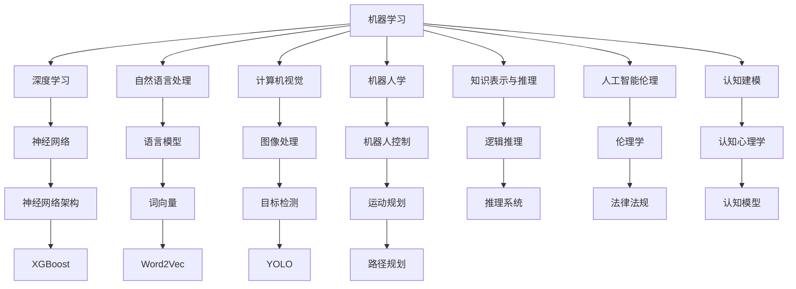

                 

在人工智能领域，研究内容丰富多样，涉及了从基础理论到实际应用的各个方面。本文旨在探讨人工智能研究的七个核心领域，通过深入分析这些领域的核心概念、算法原理、数学模型、项目实践和未来应用，为您呈现一幅全面的人工智能研究图景。关键词：人工智能、研究领域、核心概念、算法原理、数学模型、项目实践、未来应用。

## 1. 背景介绍

人工智能（Artificial Intelligence，AI）作为计算机科学的一个分支，致力于使计算机能够模拟人类智能行为，解决复杂问题，并进行自我学习和进化。自20世纪50年代人工智能概念首次提出以来，这一领域经历了多次高潮和低谷，如今正处于蓬勃发展的阶段。人工智能的研究不仅推动了科技的发展，也深刻地影响了人类社会的各个方面。

人工智能的研究领域广泛，主要包括机器学习、自然语言处理、计算机视觉、机器人学、知识表示与推理、人工智能伦理和认知建模等。这些领域相互交织，共同构成了人工智能研究的基本框架。

## 2. 核心概念与联系

### 2.1. 核心概念

在人工智能的研究中，以下几个核心概念至关重要：

- **机器学习（Machine Learning）**：通过算法让计算机从数据中学习，从而自动改进性能。
- **深度学习（Deep Learning）**：一种机器学习的方法，通过多层神经网络模拟人脑的学习过程。
- **自然语言处理（Natural Language Processing，NLP）**：使计算机能够理解、解释和生成人类语言的技术。
- **计算机视觉（Computer Vision）**：让计算机能够从图像或视频中提取信息和理解场景的技术。
- **机器人学（Robotics）**：研究设计、构建和控制机器人以完成特定任务的学科。
- **知识表示与推理（Knowledge Representation and Reasoning）**：研究如何表示知识以及如何利用这些知识进行推理。
- **人工智能伦理（Ethics of Artificial Intelligence）**：探讨人工智能技术的道德、法律和社会影响。
- **认知建模（Cognitive Modeling）**：模拟人类认知过程的方法和技术。

### 2.2. 架构联系

为了更好地理解这些核心概念之间的联系，我们可以使用Mermaid流程图来展示它们之间的关系。



## 3. 核心算法原理 & 具体操作步骤

### 3.1. 算法原理概述

人工智能研究中的核心算法包括但不限于以下几种：

- **神经网络（Neural Networks）**：模拟人脑神经元连接结构的计算模型。
- **决策树（Decision Trees）**：通过一系列判断规则对数据进行分类或回归。
- **支持向量机（Support Vector Machines，SVM）**：通过寻找最优分割超平面来实现分类。
- **随机森林（Random Forest）**：集成多个决策树，提高预测准确率和稳定性。
- **K最近邻（K-Nearest Neighbors，KNN）**：基于距离计算找出最近的K个样本进行分类。

### 3.2. 算法步骤详解

以神经网络为例，其具体步骤如下：

1. **数据预处理**：标准化输入数据，使其适合神经网络的学习。
2. **初始化参数**：设定网络权重和偏置，可以使用随机初始化。
3. **前向传播**：将输入数据通过网络，计算输出。
4. **反向传播**：计算损失函数的梯度，更新网络参数。
5. **优化算法**：使用梯度下降或其他优化算法更新参数，减小损失函数。
6. **模型评估**：在测试集上评估模型的性能。

### 3.3. 算法优缺点

每种算法都有其优缺点：

- **神经网络**：适用于复杂非线性问题，但计算量大，参数调整困难。
- **决策树**：易于理解和解释，但容易过拟合，对噪声敏感。
- **支持向量机**：理论上最优，但计算复杂度高，不适合大规模数据。
- **随机森林**：提高预测准确率和稳定性，但可能降低模型解释性。
- **K最近邻**：简单高效，但对噪声敏感，预测结果不稳定。

### 3.4. 算法应用领域

这些算法广泛应用于各个领域：

- **机器学习**：分类、回归、聚类等。
- **自然语言处理**：文本分类、情感分析、机器翻译等。
- **计算机视觉**：图像分类、目标检测、图像生成等。
- **机器人学**：路径规划、运动控制、感知等。
- **知识表示与推理**：智能推荐、智能问答等。
- **人工智能伦理**：算法公平性、隐私保护等。
- **认知建模**：模拟人类思维过程，提高决策质量。

## 4. 数学模型和公式 & 详细讲解 & 举例说明

### 4.1. 数学模型构建

神经网络的核心是多层感知机（MLP），其数学模型如下：

$$
y = \sigma(\omega_1 \cdot x + b_1)
$$

其中，$y$为输出，$x$为输入，$\sigma$为激活函数，$\omega_1$为权重，$b_1$为偏置。

### 4.2. 公式推导过程

以反向传播算法为例，其核心公式如下：

$$
\frac{\partial L}{\partial \omega} = \frac{\partial L}{\partial z} \cdot \frac{\partial z}{\partial \omega}
$$

其中，$L$为损失函数，$z$为激活值，$\omega$为权重。

### 4.3. 案例分析与讲解

以图像分类任务为例，使用卷积神经网络（CNN）进行模型训练。首先，对图像进行预处理，然后构建CNN模型，最后在测试集上评估模型性能。

```latex
% 对图像进行预处理
I_{\text{pre}} = \frac{I - \mu}{\sigma}
```

其中，$I$为原始图像，$\mu$为图像均值，$\sigma$为图像标准差。

```latex
% 构建CNN模型
Y = \sigma(\omega \cdot I + b)
```

其中，$Y$为模型输出，$\omega$为权重，$b$为偏置。

```latex
% 训练模型
\alpha = \frac{1}{m} \sum_{i=1}^{m} \frac{\partial L}{\partial \omega}
\omega_{\text{new}} = \omega - \alpha \cdot \frac{\partial L}{\partial \omega}
```

其中，$\alpha$为学习率，$m$为样本数量。

## 5. 项目实践：代码实例和详细解释说明

### 5.1. 开发环境搭建

搭建一个基于TensorFlow的神经网络，需要安装以下软件：

- Python
- TensorFlow
- NumPy
- Matplotlib

安装步骤：

```bash
pip install tensorflow numpy matplotlib
```

### 5.2. 源代码详细实现

以下是一个简单的神经网络实现，用于手写数字识别。

```python
import tensorflow as tf
import numpy as np
import matplotlib.pyplot as plt

# 初始化参数
x = tf.placeholder(tf.float32, [None, 784])
y = tf.placeholder(tf.float32, [None, 10])
W = tf.Variable(tf.zeros([784, 10]))
b = tf.Variable(tf.zeros([10]))

# 前向传播
y_pred = tf.nn.softmax(tf.matmul(x, W) + b)

# 损失函数
cross_entropy = tf.reduce_mean(-tf.reduce_sum(y * tf.log(y_pred), reduction_indices=1))

# 反向传播
optimizer = tf.train.GradientDescentOptimizer(learning_rate=0.5)
train_step = optimizer.minimize(cross_entropy)

# 训练模型
with tf.Session() as sess:
  sess.run(tf.global_variables_initializer())
  for i in range(1000):
    batch_x, batch_y = mnist.train.next_batch(100)
    sess.run(train_step, feed_dict={x: batch_x, y: batch_y})
    if i % 100 == 0:
      acc = sess.run(accuracy, feed_dict={x: mnist.test.images, y: mnist.test.labels})
      print(f"Step {i}, Test Accuracy: {acc}")

# 运行结果展示
plt.imshow(mnist.test.images[0].reshape(28, 28), cmap=plt.cm.binary)
plt.show()
```

### 5.3. 代码解读与分析

上述代码实现了以下功能：

- 初始化参数
- 前向传播
- 损失函数
- 反向传播
- 训练模型
- 运行结果展示

通过这段代码，我们可以看到如何使用TensorFlow实现一个简单的神经网络，并对其进行训练和评估。

## 6. 实际应用场景

人工智能在各个领域都有着广泛的应用：

- **医疗健康**：诊断疾病、预测疾病风险、个性化治疗等。
- **金融**：风险评估、欺诈检测、投资建议等。
- **工业制造**：自动化生产、故障预测、供应链优化等。
- **交通**：智能交通管理、自动驾驶、路况预测等。
- **教育**：智能推荐、在线教育、教育分析等。
- **娱乐**：游戏开发、虚拟现实、语音识别等。
- **科研**：数据分析、模型预测、实验设计等。

## 7. 工具和资源推荐

### 7.1. 学习资源推荐

- 《Python机器学习》（作者：塞巴斯蒂安·拉斯克）
- 《深度学习》（作者：伊恩·古德费洛、约书亚·本吉奥、亚伦·库维尔）
- 《机器学习实战》（作者：Peter Harrington）

### 7.2. 开发工具推荐

- TensorFlow
- PyTorch
- Keras
- Jupyter Notebook

### 7.3. 相关论文推荐

- “A Theoretical Analysis of the Benefits of Depth in Neural Networks”（作者：Yarin Gal和Zoubin Ghahramani）
- “Residual Networks: An Introduction to the Highway Network”（作者：Dzmitry Bahdanau、Kyunghyun Cho和Yoshua Bengio）
- “Generative Adversarial Nets: Training GANs”（作者：Ian Goodfellow等）

## 8. 总结：未来发展趋势与挑战

### 8.1. 研究成果总结

人工智能在过去几十年取得了显著成果，从简单的规则系统发展到复杂的深度学习模型，实现了从语音识别、图像识别到自动驾驶、自然语言处理等多个领域的突破。

### 8.2. 未来发展趋势

随着计算能力的提升和大数据的普及，人工智能将继续在深度学习、强化学习、多模态学习等领域取得突破。此外，人工智能与5G、物联网等技术的结合也将催生更多创新应用。

### 8.3. 面临的挑战

尽管人工智能取得了显著成果，但仍然面临着计算资源、数据隐私、算法公平性、伦理道德等方面的挑战。如何平衡技术创新与伦理道德，实现人工智能的安全、可控和可持续是未来亟待解决的问题。

### 8.4. 研究展望

未来人工智能研究将更加注重跨学科融合、多模态学习和个性化服务。随着技术的不断进步，人工智能有望在医疗健康、教育、金融等领域发挥更大的作用，推动社会的发展和进步。

## 9. 附录：常见问题与解答

### 9.1. 人工智能与机器学习的区别是什么？

人工智能是一个广泛的概念，包括使计算机模拟人类智能的各种技术，而机器学习是人工智能的一个分支，主要关注如何让计算机从数据中学习并改进性能。

### 9.2. 什么是深度学习？

深度学习是一种机器学习的方法，通过多层神经网络模拟人脑的学习过程，从而自动提取特征并进行预测。

### 9.3. 如何选择合适的算法？

选择合适的算法需要考虑问题的特性、数据规模、计算资源等多个因素。常见的算法包括神经网络、决策树、支持向量机、随机森林等。

### 9.4. 人工智能在医疗健康领域有哪些应用？

人工智能在医疗健康领域有广泛的应用，包括疾病诊断、病情预测、个性化治疗、药物研发等。

### 9.5. 人工智能面临的伦理问题有哪些？

人工智能面临的伦理问题包括算法偏见、数据隐私、算法公平性、自动化决策的道德责任等。

### 9.6. 如何解决人工智能中的数据隐私问题？

解决数据隐私问题可以通过数据加密、匿名化处理、隐私保护算法等多种技术手段来实现。此外，制定相关法律法规和伦理准则也是重要的途径。

### 9.7. 人工智能与认知建模的关系是什么？

认知建模是模拟人类认知过程的方法和技术，而人工智能是使计算机具备智能行为的手段。人工智能中的许多算法和技术都可以应用于认知建模领域，从而提高认知建模的准确性和实用性。|

