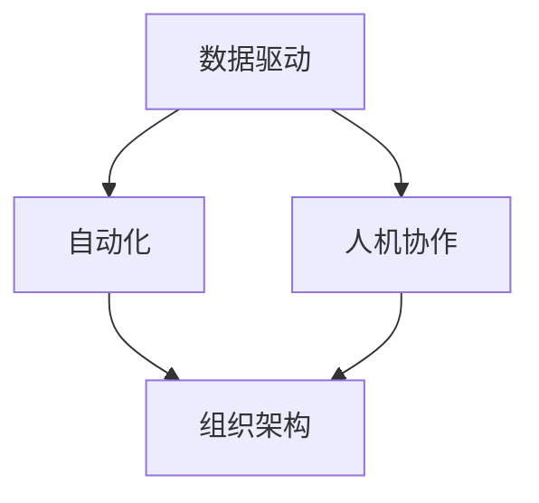

                 

关键词：人工智能管理，AI时代，工作定义，组织架构，技术变革，领导力，人才发展，创新思维

> 摘要：本文深入探讨了在人工智能时代如何重新定义工作，通过阐述人工智能管理的核心概念和联系，分析了人工智能算法原理及具体操作步骤，展示了数学模型和公式在人工智能管理中的应用，并提供了代码实例和实际应用场景。文章最后展望了未来发展趋势与挑战，以及推荐了相关学习资源和开发工具。

## 1. 背景介绍

### 1.1 人工智能的发展历程

人工智能（AI）的发展可以追溯到20世纪50年代，从最初的符号逻辑和推理算法，到今天的深度学习和神经网络，人工智能经历了巨大的变革。这一过程中，计算机硬件的快速发展、大数据的普及以及算法的创新，共同推动了人工智能的进步。

### 1.2 人工智能在现实世界中的应用

人工智能在现实世界的应用已经无处不在，从智能家居、自动驾驶汽车到医疗诊断、金融分析，人工智能正在改变我们的生活方式和工作模式。然而，随着人工智能的广泛应用，如何管理这些智能系统成为了一个新的挑战。

### 1.3 人工智能管理的必要性

人工智能管理的核心在于如何将人工智能技术与组织目标相结合，提高工作效率，优化资源分配，并实现创新。在AI时代，人工智能管理不仅仅是技术问题，更是组织管理的一种新模式。

## 2. 核心概念与联系

### 2.1 人工智能管理的核心概念

人工智能管理包括以下几个方面：

- **数据驱动**：利用大数据和机器学习算法，从数据中提取有价值的信息，支持决策制定。
- **自动化**：通过自动化技术，减少重复性工作，提高工作效率。
- **人机协作**：人工智能与人类专家的协同工作，发挥各自优势，实现高效决策。

### 2.2 人工智能管理的联系

人工智能管理不仅与数据、自动化和人机协作有关，还与组织架构、领导力、人才发展等多个方面紧密相连。图1展示了这些核心概念之间的联系。



## 3. 核心算法原理 & 具体操作步骤

### 3.1 算法原理概述

人工智能管理中的核心算法主要包括机器学习算法和深度学习算法。这些算法通过学习大量数据，自动提取特征，并生成预测模型。

### 3.2 算法步骤详解

- **数据收集**：收集大量结构化和非结构化的数据，如文本、图像、音频等。
- **数据预处理**：对数据进行清洗、归一化和特征提取，为后续的机器学习算法提供高质量的输入。
- **模型选择**：根据业务需求，选择合适的机器学习或深度学习模型。
- **模型训练**：使用预处理后的数据，对模型进行训练，优化模型参数。
- **模型评估**：使用测试数据集评估模型的性能，调整模型参数，提高准确性。
- **模型部署**：将训练好的模型部署到生产环境中，实现自动化决策。

### 3.3 算法优缺点

- **优点**：高效、准确、自适应，可以处理大规模数据，减少人力成本。
- **缺点**：对数据质量要求高，模型训练时间较长，可能产生过拟合。

### 3.4 算法应用领域

人工智能管理算法广泛应用于多个领域，如金融、医疗、物流、制造等。以下是一个具体的应用案例：

- **金融**：利用人工智能算法进行风险评估、投资组合优化和欺诈检测。
- **医疗**：通过人工智能算法进行疾病诊断、药物研发和医疗资源分配。
- **物流**：使用人工智能算法进行路线规划、货物追踪和库存管理。

## 4. 数学模型和公式 & 详细讲解 & 举例说明

### 4.1 数学模型构建

在人工智能管理中，常见的数学模型包括线性回归、逻辑回归、支持向量机等。以下以线性回归为例进行介绍。

### 4.2 公式推导过程

线性回归模型的公式如下：

$$
y = \beta_0 + \beta_1x_1 + \beta_2x_2 + \ldots + \beta_nx_n + \epsilon
$$

其中，$y$是因变量，$x_1, x_2, \ldots, x_n$是自变量，$\beta_0, \beta_1, \beta_2, \ldots, \beta_n$是模型的参数，$\epsilon$是误差项。

### 4.3 案例分析与讲解

假设我们有一个房地产销售数据集，包括房屋面积、房价等特征。我们想利用线性回归模型预测房价。

1. **数据收集与预处理**：收集大量房地产销售数据，对数据进行清洗和归一化处理。
2. **模型训练**：使用训练数据集，通过最小二乘法训练线性回归模型。
3. **模型评估**：使用测试数据集评估模型性能，调整模型参数。
4. **模型部署**：将训练好的模型部署到生产环境中，实现房价预测。

## 5. 项目实践：代码实例和详细解释说明

### 5.1 开发环境搭建

在本项目中，我们使用Python作为编程语言，结合Scikit-learn库进行线性回归模型的训练和评估。

### 5.2 源代码详细实现

```python
# 导入相关库
import numpy as np
import pandas as pd
from sklearn.linear_model import LinearRegression
from sklearn.model_selection import train_test_split
from sklearn.metrics import mean_squared_error

# 数据收集与预处理
data = pd.read_csv('real_estate_data.csv')
X = data[['area', 'location', 'age']]
y = data['price']
X = X.astype(np.float32)
y = y.astype(np.float32)

# 数据分割
X_train, X_test, y_train, y_test = train_test_split(X, y, test_size=0.2, random_state=42)

# 模型训练
model = LinearRegression()
model.fit(X_train, y_train)

# 模型评估
y_pred = model.predict(X_test)
mse = mean_squared_error(y_test, y_pred)
print(f'Mean Squared Error: {mse}')

# 模型部署
# 将模型部署到生产环境，实现房价预测
```

### 5.3 代码解读与分析

- **数据收集与预处理**：从CSV文件中读取数据，对数据进行类型转换和分割。
- **模型训练**：使用训练数据集训练线性回归模型。
- **模型评估**：使用测试数据集评估模型性能。
- **模型部署**：将训练好的模型部署到生产环境中，实现房价预测。

## 6. 实际应用场景

### 6.1 金融领域

在金融领域，人工智能管理可以用于风险评估、投资组合优化和欺诈检测。以下是一个具体的应用场景：

- **风险评估**：利用机器学习算法对借款人的信用风险进行评估，提高贷款审批的准确性。
- **投资组合优化**：通过分析市场数据，利用优化算法为投资者构建最佳投资组合，提高收益。
- **欺诈检测**：使用监督学习算法对交易数据进行分析，及时发现并防范欺诈行为。

### 6.2 医疗领域

在医疗领域，人工智能管理可以用于疾病诊断、药物研发和医疗资源分配。以下是一个具体的应用场景：

- **疾病诊断**：利用深度学习算法对医学图像进行分析，辅助医生进行疾病诊断。
- **药物研发**：通过大数据分析，发现新的药物靶点，加快药物研发进程。
- **医疗资源分配**：利用优化算法，合理分配医疗资源，提高医疗服务质量。

### 6.3 物流领域

在物流领域，人工智能管理可以用于路线规划、货物追踪和库存管理。以下是一个具体的应用场景：

- **路线规划**：利用路径规划算法，优化运输路线，降低物流成本。
- **货物追踪**：通过物联网技术，实时跟踪货物位置，提高物流效率。
- **库存管理**：利用需求预测算法，优化库存水平，降低库存成本。

## 7. 未来应用展望

### 7.1 人工智能管理的趋势

随着人工智能技术的不断发展，人工智能管理将向以下方向发展：

- **数据隐私保护**：在数据收集和处理过程中，加强数据隐私保护，确保用户隐私。
- **多模态数据处理**：结合图像、文本、音频等多模态数据，提高人工智能管理的能力。
- **人机交互**：优化人机交互界面，提高用户体验。

### 7.2 人工智能管理的挑战

在人工智能管理领域，我们面临着以下挑战：

- **数据质量**：高质量的数据是人工智能管理的基础，如何处理数据质量问题是关键。
- **算法透明度**：算法的透明度和可解释性是人工智能管理的重要问题，如何提高算法的可解释性是一个挑战。
- **人才短缺**：人工智能管理需要大量的专业人才，如何培养和吸引人才是重要问题。

### 7.3 人工智能管理的建议

针对上述挑战，我们提出以下建议：

- **数据质量控制**：建立健全的数据质量控制体系，确保数据质量。
- **算法透明度**：加强算法透明度研究，提高算法的可解释性。
- **人才培养**：加强人工智能管理相关人才的培养和引进。

## 8. 总结：未来发展趋势与挑战

### 8.1 研究成果总结

本文探讨了人工智能管理在AI时代的核心概念、算法原理、应用场景及未来发展趋势。通过对实际案例的分析，展示了人工智能管理在金融、医疗、物流等领域的广泛应用。

### 8.2 未来发展趋势

未来，人工智能管理将在数据隐私保护、多模态数据处理和人机交互等方面取得突破。同时，随着人工智能技术的不断发展，人工智能管理将在更多领域得到应用。

### 8.3 面临的挑战

在人工智能管理领域，我们面临着数据质量、算法透明度和人才短缺等挑战。如何解决这些问题，将决定人工智能管理的发展方向。

### 8.4 研究展望

在未来，我们将继续研究人工智能管理的算法优化、应用拓展和人才培养等问题，为人工智能管理的发展贡献力量。

## 9. 附录：常见问题与解答

### 9.1 人工智能管理是什么？

人工智能管理是一种利用人工智能技术优化组织管理的新模式，包括数据驱动、自动化和人机协作等方面。

### 9.2 人工智能管理有哪些应用领域？

人工智能管理广泛应用于金融、医疗、物流、制造等领域，可以用于风险评估、疾病诊断、路线规划等。

### 9.3 如何培养人工智能管理人才？

培养人工智能管理人才需要加强计算机科学、数据科学、人工智能等领域的基础知识，同时注重实践能力的培养。

### 9.4 人工智能管理有哪些挑战？

人工智能管理面临数据质量、算法透明度和人才短缺等挑战，需要加强数据质量控制、算法透明度研究和人才培养。

---

作者：禅与计算机程序设计艺术 / Zen and the Art of Computer Programming

----------------------------------------------------------------

（以上为文章的正文内容，接下来是根据要求进行的Markdown格式编排和章节的细化。）

