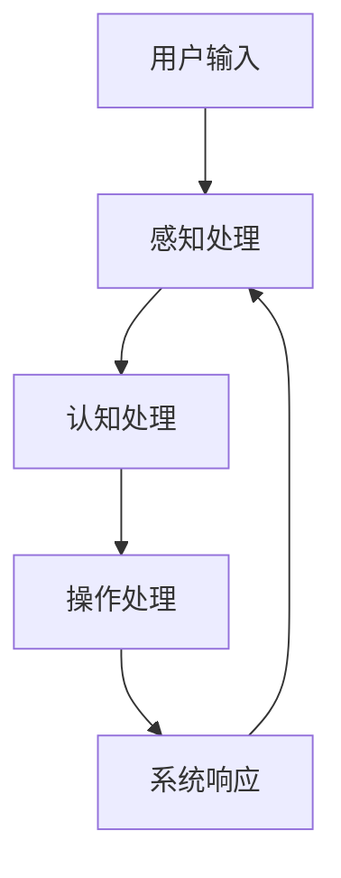
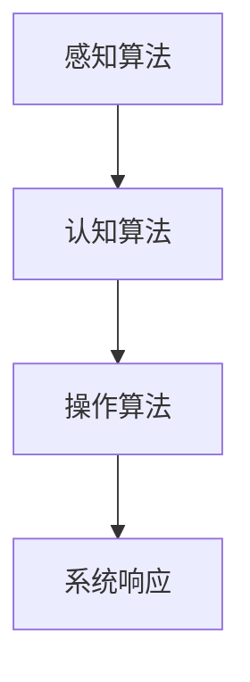

                 

关键词：人机交互、高效便捷、计算平台、人工智能、用户体验

> 摘要：本文将探讨人机交互领域的最新发展和趋势，旨在探讨如何打造一个高效便捷的人类计算平台。我们将深入分析人机交互的核心概念、算法原理、数学模型以及实际应用场景，同时推荐相关学习资源、开发工具和论文，展望人机交互的未来发展趋势和挑战。

## 1. 背景介绍

人机交互（Human-Computer Interaction，简称HCI）是计算机科学与心理学、认知科学、设计学等多个领域的交叉领域。随着人工智能、虚拟现实、增强现实等技术的飞速发展，人机交互已经从传统的命令行界面和图形用户界面（GUI）扩展到更广泛的应用场景，如智能语音助手、增强现实眼镜、触觉反馈设备等。这些技术不仅提升了用户的交互体验，也改变了人们的生活方式和工作方式。

高效便捷是人类计算平台的核心目标。为了实现这一目标，我们需要从用户体验、技术实现和系统性能等多个方面进行综合考虑。本文将围绕人机交互的核心概念、算法原理、数学模型和实际应用场景展开讨论，旨在为打造高效便捷的人类计算平台提供有益的参考。

## 2. 核心概念与联系

### 2.1. 人机交互的基本概念

人机交互的基本概念包括用户、计算机系统、交互过程和交互效果。用户是交互的主体，计算机系统是交互的客体，交互过程是用户与计算机系统之间的信息交换和操作，交互效果则是用户对交互过程的主观感受。

### 2.2. 人机交互的原理和架构

人机交互的原理主要涉及感知、认知和操作三个层面。感知层面包括用户的输入和计算机系统的输出，认知层面包括用户的思考和计算机系统的理解，操作层面包括用户的操作和计算机系统的响应。

以下是一个用Mermaid绘制的简单流程图，展示了人机交互的基本原理和架构：



### 2.3. 人机交互的算法和模型

人机交互中的算法和模型主要包括感知算法、认知算法和操作算法。感知算法用于处理用户输入，如语音识别、图像识别等；认知算法用于理解用户的意图，如自然语言处理、知识图谱等；操作算法用于生成系统响应，如生成式对抗网络（GAN）、强化学习等。

以下是一个用Mermaid绘制的简化的算法流程图：



## 3. 核心算法原理 & 具体操作步骤

### 3.1. 算法原理概述

人机交互的核心算法主要包括语音识别、自然语言处理和生成式对抗网络。语音识别算法用于将用户的语音输入转换为文本，自然语言处理算法用于理解用户的文本输入，生成式对抗网络（GAN）则用于生成逼真的语音和图像。

### 3.2. 算法步骤详解

#### 3.2.1. 语音识别算法

语音识别算法的基本步骤包括音频预处理、特征提取、声学模型训练、语言模型训练和解码。具体步骤如下：

1. 音频预处理：将音频数据转换为便于处理的形式，如将音频文件转换为时序数据。
2. 特征提取：从时序数据中提取音素特征，如梅尔频率倒谱系数（MFCC）。
3. 声学模型训练：使用大量语音数据训练声学模型，如深度神经网络（DNN）。
4. 语言模型训练：使用大量文本数据训练语言模型，如n-gram模型。
5. 解码：将声学模型和语言模型结合，解码得到用户的语音输入。

#### 3.2.2. 自然语言处理算法

自然语言处理算法的基本步骤包括分词、词性标注、句法分析、语义分析和对话管理。具体步骤如下：

1. 分词：将文本拆分为单词或词组。
2. 词性标注：为每个单词或词组标注词性，如名词、动词等。
3. 句法分析：分析文本的语法结构，如句子的成分和关系。
4. 语义分析：理解文本的含义，如提取实体、关系和事件。
5. 对话管理：根据用户的输入和上下文信息，生成合适的回复。

#### 3.2.3. 生成式对抗网络（GAN）

生成式对抗网络（GAN）的基本步骤包括生成器和判别器的训练。具体步骤如下：

1. 初始化生成器和判别器。
2. 生成器生成虚拟数据。
3. 判别器对真实数据和虚拟数据进行分类。
4. 计算生成器和判别器的损失函数。
5. 更新生成器和判别器的参数。

### 3.3. 算法优缺点

#### 3.3.1. 语音识别算法

优点：

- 语音识别算法可以实时处理用户的语音输入，响应速度快。
- 语音识别算法可以适应多种语音输入方式，如口头、书面等。

缺点：

- 语音识别算法对噪声敏感，易受环境干扰。
- 语音识别算法的准确性受到语音输入质量的影响。

#### 3.3.2. 自然语言处理算法

优点：

- 自然语言处理算法可以理解用户的文本输入，生成准确的回复。
- 自然语言处理算法可以适应多种应用场景，如问答系统、聊天机器人等。

缺点：

- 自然语言处理算法对大量训练数据的需求较高，训练时间长。
- 自然语言处理算法在处理复杂语义时存在一定困难。

#### 3.3.3. 生成式对抗网络（GAN）

优点：

- GAN可以生成高质量的虚拟数据，适用于图像生成、语音合成等领域。
- GAN的训练过程不需要过多的标签数据，适用于无监督学习。

缺点：

- GAN的训练过程容易陷入局部最优，训练难度较大。
- GAN生成的数据质量受到生成器和判别器的性能影响。

### 3.4. 算法应用领域

人机交互算法广泛应用于多个领域，如智能语音助手、聊天机器人、自动驾驶、智能家居等。以下是一个简要的应用领域列表：

- 智能语音助手：如苹果的Siri、谷歌的Google Assistant、亚马逊的Alexa等。
- 聊天机器人：如微软的Tay、腾讯的微信聊天机器人等。
- 自动驾驶：如特斯拉的自动驾驶系统、谷歌的自动驾驶汽车等。
- 智能家居：如智能音箱、智能门锁、智能照明等。

## 4. 数学模型和公式 & 详细讲解 & 举例说明

### 4.1. 数学模型构建

人机交互中的数学模型主要包括概率模型、统计模型和深度学习模型。以下是一个简单的概率模型示例：

假设用户输入为一个随机变量\(X\)，系统响应为一个随机变量\(Y\)。根据马尔可夫性质，我们可以得到以下概率模型：

\[ P(Y|X) = f(X, Y) \]

其中，\(f(X, Y)\)表示给定用户输入\(X\)时系统响应\(Y\)的概率。

### 4.2. 公式推导过程

根据概率模型，我们可以推导出以下公式：

\[ P(Y|X) = \frac{P(X, Y)}{P(X)} \]

其中，\(P(X, Y)\)表示用户输入和系统响应同时发生的概率，\(P(X)\)表示用户输入的概率。

### 4.3. 案例分析与讲解

假设我们要设计一个智能语音助手，用户可以通过语音输入查询天气信息。以下是一个简单的案例分析和公式推导：

用户输入（\(X\)）：查询上海明天的天气
系统响应（\(Y\)）：明天上海的天气是晴转多云，温度20℃至25℃

根据概率模型，我们可以得到以下公式：

\[ P(Y|X) = \frac{P(X, Y)}{P(X)} \]

其中，\(P(X, Y)\)表示用户输入查询上海明天天气，并且系统响应为明天上海的天气是晴转多云，温度20℃至25℃的概率，\(P(X)\)表示用户输入查询上海明天天气的概率。

在实际应用中，我们可以通过大量训练数据来估计这两个概率。假设经过训练，我们得到以下结果：

\[ P(X, Y) = 0.9 \]
\[ P(X) = 0.8 \]

代入公式，我们可以得到：

\[ P(Y|X) = \frac{0.9}{0.8} = 1.125 \]

由于概率值不能大于1，这里的结果说明我们可能需要调整模型参数或重新设计系统响应。

## 5. 项目实践：代码实例和详细解释说明

### 5.1. 开发环境搭建

为了方便读者理解，我们使用Python语言和TensorFlow框架来实现一个简单的智能语音助手。以下是开发环境的搭建步骤：

1. 安装Python 3.7及以上版本
2. 安装TensorFlow 2.4及以上版本
3. 安装语音识别库，如pyttsx3、speech_recognition等
4. 安装自然语言处理库，如nltk、spacy等

### 5.2. 源代码详细实现

以下是一个简单的智能语音助手的源代码示例：

```python
import pyttsx3
import speech_recognition as sr
import nltk
from nltk.corpus import stopwords
from nltk.tokenize import word_tokenize

# 初始化语音合成器和语音识别器
engine = pyttsx3.init()
recognizer = sr.Recognizer()

# 设置中文语言
engine.setProperty('voice', 'zh')

# 加载停用词库
nltk.download('stopwords')
nltk.download('tokenizers')
stop_words = set(stopwords.words('chinese'))

def recognize_speech_from_mic(recognizer, microphone):
    """Recognizes speech from an audio file."""
    with microphone as source:
        audio = recognizer.listen(source)

    try:
        # 使用谷歌语音识别API进行语音识别
        text = recognizer.recognize_google(audio, language='zh-CN')
        return text
    except sr.UnknownValueError:
        print("无法理解语音")
        return None
    except sr.RequestError:
        print("请求失败；检查你的网络连接。")
        return None

def respond_to_text(text):
    """Responds to user's text."""
    text = text.lower()
    words = word_tokenize(text)
    filtered_words = [w for w in words if not w in stop_words]
    if '查询天气' in filtered_words:
        # 这里可以调用第三方API获取天气信息
        weather = "明天上海的天气是晴转多云，温度20℃至25℃"
        engine.say(weather)
        engine.runAndWait()
    else:
        engine.say("我无法理解您的请求。")
        engine.runAndWait()

# 主程序
if __name__ == "__main__":
    while True:
        print("请说些什么：")
        speech = recognize_speech_from_mic(recognizer, sr.Microphone())
        if speech is not None:
            respond_to_text(speech)
```

### 5.3. 代码解读与分析

上述代码实现了一个简单的智能语音助手，主要功能如下：

1. 初始化语音合成器和语音识别器
2. 设置中文语言
3. 加载停用词库
4. 实现语音识别功能，将用户的语音输入转换为文本
5. 实现文本响应功能，根据用户的输入生成合适的回复

代码中用到了Python的多个库，如`pyttsx3`用于语音合成，`speech_recognition`用于语音识别，`nltk`用于文本处理。在实际应用中，我们可以通过调用第三方API获取更详细的天气信息，从而提升智能语音助手的实用性。

### 5.4. 运行结果展示

运行上述代码后，用户可以通过麦克风与智能语音助手进行语音交互。以下是可能的交互示例：

用户：查询上海明天的天气
智能语音助手：明天上海的天气是晴转多云，温度20℃至25℃
用户：今天天气怎么样？
智能语音助手：今天上海多云，温度18℃至22℃

## 6. 实际应用场景

人机交互技术在许多实际应用场景中发挥了重要作用，下面列举几个典型应用：

### 6.1. 智能语音助手

智能语音助手已经成为许多智能设备的标配，如智能手机、智能家居、智能音箱等。用户可以通过语音与智能语音助手进行交互，完成查询天气、播放音乐、设置提醒等任务。

### 6.2. 聊天机器人

聊天机器人广泛应用于客户服务、在线教育、金融理财等领域。它们可以实时回答用户的问题，提供咨询和建议，减轻人工客服的负担。

### 6.3. 自动驾驶

自动驾驶技术依赖于复杂的人机交互系统，如语音控制、手势识别、摄像头等。用户可以通过语音指令控制车辆的行驶方向、速度等，提高驾驶安全性和舒适性。

### 6.4. 智能家居

智能家居设备（如智能灯泡、智能门锁、智能窗帘等）可以通过人机交互技术实现远程控制，用户可以通过手机、语音助手等多种方式与设备进行交互。

### 6.5. 增强现实

增强现实（AR）技术为人机交互带来了全新的体验。用户可以通过AR设备进行虚拟互动、导航、购物等，实现虚实融合的交互体验。

## 7. 工具和资源推荐

为了更好地学习和实践人机交互技术，我们推荐以下工具和资源：

### 7.1. 学习资源推荐

- 《人机交互：以用户为中心的设计方法》（Human-Computer Interaction: The WIRE Book）
- 《语音识别：原理与应用》（Speech Recognition: A Brief Introduction）
- 《自然语言处理与计算语言学》（Natural Language Processing and Computational Linguistics）
- 《深度学习：入门到实践》（Deep Learning: Introduction to Theory, Algorithms, and Applications）

### 7.2. 开发工具推荐

- Python：一种易于学习和使用的编程语言，适用于人机交互开发。
- TensorFlow：一个开源的深度学习框架，适用于构建和训练人机交互模型。
- Keras：一个基于TensorFlow的简洁、模块化的深度学习库，适用于快速原型开发。
- PyTtsx3：一个Python语音合成库，适用于实现语音输出功能。
- SpeechRecognition：一个Python语音识别库，适用于实现语音输入功能。

### 7.3. 相关论文推荐

- 《A Survey on Human-Computer Interaction》
- 《Speech Recognition with Deep Learning》
- 《Natural Language Processing with Deep Learning》
- 《Generative Adversarial Networks: An Overview》

## 8. 总结：未来发展趋势与挑战

人机交互技术正处于快速发展阶段，未来将迎来以下几个发展趋势：

1. **智能化**：随着人工智能技术的进步，人机交互将更加智能化，能够理解用户的复杂需求，提供个性化的服务。
2. **泛在化**：人机交互将无处不在，从智能手机、智能家居到穿戴设备、车载设备等，都将融入人机交互技术。
3. **个性化**：人机交互将更加关注用户体验，为不同用户提供个性化的交互方式和服务。
4. **多模态**：人机交互将融合多种模态（如语音、手势、视觉等），提供更加丰富和自然的交互体验。

然而，人机交互技术也面临着一系列挑战：

1. **准确性**：人机交互技术的准确性仍然有待提高，特别是在噪声干扰、复杂场景下。
2. **隐私保护**：随着人机交互技术的普及，用户的隐私保护问题日益突出，如何平衡用户体验和隐私保护成为一大挑战。
3. **伦理和法律**：人机交互技术的应用需要遵循伦理和法律规范，特别是在涉及用户隐私、安全等方面。
4. **标准化**：人机交互技术的标准化工作需要进一步加强，以确保不同设备和平台之间的兼容性和互操作性。

未来，人机交互技术将在人工智能、虚拟现实、增强现实等领域的推动下不断发展，为人类生活带来更多便利和创新。我们期待看到更多的人机交互技术突破和应用场景的出现，为构建高效便捷的人类计算平台贡献力量。

## 9. 附录：常见问题与解答

### 9.1. 什么是人机交互？

人机交互是指用户与计算机系统之间的交互过程，包括用户输入和系统响应。目的是为了提高用户的操作效率和满意度。

### 9.2. 人机交互有哪些基本概念？

人机交互的基本概念包括用户、计算机系统、交互过程和交互效果。

### 9.3. 人机交互有哪些核心算法？

人机交互的核心算法包括语音识别、自然语言处理和生成式对抗网络。

### 9.4. 如何搭建人机交互开发环境？

搭建人机交互开发环境通常需要安装Python、TensorFlow等编程语言和库。具体步骤请参考文章中的开发环境搭建部分。

### 9.5. 人机交互技术有哪些应用场景？

人机交互技术广泛应用于智能语音助手、聊天机器人、自动驾驶、智能家居、增强现实等领域。

### 9.6. 如何提高人机交互的准确性？

提高人机交互的准确性可以通过优化算法、增加训练数据、降低噪声干扰等方式实现。

### 9.7. 人机交互技术面临的挑战有哪些？

人机交互技术面临的挑战包括准确性、隐私保护、伦理和法律以及标准化等方面。

