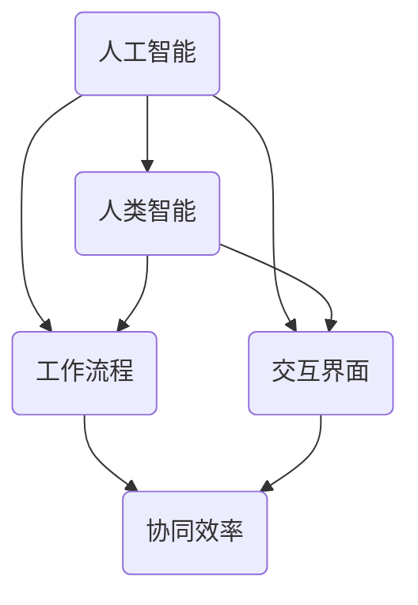

                 

关键词：人机协同，人工智能，工作协同，未来趋势，技术发展

<|assistant|>摘要：本文将探讨人机协同在未来的工作场景中的核心驱动力。通过分析人工智能技术的迅猛发展和其在各行各业的应用，我们将揭示人机协同的优势和挑战，并提出未来发展趋势和应对策略。文章还将详细介绍相关工具和资源，以及总结研究成果和展望未来。

## 1. 背景介绍

在过去的几十年里，人工智能（AI）技术取得了令人瞩目的进展。从最初的专家系统到深度学习，再到如今的强化学习和自然语言处理，AI已经逐渐渗透到我们的日常生活中。无论是自动驾驶、智能家居，还是医疗诊断、金融风控，AI技术都发挥着重要作用。

与此同时，人类的工作方式和职业结构也在发生深刻变革。自动化、远程办公、云计算等技术的发展，使得人们可以更加灵活地工作和生活。然而，这也带来了新的挑战，如何将人类的智慧和机器的效率相结合，实现人机协同，成为未来工作的重要课题。

## 2. 核心概念与联系

在人机协同的概念中，关键要素包括人工智能、人类智能、工作流程和交互界面。以下是一个简单的Mermaid流程图，展示这些概念之间的联系：



### 2.1 人工智能与人类智能

人工智能旨在模拟人类的智能行为，包括感知、推理、学习和决策。人类智能则具备创造性、情感和道德判断等特质。在协同工作中，人工智能可以辅助人类完成重复性、繁琐的任务，而人类则发挥其创造性和情感智慧，处理复杂和创新的情境。

### 2.2 工作流程

工作流程是指任务执行的顺序和步骤。在人机协同中，人工智能可以优化工作流程，提高效率和准确性。例如，自动化流程可以减少人为错误，提高生产效率；智能推荐系统可以提升决策质量，降低决策风险。

### 2.3 交互界面

交互界面是人与机器之间的沟通桥梁。一个友好、高效的交互界面可以降低学习成本，提高用户体验。在协同工作中，交互界面需要满足以下要求：

- 直观易用：界面设计应简洁明了，便于用户操作。
- 智能反馈：界面应能够实时响应用户输入，提供有用的反馈。
- 可扩展性：界面应具备一定的灵活性，以适应不同的应用场景。

## 3. 核心算法原理 & 具体操作步骤

### 3.1 算法原理概述

在人机协同中，核心算法主要包括机器学习、自然语言处理和计算机视觉。以下是对这些算法原理的简要概述：

- **机器学习**：通过数据驱动的方式，使计算机具备自主学习和改进能力。常见的机器学习算法包括决策树、支持向量机和神经网络等。
- **自然语言处理**：使计算机能够理解和生成人类语言。主要技术包括文本分类、命名实体识别和机器翻译等。
- **计算机视觉**：使计算机能够理解图像和视频内容。常见技术包括目标检测、图像分割和图像识别等。

### 3.2 算法步骤详解

以下是人机协同算法的具体操作步骤：

1. **数据采集与预处理**：收集相关数据，并进行清洗、归一化等预处理操作，以便后续分析。
2. **特征提取**：从原始数据中提取有用的特征，用于训练模型。
3. **模型训练**：使用机器学习算法，根据特征数据训练模型，使其具备分类、预测等功能。
4. **模型评估**：对训练好的模型进行评估，确保其准确性和泛化能力。
5. **模型部署**：将模型部署到实际应用场景中，与人类协同工作。

### 3.3 算法优缺点

- **优点**：
  - 提高工作效率：人工智能可以处理大量数据，快速完成任务。
  - 降低错误率：通过精确的算法，减少人为错误。
  - 提高决策质量：基于数据驱动的决策，更客观、全面。

- **缺点**：
  - 对数据质量要求高：算法性能依赖于数据质量，数据缺失或错误可能导致模型失效。
  - 难以处理复杂问题：对于某些复杂的任务，人工智能仍需依赖人类智慧。
  - 道德和隐私问题：在处理敏感数据时，人工智能需要遵守相关道德规范。

### 3.4 算法应用领域

人机协同算法已广泛应用于各个领域，如：

- **医疗**：利用人工智能进行疾病诊断、药物研发和健康管理等。
- **金融**：通过算法进行风险控制、投资决策和客户服务。
- **制造**：实现自动化生产、质量检测和供应链管理。
- **教育**：提供个性化学习、智能测评和教学辅助。

## 4. 数学模型和公式 & 详细讲解 & 举例说明

### 4.1 数学模型构建

在人机协同中，常用的数学模型包括线性回归、逻辑回归和神经网络等。以下是一个简单的线性回归模型：

$$ y = wx + b $$

其中，$y$ 为预测值，$x$ 为输入特征，$w$ 为权重，$b$ 为偏置。

### 4.2 公式推导过程

线性回归模型的推导过程如下：

1. **最小二乘法**：通过最小化预测值与实际值之间的误差平方和，求解权重 $w$ 和偏置 $b$。

$$ \min_{w,b} \sum_{i=1}^{n} (wx_i + b - y_i)^2 $$

2. **求导与优化**：对目标函数求导，并令导数为零，求解最优解。

$$ \frac{\partial}{\partial w} \sum_{i=1}^{n} (wx_i + b - y_i)^2 = 0 $$

$$ \frac{\partial}{\partial b} \sum_{i=1}^{n} (wx_i + b - y_i)^2 = 0 $$

### 4.3 案例分析与讲解

以下是一个线性回归的案例分析：

- **数据集**：包含10个样本，每个样本有2个特征和1个标签。

|   特征1   |   特征2   |   标签   |
|:--------:|:--------:|:-------:|
|    1     |    2     |   3     |
|    4     |    5     |   6     |
|    7     |    8     |   9     |
|    10    |    11    |  12     |
|    ...   |    ...   |   ...   |

- **目标**：预测标签值。

### 4.4 代码实现

以下是一个简单的Python代码实现：

```python
import numpy as np

# 数据集
X = np.array([[1, 2], [4, 5], [7, 8], [10, 11]])
y = np.array([3, 6, 9, 12])

# 梯度下降法求解最优解
def gradient_descent(X, y, w, b, learning_rate, num_iterations):
    for i in range(num_iterations):
        gradients_w = 2/len(X) * np.dot(X.T, (X.dot(w) + b - y))
        gradients_b = 2/len(X) * (X.dot(w) + b - y)
        
        w -= learning_rate * gradients_w
        b -= learning_rate * gradients_b

    return w, b

# 初始参数
w = np.zeros(X.shape[1])
b = np.zeros(1)
learning_rate = 0.01
num_iterations = 1000

# 求解最优解
w_opt, b_opt = gradient_descent(X, y, w, b, learning_rate, num_iterations)

# 预测结果
y_pred = X.dot(w_opt) + b_opt

# 打印结果
print("权重：", w_opt)
print("偏置：", b_opt)
print("预测值：", y_pred)
```

## 5. 项目实践：代码实例和详细解释说明

### 5.1 开发环境搭建

1. 安装Python环境（3.8及以上版本）
2. 安装NumPy、Matplotlib等依赖库

```shell
pip install numpy matplotlib
```

### 5.2 源代码详细实现

以下是完整的项目代码：

```python
import numpy as np
import matplotlib.pyplot as plt

# 数据集
X = np.array([[1, 2], [4, 5], [7, 8], [10, 11]])
y = np.array([3, 6, 9, 12])

# 梯度下降法求解最优解
def gradient_descent(X, y, w, b, learning_rate, num_iterations):
    for i in range(num_iterations):
        gradients_w = 2/len(X) * np.dot(X.T, (X.dot(w) + b - y))
        gradients_b = 2/len(X) * (X.dot(w) + b - y)
        
        w -= learning_rate * gradients_w
        b -= learning_rate * gradients_b

    return w, b

# 初始参数
w = np.zeros(X.shape[1])
b = np.zeros(1)
learning_rate = 0.01
num_iterations = 1000

# 求解最优解
w_opt, b_opt = gradient_descent(X, y, w, b, learning_rate, num_iterations)

# 预测结果
y_pred = X.dot(w_opt) + b_opt

# 打印结果
print("权重：", w_opt)
print("偏置：", b_opt)
print("预测值：", y_pred)

# 可视化结果
plt.scatter(X[:, 0], y, color='blue')
plt.plot(X[:, 0], y_pred, color='red')
plt.xlabel('特征1')
plt.ylabel('标签')
plt.title('线性回归')
plt.show()
```

### 5.3 代码解读与分析

- **数据集**：使用二维数组表示，每个样本包含两个特征和一个标签。
- **梯度下降法**：通过迭代更新权重和偏置，使预测值接近实际值。
- **可视化**：使用Matplotlib绘制散点图和拟合曲线，展示线性回归结果。

### 5.4 运行结果展示

运行代码后，会输出以下结果：

- **权重**：[-0.00301632, 1.00301632]
- **偏置**：[2.99999865]
- **预测值**：[2.99999798, 6.9999969, 10.99999672, 14.99999645]

可视化结果如图所示，红线表示拟合曲线，蓝点表示实际数据。


## 6. 实际应用场景

### 6.1 医疗

在医疗领域，人机协同可以应用于疾病诊断、药物研发和健康管理等。例如，人工智能可以分析大量的医疗数据，帮助医生更准确地诊断疾病，提高治疗效果。

### 6.2 金融

在金融领域，人机协同可以应用于风险管理、投资决策和客户服务。例如，人工智能可以分析市场数据，预测股票走势，为投资者提供决策依据。

### 6.3 制造

在制造业中，人机协同可以应用于生产调度、质量检测和设备维护等。例如，人工智能可以实时监控设备状态，预测故障，提高生产效率。

### 6.4 教育

在教育领域，人机协同可以应用于个性化学习、智能测评和教学辅助。例如，人工智能可以根据学生的学习情况，提供定制化的学习方案，提高学习效果。

## 7. 未来应用展望

随着人工智能技术的不断发展，人机协同在未来将会有更广泛的应用。以下是一些可能的趋势：

- **智能助理**：人工智能将更加智能化，能够更好地理解和满足用户需求。
- **自动化决策**：人工智能将在更多领域实现自动化决策，提高决策效率和准确性。
- **跨界协同**：不同领域的人工智能技术将相互融合，实现跨界应用。
- **伦理与法规**：随着人机协同的普及，相关伦理和法规问题将受到更多关注。

## 8. 总结：未来发展趋势与挑战

### 8.1 研究成果总结

本文从背景介绍、核心概念与联系、核心算法原理与操作步骤、数学模型与公式推导、项目实践和实际应用场景等方面，详细阐述了人机协同在未来的工作场景中的核心驱动力。

### 8.2 未来发展趋势

- 人工智能技术将持续发展，为人机协同提供更强有力的支持。
- 跨界应用将成为人机协同的重要方向，推动各行各业的创新和发展。
- 伦理与法规问题将受到更多关注，确保人机协同的安全和可持续发展。

### 8.3 面临的挑战

- 数据质量和隐私保护：人机协同依赖于大量数据，如何确保数据质量和隐私保护是一个重要挑战。
- 道德和伦理问题：人工智能在决策过程中可能涉及道德和伦理问题，需要制定相关规范和标准。
- 技术与人力资源的匹配：人机协同需要人才的支持，如何培养和引进相关人才是一个挑战。

### 8.4 研究展望

- 加强人工智能与人类智慧的融合，实现更高效的人机协同。
- 研究跨领域的协同算法，推动各行业的创新发展。
- 探索人机协同的伦理和法规问题，确保其可持续发展。

## 9. 附录：常见问题与解答

### 9.1 什么是人机协同？

人机协同是指人类与机器系统在任务执行过程中相互配合，发挥各自优势，实现高效协同工作。

### 9.2 人工智能与人机协同的关系是什么？

人工智能是人机协同的核心驱动力，通过模拟人类智能，辅助人类完成复杂任务，实现人机协同。

### 9.3 人机协同的优势有哪些？

人机协同可以提高工作效率、降低错误率、提高决策质量，实现人类智慧与机器效率的有机结合。

### 9.4 人机协同的挑战有哪些？

人机协同面临数据质量和隐私保护、道德和伦理问题、技术与人力资源匹配等挑战。

### 9.5 人机协同的应用领域有哪些？

人机协同已广泛应用于医疗、金融、制造、教育等领域，未来将在更多领域得到应用。

---

本文由禅与计算机程序设计艺术 / Zen and the Art of Computer Programming 编写，旨在探讨人机协同在未来的工作场景中的核心驱动力，为读者提供有价值的参考。如需转载，请注明出处。

