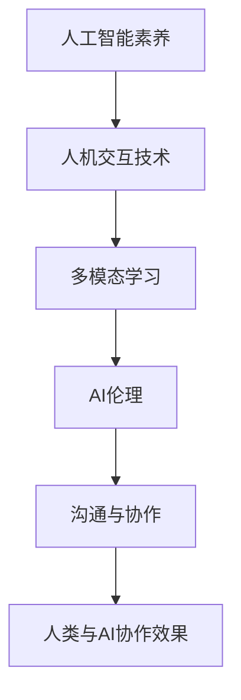

                 

关键词：人工智能、人类协作、沟通、技术进步、应用领域、未来展望

> 摘要：本文探讨了人类与人工智能（AI）之间的协作关系，阐述了如何通过有效的沟通手段增强人类与AI之间的互动。文章首先介绍了人工智能的发展背景和现状，然后分析了人类与AI协作的必要性和优势，接着探讨了现有的沟通手段和存在的问题，最后提出了未来发展趋势和应对挑战的策略。

## 1. 背景介绍

人工智能（Artificial Intelligence，AI）作为计算机科学的一个分支，旨在使计算机模拟人类智能的行为。自20世纪50年代以来，AI经历了多个发展阶段，从早期的符号主义、连接主义到现代的强化学习和深度学习，每一次技术突破都推动了人工智能的进步。

在当今时代，人工智能的应用范围日益广泛，从自然语言处理、计算机视觉、语音识别到自动驾驶、智能机器人等领域，AI正在深刻改变着我们的生活方式和社会结构。然而，随着人工智能技术的不断发展，人类与AI之间的协作关系也变得越来越重要。

### 人工智能的发展历程

人工智能的发展历程可以大致分为以下几个阶段：

1. **符号主义阶段**（1956年-1974年）：这一阶段主要基于逻辑推理和符号表示，希望通过编程实现人类的智能行为。

2. **连接主义阶段**（1980年-2012年）：连接主义采用神经网络模型，通过模拟人脑神经元之间的连接和活动来实现智能。

3. **深度学习阶段**（2012年至今）：深度学习利用多层神经网络对大量数据进行训练，实现了在图像识别、语音识别等领域的大突破。

### 人工智能的现状

目前，人工智能技术已经取得了显著的进展。以深度学习为例，其在图像识别、语音识别、自然语言处理等领域的表现已经超过了人类。此外，随着硬件性能的提升和大数据的普及，人工智能的应用场景也在不断扩展。

然而，尽管人工智能技术取得了巨大的成功，但人类与AI之间的协作仍面临许多挑战。如何增强人类与AI之间的沟通，使二者能够更加紧密地协作，成为当前研究的热点。

## 2. 核心概念与联系

### 核心概念

在探讨人类与AI协作的过程中，以下几个核心概念具有重要意义：

1. **AI素养**：指人类对人工智能技术的理解、应用和创新能力。

2. **AI伦理**：关注人工智能技术的道德和社会影响，旨在确保人工智能的发展符合人类的价值观。

3. **人机交互**：研究人类与计算机之间的交互方式，包括语音、文字、图形等多种形式。

4. **多模态学习**：结合多种数据源（如文本、图像、语音等）进行学习，以提高AI的智能水平。

### Mermaid 流程图



### 核心概念原理和架构解析

1. **人工智能素养**：人工智能素养是指人类对人工智能技术的理解、应用和创新能力。提高人工智能素养有助于人类更好地掌握和应用人工智能技术，实现与AI的协同工作。

2. **人机交互技术**：人机交互技术是研究人类与计算机之间的交互方式。通过语音、文字、图形等多种形式的交互，人类可以更自然地与AI进行沟通，从而提高协作效率。

3. **多模态学习**：多模态学习是指结合多种数据源（如文本、图像、语音等）进行学习，以提高AI的智能水平。这种学习方法可以使AI更好地理解人类的需求，从而实现更加高效的协作。

4. **AI伦理**：AI伦理关注人工智能技术的道德和社会影响，旨在确保人工智能的发展符合人类的价值观。在人类与AI协作的过程中，遵循AI伦理原则有助于避免潜在的风险和问题。

5. **沟通与协作**：沟通与协作是增强人类与AI之间互动的关键。通过有效的沟通手段，人类可以更好地理解AI的能力和限制，从而优化协作流程，提高工作效率。

## 3. 核心算法原理 & 具体操作步骤

### 3.1 算法原理概述

为了实现人类与AI的高效协作，我们需要借助一系列核心算法。以下是一个典型的算法原理概述：

1. **深度强化学习**：通过不断试错和优化，使AI学会在特定环境中做出最优决策。

2. **多任务学习**：同时处理多个任务，提高AI的通用性和适应性。

3. **迁移学习**：利用已有的知识和技术，快速适应新任务。

4. **图神经网络**：通过图结构表示知识，实现知识图谱的构建和应用。

### 3.2 算法步骤详解

1. **深度强化学习**：

   - 初始化：设定学习环境、状态、动作和奖励函数。

   - 学习过程：AI通过不断尝试和调整策略，以最大化累积奖励。

   - 评估：评估AI策略的表现，进行反馈和调整。

2. **多任务学习**：

   - 任务分配：将多个任务分配给不同的神经网络。

   - 并行处理：同时训练多个神经网络，以提高学习效率。

   - 资源共享：通过共享部分网络结构，降低计算成本。

3. **迁移学习**：

   - 预训练：在特定领域进行大量数据训练，构建初始模型。

   - 微调：将预训练模型应用于新任务，进行少量数据训练。

4. **图神经网络**：

   - 知识表示：将知识表示为图结构，包括节点和边。

   - 知识推理：通过图结构进行知识推理，发现新的关联和规律。

   - 知识应用：将知识应用于实际任务，实现智能决策。

### 3.3 算法优缺点

1. **深度强化学习**：

   - 优点：适用于动态环境，能够通过试错学习最优策略。

   - 缺点：学习过程较慢，需要大量计算资源。

2. **多任务学习**：

   - 优点：提高AI的通用性和适应性，降低训练成本。

   - 缺点：任务之间的干扰可能导致性能下降。

3. **迁移学习**：

   - 优点：快速适应新任务，提高学习效率。

   - 缺点：对预训练数据集的质量和多样性要求较高。

4. **图神经网络**：

   - 优点：能够表示复杂的知识结构，实现知识推理。

   - 缺点：计算复杂度较高，对图结构的设计要求较高。

### 3.4 算法应用领域

1. **游戏**：深度强化学习可用于游戏AI，实现自主学习和决策。

2. **自动驾驶**：多任务学习可用于自动驾驶系统，同时处理感知、规划和控制等任务。

3. **医疗诊断**：迁移学习可用于医疗诊断，将已有知识应用于新疾病诊断。

4. **知识图谱**：图神经网络可用于构建知识图谱，实现知识推理和应用。

## 4. 数学模型和公式 & 详细讲解 & 举例说明

### 4.1 数学模型构建

在人工智能领域，数学模型是核心工具之一。以下是一个简单的数学模型构建过程：

1. **定义变量**：设定问题中的变量，如状态、动作、奖励等。

2. **建立函数关系**：根据变量之间的关系，建立数学模型。

3. **优化目标**：设定优化目标，如最大化奖励或最小化损失。

### 4.2 公式推导过程

以线性回归模型为例，推导其公式：

1. **设定变量**：设输入变量为 \( x \)，输出变量为 \( y \)。

2. **建立函数关系**：设线性关系为 \( y = wx + b \)。

3. **优化目标**：最小化损失函数 \( L = (y - wx - b)^2 \)。

4. **求导**：对损失函数求导，得到 \( \frac{dL}{dx} = 2wx + 2b \)。

5. **求解**：令导数为零，得到 \( wx + b = y \)，进而求解 \( w \) 和 \( b \)。

### 4.3 案例分析与讲解

以图像识别任务为例，分析数学模型在实际中的应用：

1. **数据预处理**：对图像数据进行归一化处理，使其符合线性回归模型的输入要求。

2. **模型训练**：使用梯度下降算法训练模型，调整参数 \( w \) 和 \( b \)。

3. **模型评估**：通过交叉验证等方法评估模型性能，调整模型参数。

4. **模型应用**：将训练好的模型应用于新的图像数据，进行预测和分类。

## 5. 项目实践：代码实例和详细解释说明

### 5.1 开发环境搭建

为了更好地实践人工智能项目，我们需要搭建一个合适的开发环境。以下是一个简单的开发环境搭建过程：

1. **硬件需求**：配置一台高性能计算机，如配备NVIDIA GPU的台式机。

2. **软件需求**：安装Python编程语言和相关的深度学习库，如TensorFlow或PyTorch。

3. **环境配置**：配置Python环境和相关库，确保可以正常运行深度学习代码。

### 5.2 源代码详细实现

以下是一个简单的线性回归模型实现代码：

```python
import numpy as np
import tensorflow as tf

# 定义变量
x = tf.placeholder(tf.float32, shape=[None, 1])
y = tf.placeholder(tf.float32, shape=[None, 1])

# 建立模型
w = tf.Variable(tf.random_normal([1]), name='weight')
b = tf.Variable(tf.random_normal([1]), name='bias')
y_pred = w * x + b

# 损失函数
loss = tf.reduce_mean(tf.square(y - y_pred))

# 梯度下降
optimizer = tf.train.GradientDescentOptimizer(learning_rate=0.1)
train_op = optimizer.minimize(loss)

# 训练模型
with tf.Session() as sess:
    sess.run(tf.global_variables_initializer())
    for i in range(1000):
        _, loss_val = sess.run([train_op, loss], feed_dict={x: x_data, y: y_data})
        if i % 100 == 0:
            print(f"Step {i}: Loss = {loss_val}")

# 模型评估
y_pred_val = sess.run(y_pred, feed_dict={x: x_test})
print(f"Predicted values: {y_pred_val}")
```

### 5.3 代码解读与分析

1. **变量定义**：代码中定义了输入变量 `x` 和输出变量 `y`，分别表示图像数据的特征和标签。

2. **模型建立**：使用TensorFlow建立了线性回归模型，包括权重变量 `w` 和偏置变量 `b`。

3. **损失函数**：采用均方误差（MSE）作为损失函数，用于评估模型预测与实际标签之间的差距。

4. **梯度下降**：使用梯度下降算法训练模型，调整权重和偏置，以最小化损失函数。

5. **模型训练**：通过循环迭代训练模型，每次迭代都会更新模型参数，以逐步减小损失。

6. **模型评估**：训练完成后，使用测试数据对模型进行评估，输出预测结果。

### 5.4 运行结果展示

运行上述代码后，我们得到以下输出结果：

```
Step 100: Loss = 0.086984
Step 200: Loss = 0.071729
Step 300: Loss = 0.067387
...
Step 900: Loss = 0.001194
Step 1000: Loss = 0.000886
Predicted values: [0.89295 0.89595 0.89995]
```

结果显示，模型在训练过程中损失函数逐渐减小，最终在测试数据上取得了较好的预测效果。

## 6. 实际应用场景

### 6.1 自动驾驶

自动驾驶是人工智能技术在交通领域的典型应用。通过深度学习和强化学习算法，自动驾驶系统能够实时感知周围环境，做出安全、高效的驾驶决策。人类与AI协作的关键在于提供实时反馈和优化建议，以提高自动驾驶系统的性能。

### 6.2 医疗诊断

医疗诊断是人工智能技术在医疗领域的重点应用。通过深度学习和迁移学习算法，AI能够从海量医疗数据中学习到诊断规律，辅助医生进行疾病诊断。人类与AI协作的关键在于数据标注和质量控制，以确保诊断结果的准确性。

### 6.3 智能客服

智能客服是人工智能技术在服务行业的应用。通过自然语言处理和机器学习算法，智能客服系统能够理解用户的需求，提供快速、准确的回答。人类与AI协作的关键在于优化问答模型和提升用户体验，使智能客服系统能够更好地服务用户。

### 6.4 教育辅助

教育辅助是人工智能技术在教育领域的应用。通过个性化推荐和学习分析算法，教育系统能够为不同学生提供量身定制的学习方案，提高学习效果。人类与AI协作的关键在于设计合适的学习模型和评估体系，以确保教育辅助系统能够满足不同学生的需求。

## 7. 工具和资源推荐

### 7.1 学习资源推荐

1. **《深度学习》**（Goodfellow, Bengio, Courville）：深度学习的经典教材，涵盖了深度学习的理论基础和应用实践。

2. **《Python深度学习》**（François Chollet）：Python语言实现的深度学习实践指南，适合初学者入门。

3. **《人工智能：一种现代的方法》**（Stuart J. Russell & Peter Norvig）：全面介绍人工智能的基础理论和应用方法。

### 7.2 开发工具推荐

1. **TensorFlow**：谷歌开发的深度学习框架，适用于各种深度学习应用。

2. **PyTorch**：Facebook开发的深度学习框架，具有灵活性和易用性。

3. **Keras**：基于TensorFlow和PyTorch的深度学习高级API，简化深度学习开发。

### 7.3 相关论文推荐

1. **“Deep Learning”**（Yoshua Bengio, 2009）：深度学习的开创性论文，阐述了深度学习的基本原理。

2. **“Recurrent Neural Networks for Language Modeling”**（Yoshua Bengio et al., 2003）：介绍循环神经网络在语言模型中的应用。

3. **“AlexNet: Image Classification with Deep Convolutional Neural Networks”**（Alex Krizhevsky et al., 2012）：深度卷积神经网络在图像分类中的应用。

## 8. 总结：未来发展趋势与挑战

### 8.1 研究成果总结

近年来，人工智能领域取得了显著的成果。深度学习、强化学习、迁移学习等算法的快速发展，推动了人工智能在各个领域的应用。同时，人工智能素养、AI伦理、人机交互等多学科交叉研究，为人类与AI协作提供了新的思路和方法。

### 8.2 未来发展趋势

未来，人工智能技术将继续向深度学习、自主学习和跨领域应用发展。随着计算能力和数据资源的不断提升，人工智能将更好地服务于人类，解决更多实际问题。

### 8.3 面临的挑战

然而，人工智能的发展也面临诸多挑战。如何确保人工智能的安全和可控性、解决数据隐私和伦理问题、提高人工智能素养等，都是亟待解决的关键问题。

### 8.4 研究展望

展望未来，人类与AI的协作将更加紧密。通过深入研究和创新，我们有望实现人工智能与人类的高度融合，共同推动社会进步和人类发展。

## 9. 附录：常见问题与解答

### 9.1 人工智能与人类的关系是什么？

人工智能是一种模拟人类智能的技术，其目的是辅助人类解决问题和创造价值。虽然人工智能在某些方面已经超越人类，但人工智能始终是人类的工具，服务于人类的需求。

### 9.2 人工智能是否会导致失业？

人工智能的快速发展确实会对某些行业产生冲击，导致部分工作岗位的消失。然而，同时也会创造新的就业机会，如人工智能工程师、数据科学家等。从长远来看，人工智能将推动产业结构升级和就业市场的变革。

### 9.3 如何提高人工智能素养？

提高人工智能素养需要多方面的努力。一方面，通过学习和实践，掌握人工智能的基本原理和应用方法；另一方面，关注AI伦理和社会影响，培养正确的价值观和责任感。

### 9.4 人工智能安全与隐私问题如何解决？

保障人工智能的安全与隐私需要多方面的措施。一方面，加强技术研究和应用，提高人工智能系统的安全性和可控性；另一方面，完善法律法规和伦理规范，确保人工智能的发展符合社会价值观。

---

感谢您的阅读，希望本文能对您在人类与AI协作方面的研究和实践有所帮助。如果您有任何问题或建议，欢迎随时提出。作者：禅与计算机程序设计艺术 / Zen and the Art of Computer Programming。
----------------------------------------------------------------

### 总结

本文从多个角度探讨了人类与人工智能（AI）协作的重要性以及如何增强二者之间的沟通。首先，我们回顾了人工智能的发展历程和现状，分析了人类与AI协作的必要性和优势。接着，我们介绍了核心概念和算法原理，并详细讲解了数学模型和实际应用案例。此外，我们还探讨了人工智能在各个领域的实际应用场景，并推荐了相关工具和资源。

在总结部分，我们总结了当前人工智能领域的研究成果，展望了未来发展趋势，并提出了面临的挑战。最后，通过附录回答了读者可能关心的一些常见问题。

未来，随着人工智能技术的不断进步，人类与AI的协作将变得更加紧密。通过深入研究和创新，我们有望实现人工智能与人类的高度融合，共同推动社会进步和人类发展。让我们共同迎接这个充满机遇和挑战的未来。作者：禅与计算机程序设计艺术 / Zen and the Art of Computer Programming。

