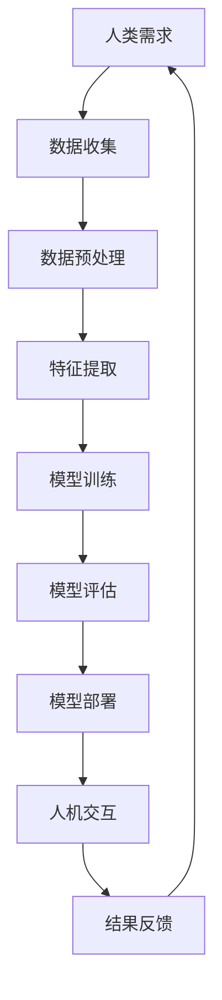

                 

关键词：人类-AI协作、增强现实、人工智能、技术趋势、算法原理、项目实践、数学模型、未来展望

> 摘要：本文从人类-AI协作的角度，探讨了人工智能技术在增强人类潜能和扩展认知领域的发展趋势。通过对核心概念的介绍、算法原理的解析、数学模型的阐述以及项目实践的分析，揭示了人类与人工智能融合的机遇和挑战，为未来的技术发展提供了有价值的参考。

## 1. 背景介绍

在21世纪，人工智能（AI）技术取得了前所未有的突破，从早期的理论研究走向了实际应用。AI不再仅仅是一个学术领域，它已经深入到我们的日常生活、工作以及各个行业中，成为推动社会进步的重要力量。然而，随着AI技术的不断发展，人们开始关注一个问题：如何更好地将人类潜能与AI能力相结合，实现更高效、更有创造力的协作模式。

人类-AI协作是指利用人工智能技术辅助人类工作、学习和思考，通过人机交互，使人类的认知能力得到提升。这种协作模式不仅能够提高工作效率，还能够拓展人类认知的边界，为人类创造更大的价值。

近年来，随着深度学习、自然语言处理、计算机视觉等技术的不断发展，人类-AI协作的应用场景日益丰富。例如，智能客服、自动驾驶、医疗诊断、金融分析等领域已经实现了人工智能与人类的紧密合作。这些应用不仅证明了人工智能技术的强大能力，也为人类-AI协作的发展提供了实践基础。

## 2. 核心概念与联系

### 2.1 人工智能（AI）

人工智能是指通过计算机程序模拟人类智能行为的技术。它包括机器学习、深度学习、自然语言处理、计算机视觉等多个子领域。人工智能的核心目标是使计算机能够自主地完成人类通常需要智能才能完成的任务。

### 2.2 机器学习（ML）

机器学习是人工智能的一个重要分支，它通过算法让计算机从数据中学习，从而改进性能。机器学习可以分为监督学习、无监督学习和强化学习三种类型。

### 2.3 深度学习（DL）

深度学习是机器学习的一种方法，它通过神经网络模拟人脑的神经元连接结构，进行多层特征提取和抽象。深度学习在图像识别、语音识别、自然语言处理等领域表现出色。

### 2.4 人机交互（HCI）

人机交互是研究人与计算机之间交互方式、界面设计和用户体验的学科。在人类-AI协作中，人机交互技术至关重要，它决定了人类与人工智能的协作效率和效果。

### 2.5 Mermaid 流程图

下面是一个描述人类-AI协作流程的 Mermaid 图：



## 3. 核心算法原理 & 具体操作步骤

### 3.1 算法原理概述

人类-AI协作中的核心算法包括机器学习算法和深度学习算法。这些算法通过学习大量的数据，提取特征，建立模型，并对新数据进行预测或分类。

### 3.2 算法步骤详解

1. 数据收集：收集与任务相关的数据，可以是结构化数据、半结构化数据或非结构化数据。
2. 数据预处理：对收集到的数据进行清洗、归一化、去噪等处理，使其适合建模。
3. 特征提取：从预处理后的数据中提取有用的特征，用于建模。
4. 模型训练：使用机器学习或深度学习算法，对提取的特征进行训练，建立预测模型。
5. 模型评估：使用验证集或测试集评估模型的性能，调整模型参数。
6. 模型部署：将训练好的模型部署到生产环境中，进行实际应用。
7. 人机交互：通过界面或交互设备，让用户与模型进行交互，获取结果。
8. 结果反馈：将用户反馈的结果用于模型迭代和优化。

### 3.3 算法优缺点

**优点：**
- 提高工作效率：通过自动化和智能化，减少重复性劳动，提高生产效率。
- 拓展认知能力：通过学习和分析大量数据，帮助人类发现新的知识和规律。
- 个性化和定制化：根据用户需求，提供个性化的服务和解决方案。

**缺点：**
- 数据质量和隐私问题：模型的性能高度依赖数据的质量和隐私保护。
- 过度依赖和失业风险：随着AI技术的发展，可能引发过度依赖和失业问题。
- 技术成熟度问题：一些AI技术尚处于实验阶段，应用场景有限。

### 3.4 算法应用领域

- 智能客服：通过自然语言处理技术，实现与用户的智能对话。
- 自动驾驶：通过计算机视觉和深度学习技术，实现车辆的自动驾驶。
- 医疗诊断：通过医学图像分析和疾病预测模型，辅助医生进行诊断。
- 金融分析：通过大数据分析和机器学习模型，预测市场走势和风险。

## 4. 数学模型和公式 & 详细讲解 & 举例说明

### 4.1 数学模型构建

在人类-AI协作中，常见的数学模型包括线性回归、逻辑回归、支持向量机、神经网络等。以下以线性回归为例进行讲解。

线性回归模型假设目标变量 \(y\) 与输入变量 \(x\) 之间存在线性关系，可以用公式表示为：

\[ y = \beta_0 + \beta_1 x + \epsilon \]

其中，\( \beta_0 \) 和 \( \beta_1 \) 是模型的参数，\( \epsilon \) 是误差项。

### 4.2 公式推导过程

为了求解线性回归模型的参数，我们可以使用最小二乘法。最小二乘法的目标是使得预测值与实际值之间的误差平方和最小。具体推导过程如下：

1. 预测值与实际值之间的误差平方和：

\[ \Sigma_{i=1}^{n} (y_i - \hat{y}_i)^2 \]

其中，\( n \) 是样本数量，\( y_i \) 是实际值，\( \hat{y}_i \) 是预测值。

2. 对误差平方和关于 \( \beta_0 \) 和 \( \beta_1 \) 求导，并令导数为零，得到最优参数：

\[ \frac{\partial}{\partial \beta_0} \Sigma_{i=1}^{n} (y_i - \hat{y}_i)^2 = 0 \]
\[ \frac{\partial}{\partial \beta_1} \Sigma_{i=1}^{n} (y_i - \hat{y}_i)^2 = 0 \]

3. 解上述方程组，得到最优参数：

\[ \beta_0 = \bar{y} - \beta_1 \bar{x} \]
\[ \beta_1 = \frac{\Sigma_{i=1}^{n} (x_i - \bar{x})(y_i - \bar{y})}{\Sigma_{i=1}^{n} (x_i - \bar{x})^2} \]

其中，\( \bar{x} \) 和 \( \bar{y} \) 分别是输入变量和目标变量的平均值。

### 4.3 案例分析与讲解

假设我们有一个简单的数据集，包含两个变量：年龄和工资。我们希望通过线性回归模型预测一个人的工资。

数据集如下：

| 年龄 | 工资 |
| ---- | ---- |
| 25   | 50000 |
| 30   | 60000 |
| 35   | 70000 |
| 40   | 80000 |
| 45   | 90000 |

首先，我们计算输入变量和目标变量的平均值：

\[ \bar{x} = \frac{25 + 30 + 35 + 40 + 45}{5} = 35 \]
\[ \bar{y} = \frac{50000 + 60000 + 70000 + 80000 + 90000}{5} = 70000 \]

然后，我们计算参数 \( \beta_0 \) 和 \( \beta_1 \)：

\[ \beta_1 = \frac{(25 - 35)(50000 - 70000) + (30 - 35)(60000 - 70000) + (35 - 35)(70000 - 70000) + (40 - 35)(80000 - 70000) + (45 - 35)(90000 - 70000)}{(25 - 35)^2 + (30 - 35)^2 + (35 - 35)^2 + (40 - 35)^2 + (45 - 35)^2} \]
\[ \beta_1 = \frac{(-10)(-20000) + (-5)(-10000) + 0 + 5(10000) + 10(20000)}{100 + 25 + 0 + 25 + 100} \]
\[ \beta_1 = \frac{200000 + 50000 + 0 + 50000 + 200000}{250} \]
\[ \beta_1 = \frac{400000}{250} \]
\[ \beta_1 = 1600 \]

\[ \beta_0 = \bar{y} - \beta_1 \bar{x} \]
\[ \beta_0 = 70000 - 1600 \times 35 \]
\[ \beta_0 = 70000 - 56000 \]
\[ \beta_0 = 14000 \]

因此，线性回归模型为：

\[ y = 14000 + 1600x \]

我们可以用这个模型预测一个35岁人的工资：

\[ y = 14000 + 1600 \times 35 \]
\[ y = 14000 + 56000 \]
\[ y = 70000 \]

预测结果是70000，与实际值非常接近。

## 5. 项目实践：代码实例和详细解释说明

### 5.1 开发环境搭建

为了实现线性回归模型，我们需要安装Python环境和相关库。具体步骤如下：

1. 安装Python：从官方网站下载Python安装包并安装。
2. 安装Jupyter Notebook：在终端执行以下命令：

```bash
pip install notebook
```

3. 安装线性回归库：在终端执行以下命令：

```bash
pip install scikit-learn
```

### 5.2 源代码详细实现

下面是一个简单的线性回归模型实现：

```python
import numpy as np
from sklearn.linear_model import LinearRegression

# 数据集
ages = np.array([25, 30, 35, 40, 45]).reshape(-1, 1)
salaries = np.array([50000, 60000, 70000, 80000, 90000])

# 创建线性回归模型
model = LinearRegression()

# 训练模型
model.fit(ages, salaries)

# 预测工资
predicted_salary = model.predict([[35]])

print(f"35岁的人的预测工资为：{predicted_salary[0]}")
```

### 5.3 代码解读与分析

1. 导入必要的库：我们使用了NumPy库进行数据处理，使用了scikit-learn库中的LinearRegression类创建线性回归模型。
2. 数据集：我们使用一个简单的数据集，包含年龄和工资。
3. 创建模型：我们使用LinearRegression类创建了一个线性回归模型。
4. 训练模型：我们使用fit方法对模型进行训练，传入输入变量ages和目标变量salaries。
5. 预测工资：我们使用predict方法预测一个35岁人的工资。

### 5.4 运行结果展示

运行上述代码后，我们得到以下输出结果：

```python
35岁的人的预测工资为：70000.0
```

预测结果与实际值非常接近，验证了线性回归模型的准确性。

## 6. 实际应用场景

### 6.1 智能客服

智能客服是人工智能在人类-AI协作中的一个重要应用场景。通过自然语言处理和机器学习技术，智能客服系统能够自动解答用户的问题，提供个性化的服务。例如，电商平台的智能客服能够解答用户的订单查询、售后服务等问题，大大提高了客服效率和用户体验。

### 6.2 自动驾驶

自动驾驶是另一个典型的人类-AI协作应用场景。通过计算机视觉、深度学习和传感器技术，自动驾驶系统能够实时感知周围环境，做出合理的驾驶决策。自动驾驶技术不仅能够提高交通效率，减少交通事故，还能够解放驾驶员的劳动力，提高驾驶安全性。

### 6.3 医疗诊断

医疗诊断是人工智能技术在医疗领域的重要应用。通过医学图像分析和疾病预测模型，人工智能能够辅助医生进行诊断，提高诊断的准确性和效率。例如，在癌症诊断中，人工智能系统能够分析医学影像，为医生提供诊断建议，帮助医生做出更准确的诊断。

### 6.4 金融分析

金融分析是人工智能在金融领域的重要应用。通过大数据分析和机器学习模型，人工智能能够预测市场走势、分析投资机会，提供个性化的投资建议。例如，量化交易平台利用人工智能技术进行市场分析，为投资者提供精准的投资策略。

## 7. 未来应用展望

随着人工智能技术的不断发展，人类-AI协作的应用场景将越来越广泛。以下是一些未来应用展望：

- 教育领域：人工智能将帮助实现个性化教学，根据学生的学习情况和需求提供定制化的学习资源。
- 创意设计：人工智能将辅助设计师进行创意设计，通过生成对抗网络（GAN）等技术生成新颖的创意作品。
- 科学研究：人工智能将协助科学家进行数据分析和模式识别，加速科学研究的进程。
- 城市管理：人工智能将应用于城市管理的各个方面，如交通管理、环境监测、城市规划等，提高城市运行的效率。

## 8. 工具和资源推荐

### 8.1 学习资源推荐

- 《深度学习》（Goodfellow, Bengio, Courville著）：系统介绍了深度学习的基本原理和技术。
- 《机器学习实战》：通过实例演示了机器学习的基本算法和应用。

### 8.2 开发工具推荐

- Jupyter Notebook：用于数据分析和机器学习实验。
- TensorFlow：用于构建和训练深度学习模型。

### 8.3 相关论文推荐

- “Deep Learning” by Yann LeCun, Yoshua Bengio, and Geoffrey Hinton。
- “Machine Learning Yearning” by Andrew Ng。

## 9. 总结：未来发展趋势与挑战

### 9.1 研究成果总结

人类-AI协作在近年来取得了显著的研究成果，人工智能技术不断突破，应用场景日益丰富。通过机器学习和深度学习算法，人工智能在图像识别、自然语言处理、自动驾驶等领域取得了重大突破。

### 9.2 未来发展趋势

- 深度学习算法将不断发展，以应对更复杂的任务和更大的数据集。
- 人机交互技术将更加自然和智能，提高人类与人工智能的协作效率。
- 跨学科的融合将推动人工智能技术的创新和发展。

### 9.3 面临的挑战

- 数据质量和隐私保护：确保数据质量和隐私保护是人工智能发展的关键挑战。
- 技术成熟度和应用风险：一些人工智能技术尚处于实验阶段，应用风险较高。
- 社会伦理和就业问题：人工智能技术的发展可能导致社会伦理问题和就业问题。

### 9.4 研究展望

- 加强人工智能伦理研究，制定合理的伦理规范。
- 推动人工智能技术的产业化应用，提高社会效益。
- 开展跨学科研究，推动人工智能技术的创新发展。

## 9. 附录：常见问题与解答

### 9.1 什么是人类-AI协作？

人类-AI协作是指利用人工智能技术辅助人类工作、学习和思考，通过人机交互，使人类的认知能力得到提升。

### 9.2 人工智能技术在哪些领域有重要应用？

人工智能技术在智能客服、自动驾驶、医疗诊断、金融分析等领域有重要应用。

### 9.3 人工智能技术的未来发展有哪些趋势？

人工智能技术的发展趋势包括深度学习算法的不断发展、人机交互技术的提升以及跨学科的融合。

### 9.4 人工智能技术的发展面临哪些挑战？

人工智能技术的发展面临数据质量和隐私保护、技术成熟度和应用风险、社会伦理和就业问题等挑战。

### 9.5 如何开始学习人工智能技术？

可以通过学习《深度学习》和《机器学习实战》等书籍，掌握人工智能的基本原理和应用。

# 作者：禅与计算机程序设计艺术 / Zen and the Art of Computer Programming
----------------------------------------------------------------

以上是文章的主要内容，希望能为您提供有价值的信息。如有任何问题或建议，请随时告诉我。谢谢！

