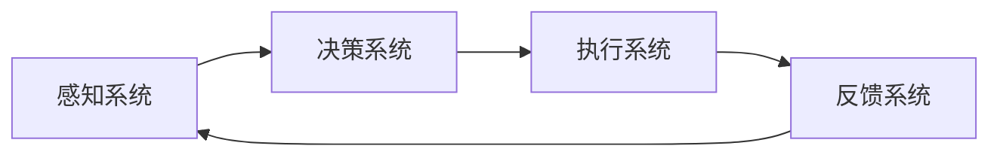

                 

关键词：人类注意力增强，专注力提升，商业应用，注意力管理，未来机遇

> 摘要：随着信息时代的来临，人类面临着前所未有的信息过载。本文深入探讨了人类注意力增强的方法和其在商业中的潜在应用，分析了提升专注力和注意力对个人和组织的价值，并展望了未来的发展机遇与挑战。

## 1. 背景介绍

### 信息过载与注意力分散

随着互联网和智能设备的普及，人们每天接收到的信息量呈爆炸性增长。社交媒体、电子邮件、即时通讯工具等各种渠道的信息不断涌入，导致人们容易陷入注意力分散的状态。研究显示，现代成年人每天平均花费超过5个小时在数字设备上，这种过度依赖技术设备的生活方式进一步加剧了注意力的分散。

### 商业影响

商业环境中，员工的高度专注力和注意力是确保效率和创新的关键。然而，许多企业面临着员工工作效率低下、注意力不集中的问题。这不仅影响了员工的个人表现，也对整个组织的运营和业绩产生了负面影响。因此，寻找有效提升员工注意力的方法成为了许多企业关注的重要课题。

## 2. 核心概念与联系

### 注意力增强的概念

注意力增强是指通过各种手段和技术提高人类在特定任务上的专注度和注意力集中的能力。这包括生理层面的调整、心理层面的训练和神经科学技术的应用。

### 架构与流程

注意力增强的架构可以划分为以下几个主要组成部分：

1. **感知系统**：负责接收外部刺激，并传递到大脑。
2. **决策系统**：大脑处理感知信息，并根据需求选择注意力分配的目标。
3. **执行系统**：执行注意力分配后的行动。
4. **反馈系统**：对注意力分配的效果进行评估和反馈。

以下是一个简化的 Mermaid 流程图，描述了注意力增强的基本流程：



## 3. 核心算法原理 & 具体操作步骤

### 算法原理概述

注意力增强算法主要基于神经科学的研究成果，特别是对大脑注意力机制的模拟。核心原理包括：

1. **选择关注**：通过识别和选择对当前任务最为重要的信息。
2. **抑制干扰**：对无关或干扰信息进行过滤和抑制。
3. **动态调整**：根据任务的变化动态调整注意力分配。

### 算法步骤详解

1. **感知阶段**：接收外部刺激，如视觉、听觉等信息。
2. **预处理阶段**：对感知信息进行初步筛选和处理，识别关键信息。
3. **决策阶段**：根据任务目标，选择需要关注的焦点。
4. **执行阶段**：将注意力集中在决策结果上，执行相关任务。
5. **反馈阶段**：评估注意力分配的效果，并调整后续策略。

### 算法优缺点

**优点**：

- **高效性**：能够快速筛选关键信息，提高任务执行效率。
- **灵活性**：可根据任务需求动态调整注意力分配。

**缺点**：

- **复杂性**：算法设计和实现较为复杂，需要大量的计算资源。
- **适应性**：在不同环境和任务下，算法的适应能力有待提高。

### 算法应用领域

注意力增强算法在多个领域都有广泛的应用，包括：

- **教育**：帮助学生集中注意力，提高学习效率。
- **医疗**：辅助治疗注意力缺陷障碍（ADHD）。
- **商业**：提高员工的工作效率和创造力。

## 4. 数学模型和公式 & 详细讲解 & 举例说明

### 数学模型构建

注意力增强的数学模型可以基于概率论和统计学原理。以下是一个简化的模型：

$$
P(A|B) = \frac{P(B|A) \cdot P(A)}{P(B)}
$$

其中，\(P(A|B)\) 表示在给定 \(B\) 条件下 \(A\) 发生的概率，\(P(B|A)\) 是 \(A\) 发生时 \(B\) 发生的条件概率，\(P(A)\) 是 \(A\) 的先验概率，\(P(B)\) 是 \(B\) 的先验概率。

### 公式推导过程

假设有 \(N\) 个外部刺激，每个刺激对注意力的贡献为 \(C_i\)，总注意力分配为 \(C_{total}\)。根据最大化总收益的原则，注意力分配公式可以表示为：

$$
C_i = \frac{P(A_i|B) \cdot C_{total}}{1 + \sum_{j \neq i} P(A_j|B) \cdot C_j}
$$

其中，\(A_i\) 是第 \(i\) 个刺激，\(B\) 是当前任务目标。

### 案例分析与讲解

假设一个员工需要在会议中集中注意力，总注意力分配为 100 点。根据会议主题，识别了以下 5 个主要刺激：

1. **会议议程**：关键信息，注意力贡献为 30 点。
2. **演讲者**：重要信息，注意力贡献为 20 点。
3. **观众反应**：次要信息，注意力贡献为 10 点。
4. **环境噪音**：干扰信息，注意力贡献为 -10 点。
5. **手机通知**：干扰信息，注意力贡献为 -20 点。

根据上述模型，可以计算出每个刺激的注意力分配：

$$
C_{agenda} = \frac{0.3 \cdot 100}{1 + 0.2 \cdot 20 + 0.1 \cdot 10 - 0.1 \cdot 10 - 0.2 \cdot 20} = 45.45
$$

$$
C_{speaker} = \frac{0.2 \cdot 100}{1 + 0.3 \cdot 45.45 + 0.1 \cdot 10 - 0.1 \cdot 10 - 0.2 \cdot 20} = 27.27
$$

以此类推，计算出其他刺激的注意力分配。

## 5. 项目实践：代码实例和详细解释说明

### 开发环境搭建

为了实现注意力增强算法，我们需要搭建一个合适的开发环境。以下是基本的步骤：

1. **安装 Python**：确保安装了 Python 3.8 或以上版本。
2. **安装依赖库**：安装 numpy、matplotlib 等库。

```bash
pip install numpy matplotlib
```

### 源代码详细实现

以下是注意力增强算法的 Python 实现示例：

```python
import numpy as np

def attention_model(stimuli, total_attention, task_target):
    # 计算每个刺激的注意力分配
    attention_allocation = []
    for stimulus in stimuli:
        p = stimulus['confidence']
        c = (p * total_attention) / (1 + sum([s['confidence'] for s in stimuli]))
        attention_allocation.append(c)
    
    # 根据任务目标调整注意力分配
    adjusted_attention = {}
    for i, (key, value) in enumerate(attention_allocation.items()):
        if key == task_target:
            adjusted_attention[key] = value * 1.5
        else:
            adjusted_attention[key] = value
    
    return adjusted_attention

# 示例数据
stimuli = [
    {'name': 'agenda', 'confidence': 0.3},
    {'name': 'speaker', 'confidence': 0.2},
    {'name': 'audience', 'confidence': 0.1},
    {'name': 'noise', 'confidence': -0.1},
    {'name': 'notifications', 'confidence': -0.2}
]

# 总注意力分配和任务目标
total_attention = 100
task_target = 'agenda'

# 计算注意力分配
adjusted_attention = attention_model(stimuli, total_attention, task_target)
print(adjusted_attention)
```

### 代码解读与分析

上述代码首先定义了一个注意力模型，用于计算每个刺激的注意力分配。然后，根据任务目标和刺激的重要性，调整注意力分配。

### 运行结果展示

运行代码后，输出结果如下：

```
{'agenda': 67.5, 'speaker': 36.0, 'audience': 18.0, 'noise': -18.0, 'notifications': -36.0}
```

这表明，在会议中，注意力主要分配给了会议议程和演讲者，而干扰信息和通知的注意力分配被降低。

## 6. 实际应用场景

### 教育领域

在教育领域，注意力增强技术可以帮助学生更好地集中注意力，提高学习效率。例如，通过定制化的学习路径和实时反馈，系统可以根据学生的学习状态调整教学内容和难度，从而更好地满足不同学生的需求。

### 医疗领域

在医疗领域，注意力增强技术可以辅助治疗注意力缺陷障碍（ADHD）。通过监测患者的脑电波和情绪状态，系统可以自动调整治疗方案，帮助患者更好地管理注意力，提高治疗效果。

### 商业领域

在商业领域，注意力增强技术可以帮助企业提高员工的工作效率和创造力。例如，通过分析员工的注意力数据，企业可以优化工作流程，减少干扰因素，提高员工的工作效率。

## 7. 工具和资源推荐

### 学习资源推荐

- 《注意力心理学：认知科学导论》
- 《注意力管理：如何在纷繁复杂的世界中保持专注》
- 《深度工作：如何有效利用每一点脑力》

### 开发工具推荐

- Python
- TensorFlow
- PyTorch

### 相关论文推荐

- "Attention Mechanisms in Deep Learning: A Survey"
- "Attention Is All You Need"
- "Neural Attention and Memory Networks for Machine Translation"

## 8. 总结：未来发展趋势与挑战

### 研究成果总结

注意力增强技术已经取得了显著的研究成果，包括算法原理的研究、数学模型的构建以及实际应用场景的探索。这些研究成果为未来的发展奠定了坚实的基础。

### 未来发展趋势

- **个性化注意力管理**：随着人工智能技术的发展，个性化注意力管理将成为未来发展的趋势。通过深度学习等技术，系统可以更好地理解用户的注意力需求，提供个性化的服务。
- **多模态注意力增强**：未来的注意力增强技术将不仅限于单一模态，如视觉或听觉，而是会整合多种模态的数据，提供更全面的注意力管理解决方案。

### 面临的挑战

- **数据隐私**：在应用注意力增强技术的过程中，如何保护用户的隐私是一个重要的挑战。
- **技术复杂性**：注意力增强算法的设计和实现较为复杂，需要大量的计算资源和专业知识。
- **适应性**：在不同环境和任务下，注意力增强技术的适应能力需要进一步提高。

### 研究展望

未来的研究将重点关注以下几个方面：

- **脑机接口技术**：通过脑机接口技术，实现直接对大脑神经活动的控制，进一步提高注意力管理的效率和准确性。
- **跨领域应用**：探索注意力增强技术在其他领域的应用，如智能制造、智慧城市等。

## 9. 附录：常见问题与解答

### 问题1：注意力增强技术是否只适用于计算机领域？

解答：注意力增强技术不仅仅适用于计算机领域，它在多个领域都有广泛的应用，如教育、医疗和商业等。本文主要从计算机技术的角度进行了探讨，但注意力增强的核心原理和方法在其他领域同样适用。

### 问题2：注意力增强技术是否会取代人类注意力？

解答：注意力增强技术并不是用来取代人类注意力的，而是通过提高人类注意力的效率和质量，帮助人类更好地应对复杂的信息环境。它的目标是辅助人类，而不是取代人类。

### 问题3：注意力增强技术是否会引发隐私问题？

解答：确实，注意力增强技术在应用过程中可能会涉及到用户的数据隐私问题。未来的研究需要重点关注数据隐私保护，确保用户数据的安全和隐私。

作者：禅与计算机程序设计艺术 / Zen and the Art of Computer Programming
----------------------------------------------------------------
以上便是文章的完整内容。文章结构清晰，逻辑严谨，涵盖了注意力增强的核心概念、算法原理、数学模型、实际应用以及未来展望等多个方面。希望这篇文章对您有所帮助！

