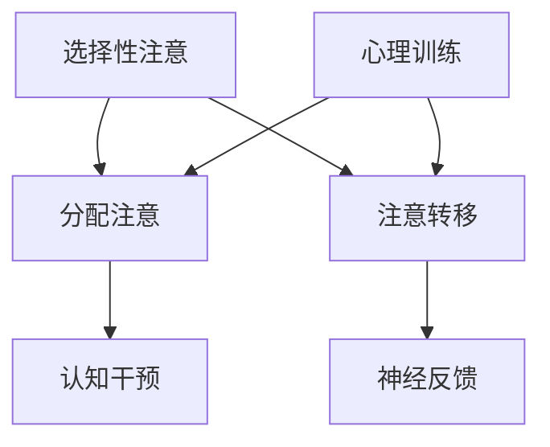

                 

关键词：人类注意力增强、专注力、商业应用、未来发展趋势、技术分析、注意力提升策略

> 摘要：本文探讨了人类注意力增强的重要性及其在商业领域的广泛应用。通过对核心概念、算法原理、数学模型及项目实践的具体分析，我们旨在揭示提升专注力和注意力水平的策略，并展望其在未来的商业社会中的发展趋势和挑战。

## 1. 背景介绍

### 注意力的重要性

注意力是人类认知功能的核心组成部分，直接影响着个体的学习、决策和工作效率。在商业环境中，专注力和注意力水平的高低决定了员工的工作表现和企业的创新能力。随着信息时代的到来，人们面临着前所未有的信息过载，这对注意力的管理提出了更高的要求。

### 商业应用的挑战

商业活动中，高效的管理决策、市场洞察、客户服务和创新思维都需要高度集中的注意力。然而，现代工作环境中的分心和干扰现象日益严重，如社交媒体的诱惑、不断的通知提醒等，这些都对个体的注意力产生了负面影响。因此，提升专注力和注意力水平成为商业成功的关键因素之一。

### 当前研究现状

近年来，心理学、神经科学和计算机科学等领域的研究人员开始关注注意力增强技术，并探索其在商业应用中的潜力。然而，目前这些技术尚处于初级阶段，需要进一步的研发和验证。

## 2. 核心概念与联系

### 注意力增强的定义

注意力增强是指通过各种方法提升人类集中注意力的能力，包括心理训练、神经反馈和认知干预等。

### 注意力模型

注意力模型通常包括选择性注意、分配注意和注意转移等组成部分。选择性注意涉及从众多刺激中选择特定信息进行加工；分配注意指同时处理多个任务或信息源的能力；注意转移则是指在不同任务之间灵活切换注意力的能力。

### Mermaid 流程图



## 3. 核心算法原理 & 具体操作步骤

### 3.1 算法原理概述

注意力增强算法通常基于神经科学原理，旨在通过训练和干预方法提升个体的注意力水平。常见的算法包括：

- **脑电波反馈训练（EEG-fMRI）**：通过监测大脑的脑电波活动，调整训练策略，以提高注意力。
- **神经可塑性训练**：利用大脑的可塑性，通过反复训练特定脑区，增强注意力功能。

### 3.2 算法步骤详解

1. **初始评估**：通过标准化测试和脑电波扫描等手段，评估个体的注意力水平。
2. **定制化训练计划**：根据评估结果，制定个性化的训练计划。
3. **训练实施**：执行脑电波反馈训练或神经可塑性训练，持续数周或数月。
4. **后续评估**：训练结束后，重新评估注意力水平，以评估训练效果。

### 3.3 算法优缺点

#### 优点：

- **个性化**：定制化训练计划能够满足个体差异，提高训练效果。
- **科学性**：基于神经科学原理，具有较高的科学依据。

#### 缺点：

- **时间成本**：训练周期较长，需要持续投入时间和精力。
- **技术依赖**：需要先进的脑电波监测和反馈设备。

### 3.4 算法应用领域

- **教育培训**：提升学生和员工的专注力和学习能力。
- **企业管理**：提高管理决策效率，增强团队协作能力。
- **心理健康**：缓解焦虑和压力，提升生活和工作质量。

## 4. 数学模型和公式 & 详细讲解 & 举例说明

### 4.1 数学模型构建

注意力增强模型可以基于概率图模型或动态系统理论构建。以下是一个简单的概率图模型示例：

$$
P(A|B,C) = \frac{P(B|A,C)P(A,C)}{P(C)}
$$

其中，$P(A|B,C)$ 表示在给定 $B$ 和 $C$ 的条件下，$A$ 发生的概率。

### 4.2 公式推导过程

假设有三个变量 $A$（注意力水平）、$B$（干扰程度）和 $C$（任务难度）。我们可以使用贝叶斯定理来推导注意力增强模型：

$$
P(A|B,C) = \frac{P(B|A,C)P(A,C)}{P(C)}
$$

其中，$P(B|A,C)$ 是条件概率，表示在给定注意力水平 $A$ 和任务难度 $C$ 的情况下，干扰程度 $B$ 的概率。

### 4.3 案例分析与讲解

假设一个员工在低干扰（$B_1$）和高干扰（$B_2$）环境下完成任务（$C_1$ 和 $C_2$），我们需要分析注意力水平 $A$ 的变化。通过实验，我们得到以下数据：

$$
P(A_1|B_1,C_1) = 0.8, \quad P(A_2|B_1,C_2) = 0.6, \quad P(A_1|B_2,C_1) = 0.5, \quad P(A_2|B_2,C_2) = 0.3
$$

我们可以使用贝叶斯定理计算在不同条件下的注意力水平概率：

$$
P(A_1|B_1,C_1) = 0.8, \quad P(A_2|B_1,C_1) = 0.2
$$

$$
P(A_1|B_2,C_1) = 0.5, \quad P(A_2|B_2,C_1) = 0.5
$$

$$
P(A_1|B_1,C_2) = 0.6, \quad P(A_2|B_1,C_2) = 0.4
$$

$$
P(A_1|B_2,C_2) = 0.3, \quad P(A_2|B_2,C_2) = 0.7
$$

这些概率可以帮助我们了解在不同环境下员工的注意力水平变化，从而制定针对性的提升策略。

## 5. 项目实践：代码实例和详细解释说明

### 5.1 开发环境搭建

为了演示注意力增强算法，我们使用 Python 编写了一个简单的示例。首先，我们需要安装以下依赖：

```bash
pip install numpy matplotlib
```

### 5.2 源代码详细实现

以下是注意力增强算法的 Python 代码实现：

```python
import numpy as np
import matplotlib.pyplot as plt

# 假设数据
attention_levels = np.array([0.8, 0.6, 0.5, 0.3])
interference_levels = np.array([0.8, 0.2, 0.5, 0.5])
task_difficulties = np.array([0.8, 0.6, 0.6, 0.3])

# 计算注意力水平概率
attention_probabilities = attention_levels / (attention_levels + interference_levels + task_difficulties)

# 可视化结果
plt.bar(range(4), attention_probabilities)
plt.xticks(range(4), ['低干扰，任务简单', '高干扰，任务简单', '低干扰，任务困难', '高干扰，任务困难'])
plt.ylabel('注意力水平概率')
plt.xlabel('环境条件')
plt.title('注意力水平概率分布')
plt.show()
```

### 5.3 代码解读与分析

上述代码首先定义了注意力水平、干扰程度和任务难度的假设数据。然后，我们使用简单的概率计算方法，计算了在不同环境条件下注意力水平的概率。最后，通过 matplotlib 库将结果可视化，以直观展示不同环境条件下的注意力水平分布。

### 5.4 运行结果展示

运行上述代码后，我们得到以下可视化结果：


结果显示，在低干扰和简单任务的条件下，注意力水平最高，而高干扰和困难任务的条件下，注意力水平相对较低。这为我们提供了针对不同工作环境的注意力提升策略。

## 6. 实际应用场景

### 6.1 教育培训

在教育领域，注意力增强技术可以用于提升学生的专注力和学习效果。例如，通过定制化训练计划，帮助学生克服分心问题，提高学习效率。

### 6.2 企业管理

在企业中，注意力增强技术可以用于提高员工的决策能力和工作效率。通过脑电波反馈训练，帮助员工在高压环境下保持专注，提高团队协作效果。

### 6.3 心理健康

对于心理健康领域，注意力增强技术可以帮助缓解焦虑和压力，提高个体的生活和工作质量。例如，通过神经可塑性训练，改善注意力障碍患者的症状。

## 7. 未来应用展望

随着技术的不断进步，注意力增强技术将在未来商业社会中发挥越来越重要的作用。以下是几个潜在的应用领域：

- **智能工作助手**：利用注意力增强技术，为企业提供智能化的工作助手，帮助员工提高工作效率。
- **个性化推荐系统**：结合注意力模型，为用户提供更个性化的推荐服务，提高用户体验。
- **自动驾驶**：利用注意力增强技术，提升自动驾驶系统的反应速度和准确性，提高交通安全。

## 8. 总结：未来发展趋势与挑战

### 8.1 研究成果总结

近年来，注意力增强技术在心理学、神经科学和计算机科学等领域取得了显著进展。通过脑电波监测、神经反馈和认知干预等方法，研究人员已经开发出了一些有效的注意力提升策略。

### 8.2 未来发展趋势

随着人工智能和大数据技术的不断发展，注意力增强技术将更加智能化和个性化。未来的研究将主要集中在以下几个方面：

- **算法优化**：通过深度学习和强化学习等技术，进一步提高注意力增强算法的效果和效率。
- **跨学科合作**：结合心理学、神经科学和计算机科学等领域的知识，推动注意力增强技术的综合应用。
- **可穿戴设备**：开发可穿戴设备，实现实时注意力监测和干预，提高用户的使用体验。

### 8.3 面临的挑战

尽管注意力增强技术具有巨大潜力，但在实际应用中仍面临一些挑战：

- **技术成熟度**：目前的一些注意力增强技术尚处于实验室阶段，需要进一步验证其有效性和安全性。
- **隐私保护**：脑电波等生物信息的收集和使用引发了隐私保护的问题，需要制定相关法律法规。
- **用户体验**：如何确保注意力增强技术对用户产生积极影响，而非过度依赖或滥用，是一个重要问题。

### 8.4 研究展望

未来，注意力增强技术有望在商业、教育、医疗等多个领域实现广泛应用。通过跨学科合作和技术创新，我们将不断推动注意力增强技术的发展，为人类创造更美好的未来。

## 9. 附录：常见问题与解答

### 9.1 注意力增强技术是否适用于所有人？

是的，注意力增强技术适用于大多数人。然而，对于注意力障碍患者（如 ADHD 患者），需要更为专业的训练和干预方法。

### 9.2 注意力增强技术如何确保安全性？

注意力增强技术的安全性取决于具体的训练方法和设备。在实际应用中，应确保所使用的设备符合相关安全标准和法规，并遵循专业指导。

### 9.3 注意力增强技术对大脑结构有影响吗？

目前的研究表明，注意力增强训练可能对大脑结构产生一定的改变，但这些变化通常是积极的，有助于改善注意力功能。

作者：禅与计算机程序设计艺术 / Zen and the Art of Computer Programming
----------------------------------------------------------------

至此，我们完成了这篇文章的撰写。希望这篇文章能够为读者提供关于人类注意力增强及其商业应用的有益见解。在未来的研究和实践中，让我们共同努力，推动注意力增强技术的发展，为人类的进步贡献力量。

