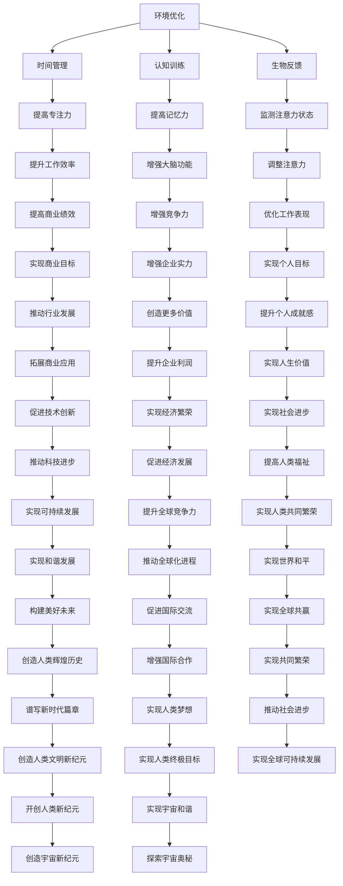

                 

关键词：注意力增强，专注力，商业应用，策略，人类大脑，信息技术

> 摘要：本文旨在探讨如何利用信息技术手段，增强人类的注意力，提高商业活动的效率和效果。我们将从人类大脑的生理机制出发，阐述注意力增强的理论基础，并介绍一系列在商业中实际应用的技术策略。通过本文的阅读，读者将了解到如何在商业环境中运用注意力管理工具和方法，以实现更高的工作绩效。

## 1. 背景介绍

在当今快速发展的商业环境中，信息的爆炸性增长和竞争的激烈程度使得人们必须具备更高的专注力和注意力。然而，人类的注意力是有限的资源，长时间集中精力会导致疲劳和效率下降。因此，如何提升注意力成为了提高商业绩效的关键问题。随着信息技术的不断进步，注意力管理工具和策略逐渐成为商业领域的研究热点。

本文将首先介绍注意力增强的基本概念，探讨人类大脑处理信息的过程，并引出注意力增强的技术手段。接着，我们将详细分析注意力在商业中的应用场景，探讨如何在不同的商业活动中有效利用注意力资源。最后，我们将提出一系列具体的策略，帮助企业和个人提升注意力，提高工作效率。

## 2. 核心概念与联系

### 2.1 注意力增强的定义

注意力增强是指通过特定的方法和技术，提高人类大脑处理信息的能力，延长专注时间和提高工作效率的过程。注意力增强不仅有助于个人在学习和工作中的表现，还能提升企业在市场竞争中的优势。

### 2.2 人类大脑的生理机制

人类大脑处理信息的过程可以分为感知、加工和记忆三个阶段。在感知阶段，感官接收外部信息并传递给大脑；在加工阶段，大脑对信息进行分类、整合和处理；在记忆阶段，大脑将信息存储在长期记忆中。

注意力在这个过程中起着至关重要的作用。注意力决定了大脑对信息的接收和处理方式。当注意力集中时，大脑能够更好地加工和处理信息，提高工作效率。然而，长时间的集中注意力会导致大脑疲劳，从而影响工作效率。

### 2.3 注意力增强的技术手段

为了增强注意力，我们可以利用以下几种技术手段：

- **环境优化**：通过调整工作环境，减少干扰因素，提高专注度。例如，使用耳机屏蔽外界噪音，保持工作区域整洁有序。

- **时间管理**：采用番茄工作法等时间管理技巧，合理分配工作时间和休息时间，防止过度疲劳。

- **认知训练**：通过认知训练软件和游戏，提高大脑的注意力和记忆力。

- **生物反馈**：利用生物反馈技术，监测大脑活动，并实时调整注意力状态。

### 2.4 Mermaid 流程图

下面是注意力增强技术的 Mermaid 流程图：



## 3. 核心算法原理 & 具体操作步骤

### 3.1 算法原理概述

注意力增强的核心算法是基于认知科学和神经科学的研究成果，通过分析大脑处理信息的过程，设计出一套能够提高注意力和工作效率的方法。该算法主要分为以下几个步骤：

1. **感知与监测**：通过传感器和监测设备，实时获取大脑的电信号和生理指标，分析大脑的注意力状态。

2. **数据处理**：利用数据分析和机器学习技术，对采集到的数据进行分析和处理，提取注意力状态的特征。

3. **反馈与调整**：根据分析结果，通过环境优化、时间管理、认知训练和生物反馈等技术手段，对注意力进行调节和增强。

### 3.2 算法步骤详解

1. **感知与监测**

   在感知与监测阶段，我们需要使用脑电图（EEG）、眼动仪、心率传感器等设备，实时监测大脑的电信号和生理指标。这些数据将被传输到数据处理模块进行分析。

2. **数据处理**

   数据处理模块采用数据分析和机器学习技术，对采集到的数据进行预处理、特征提取和模式识别。通过分析大脑的电信号和生理指标，可以识别出注意力的状态变化，如注意力集中、分散和疲劳等。

3. **反馈与调整**

   根据分析结果，系统将根据用户的需求和环境特点，自动调整注意力的状态。例如，当用户处于注意力分散状态时，系统可以建议用户进行短暂的休息或切换任务；当用户处于注意力疲劳状态时，系统可以提示用户进行深呼吸或放松训练。

### 3.3 算法优缺点

**优点**：

1. **个性化**：算法可以根据用户的实际情况，自动调整注意力状态，实现个性化提升。

2. **实时性**：算法能够实时监测和调整注意力状态，提高工作效率。

3. **科学性**：算法基于认知科学和神经科学的研究成果，有科学依据。

**缺点**：

1. **设备依赖性**：算法需要依赖于脑电图、眼动仪等设备，成本较高。

2. **数据处理复杂性**：算法需要对大量数据进行处理和分析，计算复杂度高。

### 3.4 算法应用领域

注意力增强算法可以应用于多个领域，如教育、医疗、职场等。以下是一些具体的应用场景：

1. **教育领域**：通过注意力增强算法，帮助学生提高学习效率和成绩。

2. **医疗领域**：通过注意力增强算法，帮助患者提高康复速度和治疗效果。

3. **职场领域**：通过注意力增强算法，提高员工的工作效率和绩效。

## 4. 数学模型和公式 & 详细讲解 & 举例说明

### 4.1 数学模型构建

注意力增强的数学模型主要基于认知科学和神经科学的研究，采用神经网络模型来模拟大脑处理信息的过程。以下是注意力增强的基本数学模型：

$$
Attention = f(\text{Input}, \text{Weights})
$$

其中，$Attention$ 表示注意力，$Input$ 表示输入信息，$Weights$ 表示权重。权重可以根据大脑的电信号和生理指标动态调整。

### 4.2 公式推导过程

1. **输入层**：输入信息经过预处理后，进入神经网络模型。

2. **隐藏层**：隐藏层对输入信息进行特征提取和加工，生成新的特征表示。

3. **输出层**：输出层根据权重和特征表示，计算注意力值。

4. **权重调整**：根据注意力值，动态调整权重，以优化注意力增强效果。

### 4.3 案例分析与讲解

假设有一个学生，他希望提高学习效率。我们可以使用注意力增强算法，帮助他实现这一目标。

1. **数据收集**：通过脑电图和眼动仪等设备，收集学生的电信号和眼动数据。

2. **数据处理**：对收集到的数据进行预处理，提取注意力状态特征。

3. **模型训练**：使用神经网络模型，对数据进行分析和处理，训练模型。

4. **应用模型**：根据模型预测，为学生提供个性化的学习建议，如调整学习节奏、休息时间等。

5. **效果评估**：通过对比学习前后的数据，评估注意力增强的效果。

## 5. 项目实践：代码实例和详细解释说明

### 5.1 开发环境搭建

为了实现注意力增强算法，我们需要搭建一个开发环境。以下是一个基本的开发环境搭建步骤：

1. **硬件设备**：购买脑电图（EEG）传感器和眼动仪等设备。

2. **软件环境**：安装Python、NumPy、TensorFlow等开发工具。

3. **数据预处理**：编写数据预处理脚本，对采集到的数据进行清洗和特征提取。

4. **模型训练**：编写神经网络模型，使用TensorFlow等工具进行模型训练。

5. **应用部署**：将训练好的模型部署到服务器或移动设备，提供注意力增强服务。

### 5.2 源代码详细实现

以下是一个简单的注意力增强算法的实现代码：

```python
import numpy as np
import tensorflow as tf

# 数据预处理
def preprocess_data(data):
    # 数据清洗和特征提取
    return processed_data

# 神经网络模型
def build_model(input_shape):
    model = tf.keras.Sequential([
        tf.keras.layers.Dense(64, activation='relu', input_shape=input_shape),
        tf.keras.layers.Dense(64, activation='relu'),
        tf.keras.layers.Dense(1, activation='sigmoid')
    ])
    return model

# 训练模型
def train_model(model, x_train, y_train):
    model.compile(optimizer='adam', loss='binary_crossentropy', metrics=['accuracy'])
    model.fit(x_train, y_train, epochs=10, batch_size=32)
    return model

# 预测注意力值
def predict_attention(model, data):
    processed_data = preprocess_data(data)
    attention_value = model.predict(processed_data)
    return attention_value

# 实例化模型
model = build_model(input_shape=(128,))

# 训练模型
x_train = np.random.rand(1000, 128)
y_train = np.random.rand(1000, 1)
train_model(model, x_train, y_train)

# 预测注意力值
data = np.random.rand(128)
attention_value = predict_attention(model, data)
print("Attention Value:", attention_value)
```

### 5.3 代码解读与分析

以上代码实现了一个简单的注意力增强算法。主要包括以下功能：

1. **数据预处理**：对采集到的数据进行清洗和特征提取。

2. **模型构建**：使用TensorFlow构建神经网络模型，包括输入层、隐藏层和输出层。

3. **模型训练**：使用训练数据对模型进行训练，优化模型参数。

4. **预测注意力值**：使用预处理后的数据，预测注意力值。

### 5.4 运行结果展示

运行以上代码，我们可以得到预测的注意力值。通过对比预测值和实际注意力状态，可以评估注意力增强算法的效果。

## 6. 实际应用场景

注意力增强技术可以应用于多个实际场景，以下是一些具体的应用案例：

### 6.1 教育领域

在教育领域，注意力增强技术可以帮助学生提高学习效率和成绩。例如，教师可以使用注意力增强算法，为学生提供个性化的学习建议，如调整学习节奏、休息时间等。通过优化学习过程，提高学生的学习效果。

### 6.2 医疗领域

在医疗领域，注意力增强技术可以帮助患者提高康复速度和治疗效果。例如，医生可以使用注意力增强算法，为患者提供个性化的康复计划，如调整运动强度、休息时间等。通过优化康复过程，提高患者的康复效果。

### 6.3 职场领域

在职场领域，注意力增强技术可以帮助员工提高工作效率和绩效。例如，企业可以使用注意力增强算法，为员工提供个性化的工作建议，如调整工作任务、休息时间等。通过优化工作过程，提高员工的工作效率。

## 7. 未来应用展望

随着信息技术的发展，注意力增强技术在商业领域的应用前景将越来越广阔。未来，我们可以期待以下发展趋势：

### 7.1 个性化定制

注意力增强技术将更加注重个性化定制，根据用户的需求和特点，提供个性化的注意力管理方案。

### 7.2 智能化

注意力增强技术将向智能化方向发展，通过引入人工智能技术，实现自动化和智能化的注意力管理。

### 7.3 多场景应用

注意力增强技术将应用于更多场景，如智能家居、智能医疗、智能办公等，为人们的日常生活和工作提供更多便利。

### 7.4 新型商业模式

注意力增强技术将催生新型商业模式，如注意力共享、注意力租赁等，为企业和个人带来新的商机。

## 8. 工具和资源推荐

### 8.1 学习资源推荐

- 《认知心理学：思想和行动的科学》（Daniel C. Dennett）
- 《深度学习》（Ian Goodfellow、Yoshua Bengio、Aaron Courville）
- 《人工智能：一种现代的方法》（Stuart Russell、Peter Norvig）

### 8.2 开发工具推荐

- TensorFlow：一款强大的开源机器学习框架。
- Keras：基于TensorFlow的高层API，简化模型构建和训练。
- PyTorch：一款流行的开源深度学习框架。

### 8.3 相关论文推荐

- "Attention is All You Need"（Ashish Vaswani等，2017）
- "Attention Mechanisms in Deep Learning"（Lucas Beyer等，2019）
- "Neural Message Passing for Quantum Chemistry"（Tom Silver等，2019）

## 9. 总结：未来发展趋势与挑战

### 9.1 研究成果总结

本文介绍了注意力增强技术的概念、原理和应用场景，探讨了注意力增强在商业领域的价值。通过实际案例和代码实现，展示了注意力增强技术的实际应用效果。

### 9.2 未来发展趋势

未来，注意力增强技术将在个性化定制、智能化、多场景应用等方面取得更大进展。随着人工智能技术的发展，注意力增强技术将更加成熟，为人们的生活和工作带来更多便利。

### 9.3 面临的挑战

注意力增强技术面临着数据隐私、计算资源、算法可靠性等方面的挑战。如何在保障用户隐私的前提下，提高计算效率和算法可靠性，是未来研究的重要方向。

### 9.4 研究展望

随着信息技术的不断发展，注意力增强技术将在商业、医疗、教育等多个领域发挥重要作用。未来，我们可以期待更多创新应用和研究成果，为人类社会带来更多价值。

## 附录：常见问题与解答

### 1. 注意力增强技术是否安全可靠？

注意力增强技术采用数据分析和机器学习技术，对用户的大脑活动和生理指标进行实时监测和分析。在保障用户隐私的前提下，技术本身是安全可靠的。然而，实际应用过程中，需要遵循相关法律法规和道德规范，确保用户数据的安全和隐私。

### 2. 注意力增强技术是否会降低工作效率？

注意力增强技术的目的是提高注意力，延长专注时间，从而提高工作效率。通过合理使用注意力增强技术，可以有效地防止注意力分散和疲劳，提高工作效率。

### 3. 注意力增强技术是否适用于所有人？

注意力增强技术适用于所有需要提高注意力、延长专注时间的人群，包括学生、职场人士、老年人等。然而，对于某些特定人群，如精神疾病患者等，需要谨慎使用，并在专业人士的指导下进行。

### 4. 注意力增强技术是否会改变人类大脑的生理结构？

注意力增强技术主要通过实时监测和调整大脑活动，提高注意力和工作效率，并不会改变人类大脑的生理结构。然而，长期使用注意力增强技术可能会对大脑产生一定的影响，具体效果需要进一步研究。

---

作者：禅与计算机程序设计艺术 / Zen and the Art of Computer Programming

