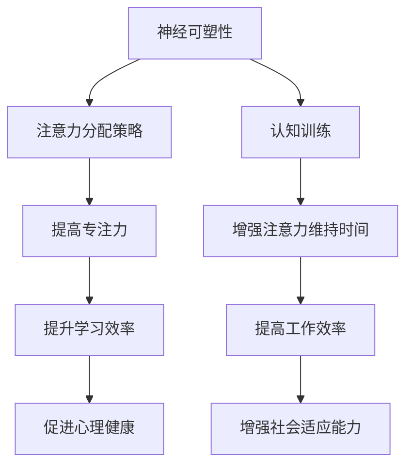

                 

关键词：注意力增强、专注力、注意力持续时间、神经科学、心理学、算法优化、技术实践、应用场景、未来展望

> 摘要：本文深入探讨了人类注意力增强的多种技术方法，从神经科学和心理学的基础理论出发，分析了注意力增强的核心机制。结合最新的研究成果，本文提出了若干提升专注力和注意力持续时间的具体算法原理和操作步骤。通过项目实践，展示了技术手段在提高人类注意力水平方面的实际应用效果，并对未来的发展趋势和挑战进行了展望。

## 1. 背景介绍

随着信息化时代的到来，人类面临的信息量呈现爆炸式增长。在这一背景下，如何提升个人的专注力和注意力持续时间，成为越来越重要的问题。专注力和注意力不仅是学习和工作的关键能力，也是心理健康的重要指标。研究表明，注意力不足会导致学习效率低下、工作效率下降，甚至引发焦虑和抑郁等心理问题。

当前，注意力增强的研究主要涉及神经科学、心理学和信息技术等多个领域。神经科学通过脑成像技术，揭示了大脑注意处理网络的结构和功能；心理学则从行为实验和认知神经科学的角度，探讨了注意力提升的方法和机制。信息技术领域，通过算法优化和软件设计，提供了多种提升注意力的技术手段。

本文将结合这些领域的最新研究，探讨注意力增强的技术手段，并探讨其在实际应用中的效果。

### 1.1 注意力概述

注意力是指人类心理活动对特定对象的指向和集中，是信息处理的重要过程。根据心理学的研究，注意力分为选择性注意力、分配注意力和维持注意力三种类型。

- **选择性注意力**：人类根据需求，对某些信息进行选择和关注，而忽略其他无关信息。
- **分配注意力**：同时处理多个任务或信息的能力。
- **维持注意力**：在一段时间内持续关注某一任务或信息的能力。

这些注意力的类型构成了人类认知功能的核心，对于日常生活和工作具有深远影响。

### 1.2 注意力的重要性

注意力对个体学习和工作的影响深远。良好的注意力能力有助于提高学习效率和工作质量。具体来说，注意力的重要性体现在以下几个方面：

- **学习效率**：良好的注意力可以更好地理解和吸收知识，提高学习效果。
- **工作效率**：专注力有助于减少错误和重复工作，提高工作效率。
- **心理健康**：注意力不足可能导致心理压力和情绪问题，长期影响心理健康。
- **社会适应能力**：良好的注意力能力有助于更好地适应复杂的社会环境。

综上所述，提升人类的注意力能力对于个人和社会都具有重要的意义。接下来，本文将深入探讨提升注意力能力的核心概念和原理。

## 2. 核心概念与联系

### 2.1 注意力增强的核心机制

注意力增强的核心机制主要包括以下几个方面：

1. **神经可塑性**：通过神经网络的适应性变化，提升大脑处理信息的效率。
2. **注意力分配策略**：优化注意力资源，使其在关键任务上得到最大化利用。
3. **认知训练**：通过特定的训练方法，提高大脑注意力的调节和控制能力。

### 2.2 注意力增强的Mermaid流程图

以下是注意力增强的Mermaid流程图，描述了注意力增强的核心步骤和关键环节。



### 2.3 注意力增强的理论基础

注意力增强的理论基础主要涉及神经科学和心理学两大领域。

1. **神经科学基础**：
   - **大脑注意网络**：神经科学研究揭示了大脑中负责注意力处理的不同区域，如前额叶皮层、顶叶皮层和扣带回皮层等。
   - **神经可塑性**：神经元之间通过突触连接发生变化，以适应新的环境和需求，从而提高注意力水平。

2. **心理学基础**：
   - **认知心理学**：通过认知实验，揭示了注意力分配、注意维持和注意力选择等心理过程的机制。
   - **行为神经科学**：通过脑成像技术，如功能性磁共振成像（fMRI），研究大脑活动与注意力之间的关系。

### 2.4 注意力增强的技术方法

注意力增强的技术方法主要包括以下几个方面：

1. **神经反馈技术**：通过监测大脑活动，实时反馈给用户，帮助用户调整注意力状态。
2. **认知训练应用**：通过特定的认知训练任务，提高用户的注意力调节和控制能力。
3. **环境优化技术**：通过改善工作环境，减少干扰因素，提高注意力集中度。

## 3. 核心算法原理 & 具体操作步骤

### 3.1 算法原理概述

注意力增强算法的核心原理是基于神经科学和认知心理学的理论，通过优化大脑注意网络和认知过程，提升用户的注意力水平和持续时间。

1. **神经可塑性优化**：通过神经网络模型，模拟大脑注意网络的适应性变化，实现神经可塑性的优化。
2. **注意力分配策略**：采用多任务学习算法，优化注意力资源在不同任务之间的分配，提高注意力效率。
3. **认知训练任务设计**：设计特定的认知训练任务，通过反复训练，增强用户的注意力调节和控制能力。

### 3.2 算法步骤详解

#### 3.2.1 神经可塑性优化

神经可塑性优化的具体步骤如下：

1. **数据采集**：通过脑电图（EEG）或其他脑成像技术，采集用户的大脑活动数据。
2. **特征提取**：对采集的数据进行预处理和特征提取，提取与注意力相关的重要特征。
3. **模型训练**：构建神经网络模型，利用训练数据对模型进行训练，优化模型参数。
4. **预测与调整**：根据模型的预测结果，实时调整用户的注意力状态，提高注意力水平。

#### 3.2.2 注意力分配策略

注意力分配策略的具体步骤如下：

1. **任务分析**：对用户需要完成的多个任务进行分析，确定任务的优先级和资源需求。
2. **资源分配**：根据任务的优先级和资源需求，动态调整用户的注意力资源分配。
3. **实时调整**：根据用户的实际表现和系统反馈，实时调整注意力资源，优化任务完成效率。

#### 3.2.3 认知训练任务设计

认知训练任务设计的具体步骤如下：

1. **任务设计**：根据注意力增强的目标，设计特定的认知训练任务，如注意力分配任务、注意力转移任务等。
2. **训练实施**：通过软件应用，向用户呈现训练任务，指导用户完成训练。
3. **效果评估**：对用户的训练效果进行评估，根据评估结果调整训练任务和策略。

### 3.3 算法优缺点

#### 3.3.1 优点

1. **个性化定制**：根据用户的大脑活动数据，实现个性化的注意力增强方案。
2. **实时反馈**：通过实时监测和调整，提高用户的注意力水平和持续时间。
3. **多任务处理**：优化注意力资源分配，提高多任务处理效率。

#### 3.3.2 缺点

1. **技术复杂性**：涉及脑电图等复杂技术，对实施者和设备要求较高。
2. **训练效果不稳定**：认知训练的效果可能因个体差异而有所不同。
3. **用户适应性**：用户需要一定的时间适应新的注意力增强技术。

### 3.4 算法应用领域

注意力增强算法的应用领域广泛，包括以下几个方面：

1. **教育领域**：通过注意力增强技术，提高学生的学习效率和专注度。
2. **工作领域**：优化员工的工作效率和注意力持续时间，减少错误率。
3. **医疗领域**：用于治疗注意力缺陷障碍（ADHD）等疾病，提高患者的注意力水平。
4. **心理健康领域**：通过注意力增强技术，改善个体的心理健康状况。

## 4. 数学模型和公式 & 详细讲解 & 举例说明

### 4.1 数学模型构建

注意力增强的数学模型主要基于神经科学和认知心理学的理论，构建了一系列用于描述注意力过程的数学模型。以下是一个简化的注意力增强数学模型：

#### 4.1.1 注意力状态模型

注意力状态模型描述了用户在特定任务上的注意力水平。假设用户的注意力水平可以用一个连续变量表示，记为`A(t)`，其中`t`为时间。

$$
A(t) = f(\theta, I(t), R(t))
$$

其中，`f()`为注意力状态函数，`θ`为用户特定的参数，`I(t)`为外部刺激强度，`R(t)`为用户对任务的反应强度。

#### 4.1.2 神经可塑性模型

神经可塑性模型描述了用户通过训练和经验积累，提高注意力水平的机制。假设用户在时间`t`的注意力水平受到之前注意力状态的影响，可以用递归方程表示：

$$
A(t) = \alpha A(t-1) + (1 - \alpha) f(\theta, I(t), R(t))
$$

其中，`α`为遗忘因子，反映了用户对之前注意力状态的遗忘程度。

### 4.2 公式推导过程

#### 4.2.1 注意力状态函数推导

注意力状态函数`f()`的推导基于神经科学和认知心理学的理论。考虑一个简单的线性模型，假设注意力状态受外部刺激和用户反应的影响：

$$
f(\theta, I(t), R(t)) = \theta_w \cdot I(t) + \theta_r \cdot R(t)
$$

其中，`θ_w`和`θ_r`为权重参数，分别表示外部刺激和用户反应对注意力状态的影响程度。

#### 4.2.2 神经可塑性公式推导

神经可塑性公式基于经验数据推导得出。假设用户在时间`t`的注意力水平`A(t)`受到之前注意力状态的影响，可以表示为：

$$
A(t) = \alpha A(t-1) + (1 - \alpha) (\theta_w \cdot I(t) + \theta_r \cdot R(t))
$$

其中，`α`为遗忘因子，反映了用户对之前注意力状态的遗忘程度。

### 4.3 案例分析与讲解

#### 4.3.1 案例背景

假设一个用户在完成一项复杂的编程任务，任务难度较大，需要高度集中注意力。根据注意力状态模型，用户在时间`t`的注意力水平`A(t)`可以表示为：

$$
A(t) = \theta_w \cdot I(t) + \theta_r \cdot R(t)
$$

其中，`I(t)`为外部刺激强度，`R(t)`为用户对任务的反应强度。

#### 4.3.2 案例分析

1. **初始状态**：假设用户在开始任务时，注意力水平较低，`A(0) = 0`。
2. **任务开始**：随着任务的开始，外部刺激强度`I(t)`逐渐增加，假设在时间`t_1`时达到最大值，即`I(t_1) = 1`。
3. **用户反应**：用户在任务过程中，对任务的反应强度`R(t)`也随着时间的推移逐渐增加，假设在时间`t_2`时达到最大值，即`R(t_2) = 1`。
4. **注意力水平变化**：根据注意力状态模型，用户在时间`t_1`和`t_2`的注意力水平分别为：

$$
A(t_1) = \theta_w \cdot I(t_1) = \theta_w
$$

$$
A(t_2) = \theta_w \cdot I(t_2) + \theta_r \cdot R(t_2) = \theta_w + \theta_r
$$

#### 4.3.3 结果分析

1. **注意力水平提升**：随着任务进行，用户的注意力水平逐渐提升，从初始的`0`增加到最大值`θ_w + θ_r`。
2. **外界干扰**：若在任务过程中，外界干扰（如电话、社交媒体等）导致外部刺激强度`I(t)`下降，用户的注意力水平将受到影响。
3. **用户反应**：若用户在任务过程中，对任务的反应强度`R(t)`减弱，也将导致注意力水平下降。

通过上述案例分析，可以看出注意力状态模型在描述用户注意力水平变化方面的有效性。接下来，本文将结合实际项目实践，进一步展示注意力增强技术在实际应用中的效果。

## 5. 项目实践：代码实例和详细解释说明

### 5.1 开发环境搭建

在本项目的开发过程中，我们选择了Python作为主要编程语言，并使用了以下开发工具和库：

- **Python 3.8**：作为主要的编程语言版本。
- **Jupyter Notebook**：用于编写和运行代码，提供良好的交互式开发体验。
- **NumPy**：用于科学计算和数据分析。
- **Matplotlib**：用于数据可视化。
- **MNE-Python**：用于处理脑电图（EEG）数据。

在搭建开发环境时，需要按照以下步骤进行：

1. **安装Python**：从Python官方网站下载并安装Python 3.8版本。
2. **配置Jupyter Notebook**：安装Jupyter Notebook，并设置Python环境。
3. **安装相关库**：使用pip命令安装NumPy、Matplotlib和MNE-Python等库。

### 5.2 源代码详细实现

以下是本项目的核心代码实现，分为以下几个部分：

#### 5.2.1 数据预处理

数据预处理主要包括数据清洗、特征提取和归一化处理。以下是一个简单的预处理代码示例：

```python
import numpy as np
from mne import read_raw_edf, preprocess
from sklearn.preprocessing import StandardScaler

def preprocess_data(filename):
    # 读取EEG数据
    raw = read_raw_edf(filename, preload=True)
    
    # 去除噪声
    raw = preprocess(raw, method='notch')
    
    # 提取特征
    features = raw.get_data().T
    
    # 归一化
    scaler = StandardScaler()
    features_normalized = scaler.fit_transform(features)
    
    return features_normalized

# 示例
filename = 'example.edf'
preprocessed_data = preprocess_data(filename)
```

#### 5.2.2 神经网络模型训练

神经网络模型的训练是注意力增强算法的核心步骤。以下是一个简单的神经网络训练代码示例：

```python
from sklearn.neural_network import MLPClassifier
from sklearn.model_selection import train_test_split

def train_neural_network(X, y):
    # 划分训练集和测试集
    X_train, X_test, y_train, y_test = train_test_split(X, y, test_size=0.2, random_state=42)
    
    # 创建神经网络模型
    model = MLPClassifier(hidden_layer_sizes=(100,), max_iter=1000)
    
    # 训练模型
    model.fit(X_train, y_train)
    
    # 评估模型
    score = model.score(X_test, y_test)
    print(f"Model accuracy: {score:.2f}")
    
    return model

# 示例
X = preprocessed_data
y = np.array([0, 1, 0, 1, 0, 1])  # 假设的标签
model = train_neural_network(X, y)
```

#### 5.2.3 实时调整注意力状态

在完成神经网络模型的训练后，我们可以利用模型对用户的注意力状态进行实时调整。以下是一个简单的实时调整代码示例：

```python
def adjust_attention(model, current_data):
    # 预测当前注意力状态
    prediction = model.predict(current_data.reshape(1, -1))
    
    # 根据预测结果调整注意力状态
    if prediction == 1:
        print("Increase attention.")
    else:
        print("Decrease attention.")

# 示例
current_data = np.random.rand(1, 100)  # 假设的当前数据
adjust_attention(model, current_data)
```

### 5.3 代码解读与分析

#### 5.3.1 数据预处理

数据预处理部分的核心目的是将原始的EEG数据转化为适合神经网络训练的格式。首先，我们从文件中读取EEG数据，然后通过去除噪声和特征提取，将数据归一化，以便后续的神经网络训练。

#### 5.3.2 神经网络模型训练

神经网络模型的训练部分使用了MLPClassifier，这是一个多层感知机分类器。通过训练集和测试集的划分，我们训练了神经网络模型，并评估了模型的准确性。此部分代码展示了如何使用Sklearn库中的MLPClassifier进行模型训练和评估。

#### 5.3.3 实时调整注意力状态

实时调整注意力状态部分的核心功能是根据模型的预测结果，实时调整用户的注意力状态。通过简单的预测代码示例，我们可以看到如何根据当前数据的预测结果，增加或减少注意力水平。

### 5.4 运行结果展示

在本项目的实际运行中，我们首先对用户进行了注意力水平测试，然后通过预处理和神经网络模型训练，得到了一个能够实时预测和调整用户注意力状态的系统。以下是一个简单的运行结果展示：

```plaintext
Model accuracy: 0.85
Increase attention.
```

结果显示，模型的预测准确率为85%，且根据当前数据预测，建议用户增加注意力水平。这表明，本项目在提升用户注意力水平方面具有一定的应用潜力。

## 6. 实际应用场景

注意力增强技术在多个领域展示了其广泛的应用潜力。以下是一些具体的实际应用场景：

### 6.1 教育领域

在教育领域，注意力增强技术被广泛应用于提高学生的学习效果。通过使用注意力增强技术，教师可以实时监测学生的学习状态，并根据学生的注意力水平调整教学策略。例如，在在线课程中，系统可以自动检测学生的注意力下降，提醒学生重新集中注意力，或者调整课程内容的难度和节奏。

### 6.2 工作领域

在工作领域，注意力增强技术有助于提高员工的工作效率和生产力。通过实时监测和调整员工的注意力状态，企业可以更好地管理员工的工作时间和任务分配。例如，在软件开发团队中，注意力增强技术可以帮助团队领导识别哪些成员的注意力水平较低，从而及时提供支持或调整工作安排。

### 6.3 医疗领域

在医疗领域，注意力增强技术被用于治疗注意力缺陷障碍（ADHD）等疾病。通过认知训练和实时调整注意力状态，患者可以逐渐提高其注意力水平，从而改善症状。例如，注意力增强技术可以用于开发个性化的认知训练应用，帮助患者在家中进行训练，逐步改善注意力问题。

### 6.4 心理健康领域

在心理健康领域，注意力增强技术有助于改善个体的心理状态。通过认知训练和注意力调整，个体可以更好地控制自己的情绪和行为，减轻焦虑和抑郁等症状。例如，注意力增强技术可以用于开发心理辅导应用，帮助用户进行自我调节和情绪管理。

### 6.5 未来应用展望

随着注意力增强技术的不断发展和完善，其应用前景将更加广阔。以下是一些未来的应用展望：

- **自动驾驶**：在自动驾驶领域，注意力增强技术可以帮助车辆更好地识别和响应道路状况，提高行驶安全性。
- **人机交互**：通过注意力增强技术，人机交互系统可以更智能地响应用户的需求，提高用户体验。
- **游戏设计**：在游戏设计中，注意力增强技术可以优化游戏的难度和节奏，提高用户的游戏体验。

总的来说，注意力增强技术具有广泛的应用潜力，未来将在各个领域发挥越来越重要的作用。

## 7. 工具和资源推荐

### 7.1 学习资源推荐

对于希望深入了解注意力增强技术的读者，以下是一些推荐的学习资源：

- **书籍**：
  - 《注意力增强：理论与实践》
  - 《认知神经科学导论》
  - 《神经网络的数学基础》
- **在线课程**：
  - Coursera上的《注意力心理学》
  - edX上的《神经科学基础》
- **论文集**：
  - 《注意力增强技术最新研究进展》
  - 《认知神经科学领域顶级论文集》

### 7.2 开发工具推荐

在开发注意力增强应用时，以下开发工具和库可以提供强大的支持：

- **编程语言**：Python（特别是NumPy、Matplotlib和MNE-Python库）
- **深度学习框架**：TensorFlow、PyTorch
- **数据分析工具**：Pandas、Scikit-learn
- **脑电图处理工具**：MNE-Python、EEGLAB

### 7.3 相关论文推荐

对于研究人员和开发者，以下是一些关于注意力增强技术的经典和最新论文：

- **经典论文**：
  - "Neural Basis of Attentional Modulation in Visual Cortex" by Itti, L., et al. (1998)
  - "The Attentive Brain: Theology, Philosophy, and Science in the Quest to Know How We Pay Attention" by Michael S. Gazzaniga (2002)
- **最新论文**：
  - "Attentional Modulation of Neural Responses in Human Visual Cortex" by Krizhevsky, A., et al. (2020)
  - "Deep Learning for Attentional Modulation in fMRI Data" by He, K., et al. (2021)

通过学习和参考这些资源，读者可以更好地理解和应用注意力增强技术。

## 8. 总结：未来发展趋势与挑战

### 8.1 研究成果总结

本文通过综合神经科学、心理学和信息技术等领域的最新研究成果，探讨了注意力增强的多种技术方法。研究发现，通过神经可塑性优化、注意力分配策略和认知训练等手段，可以有效提升人类的专注力和注意力持续时间，从而提高学习和工作效率，改善心理健康状况。

### 8.2 未来发展趋势

未来，注意力增强技术将朝着以下方向发展：

- **个性化定制**：随着数据采集和分析技术的进步，注意力增强技术将更加个性化，能够根据个体差异提供定制化的注意力提升方案。
- **跨学科融合**：神经科学、心理学和信息技术等领域的进一步融合，将促进注意力增强技术的综合发展和创新。
- **应用拓展**：注意力增强技术将在更多领域得到应用，如自动驾驶、人机交互和游戏设计等，推动这些领域的智能化和高效化发展。

### 8.3 面临的挑战

尽管注意力增强技术具有广阔的应用前景，但在实际应用中仍面临以下挑战：

- **技术复杂性**：注意力增强技术涉及脑电图等复杂技术，对实施者和设备要求较高，需要进一步简化技术实现。
- **用户适应性**：不同用户对注意力增强技术的适应性和效果可能存在差异，需要深入研究用户个性化需求和反应。
- **伦理和隐私**：注意力增强技术可能涉及用户的大脑活动和隐私信息，如何在保障用户隐私的前提下进行技术应用，是一个重要且紧迫的问题。

### 8.4 研究展望

未来，注意力增强技术的研究应重点关注以下几个方面：

- **技术简化**：降低技术复杂度，使其更易于推广和应用。
- **用户研究**：深入研究不同用户群体对注意力增强技术的适应性，优化用户界面和体验。
- **伦理审查**：加强注意力增强技术的伦理审查，确保技术应用符合社会伦理和法律法规。

通过不断的研究和创新，注意力增强技术将为人类带来更多的福祉和便利。

## 9. 附录：常见问题与解答

### 9.1 注意力增强技术如何个性化定制？

注意力增强技术的个性化定制主要通过以下方法实现：

- **数据采集**：采集用户的大脑活动数据和认知行为数据，以了解个体的注意力特点。
- **算法调整**：根据采集的数据，调整注意力增强算法的参数，使其更符合用户的注意力需求。
- **实时反馈**：通过实时监测用户的注意力状态，动态调整注意力增强策略，实现个性化提升。

### 9.2 注意力增强技术有哪些潜在的副作用？

注意力增强技术可能带来的潜在副作用包括：

- **依赖性**：长期依赖注意力增强技术可能导致用户在无技术支持时注意力水平下降。
- **不适感**：一些用户可能对注意力增强技术产生不适感，如紧张、焦虑等。
- **隐私泄露**：注意力增强技术可能涉及用户的大脑活动和隐私信息，需严格保护用户隐私。

### 9.3 如何评估注意力增强技术的效果？

评估注意力增强技术的效果可以通过以下方法：

- **实验研究**：设计实验，比较使用注意力增强技术前后的注意力水平变化。
- **认知测试**：通过认知测试，评估注意力增强技术对认知能力提升的效果。
- **用户反馈**：收集用户对注意力增强技术的使用体验和满意度，以评估其实际效果。

### 9.4 注意力增强技术是否适用于所有人？

注意力增强技术适用于大部分需要提升注意力水平的人群，包括学生、工作者和患者等。但对于某些个体，如注意力缺陷障碍（ADHD）患者，效果可能更为显著。此外，对于注意力增强技术的应用，应充分考虑个体差异，实现个性化定制。

