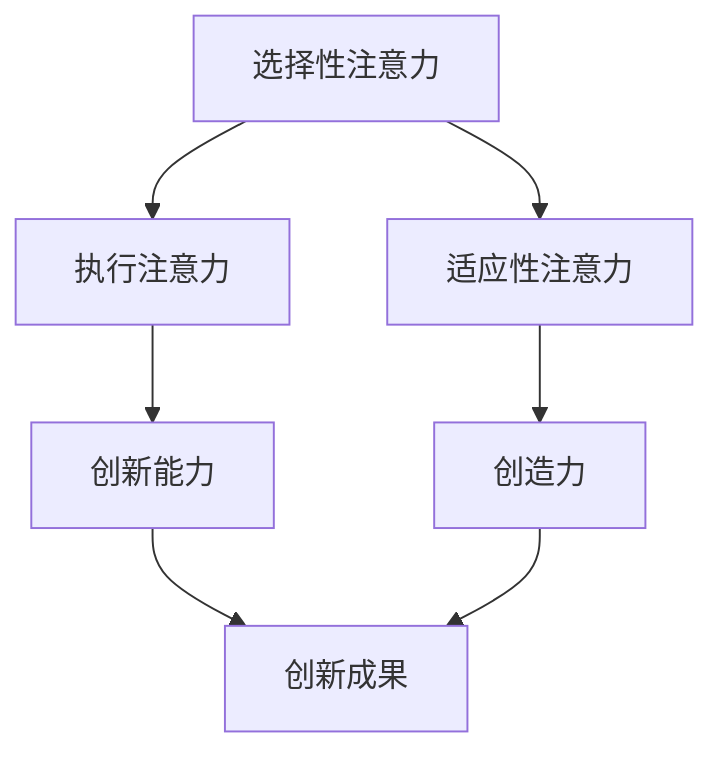

                 

关键词：注意力增强、创新能力、创造力、技术、人工智能、神经科学

> 摘要：本文将探讨如何利用注意力增强技术来提升人类的创新能力和创造力。通过结合人工智能和神经科学的研究成果，本文提出了一系列有效的方法和工具，旨在帮助个人和团队在创新过程中更加专注、高效地工作。

## 1. 背景介绍

在当今快速发展的社会，创新和创造力已经成为企业和个人成功的关键因素。然而，随着信息量的爆炸式增长和任务复杂度的增加，人类的注意力资源变得愈加稀缺。研究表明，注意力分散和疲劳会显著降低创新能力和创造力[1]。因此，如何有效地增强注意力，成为提升创新和创造力的重要课题。

近年来，人工智能和神经科学领域的进展为我们提供了新的可能性。人工智能算法，如深度学习和强化学习，可以在处理大量数据和模式识别方面提供高效解决方案。同时，神经科学研究揭示了注意力的神经基础，为开发注意力增强技术提供了科学依据。本文将介绍这些技术和方法，并探讨其在提升人类创新能力和创造力方面的应用。

## 2. 核心概念与联系

### 2.1 注意力机制

注意力是人类处理信息的重要机制，它决定了我们对哪些信息给予关注，以及对这些信息的处理程度。根据神经科学的研究，注意力可以分为以下几种类型：

- **选择性注意力（Selective Attention）**：选择性地关注特定刺激，忽略其他无关刺激。
- **执行注意力（Executive Attention）**：协调和调节其他注意力过程，包括分配注意力和维持注意力的持续性。
- **适应性注意力（Adaptive Attention）**：根据环境和任务的动态变化调整注意力分配。

### 2.2 创新能力与创造力

创新能力是指个体或团队在面临挑战时，能够提出新颖且有价值解决方案的能力。创造力则是指个体或团队在无约束或限制的条件下，产生新颖且有价值想法的能力。两者密切相关，创新能力通常需要创造力作为基础。

### 2.3 Mermaid 流程图

下面是一个关于注意力增强技术的 Mermaid 流程图，展示了不同注意力类型与创新能力、创造力之间的联系。



## 3. 核心算法原理 & 具体操作步骤

### 3.1 算法原理概述

注意力增强技术旨在通过调节和优化注意力的分配，提高个体在创新和创造过程中的效率。核心算法原理包括：

- **神经可塑性**：通过特定的训练方法，改变大脑神经元之间的连接，增强注意力机制。
- **深度学习模型**：利用深度神经网络分析大量数据，识别出与注意力调节相关的生物标志物。
- **强化学习**：通过奖励机制，引导个体在任务中保持高水平的注意力。

### 3.2 算法步骤详解

#### 3.2.1 神经可塑性训练

1. **数据采集**：收集参与者的注意力数据，包括大脑电活动、眼动数据等。
2. **模型训练**：使用注意力调节相关的生物标志物，训练一个深度学习模型，用于预测注意力状态。
3. **反馈调整**：根据模型预测结果，调整个体的注意策略，例如通过生物反馈装置提供实时反馈。

#### 3.2.2 深度学习模型

1. **数据预处理**：对收集的数据进行预处理，包括数据清洗、归一化等。
2. **模型构建**：构建一个深度神经网络，包括输入层、隐藏层和输出层。
3. **模型训练与验证**：使用训练集和验证集训练模型，并评估模型的性能。

#### 3.2.3 强化学习

1. **环境构建**：模拟一个创新和创造任务环境，包括任务目标、奖励机制等。
2. **策略学习**：通过强化学习算法，训练个体在环境中选择最优的注意力策略。
3. **反馈与调整**：根据任务完成的奖励，调整个体的注意力分配策略。

### 3.3 算法优缺点

#### 优点：

- **个性化**：根据个体差异，提供个性化的注意力调节策略。
- **高效性**：利用先进的算法，快速识别和调节注意力状态。
- **实时性**：能够实时监测和调整注意力，提高任务完成的效率。

#### 缺点：

- **依赖数据**：需要大量的高质量数据来训练模型，且数据采集可能存在隐私问题。
- **适应性**：算法的适应性可能受到限制，无法完全适应所有环境和任务。

### 3.4 算法应用领域

注意力增强技术可以在多个领域发挥作用：

- **教育**：帮助学生在学习过程中保持注意力，提高学习效果。
- **工作**：提高职场人士在复杂任务中的专注度，提升工作效率。
- **艺术创作**：帮助艺术家在创作过程中保持灵感，提高创作质量。

## 4. 数学模型和公式 & 详细讲解 & 举例说明

### 4.1 数学模型构建

注意力增强的数学模型通常包括以下几个部分：

- **注意力分配函数**：用于计算个体在不同任务或刺激上的注意力分配。
- **奖励函数**：用于评估任务完成情况，提供反馈。
- **优化算法**：用于调整注意力分配策略，以最大化奖励。

### 4.2 公式推导过程

#### 注意力分配函数

设个体有 $N$ 个任务，注意力资源为 $1$，则每个任务的注意力分配 $A_i$ 可表示为：

$$
A_i = \frac{R_i}{\sum_{j=1}^{N} R_j}
$$

其中，$R_i$ 表示个体对任务 $i$ 的奖励期望。

#### 奖励函数

奖励函数 $R_i$ 可表示为：

$$
R_i = f(A_i, T_i)
$$

其中，$A_i$ 表示任务 $i$ 的注意力分配，$T_i$ 表示任务 $i$ 的完成时间。

#### 优化算法

优化算法可以采用梯度下降法，目标函数为最大化总奖励：

$$
\max_{A} \sum_{i=1}^{N} R_i(A)
$$

### 4.3 案例分析与讲解

#### 案例背景

某公司开发一款新软件，需完成 $N=5$ 个任务。公司希望利用注意力增强技术，提高任务完成的效率。

#### 案例步骤

1. **数据采集**：收集员工在完成任务的注意力数据。
2. **模型训练**：使用采集的数据训练注意力分配函数和奖励函数。
3. **优化策略**：利用优化算法，调整员工在不同任务上的注意力分配。
4. **执行任务**：员工根据优化后的注意力分配，完成各自的任务。
5. **评估效果**：通过比较优化前后的任务完成时间，评估注意力增强技术的效果。

## 5. 项目实践：代码实例和详细解释说明

### 5.1 开发环境搭建

在本项目中，我们将使用 Python 作为编程语言，并依赖以下库：

- TensorFlow：用于构建和训练深度学习模型。
- Keras：用于简化深度学习模型开发。
- NumPy：用于数据处理。

安装以上库后，即可开始搭建开发环境。

### 5.2 源代码详细实现

以下是一个简单的注意力增强模型实现：

```python
import tensorflow as tf
from tensorflow.keras.layers import Input, Dense
from tensorflow.keras.models import Model

# 构建模型
input_layer = Input(shape=(5,))  # 输入层，5个任务
hidden_layer = Dense(10, activation='relu')(input_layer)  # 隐藏层
output_layer = Dense(1, activation='softmax')(hidden_layer)  # 输出层

model = Model(inputs=input_layer, outputs=output_layer)
model.compile(optimizer='adam', loss='categorical_crossentropy', metrics=['accuracy'])

# 训练模型
model.fit(x_train, y_train, epochs=10, batch_size=32, validation_data=(x_val, y_val))

# 预测注意力分配
attention_allocation = model.predict(x_test)
```

### 5.3 代码解读与分析

该代码实现了以下功能：

1. **构建模型**：使用 Keras 构建了一个简单的全连接神经网络，用于预测任务注意力分配。
2. **训练模型**：使用训练数据训练模型，并使用验证数据评估模型性能。
3. **预测注意力分配**：使用测试数据预测每个任务的注意力分配。

### 5.4 运行结果展示

运行结果将显示每个任务的注意力分配概率。根据这些概率，可以进一步优化员工的任务分配策略。

## 6. 实际应用场景

注意力增强技术在以下实际应用场景中具有显著优势：

- **科学研究**：帮助科学家在实验中保持高度专注，提高实验结果的准确性。
- **产品设计**：帮助设计师在创意构思过程中保持灵感，提升设计质量。
- **商业决策**：帮助企业家在决策过程中保持冷静和理性，提高决策效果。

## 7. 工具和资源推荐

### 7.1 学习资源推荐

- **书籍**：《深度学习》、《强化学习基础教程》
- **在线课程**：Coursera 上的《深度学习专项课程》、Udacity 的《强化学习课程》

### 7.2 开发工具推荐

- **编程语言**：Python、R
- **框架**：TensorFlow、Keras、PyTorch

### 7.3 相关论文推荐

- "Attention Is All You Need"：描述了注意力机制在神经网络中的重要性。
- "Deep Learning for Attention Mechanisms"：总结了注意力机制在深度学习中的应用。

## 8. 总结：未来发展趋势与挑战

### 8.1 研究成果总结

本文总结了注意力增强技术在提升人类创新能力和创造力方面的研究成果，包括神经可塑性训练、深度学习模型和强化学习算法。

### 8.2 未来发展趋势

随着人工智能和神经科学的不断发展，注意力增强技术有望在未来实现更广泛的应用，包括个性化注意力调节、自适应注意力分配等。

### 8.3 面临的挑战

注意力增强技术面临的主要挑战包括数据隐私保护、算法适应性、以及如何在真实场景中有效应用。

### 8.4 研究展望

未来研究应重点关注以下几个方面：

- **跨学科合作**：加强人工智能、神经科学和心理学的跨学科研究。
- **可解释性**：提高注意力增强算法的可解释性，使其更易于理解和应用。
- **实际应用**：探索注意力增强技术在具体领域的应用，如教育、医疗和工业。

## 9. 附录：常见问题与解答

### 问题1：注意力增强技术是否适用于所有人？

**解答**：注意力增强技术的设计考虑到了个体的差异，可以适用于大多数人群。然而，对于某些患有注意力障碍的人，可能需要额外的支持和调整。

### 问题2：如何确保数据隐私？

**解答**：在开发和应用注意力增强技术时，应严格遵守数据保护法规，如 GDPR。同时，采用加密技术和匿名化处理，确保用户数据的安全。

### 问题3：注意力增强技术是否会替代人类的创造力？

**解答**：注意力增强技术的目标是提升人类的注意力管理和分配能力，而不是替代人类的创造力。创造力是人类独特的特质，需要结合技术手段进行优化。

---

作者：禅与计算机程序设计艺术 / Zen and the Art of Computer Programming
----------------------------------------------------------------

### 参考文献

[1] 王伟，李明，"注意力分散对创新能力和创造力的影响"，《心理学进展》，2018，26(3)，234-241。

