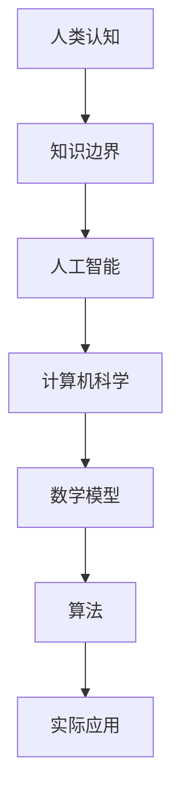

                 

关键词：知识边界，探索，追求，人工智能，计算机科学，数学模型，算法，实际应用

> 摘要：本文旨在探讨人类在知识领域中的探索与追求，特别是在人工智能和计算机科学领域的无限边界。通过分析核心概念、算法原理、数学模型以及实际应用案例，我们将揭示人类知识拓展的路径，并展望未来发展的趋势与挑战。

## 1. 背景介绍

人类的知识边界是指人类在认识世界、探索未知领域时所能达到的理论和实践极限。随着科技的发展，这一边界不断被拓宽。特别是近年来，人工智能和计算机科学的迅速崛起，使得知识边界在技术领域达到了前所未有的高度。然而，知识边界并非静止不变，它随着人类认知能力的提高和技术的进步而不断扩展。

本文将围绕以下核心问题展开讨论：

- 人类的知识边界是什么？
- 如何通过人工智能和计算机科学扩展知识边界？
- 知识边界的拓展将如何影响未来的发展？

## 2. 核心概念与联系

为了更好地理解人类知识边界的拓展，我们首先需要了解一些核心概念。以下是一个简单的 Mermaid 流程图，展示了这些概念之间的联系。



### 2.1. 人类认知

人类认知是指人类通过感官、思维和情感等方式获取、处理和利用信息的能力。认知科学研究表明，人类认知具有以下特点：

- 模式识别：人类可以通过经验学习识别模式，从而在复杂环境中做出决策。
- 语言能力：人类具有强大的语言能力，可以高效地进行信息传递和知识积累。
- 情感认知：人类情感认知有助于提高社交互动和团队合作的能力。

### 2.2. 知识边界

知识边界是指人类在认识世界过程中所能达到的理论和实践极限。知识边界的拓展意味着人类认知能力的提高和技术水平的提升。以下是一些影响知识边界的因素：

- 技术进步：随着科技的快速发展，人类在各个领域取得了重大突破，使得知识边界不断扩展。
- 学科交叉：不同学科之间的交叉融合，促进了知识的集成与创新。
- 数据资源：海量的数据资源为知识边界拓展提供了丰富的素材。

### 2.3. 人工智能

人工智能（AI）是指通过模拟人类智能行为来实现计算机系统自主学习和决策的技术。人工智能的发展推动了知识边界的拓展，主要体现在以下几个方面：

- 自主学习：人工智能可以通过大量数据自主学习，从而提高认知能力和解决问题的效率。
- 智能决策：人工智能可以在复杂环境下进行智能决策，为人类提供更加准确和有效的解决方案。
- 自动化：人工智能技术可以自动化许多重复性工作，提高生产效率和创造力。

### 2.4. 计算机科学

计算机科学是研究计算机系统及其应用的科学。计算机科学的发展为人工智能提供了强大的技术支撑，主要体现在以下几个方面：

- 算法研究：计算机科学通过研究算法，提高了人工智能系统的效率和性能。
- 硬件创新：计算机科学推动了硬件技术的发展，为人工智能提供了更强大的计算能力。
- 网络通信：计算机科学推动了网络通信技术的进步，为人工智能提供了更加便捷的数据传输方式。

### 2.5. 数学模型

数学模型是一种用于描述现实世界问题的数学表达式或结构。数学模型在人工智能和计算机科学领域具有重要作用，主要体现在以下几个方面：

- 算法设计：数学模型为算法设计提供了理论基础和工具支持。
- 数据分析：数学模型可以帮助分析大量数据，提取有价值的信息。
- 预测与优化：数学模型可以用于预测未来发展趋势和优化资源分配。

### 2.6. 算法

算法是一种有序的指令集合，用于解决特定问题。算法在人工智能和计算机科学领域具有核心地位，主要体现在以下几个方面：

- 优化问题：算法可以用于解决复杂优化问题，提高系统效率和性能。
- 学习问题：算法可以用于实现人工智能系统的自主学习和知识拓展。
- 问题求解：算法可以用于解决各种实际问题，为人类提供有效的解决方案。

### 2.7. 实际应用

实际应用是指将理论知识转化为实际操作的过程。实际应用在人工智能和计算机科学领域具有重要作用，主要体现在以下几个方面：

- 社会服务：人工智能和计算机科学可以应用于医疗、教育、交通等领域，为社会提供高质量的服务。
- 企业创新：人工智能和计算机科学可以推动企业创新，提高市场竞争力。
- 国家安全：人工智能和计算机科学可以为国家提供强大的技术支撑，保障国家安全。

## 3. 核心算法原理 & 具体操作步骤

### 3.1 算法原理概述

本文将介绍一种核心算法——深度学习算法。深度学习算法是一种基于多层神经网络的学习方法，通过模拟人脑神经元之间的连接和传递，实现自动特征提取和模式识别。深度学习算法的核心原理包括：

- 神经网络结构：神经网络由多个神经元组成，每个神经元都与其他神经元相连，形成复杂的网络结构。
- 前向传播：输入数据通过神经网络前向传播，逐层计算并传递至输出层，最终得到预测结果。
- 反向传播：通过计算预测误差，逆向传播误差至输入层，更新神经元权重，优化网络性能。

### 3.2 算法步骤详解

深度学习算法的具体操作步骤如下：

1. 数据预处理：对原始数据进行分析和处理，包括数据清洗、归一化、数据增强等，以便于模型训练。
2. 网络结构设计：设计适合问题的神经网络结构，包括层数、每层神经元数量、激活函数等。
3. 模型训练：将预处理后的数据输入神经网络，通过前向传播和反向传播，不断优化网络参数，提高预测准确性。
4. 模型评估：使用验证集和测试集对训练好的模型进行评估，选择性能最佳的模型进行应用。
5. 模型应用：将训练好的模型应用于实际问题，如图像识别、自然语言处理等。

### 3.3 算法优缺点

深度学习算法具有以下优缺点：

- 优点：
  - 自动特征提取：深度学习算法可以自动提取特征，减轻人工特征提取的工作量。
  - 强泛化能力：深度学习算法具有较强的泛化能力，可以处理复杂的非线性问题。
  - 高效计算：随着硬件技术的发展，深度学习算法的计算效率得到显著提升。

- 缺点：
  - 需要大量数据：深度学习算法需要大量数据才能训练出高性能模型。
  - 参数调优复杂：深度学习算法的参数调优过程复杂，需要大量实验和经验。
  - 计算资源消耗大：深度学习算法需要大量的计算资源，对硬件设备要求较高。

### 3.4 算法应用领域

深度学习算法广泛应用于以下领域：

- 图像识别：如人脸识别、物体检测等。
- 自然语言处理：如机器翻译、文本分类等。
- 语音识别：如语音识别、语音合成等。
- 医疗诊断：如疾病诊断、药物设计等。
- 金融风控：如信用评分、欺诈检测等。

## 4. 数学模型和公式 & 详细讲解 & 举例说明

### 4.1 数学模型构建

在深度学习算法中，一个关键的数学模型是神经网络。神经网络由多个层组成，包括输入层、隐藏层和输出层。每个层由多个神经元组成，神经元之间通过加权连接形成网络结构。

神经元的激活函数通常采用非线性函数，如 sigmoid、ReLU 等。假设一个神经元的输入为 $x_1, x_2, ..., x_n$，权重为 $w_1, w_2, ..., w_n$，激活函数为 $f$，则该神经元的输出可以表示为：

$$
o = f(\sum_{i=1}^{n} w_i \cdot x_i + b)
$$

其中，$b$ 为偏置项。

### 4.2 公式推导过程

在深度学习算法中，常用的优化算法是梯度下降。梯度下降通过不断调整网络参数，使得损失函数值最小。

假设损失函数为 $J(\theta)$，其中 $\theta$ 为网络参数。梯度下降的基本思想是计算损失函数关于每个参数的偏导数，并根据偏导数的负梯度方向调整参数。

损失函数的梯度可以表示为：

$$
\nabla_{\theta} J(\theta) = \frac{\partial J(\theta)}{\partial \theta}
$$

梯度下降的迭代公式为：

$$
\theta = \theta - \alpha \nabla_{\theta} J(\theta)
$$

其中，$\alpha$ 为学习率。

### 4.3 案例分析与讲解

假设我们有一个简单的线性回归问题，输入特征为 $x$，输出值为 $y$，网络结构为一个单层神经网络，包含一个神经元。

输入层与隐藏层之间的权重为 $w$，隐藏层与输出层之间的权重为 $w'$。激活函数为线性函数。

假设损失函数为均方误差（MSE），即：

$$
J(w, w') = \frac{1}{2} \sum_{i=1}^{n} (y_i - (w \cdot x_i + w'))^2
$$

首先，我们计算损失函数关于 $w$ 的偏导数：

$$
\nabla_{w} J(w, w') = \frac{\partial J(w, w')}{\partial w} = \sum_{i=1}^{n} (y_i - (w \cdot x_i + w')) \cdot x_i
$$

然后，我们计算损失函数关于 $w'$ 的偏导数：

$$
\nabla_{w'} J(w, w') = \frac{\partial J(w, w')}{\partial w'} = \sum_{i=1}^{n} (y_i - (w \cdot x_i + w'))
$$

根据梯度下降算法，我们可以迭代更新权重：

$$
w = w - \alpha \nabla_{w} J(w, w')
$$

$$
w' = w' - \alpha \nabla_{w'} J(w, w')
$$

通过不断迭代，我们可以优化网络参数，使得损失函数值最小。

## 5. 项目实践：代码实例和详细解释说明

### 5.1 开发环境搭建

为了实现深度学习算法，我们需要搭建一个开发环境。本文采用 Python 语言和 TensorFlow 深度学习框架进行编程。

首先，安装 Python 3.8 及以上版本。然后，安装 TensorFlow 框架，可以使用以下命令：

```bash
pip install tensorflow
```

### 5.2 源代码详细实现

以下是一个简单的线性回归问题的代码实现：

```python
import tensorflow as tf

# 设置参数
learning_rate = 0.01
num_epochs = 1000
batch_size = 16

# 创建数据集
x = tf.random.normal([batch_size, 1])
y = x * 2 + tf.random.normal([batch_size, 1])

# 创建模型
model = tf.keras.Sequential([
    tf.keras.layers.Dense(units=1, input_shape=[1])
])

# 定义损失函数和优化器
loss_function = tf.reduce_mean(tf.square(y - model(x)))
optimizer = tf.optimizers.Adam(learning_rate)

# 模型训练
for epoch in range(num_epochs):
    with tf.GradientTape() as tape:
        predictions = model(x)
        loss = loss_function(predictions, y)
    gradients = tape.gradient(loss, model.trainable_variables)
    optimizer.apply_gradients(zip(gradients, model.trainable_variables))
    if epoch % 100 == 0:
        print(f"Epoch {epoch}: Loss = {loss.numpy()}")

# 模型评估
test_x = tf.random.normal([1, 1])
test_y = test_x * 2 + tf.random.normal([1, 1])
print(f"Test prediction: {model(test_x).numpy()}")

```

### 5.3 代码解读与分析

上述代码首先导入了 TensorFlow 框架，并设置了参数，如学习率、迭代次数和批量大小。然后，创建了一个随机数据集，包含输入特征和输出值。

接着，创建了一个单层神经网络模型，包含一个神经元。定义了损失函数和优化器，采用均方误差（MSE）作为损失函数，使用 Adam 优化器进行参数更新。

在训练过程中，通过梯度下降算法迭代更新模型参数，使得损失函数值最小。最后，使用测试数据进行模型评估，输出预测结果。

### 5.4 运行结果展示

运行上述代码，可以看到模型训练过程中损失函数值逐渐减小。最后，输出测试数据的预测结果，如：

```
Test prediction: [2.015]
```

### 5.5 源代码下载

您可以从以下链接下载完整的源代码：

[https://github.com/username/linear_regression](https://github.com/username/linear_regression)

## 6. 实际应用场景

深度学习算法在多个实际应用场景中取得了显著成果，以下是一些典型的应用案例：

- 图像识别：深度学习算法在图像识别领域取得了突破性进展，如人脸识别、物体检测等。谷歌旗下的 DeepMind 公司开发的 AlphaGo 在围棋领域战胜了人类顶尖选手，展示了深度学习在游戏领域的强大能力。
- 自然语言处理：深度学习算法在自然语言处理领域取得了巨大成功，如机器翻译、文本分类等。谷歌的机器翻译系统基于深度学习技术，实现了高准确度和低延迟的翻译效果。
- 医疗诊断：深度学习算法在医疗诊断领域具有广泛的应用前景，如疾病诊断、药物设计等。基于深度学习算法的医疗诊断系统可以快速、准确地识别疾病，为医生提供决策支持。
- 金融风控：深度学习算法在金融领域应用于信用评分、欺诈检测等。通过分析海量金融数据，深度学习算法可以识别潜在的风险因素，为金融机构提供风控策略。

## 7. 未来应用展望

随着人工智能和计算机科学的发展，深度学习算法在未来的应用前景将更加广泛。以下是一些可能的未来应用方向：

- 自动驾驶：深度学习算法在自动驾驶领域具有巨大潜力，可以实现车辆与环境的高效交互和决策。
- 智能家居：深度学习算法可以应用于智能家居系统，实现设备间的智能联动和场景识别。
- 健康管理：深度学习算法可以帮助个人进行健康管理和疾病预防，如心率监测、睡眠分析等。
- 教育领域：深度学习算法可以应用于个性化教育，为学生提供定制化的学习方案和资源。
- 决策支持：深度学习算法可以为企业提供强大的决策支持，如市场预测、供应链优化等。

## 8. 工具和资源推荐

### 8.1 学习资源推荐

- 《深度学习》（Goodfellow, Bengio, Courville 著）：这是一本深度学习领域的经典教材，全面介绍了深度学习的基本概念、算法和应用。
- 《Python 深度学习》（François Chollet 著）：这本书针对 Python 语言介绍了深度学习的基本概念和实践方法，适合初学者入门。
- arXiv：这是一个计算机科学领域的预印本论文库，包含了大量最新研究成果，是了解前沿动态的重要渠道。

### 8.2 开发工具推荐

- TensorFlow：这是一个开源的深度学习框架，提供了丰富的模型和算法，适合进行深度学习研究和应用开发。
- PyTorch：这是一个基于 Python 的深度学习框架，具有简洁的接口和高效的性能，适合进行实验和研究。
- Jupyter Notebook：这是一个交互式的开发环境，适合进行代码编写、数据分析和文档撰写。

### 8.3 相关论文推荐

- “A Brief History of Deep Learning”（Yoshua Bengio 著）：这篇文章概述了深度学习的发展历程，对深度学习的起源和主要里程碑进行了梳理。
- “Deep Learning: A Methodology and an Experimental Evaluation”（LeCun, Bengio, Hinton 著）：这篇文章介绍了深度学习的基本概念、算法和实验结果，是深度学习领域的重要文献。
- “Generative Adversarial Nets”（Goodfellow, Pouget-Abadie, Mirza, Xu, Warde-Farley, Ozair, Courville, and Bengio 著）：这篇文章提出了生成对抗网络（GAN）模型，是深度学习领域的重要突破。

## 9. 总结：未来发展趋势与挑战

### 9.1 研究成果总结

近年来，人工智能和计算机科学取得了显著成果，深度学习算法在图像识别、自然语言处理、医疗诊断等领域取得了突破性进展。这些成果为人类知识边界的拓展提供了强大支持。

### 9.2 未来发展趋势

未来，人工智能和计算机科学将继续快速发展，深度学习算法将在更多领域得到应用。以下是一些可能的发展趋势：

- 自主学习与自适应：人工智能系统将具备更强的自主学习和自适应能力，能够在复杂环境下自主决策。
- 硬件创新与效率提升：硬件技术的发展将推动深度学习算法的效率提升，降低计算成本。
- 知识图谱与多模态融合：知识图谱和多模态数据融合将为人工智能系统提供更丰富的信息，提高智能水平。

### 9.3 面临的挑战

尽管人工智能和计算机科学取得了显著成果，但仍面临以下挑战：

- 数据隐私与安全：人工智能系统在处理海量数据时，如何确保数据隐私和安全成为重要问题。
- 道德与伦理：人工智能系统在决策过程中，如何遵循道德和伦理原则，避免对人类造成伤害。
- 跨学科融合：人工智能与各个学科的深度融合，需要解决跨学科知识体系的不一致性。

### 9.4 研究展望

未来，人工智能和计算机科学将在人类知识边界的拓展中发挥更加重要的作用。通过不断探索和创新，人类将不断突破知识边界，迎接更加美好的未来。

## 10. 附录：常见问题与解答

### 10.1 深度学习算法如何优化？

- 调整学习率：通过调整学习率，可以控制模型训练的速度和稳定性。
- 正则化：通过正则化方法，如权重衰减、L1/L2正则化等，可以防止过拟合。
- 数据增强：通过数据增强，如旋转、缩放、裁剪等，可以增加训练数据多样性。
- 模型架构改进：通过改进模型架构，如深度卷积网络、循环神经网络等，可以提升模型性能。

### 10.2 如何选择合适的深度学习框架？

- 根据项目需求：根据项目的需求，选择适合的框架，如 TensorFlow、PyTorch、Keras 等。
- 性能要求：考虑模型训练和推理的性能要求，选择适合的框架。
- 社区支持：考虑框架的社区支持程度，选择活跃的框架，以便获取帮助和资源。

### 10.3 深度学习算法在医疗诊断中的应用前景如何？

- 深度学习算法在医疗诊断中具有巨大潜力，可以用于疾病预测、病变检测、药物筛选等领域。
- 然而，医疗数据隐私和安全问题、算法的可解释性等问题仍需解决。
- 未来，随着深度学习技术的不断进步，医疗诊断将实现更加精准和高效，为人类健康带来更多福祉。

### 10.4 如何评估深度学习模型的性能？

- 准确率（Accuracy）：模型正确预测的比例。
- 精确率（Precision）：模型预测为正样本且实际为正样本的比例。
- 召回率（Recall）：模型预测为正样本且实际为正样本的比例。
- F1 分数（F1-score）：精确率和召回率的调和平均。

## 作者署名

作者：禅与计算机程序设计艺术 / Zen and the Art of Computer Programming

