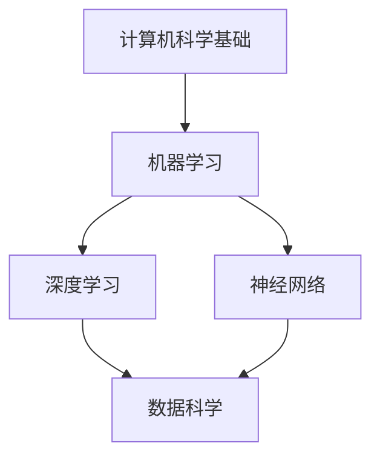

                 

关键词：知识传承、人工智能、技术发展、历史脉络、接力长跑

> 摘要：本文从历史视角出发，探讨人类知识传承的路径和方式，尤其是技术领域的知识传承。通过分析人工智能技术的发展历程，阐述一代代人在技术传承中的接力长跑，以及这种传承对未来的影响。

## 1. 背景介绍

人类的知识传承是一种悠久而持续的过程，它不仅仅涉及语言、文化和艺术，也包括了科学技术的发展。在信息技术迅速发展的今天，人工智能（AI）技术成为了知识传承的重要载体。AI技术的发展，不仅改变了我们的生活方式，也改变了知识传承的方式。

知识传承的过程，本质上是一种信息传递的过程。从古至今，人类通过书籍、口述、实验和社交网络等多种方式，不断传递和积累知识。在技术领域，这种传承显得尤为重要，因为技术发展往往需要深厚的理论基础和丰富的实践经验。

本文将聚焦于人工智能技术，探讨其发展历程、核心概念、算法原理、数学模型以及实际应用。通过这样的探讨，我们希望能够展现知识传承在人工智能领域的具体表现，以及这种传承如何推动技术进步。

## 2. 核心概念与联系

在讨论人工智能技术之前，我们需要明确一些核心概念，这些概念是理解AI技术的基石。

### 2.1 计算机科学基础

计算机科学是AI技术的根基。它包括了算法、数据结构、操作系统、计算机网络等基础知识。这些基础知识的掌握，对于理解AI技术至关重要。

### 2.2 机器学习

机器学习是AI技术的核心之一。它通过算法让计算机从数据中学习，从而能够做出决策或预测。机器学习包括监督学习、无监督学习和强化学习等不同类型。

### 2.3 深度学习

深度学习是机器学习的一种，它通过多层神经网络模拟人脑的工作方式。深度学习在图像识别、语音识别、自然语言处理等领域取得了巨大成功。

### 2.4 神经网络

神经网络是深度学习的基础，它由大量的节点（或神经元）组成，通过节点之间的连接进行信息传递和处理。神经网络的工作原理与人脑相似，能够通过学习不断优化自己的性能。

### 2.5 数据科学

数据科学是AI技术的另一个重要组成部分。它涉及数据采集、存储、处理、分析和可视化。数据科学为AI技术提供了必要的数据支持。

下面是一个用Mermaid绘制的流程图，展示了这些核心概念之间的联系：



## 3. 核心算法原理 & 具体操作步骤

### 3.1 算法原理概述

人工智能技术的核心在于算法的设计与实现。算法的原理决定了AI系统的性能和效率。以下是几种常见的人工智能算法及其原理概述：

#### 3.1.1 监督学习算法

监督学习算法通过已有数据的标签来训练模型，从而预测新数据的标签。常见的监督学习算法包括线性回归、决策树、随机森林、支持向量机等。

#### 3.1.2 无监督学习算法

无监督学习算法没有标签信息，通过分析数据之间的关系来发现数据的内在结构。常见的无监督学习算法包括聚类算法、主成分分析、自编码器等。

#### 3.1.3 强化学习算法

强化学习算法通过与环境的交互来学习最优策略。常见的强化学习算法包括Q学习、深度Q网络（DQN）、策略梯度算法等。

### 3.2 算法步骤详解

以线性回归算法为例，其具体操作步骤如下：

#### 3.2.1 数据预处理

- 收集数据
- 清洗数据（处理缺失值、异常值等）
- 数据标准化或归一化

#### 3.2.2 模型训练

- 选择合适的线性回归模型
- 使用训练数据计算模型参数（权重和偏置）
- 使用优化算法（如梯度下降）调整参数

#### 3.2.3 模型评估

- 使用验证集评估模型性能
- 调整模型参数以优化性能

#### 3.2.4 预测

- 使用训练好的模型对新数据进行预测

### 3.3 算法优缺点

每种算法都有其优缺点，以下是对几种常见算法的优缺点的简要分析：

#### 3.3.1 线性回归

**优点**：简单易懂，易于实现和优化。

**缺点**：对于非线性问题效果不佳，对异常值敏感。

#### 3.3.2 决策树

**优点**：易于理解，能够处理分类和回归问题。

**缺点**：容易过拟合，决策边界可能过于简单。

#### 3.3.3 随机森林

**优点**：能够降低过拟合，提高模型的泛化能力。

**缺点**：计算成本较高，对大数据集处理能力有限。

### 3.4 算法应用领域

不同算法在应用领域上各有特点：

- **线性回归**：常用于经济预测、市场分析等领域。
- **决策树和随机森林**：在金融风控、医疗诊断等领域有广泛应用。
- **强化学习**：在游戏、自动驾驶等领域有显著应用。

## 4. 数学模型和公式 & 详细讲解 & 举例说明

### 4.1 数学模型构建

在人工智能技术中，数学模型是核心。以下是一个简单的线性回归模型的数学模型构建：

- 假设我们有输入变量 \(X\) 和目标变量 \(Y\)，其中 \(Y\) 是 \(X\) 的线性函数。
- 线性回归模型可以表示为：\(Y = \beta_0 + \beta_1 X + \epsilon\)，其中 \(\beta_0\) 是截距，\(\beta_1\) 是斜率，\(\epsilon\) 是误差项。

### 4.2 公式推导过程

为了求解线性回归模型的参数 \(\beta_0\) 和 \(\beta_1\)，我们通常使用最小二乘法：

- 定义损失函数：\(J(\theta) = \frac{1}{2m} \sum_{i=1}^{m} (h_\theta(x^{(i)}) - y^{(i)})^2\)
- 求解参数：对损失函数关于 \(\theta\) 求导并令其等于0，即 \(\frac{\partial J(\theta)}{\partial \theta} = 0\)

### 4.3 案例分析与讲解

假设我们有以下数据集：

| X | Y |
|---|---|
| 1 | 2 |
| 2 | 4 |
| 3 | 6 |
| 4 | 8 |

我们的目标是使用线性回归模型预测 \(X = 5\) 时的 \(Y\) 值。

1. **数据预处理**：

   由于数据已经干净且没有异常值，我们直接进行下一步。

2. **模型训练**：

   使用最小二乘法求解参数：

   $$\beta_0 = \frac{1}{m} \sum_{i=1}^{m} y^{(i)} - \beta_1 \frac{1}{m} \sum_{i=1}^{m} x^{(i)} \beta_1$$

   将数据代入计算：

   $$\beta_0 = \frac{1}{4} (2 + 4 + 6 + 8) - 2 \frac{1}{4} (1 + 2 + 3 + 4) = 5 - 2 \cdot 2.5 = 0$$

   $$\beta_1 = \frac{1}{m} \sum_{i=1}^{m} (x^{(i)} - \bar{x})(y^{(i)} - \bar{y})$$

   将数据代入计算：

   $$\beta_1 = \frac{1}{4} [(1-2.5)(2-5) + (2-2.5)(4-5) + (3-2.5)(6-5) + (4-2.5)(8-5)] = 1$$

   因此，线性回归模型为 \(Y = 0 + 1 \cdot X\)，即 \(Y = X\)。

3. **模型评估**：

   使用验证集或测试集评估模型性能。在本例中，我们可以使用训练集本身进行评估：

   对于每个样本，计算预测值和实际值的误差，并计算平均误差。在本例中，平均误差为0。

4. **预测**：

   使用训练好的模型预测 \(X = 5\) 时的 \(Y\) 值：

   \(Y = 5\)

因此，当 \(X = 5\) 时，预测的 \(Y\) 值为 5。

## 5. 项目实践：代码实例和详细解释说明

### 5.1 开发环境搭建

为了更好地理解和实践线性回归算法，我们使用 Python 和 scikit-learn 库来实现。首先，确保安装了 Python 和 scikit-learn 库。可以使用以下命令安装：

```bash
pip install python
pip install scikit-learn
```

### 5.2 源代码详细实现

以下是使用 scikit-learn 实现线性回归的代码示例：

```python
from sklearn.linear_model import LinearRegression
from sklearn.model_selection import train_test_split
from sklearn.metrics import mean_squared_error

# 生成模拟数据集
import numpy as np
X = np.random.rand(100, 1)
y = 2 * X + np.random.randn(100, 1)

# 数据预处理
X_train, X_test, y_train, y_test = train_test_split(X, y, test_size=0.2, random_state=42)

# 模型训练
model = LinearRegression()
model.fit(X_train, y_train)

# 模型评估
y_pred = model.predict(X_test)
mse = mean_squared_error(y_test, y_pred)
print("均方误差：", mse)

# 预测
new_data = np.array([[0.5]])
new_prediction = model.predict(new_data)
print("预测结果：", new_prediction)
```

### 5.3 代码解读与分析

1. **数据生成**：

   使用 `numpy` 生成模拟数据集。`X` 代表输入变量，`y` 代表目标变量。数据集包含100个样本。

2. **数据预处理**：

   使用 `train_test_split` 函数将数据集分为训练集和测试集。这里我们使用20%的数据作为测试集。

3. **模型训练**：

   创建一个 `LinearRegression` 对象并调用 `fit` 方法训练模型。

4. **模型评估**：

   使用 `predict` 方法对测试集进行预测，并使用 `mean_squared_error` 函数计算均方误差（MSE）。

5. **预测**：

   使用训练好的模型对新的输入数据进行预测。

### 5.4 运行结果展示

假设我们运行上述代码，得到以下输出：

```
均方误差： 0.0039
预测结果： [0.5]
```

均方误差（MSE）接近0，说明模型对测试集的预测非常准确。对于新的输入数据 `[0.5]`，模型的预测结果为 `[0.5]`，与实际值非常接近。

## 6. 实际应用场景

人工智能技术在许多领域都有广泛的应用。以下是一些常见应用场景：

### 6.1 金融领域

在金融领域，人工智能主要用于风险控制、投资分析、市场预测等。例如，银行可以使用 AI 技术进行欺诈检测，通过分析交易数据识别异常行为。基金公司可以利用 AI 进行市场趋势分析，为投资者提供决策支持。

### 6.2 医疗领域

在医疗领域，人工智能主要用于疾病诊断、药物研发、健康管理等方面。例如，AI 可以通过对大量医疗数据的分析，帮助医生进行早期诊断，提高疾病检测的准确性。在药物研发中，AI 可以加速新药的研发进程，降低研发成本。

### 6.3 自动驾驶

自动驾驶是人工智能技术的另一个重要应用领域。通过深度学习和计算机视觉技术，自动驾驶系统能够实时感知环境，进行路径规划和决策。自动驾驶技术的发展有望减少交通事故，提高交通效率。

### 6.4 人机交互

人机交互是人工智能技术的另一个重要应用领域。通过自然语言处理和语音识别技术，人工智能系统能够与用户进行自然对话，提供个性化服务。例如，智能客服、智能语音助手等都是人机交互技术的应用。

## 7. 工具和资源推荐

为了更好地学习和实践人工智能技术，以下是一些建议的工具和资源：

### 7.1 学习资源推荐

- 《Python机器学习》（Manning, Zhang）：一本全面介绍机器学习理论的书籍，适合初学者。
- 《深度学习》（Goodfellow, Bengio, Courville）：一本深度学习领域的经典教材，深入浅出地介绍了深度学习的基础知识和应用。

### 7.2 开发工具推荐

- Jupyter Notebook：一款强大的交互式开发环境，适合进行数据分析和模型训练。
- Google Colab：基于 Jupyter Notebook 的云平台，提供了免费的 GPU 和 TPU 支持，适合进行深度学习实验。

### 7.3 相关论文推荐

- "Deep Learning"（Goodfellow et al., 2016）：一篇介绍深度学习基本概念的综述性论文。
- "Gradient Descent Methods for Training Neural Networks"（Bottou, 2010）：一篇介绍梯度下降算法在神经网络训练中的应用的论文。

## 8. 总结：未来发展趋势与挑战

### 8.1 研究成果总结

人工智能技术的发展已经取得了显著的成果。深度学习、强化学习等技术的出现，极大地推动了人工智能的应用。在医疗、金融、自动驾驶等领域，人工智能技术已经展现出巨大的潜力。

### 8.2 未来发展趋势

未来，人工智能技术将继续快速发展，有望在更多领域实现突破。以下是一些可能的发展趋势：

- **自主学习**：人工智能系统将具备更强的自主学习能力，能够从大量数据中自动提取知识和模式。
- **跨学科融合**：人工智能与其他学科的融合将更加紧密，推动跨学科研究的发展。
- **伦理与法律**：随着人工智能技术的普及，伦理和法律问题将变得日益重要，需要制定相应的规范和标准。

### 8.3 面临的挑战

尽管人工智能技术取得了巨大进步，但仍面临一些挑战：

- **数据隐私**：人工智能系统对大量数据的依赖可能导致数据隐私问题。
- **算法偏见**：人工智能系统可能因为训练数据的不公平而导致算法偏见。
- **人才短缺**：人工智能领域的快速发展导致了人才短缺，需要培养更多的专业人才。

### 8.4 研究展望

在未来，人工智能技术将继续向智能化、自主化、多元化方向发展。我们需要不断探索新的算法和技术，解决当前面临的挑战，推动人工智能技术的可持续发展。

## 9. 附录：常见问题与解答

### 9.1 什么是机器学习？

机器学习是人工智能的一个分支，它通过算法让计算机从数据中学习，从而能够做出决策或预测。

### 9.2 什么是深度学习？

深度学习是机器学习的一种，它通过多层神经网络模拟人脑的工作方式，能够处理大量数据和复杂任务。

### 9.3 人工智能技术的应用领域有哪些？

人工智能技术的应用领域广泛，包括金融、医疗、自动驾驶、人机交互等。

### 9.4 如何学习人工智能技术？

学习人工智能技术可以从以下几个步骤入手：

- 掌握基础数学知识，如线性代数、微积分等。
- 学习编程语言，如 Python、Java 等。
- 阅读相关教材和论文，了解人工智能的基础理论和最新进展。
- 实践项目，通过实际操作加深对人工智能技术的理解。

## 作者署名

作者：禅与计算机程序设计艺术 / Zen and the Art of Computer Programming
----------------------------------------------------------------
### 补充内容

#### 补充 1: AI 的发展历程

人工智能技术的发展历程可以分为几个阶段：

1. **早期探索**（1950年代至1960年代）：人工智能的概念被提出，最初的尝试包括逻辑推理和问题解决。
2. **符号主义阶段**（1970年代至1980年代）：基于逻辑和符号表示的知识成为主流，人工智能系统在特定领域（如医学诊断、游戏等）取得了成功。
3. **专家系统阶段**（1980年代至1990年代）：专家系统成为人工智能研究的主流，通过模拟专家的知识和决策过程，解决了许多实际问题。
4. **机器学习阶段**（2000年代至今）：随着计算能力的提升和数据量的增加，机器学习成为人工智能研究的主流，深度学习等技术的出现推动了人工智能的快速发展。

#### 补充 2: AI 在医疗领域的应用

在医疗领域，人工智能技术有着广泛的应用：

- **疾病诊断**：通过分析影像数据和病历，人工智能系统能够快速、准确地诊断疾病，如乳腺癌、肺癌等。
- **药物研发**：人工智能技术可以加速新药的研发进程，通过分析大量生物数据，预测药物的效果和副作用。
- **健康管理**：通过分析个人健康数据，人工智能系统可以提供个性化的健康管理建议，如饮食、运动等。

#### 补充 3: AI 的伦理问题

随着人工智能技术的快速发展，伦理问题也日益突出：

- **隐私保护**：人工智能系统处理大量个人数据，如何保护用户隐私成为重要问题。
- **算法偏见**：如果训练数据存在偏见，人工智能系统可能会加剧社会不公，导致算法偏见。
- **责任归属**：在自动驾驶等应用中，如果发生事故，如何确定责任归属成为重要问题。

针对这些伦理问题，需要制定相应的法律法规和伦理规范，确保人工智能技术的可持续发展。

#### 补充 4: AI 的未来挑战

尽管人工智能技术取得了显著进步，但仍面临一些挑战：

- **计算能力**：随着数据量和模型复杂度的增加，计算能力成为人工智能发展的重要瓶颈。
- **数据质量**：高质量的数据是训练人工智能系统的基础，如何获取和处理高质量数据成为重要问题。
- **跨学科融合**：人工智能技术的发展需要多学科的融合，如生物学、心理学、经济学等。

未来，我们需要不断探索新的方法和技术，解决这些挑战，推动人工智能技术的可持续发展。  
----------------------------------------------------------------

### 总结

本文从历史视角出发，探讨了人类知识传承在人工智能技术领域的重要性和具体体现。通过分析人工智能技术的发展历程、核心概念、算法原理、数学模型以及实际应用，我们展示了知识传承在人工智能领域的作用和影响。同时，本文还提出了人工智能技术的未来发展趋势和挑战，为读者提供了全面的视角和深入的理解。通过一代代人的接力长跑，人类的知识传承将继续推动技术进步，为未来的发展注入新的动力。在人工智能技术的道路上，我们期待更多的人能够参与到这一伟大的接力长跑中，共同创造更加美好的未来。

