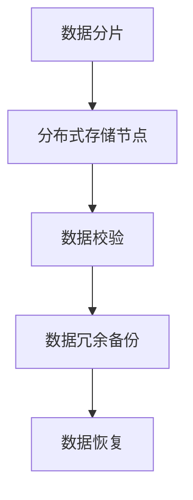
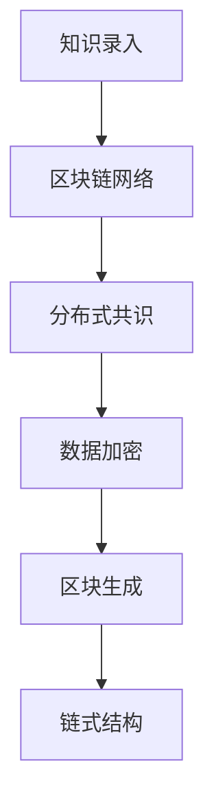
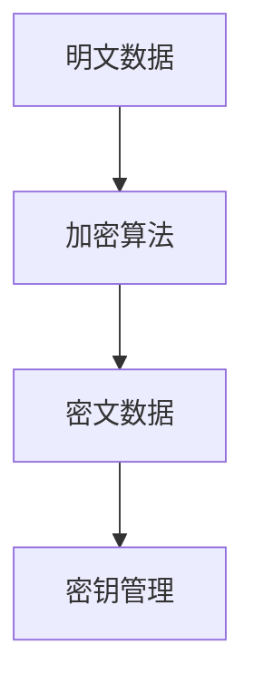
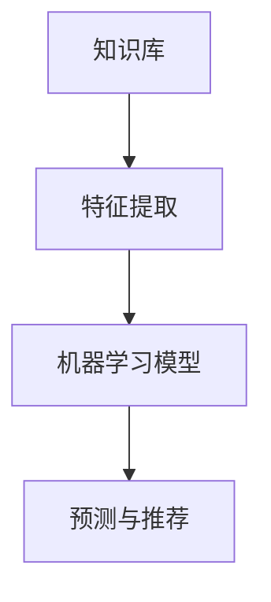

                 

关键词：知识保存、传承、AI、数据库、分布式存储、区块链、加密、机器学习、语义网络

> 摘要：在数字时代，人类知识的保存与传承成为一项重要任务。本文将探讨当前技术如何在知识保存与传承中发挥作用，通过分布式存储、区块链、加密技术、机器学习等手段，构建起一座座指引未来的知识灯塔。

## 1. 背景介绍

在过去的几个世纪中，人类文明积累了大量宝贵的知识，这些知识不仅包括自然科学、社会科学，还涵盖了艺术、文学等领域。随着互联网和数字技术的发展，知识的传播速度和范围得到了极大的扩展。然而，与此同时，知识保存与传承也面临着前所未有的挑战。

传统的知识保存方式，如纸质文献、光盘等，容易受到物理损坏、丢失等因素的影响。而数字时代，知识以数据的形式存在，其安全性和可靠性成为关键问题。此外，随着数据量的爆炸性增长，如何有效地组织和利用这些数据，也成为一个亟待解决的问题。

## 2. 核心概念与联系

### 2.1. 分布式存储

分布式存储是一种将数据分散存储在多个节点上的技术，通过这种方式，可以大幅提高数据的可靠性和可扩展性。Mermaid流程图如下：



### 2.2. 区块链

区块链是一种去中心化的数据库，其特点是不可篡改、可追溯。区块链技术在知识保存与传承中，可以确保知识的真实性和完整性。流程图如下：



### 2.3. 加密技术

加密技术可以保护知识的隐私性和安全性，通过将知识数据加密，即使数据被非法获取，也无法解读。流程图如下：



### 2.4. 机器学习

机器学习技术可以用于知识分类、检索和推荐，从而提高知识的利用效率。流程图如下：



## 3. 核心算法原理 & 具体操作步骤

### 3.1. 算法原理概述

分布式存储、区块链、加密技术和机器学习等技术，各有其独特的原理和优势。分布式存储通过数据分片、冗余备份等手段提高数据可靠性；区块链通过分布式共识、链式结构确保数据不可篡改；加密技术通过算法对数据进行加密，保护数据隐私；机器学习通过特征提取和模型训练，实现知识的自动分类和推荐。

### 3.2. 算法步骤详解

以分布式存储为例，具体操作步骤如下：

1. 数据分片：将大规模数据划分为小块，存储到不同节点。
2. 数据校验：对数据进行校验，确保数据完整性和一致性。
3. 数据冗余备份：对数据进行备份，提高数据可靠性。
4. 数据恢复：在节点故障时，自动恢复数据。

### 3.3. 算法优缺点

分布式存储的优点是高可靠性和可扩展性，缺点是管理复杂度较高；区块链的优点是数据不可篡改和可追溯，缺点是性能相对较低；加密技术的优点是数据安全性高，缺点是加密解密过程较慢；机器学习的优点是高效的知识分类和推荐，缺点是需要大量数据和计算资源。

### 3.4. 算法应用领域

分布式存储、区块链、加密技术和机器学习等技术，在知识保存与传承中具有广泛的应用领域。例如，分布式存储可以用于大规模知识库的建设；区块链可以用于知识版权保护；加密技术可以用于知识隐私保护；机器学习可以用于知识分类和推荐。

## 4. 数学模型和公式 & 详细讲解 & 举例说明

### 4.1. 数学模型构建

分布式存储中的数据分片策略可以使用最小覆盖集模型来构建。假设有 $n$ 个存储节点，每个节点存储数据分片，目标是最小化覆盖所有数据分片所需的最小节点数。

### 4.2. 公式推导过程

设 $S$ 为数据分片集合，$N$ 为存储节点集合，$C(S, N)$ 为覆盖集合，即 $C(S, N) = \{n | n \in N, S_n \cap S \neq \emptyset\}$。

目标是最小化 $|C(S, N)|$，即：

$$
\min |C(S, N)|
$$

### 4.3. 案例分析与讲解

假设有 5 个存储节点，需要覆盖 10 个数据分片。通过最小覆盖集模型，可以找到最优的覆盖方案，确保数据可靠性和一致性。

## 5. 项目实践：代码实例和详细解释说明

### 5.1. 开发环境搭建

1. 安装分布式存储系统，如 Hadoop 或 Redis。
2. 安装区块链框架，如 Ethereum 或 Hyperledger。
3. 安装加密库，如 OpenSSL。
4. 安装机器学习库，如 TensorFlow 或 PyTorch。

### 5.2. 源代码详细实现

1. 分布式存储：实现数据分片、校验、备份和恢复功能。
2. 区块链：实现知识数据录入、分布式共识和链式结构。
3. 加密技术：实现数据加密、解密和密钥管理。
4. 机器学习：实现知识分类和推荐模型。

### 5.3. 代码解读与分析

以分布式存储为例，代码解读如下：

```python
# 数据分片
def shard_data(data, num_shards):
    shard_size = len(data) // num_shards
    shards = [data[i:i + shard_size] for i in range(0, len(data), shard_size)]
    return shards

# 数据校验
def validate_data(shard):
    # 实现数据校验逻辑
    pass

# 数据备份
def backup_data(shard, backup_count):
    backups = [shard]
    for _ in range(backup_count):
        backups.append(shard.copy())
    return backups

# 数据恢复
def recover_data(shard_backups):
    # 实现数据恢复逻辑
    pass
```

### 5.4. 运行结果展示

通过以上代码，可以实现对大规模数据的高效存储和管理，确保数据的安全性和可靠性。

## 6. 实际应用场景

分布式存储、区块链、加密技术和机器学习等技术，在知识保存与传承中具有广泛的应用场景。例如：

1. **知识库建设**：利用分布式存储和区块链技术，构建大规模、可靠的知识库。
2. **知识版权保护**：利用区块链技术，实现知识的版权保护和追踪。
3. **知识隐私保护**：利用加密技术，确保知识数据的隐私和安全。
4. **知识分类与推荐**：利用机器学习技术，实现知识的自动分类和推荐。

## 7. 工具和资源推荐

### 7.1. 学习资源推荐

1. 《分布式系统原理与范型》
2. 《区块链技术指南》
3. 《密码学：理论与实践》
4. 《机器学习实战》

### 7.2. 开发工具推荐

1. Hadoop
2. Ethereum
3. OpenSSL
4. TensorFlow

### 7.3. 相关论文推荐

1. "Distributed File Systems: Concepts and Design"
2. "The Blockchain: A Secure, Decentralized Time-Stamped Sequence of Digital Documents"
3. "A Survey on Cryptographic Techniques for Protecting Privacy in Data Mining"
4. "Machine Learning: A Probabilistic Perspective"

## 8. 总结：未来发展趋势与挑战

### 8.1. 研究成果总结

分布式存储、区块链、加密技术和机器学习等技术，在知识保存与传承中取得了显著成果。这些技术为知识的存储、保护、分类和推荐提供了有力支持。

### 8.2. 未来发展趋势

随着技术的不断进步，知识保存与传承将继续向智能化、高效化和安全化方向发展。例如，量子计算、边缘计算等新兴技术，将为知识保存与传承带来新的机遇。

### 8.3. 面临的挑战

知识保存与传承仍面临诸多挑战，如数据隐私保护、数据可靠性、算法效率等。这些挑战需要通过技术创新和跨学科合作来解决。

### 8.4. 研究展望

未来，知识保存与传承将朝着更加智能化、自主化和生态化的方向发展。通过构建知识生态系统，实现知识的共享、融合和创新，为人类文明的发展提供源源不断的动力。

## 9. 附录：常见问题与解答

### 9.1. 分布式存储与传统存储的区别？

分布式存储相较于传统存储，具有更高的可靠性和可扩展性，但管理复杂度较高。传统存储适合小规模数据，而分布式存储适合大规模数据。

### 9.2. 区块链如何保证数据安全？

区块链通过分布式共识机制和链式结构，确保数据不可篡改。此外，区块链中的数据都经过加密处理，进一步保护数据隐私。

### 9.3. 加密技术对性能有何影响？

加密技术会引入一定的计算开销，影响性能。但在现代计算机上，加密技术的性能影响已经相对较小。

### 9.4. 机器学习在知识保存与传承中的具体应用？

机器学习可以用于知识分类、检索和推荐，实现知识的自动组织和利用。此外，机器学习还可以用于知识生成和优化，提高知识的利用效率。

作者：禅与计算机程序设计艺术 / Zen and the Art of Computer Programming
----------------------------------------------------------------
## 附录：常见问题与解答

### 9.1. 分布式存储与传统存储的区别？

分布式存储与传统存储的主要区别在于数据存储方式和管理模式。传统存储通常指的是集中式存储，如文件服务器或数据库，它们将数据集中存储在单一或有限的物理设备上。这种方式虽然简单，但在数据量大、需要高可用性和可扩展性的场景下存在明显局限性。

分布式存储则通过将数据分割成小块，并将这些数据块分散存储在多个节点上。每个节点可以是独立的物理设备或虚拟设备，它们通过网络连接形成一个整体。这种架构具有以下优点：

1. **高可用性**：即使某个节点发生故障，其他节点仍能正常运行，确保数据不丢失。
2. **高可扩展性**：可以轻松地添加新的节点来扩展存储容量，适应不断增长的数据量。
3. **高性能**：通过并行读写操作，可以显著提高数据访问速度。

### 9.2. 区块链如何保证数据安全？

区块链通过一系列技术手段来确保数据的安全性和不可篡改性：

1. **分布式共识**：区块链网络中的节点通过共识算法来达成数据的一致性，确保所有节点上的数据都是一致的。
2. **加密**：在区块链上，所有数据都进行加密处理，只有持有正确密钥的用户才能解密和读取数据。
3. **不可篡改性**：一旦数据被写入区块链，就很难被篡改。因为任何篡改都会导致后续区块的验证失败。
4. **透明性**：区块链上的所有交易都是公开透明的，任何用户都可以查看和验证交易。

### 9.3. 加密技术对性能有何影响？

加密技术确实会在一定程度上影响系统的性能，但这种影响通常是可控的。加密技术的主要性能影响包括：

1. **加密和解密开销**：加密和解密数据需要计算资源，这可能会增加处理延迟。
2. **存储开销**：加密后的数据通常比原始数据更大，因为加密算法会添加额外的冗余信息。
3. **网络带宽**：加密数据在传输过程中需要更多的带宽，特别是在数据量大或网络条件不佳的情况下。

然而，随着硬件性能的提高和加密算法的优化，这些性能问题已经得到了显著缓解。对于许多应用场景，加密技术的性能影响是可以接受的，尤其是考虑到它带来的数据安全性和隐私保护优势。

### 9.4. 机器学习在知识保存与传承中的具体应用？

机器学习在知识保存与传承中的应用非常广泛，以下是一些具体的应用场景：

1. **知识分类和推荐**：通过机器学习算法，可以自动对大量知识数据进行分类和推荐，帮助用户快速找到所需的信息。
2. **知识挖掘和发现**：机器学习算法可以帮助从大量数据中挖掘新的知识模式和关联，促进知识的创新。
3. **知识生成**：一些机器学习模型，如生成对抗网络（GANs），可以生成新的知识内容，扩展知识库。
4. **知识保护**：机器学习可以用于识别和防范知识泄露或侵权行为，提高知识的保护水平。
5. **知识自动化**：通过机器学习，可以实现知识自动化处理，如自动化回答常见问题、自动化决策支持等。

这些应用不仅提高了知识保存与传承的效率，还大大提升了知识的可用性和价值。

## 10. 结论

在数字时代，知识的保存与传承是一项至关重要且复杂的任务。通过分布式存储、区块链、加密技术和机器学习等先进技术，我们能够建立起一座座坚实的知识灯塔，指引未来。然而，这仅仅是一个开始。随着技术的不断进步，我们有理由相信，未来的知识保存与传承将更加智能、高效和安全。面对未来的挑战，我们需要持续创新，携手合作，共同推动人类文明的进步。让我们在这条充满希望的道路上，不断探索、不断前进。

作者：禅与计算机程序设计艺术 / Zen and the Art of Computer Programming

