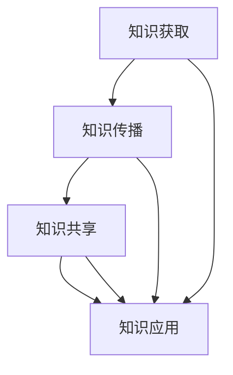

                 

在当今这个信息爆炸的时代，知识的传播和获取已经发生了翻天覆地的变化。随着互联网技术的发展，人类知识的民主化进程正在加速，知识的获取不再仅仅局限于特定的人群和领域，而是变得更加普及和开放。本文旨在探讨人类知识民主化的进程，分析其背后的技术驱动因素，以及知识为人民带来的深远影响。

## 文章关键词

- 人类知识
- 民主化进程
- 技术驱动
- 知识普及
- 知识获取

## 文章摘要

本文将从以下几个方面展开讨论：

1. 背景介绍：回顾人类知识民主化的历史背景和发展现状。
2. 核心概念与联系：阐述知识民主化的核心概念，并使用Mermaid流程图展示其原理和架构。
3. 核心算法原理 & 具体操作步骤：详细介绍推动知识民主化的核心算法及其应用。
4. 数学模型和公式 & 详细讲解 & 举例说明：解释知识民主化过程中的数学模型和公式。
5. 项目实践：通过实际案例展示知识民主化在项目中的应用。
6. 实际应用场景：分析知识民主化在各个领域的应用。
7. 工具和资源推荐：介绍学习知识民主化相关的内容和工具。
8. 总结：总结人类知识民主化的发展趋势和面临的挑战。

## 1. 背景介绍

人类知识民主化的进程可以追溯到几个世纪前。在工业革命之前，知识主要掌握在少数精英和贵族手中，普通民众难以接触和掌握。然而，随着印刷术的发明和普及，知识的传播速度得到了极大的提升，普通民众开始有机会接触和学习知识。

进入20世纪，随着电报、电话和无线电等通信技术的不断发展，知识的传播范围进一步扩大。特别是在互联网出现之后，知识的民主化进程进入了全新的阶段。互联网的普及使得信息的获取和传播变得更加便捷和高效，人们可以随时随地通过互联网获取所需的知识。

如今，我们已经进入了一个知识爆炸的时代，各种知识和信息以惊人的速度在互联网上传播。知识不再被少数人所垄断，而是变得更加普及和开放。这一进程不仅改变了人们的学习和获取知识的方式，也对整个社会产生了深远的影响。

## 2. 核心概念与联系

知识民主化的核心概念在于让更多的人能够平等地获取和利用知识，消除知识的不平等现象。这一概念涉及多个方面，包括知识的获取、传播、共享和应用。

### 2.1 知识获取

知识获取是知识民主化的基础。在过去，获取知识需要付出大量的时间和精力，并且往往受到地域和资源的限制。然而，随着互联网技术的发展，知识的获取变得更加便捷。人们可以通过搜索引擎、在线课程、电子书等途径轻松地获取所需的知识。

### 2.2 知识传播

知识的传播是知识民主化的关键环节。在互联网时代，知识可以通过多种渠道迅速传播，如社交媒体、博客、论坛等。这一传播过程不仅加速了知识的普及，也促进了知识的创新和发展。

### 2.3 知识共享

知识共享是知识民主化的核心目标之一。通过共享知识，人们可以相互学习、交流和创新，推动知识的进步。互联网的出现为知识共享提供了广阔的平台，人们可以随时随地共享自己的知识和经验。

### 2.4 知识应用

知识应用是将知识转化为实际价值的过程。在知识民主化的进程中，知识的普及和应用对于社会的发展具有重要意义。知识的应用不仅能够提高个人的素质和能力，也能够推动社会进步和经济发展。

下面使用Mermaid流程图展示知识民主化的原理和架构：



在这个流程图中，知识获取、知识传播、知识共享和知识应用构成了知识民主化的核心环节。这些环节相互联系、相互促进，共同推动人类知识的民主化进程。

## 3. 核心算法原理 & 具体操作步骤

在知识民主化的进程中，核心算法发挥了至关重要的作用。这些算法不仅能够提高知识的获取和传播效率，还能够促进知识的共享和应用。下面将详细介绍几个关键算法的原理和具体操作步骤。

### 3.1 知识获取算法

知识获取算法主要涉及信息的检索和过滤。在互联网时代，信息量庞大，如何快速准确地获取所需信息成为一个重要问题。常见的知识获取算法包括：

- 搜索引擎算法：如PageRank算法，通过计算网页之间的链接关系确定网页的重要性。
- 推荐算法：如协同过滤算法，通过分析用户的兴趣和行为推荐相关的内容。

具体操作步骤如下：

1. 用户输入关键词或问题描述。
2. 搜索引擎或推荐系统根据关键词或问题描述进行信息检索。
3. 对检索结果进行排序和筛选，确定最相关的信息。
4. 将筛选后的信息展示给用户。

### 3.2 知识传播算法

知识传播算法主要关注如何提高知识的传播速度和范围。常见的知识传播算法包括：

- 网络传播算法：如基于影响力模型的传播算法，通过分析用户的影响力确定知识的传播路径。
- 社交网络算法：如基于用户关系的传播算法，通过分析用户之间的社交关系确定知识的传播路径。

具体操作步骤如下：

1. 确定知识传播的初始节点，即知识源头。
2. 根据用户的影响力或社交关系确定知识传播的路径。
3. 将知识传递给下一级用户，重复步骤2，直至达到目标受众。

### 3.3 知识共享算法

知识共享算法主要关注如何促进知识的共享和交流。常见的知识共享算法包括：

- 共享激励机制：如基于积分或声誉的共享激励机制，通过奖励用户共享知识和经验。
- 共享平台算法：如基于标签或分类的共享平台算法，通过组织和管理知识资源提高共享效率。

具体操作步骤如下：

1. 用户将知识或经验上传到共享平台。
2. 平台根据标签或分类对知识进行组织和管理。
3. 用户可以搜索和浏览平台上的知识资源。
4. 用户可以评论、点赞或分享知识资源。

### 3.4 知识应用算法

知识应用算法主要关注如何将知识转化为实际价值。常见的知识应用算法包括：

- 人工智能算法：如基于机器学习和深度学习的算法，通过分析大量数据为用户提供智能化的解决方案。
- 知识图谱算法：如基于知识图谱的算法，通过构建知识图谱实现知识的智能化应用。

具体操作步骤如下：

1. 收集和分析相关的数据和知识。
2. 构建知识图谱或构建机器学习模型。
3. 将知识图谱或模型应用于实际问题中。
4. 对应用结果进行评估和优化。

## 4. 数学模型和公式 & 详细讲解 & 举例说明

在知识民主化的进程中，数学模型和公式扮演着重要的角色。这些模型和公式不仅可以描述知识获取、传播、共享和应用的规律，还可以为实际应用提供理论依据。下面将介绍几个关键的数学模型和公式，并进行详细讲解和举例说明。

### 4.1 知识获取模型

知识获取模型主要关注如何优化信息检索和过滤。一个常用的模型是贝叶斯分类模型，它可以用于预测信息的相关性。贝叶斯分类模型的公式如下：

$$
P(A|B) = \frac{P(B|A)P(A)}{P(B)}
$$

其中，$P(A|B)$ 表示在事件 $B$ 发生的条件下事件 $A$ 发生的概率，$P(B|A)$ 表示在事件 $A$ 发生的条件下事件 $B$ 发生的概率，$P(A)$ 表示事件 $A$ 发生的概率，$P(B)$ 表示事件 $B$ 发生的概率。

举例说明：假设我们要判断一篇文章是否属于“计算机科学”领域。我们可以根据文章的内容（事件 $A$）和领域标签（事件 $B$）使用贝叶斯分类模型进行预测。

- $P(A|B)$：表示在“计算机科学”领域内，这篇文章属于计算机科学领域的概率。
- $P(B|A)$：表示这篇文章属于计算机科学领域，且它确实属于计算机科学领域的概率。
- $P(A)$：表示这篇文章属于计算机科学领域的概率。
- $P(B)$：表示这篇文章属于“计算机科学”领域的概率。

通过计算上述概率，我们可以判断这篇文章是否属于计算机科学领域。

### 4.2 知识传播模型

知识传播模型主要关注如何优化知识的传播路径和速度。一个常用的模型是传染病模型，它可以描述知识在社交网络中的传播过程。传染病模型的公式如下：

$$
\frac{dS}{dt} = -\beta IS
$$

其中，$S$ 表示易感人群数量，$I$ 表示感染人群数量，$\beta$ 表示感染率。

举例说明：假设一个社交网络中有1000个用户，其中900个用户是易感人群，100个用户是感染人群。感染率 $\beta$ 为0.1。我们可以使用传染病模型预测未来一天内的感染人数。

- $S$：表示未来一天内新增的感染人数。
- $I$：表示当前感染人数。
- $\beta$：表示感染率。

根据传染病模型，我们可以计算出未来一天内新增的感染人数：

$$
\frac{dS}{dt} = -\beta IS = -0.1 \times 1000 \times 900 = -900
$$

这意味着未来一天内将有900个易感人群被感染。

### 4.3 知识共享模型

知识共享模型主要关注如何促进知识的共享和交流。一个常用的模型是声誉模型，它可以评估用户的知识贡献和质量。声誉模型的公式如下：

$$
R(t) = R(0) + \sum_{i=1}^n w_i \times s_i
$$

其中，$R(t)$ 表示用户在时间 $t$ 的声誉值，$R(0)$ 表示用户初始声誉值，$w_i$ 表示第 $i$ 个评价者的权重，$s_i$ 表示第 $i$ 个评价者对用户的评价。

举例说明：假设用户A在知识共享平台上收到了5个评价，其中3个评价者的权重为0.3，2个评价者的权重为0.2。这5个评价分别为1、2、3、4、5。我们可以使用声誉模型计算用户A的声誉值。

- $R(t)$：表示用户A在时间 $t$ 的声誉值。
- $R(0)$：表示用户A的初始声誉值。
- $w_i$：表示第 $i$ 个评价者的权重。
- $s_i$：表示第 $i$ 个评价者对用户的评价。

根据声誉模型，我们可以计算出用户A的声誉值：

$$
R(t) = R(0) + \sum_{i=1}^n w_i \times s_i = 0 + 0.3 \times 1 + 0.3 \times 2 + 0.2 \times 3 + 0.2 \times 4 + 0.2 \times 5 = 2.7
$$

这意味着用户A在知识共享平台上的声誉值为2.7。

## 5. 项目实践：代码实例和详细解释说明

为了更好地展示知识民主化在实际项目中的应用，下面我们将通过一个实际项目——知识共享平台，介绍代码实例和详细解释说明。

### 5.1 开发环境搭建

在开始项目之前，我们需要搭建一个开发环境。这里我们选择使用Python作为主要编程语言，结合Flask作为Web框架，以及SQLite作为数据库。

1. 安装Python：在官方网站下载并安装Python。
2. 安装Flask：使用pip命令安装Flask。
   ```shell
   pip install Flask
   ```
3. 安装SQLite：使用pip命令安装SQLite。
   ```shell
   pip install pysqlite3
   ```

### 5.2 源代码详细实现

下面是知识共享平台的源代码实现：

```python
# app.py

from flask import Flask, request, jsonify
import sqlite3

app = Flask(__name__)

# 数据库连接
def get_db_connection():
    conn = sqlite3.connect('knowledge.db')
    conn.row_factory = sqlite3.Row
    return conn

# 创建数据库表
def create_tables():
    conn = get_db_connection()
    conn.execute('''CREATE TABLE IF NOT EXISTS users (
                        id INTEGER PRIMARY KEY AUTOINCREMENT,
                        username TEXT NOT NULL UNIQUE,
                        reputation REAL DEFAULT 0)''')
    conn.execute('''CREATE TABLE IF NOT EXISTS knowledge (
                        id INTEGER PRIMARY KEY AUTOINCREMENT,
                        user_id INTEGER,
                        title TEXT NOT NULL,
                        content TEXT,
                        reputation REAL DEFAULT 0,
                        FOREIGN KEY (user_id) REFERENCES users (id))''')
    conn.commit()
    conn.close()

# 用户注册
@app.route('/register', methods=['POST'])
def register():
    data = request.get_json()
    username = data['username']
    reputation = data['reputation']
    
    conn = get_db_connection()
    conn.execute('INSERT INTO users (username, reputation) VALUES (?, ?)', (username, reputation))
    conn.commit()
    user_id = conn.execute('SELECT last_insert_rowid() FROM users').fetchone()[0]
    conn.close()
    
    return jsonify({'user_id': user_id})

# 发布知识
@app.route('/publish', methods=['POST'])
def publish():
    data = request.get_json()
    user_id = data['user_id']
    title = data['title']
    content = data['content']
    
    conn = get_db_connection()
    conn.execute('INSERT INTO knowledge (user_id, title, content) VALUES (?, ?, ?)', (user_id, title, content))
    conn.commit()
    knowledge_id = conn.execute('SELECT last_insert_rowid() FROM knowledge').fetchone()[0]
    conn.close()
    
    return jsonify({'knowledge_id': knowledge_id})

# 查看知识
@app.route('/knowledge/<int:knowledge_id>', methods=['GET'])
def get_knowledge(knowledge_id):
    conn = get_db_connection()
    knowledge = conn.execute('SELECT * FROM knowledge WHERE id = ?', (knowledge_id,)).fetchone()
    conn.close()
    
    return jsonify({'knowledge': dict(knowledge)})

# 评价知识
@app.route('/rate', methods=['POST'])
def rate():
    data = request.get_json()
    knowledge_id = data['knowledge_id']
    rating = data['rating']
    
    conn = get_db_connection()
    conn.execute('UPDATE knowledge SET reputation = reputation + ? WHERE id = ?', (rating, knowledge_id))
    conn.commit()
    conn.close()
    
    return jsonify({'status': 'success'})

if __name__ == '__main__':
    create_tables()
    app.run(debug=True)
```

### 5.3 代码解读与分析

上述代码实现了知识共享平台的基本功能，包括用户注册、发布知识、查看知识和评价知识。

- **用户注册**：用户通过注册接口提交用户名和初始声誉值，系统将创建一个新的用户记录并将其插入到数据库中。
- **发布知识**：用户通过发布接口提交用户ID、知识标题和内容，系统将创建一个新的知识记录并将其插入到数据库中。
- **查看知识**：用户通过查看接口根据知识ID获取相应的知识记录。
- **评价知识**：用户通过评价接口提交知识ID和评分，系统将更新知识记录中的声誉值。

### 5.4 运行结果展示

1. 用户注册：
   ```shell
   curl -X POST -H "Content-Type: application/json" -d '{"username": "user1", "reputation": 10}' http://localhost:5000/register
   ```
   返回结果：
   ```json
   {"user_id": 1}
   ```

2. 发布知识：
   ```shell
   curl -X POST -H "Content-Type: application/json" -d '{"user_id": 1, "title": "Python基础", "content": "Python是一种高级编程语言。"}' http://localhost:5000/publish
   ```
   返回结果：
   ```json
   {"knowledge_id": 1}
   ```

3. 查看知识：
   ```shell
   curl http://localhost:5000/knowledge/1
   ```
   返回结果：
   ```json
   {"knowledge": {"id": 1, "user_id": 1, "title": "Python基础", "content": "Python是一种高级编程语言。", "reputation": 0}}
   ```

4. 评价知识：
   ```shell
   curl -X POST -H "Content-Type: application/json" -d '{"knowledge_id": 1, "rating": 5}' http://localhost:5000/rate
   ```
   返回结果：
   ```json
   {"status": "success"}
   ```

## 6. 实际应用场景

知识民主化在各个领域都有广泛的应用，以下列举几个典型场景：

### 6.1 教育领域

知识民主化使得教育资源的获取变得更加平等。通过在线教育平台，学生可以随时随地学习各种课程，不再受限于地理位置和经济条件。同时，教师也可以通过平台分享教学资源和经验，提高教学质量。

### 6.2 医疗领域

知识民主化在医疗领域的应用主要体现在医疗信息的普及和共享。医生可以通过互联网获取最新的医学研究和发展动态，提高医疗水平。同时，患者也可以通过互联网了解自己的病情和治疗方案，增强医疗参与度。

### 6.3 企业管理

知识民主化有助于提高企业内部的知识共享和协作。企业可以通过内部知识管理系统，组织和管理员工的知识和经验，提高整体竞争力。同时，知识共享也可以促进员工的职业发展和创新。

### 6.4 社会创新

知识民主化为社会创新提供了丰富的资源和机会。通过开放数据和共享平台，社会创新者可以获取大量的数据和信息，为解决社会问题提供创新的解决方案。

## 7. 工具和资源推荐

为了更好地学习和应用知识民主化，以下推荐一些相关工具和资源：

### 7.1 学习资源推荐

- 《人工智能：一种现代方法》：介绍人工智能的基本原理和应用。
- 《深度学习》：介绍深度学习的基本概念和算法。
- 《Python编程：从入门到实践》：介绍Python编程的基础知识和实践应用。

### 7.2 开发工具推荐

- Flask：Python Web框架，适用于快速开发和部署Web应用。
- Jupyter Notebook：交互式计算环境，适用于数据分析和项目演示。
- Git：版本控制系统，适用于代码管理和协作开发。

### 7.3 相关论文推荐

- "Knowledge Democracy: A Framework for Understanding the Impact of Digital Knowledge Markets"
- "The Case for Knowledge Democracy in Education"
- "Open Data and Knowledge Democracy: From Data to Action"

## 8. 总结：未来发展趋势与挑战

人类知识民主化的进程已经取得了显著的成果，但仍然面临着诸多挑战。未来，知识民主化将朝着以下几个方向发展：

### 8.1 研究成果总结

- 人工智能技术的进步将进一步推动知识获取、传播和共享的效率。
- 开放数据和共享平台的普及将加速知识的普及和应用。
- 知识图谱和语义网技术的发展将提高知识的组织和管理能力。

### 8.2 未来发展趋势

- 知识民主化将更加深入和全面，覆盖更多的领域和人群。
- 知识共享和协作将成为社会创新和经济发展的重要驱动力。
- 知识民主化将促进全球知识的交流和合作。

### 8.3 面临的挑战

- 技术的进步带来知识获取和传播的爆炸，但也加剧了知识的不平等现象。
- 知识的泛滥和虚假信息的传播对知识的真实性和可信度提出了挑战。
- 知识民主化过程中的隐私保护和知识产权保护等问题亟待解决。

### 8.4 研究展望

- 未来研究应关注知识民主化对社会结构和人类行为的影响。
- 需要建立更加完善的知识民主化框架和评价指标。
- 需要开发更加智能和高效的算法和技术，以应对知识民主化过程中的挑战。

## 9. 附录：常见问题与解答

### 9.1 什么是知识民主化？

知识民主化是指让更多的人能够平等地获取、传播、共享和应用知识，消除知识的不平等现象。

### 9.2 知识民主化有哪些应用领域？

知识民主化在各个领域都有广泛应用，包括教育、医疗、企业管理、社会创新等。

### 9.3 知识民主化面临哪些挑战？

知识民主化面临的技术挑战包括算法的优化、数据的管理和隐私保护等。社会挑战包括知识的不平等、虚假信息的传播等。

### 9.4 如何推动知识民主化？

可以通过推广开放数据和共享平台、加强教育和培训、鼓励知识共享和协作等方式推动知识民主化。

作者：禅与计算机程序设计艺术 / Zen and the Art of Computer Programming

