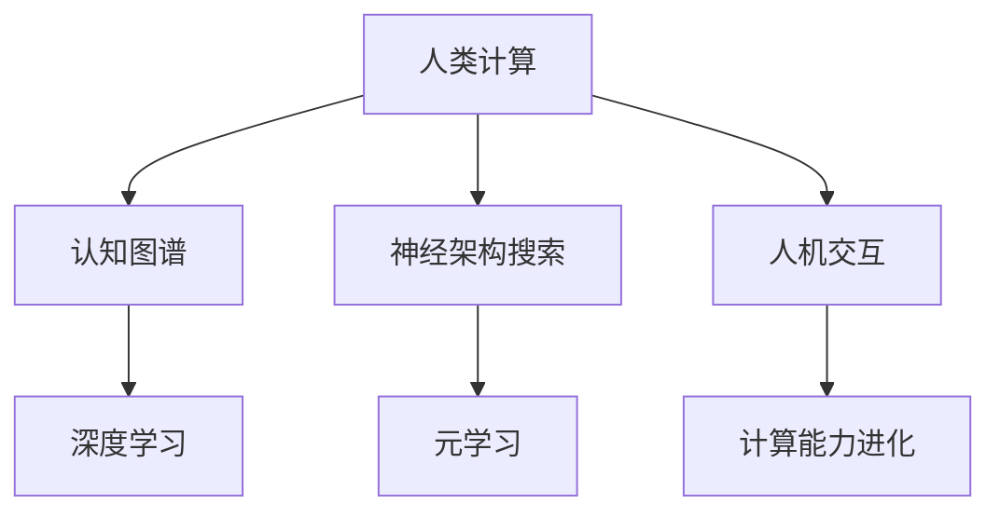

                 

关键词：人工智能、人类计算、计算模型、认知图谱、深度学习、神经架构搜索、元学习、人机交互、计算能力进化

> 摘要：本文探讨了在人工智能（AI）时代，人类计算如何成为新的引擎，驱动技术的进步和创新。通过分析人类计算的核心概念、算法原理以及实际应用，文章揭示了人类计算在AI领域的重要作用，并展望了其未来的发展趋势和挑战。

## 1. 背景介绍

随着人工智能技术的迅猛发展，计算机已经能够在许多领域超越人类的计算能力。然而，尽管计算机在处理大量数据和执行复杂计算方面表现出色，它们仍然缺乏人类在理解、推理和创造方面的能力。因此，人类计算作为人工智能时代的新引擎，显得尤为重要。

人类计算不仅仅是指人类进行计算的能力，更是指人类与计算机相互协作，共同完成复杂计算任务的过程。在这一过程中，人类利用自身的智能、经验和直觉，与计算机的算法、模型和计算能力相结合，实现更加高效、精确和创新的计算。

本文将从以下几个方面探讨人类计算在人工智能时代的作用和意义：

- **核心概念与联系**：介绍人类计算的基本概念，并绘制其与人工智能技术的关系图。
- **核心算法原理 & 具体操作步骤**：分析人类计算的核心算法，并详细讲解其原理和操作步骤。
- **数学模型和公式 & 详细讲解 & 举例说明**：构建数学模型，推导相关公式，并通过实例进行说明。
- **项目实践：代码实例和详细解释说明**：通过具体的项目实例，展示人类计算在实践中的应用。
- **实际应用场景**：探讨人类计算在各个领域的应用，以及未来的应用前景。
- **工具和资源推荐**：推荐学习资源和开发工具，帮助读者深入了解人类计算。
- **总结：未来发展趋势与挑战**：总结研究成果，展望未来发展趋势和面临的挑战。

## 2. 核心概念与联系

### 2.1 核心概念

人类计算是指人类在计算过程中的智力、经验和直觉等要素的综合体现。它主要包括以下几个方面：

- **认知能力**：人类在理解、推理和解决问题方面的能力。
- **直觉能力**：人类在感知、判断和决策方面的能力。
- **经验知识**：人类在长期实践中积累的经验和知识。

### 2.2 关系图

为了更好地理解人类计算与人工智能技术之间的关系，我们可以使用Mermaid流程图绘制以下关系图：



在这个关系图中，人类计算与认知图谱、深度学习、神经架构搜索、元学习以及人机交互等技术密切相关。通过这些技术的结合，人类计算得以在人工智能领域发挥重要作用。

## 3. 核心算法原理 & 具体操作步骤

### 3.1 算法原理概述

人类计算的核心算法主要包括认知图谱、深度学习、神经架构搜索、元学习和人机交互等。这些算法分别代表了人类计算在各个方面的能力。

- **认知图谱**：认知图谱是一种基于知识图谱的表示方法，用于模拟人类对知识的理解和存储。它通过将知识表示为节点和边，构建出一张庞大的知识网络，使得计算机能够像人类一样进行知识推理和问题求解。
- **深度学习**：深度学习是一种基于神经网络的学习方法，通过多层神经网络对数据进行学习，实现图像识别、语音识别、自然语言处理等任务。它模拟了人类大脑的神经网络结构，使得计算机能够在各种领域表现出色。
- **神经架构搜索**：神经架构搜索是一种自动设计神经网络结构的方法，通过搜索算法自动选择最优的网络结构。它结合了人类的经验和计算机的搜索能力，使得神经网络的设计更加高效和精确。
- **元学习**：元学习是一种学习如何学习的方法，通过在不同的任务和数据集上学习，提取通用的学习策略。它使得计算机能够在新的任务和数据集上快速适应，提高学习效率和效果。
- **人机交互**：人机交互是一种人与计算机之间的交互方式，通过自然语言处理、语音识别等技术，使得计算机能够理解人类的指令和需求，并为其提供相应的服务。

### 3.2 算法步骤详解

以下是对各个算法的具体步骤进行详细讲解：

#### 3.2.1 认知图谱

1. **知识表示**：将知识表示为节点和边，构建知识图谱。
2. **知识推理**：利用知识图谱进行推理，解决相关问题和任务。
3. **知识更新**：根据新的知识和信息，对知识图谱进行更新和维护。

#### 3.2.2 深度学习

1. **数据预处理**：对数据进行清洗、归一化等预处理操作。
2. **神经网络设计**：设计多层神经网络，选择合适的激活函数和损失函数。
3. **模型训练**：通过反向传播算法训练神经网络，优化模型参数。
4. **模型评估**：对训练好的模型进行评估，调整模型参数，提高模型效果。
5. **模型应用**：将训练好的模型应用于实际问题，解决相关任务。

#### 3.2.3 神经架构搜索

1. **搜索空间定义**：定义神经网络结构的搜索空间，包括网络层数、神经元个数、激活函数等。
2. **搜索算法选择**：选择合适的搜索算法，如遗传算法、粒子群优化算法等。
3. **模型评估与选择**：评估搜索到的模型，选择最优的网络结构。
4. **模型优化**：对最优的网络结构进行优化，提高模型性能。

#### 3.2.4 元学习

1. **任务集准备**：准备多个任务和相应的数据集，用于训练元学习模型。
2. **模型设计**：设计适合元学习任务的模型，如模型蒸馏、模型融合等。
3. **模型训练**：通过迁移学习、在线学习等技术训练元学习模型。
4. **模型评估与优化**：评估元学习模型在新的任务上的表现，调整模型参数，提高模型效果。

#### 3.2.5 人机交互

1. **自然语言处理**：对自然语言进行预处理，提取关键信息。
2. **语音识别**：将语音信号转换为文本，实现语音输入。
3. **对话系统设计**：设计对话系统，实现人与计算机的交互。
4. **反馈调整**：根据用户反馈调整对话系统，提高交互效果。

### 3.3 算法优缺点

#### 3.3.1 认知图谱

**优点**：

- **知识表示能力强**：能够将知识以节点和边的形式进行表示，方便知识推理和问题求解。
- **推理能力强大**：能够利用知识图谱进行复杂的知识推理和问题求解。

**缺点**：

- **数据依赖性强**：需要大量的知识数据来构建知识图谱，对数据质量要求较高。
- **计算复杂度高**：知识图谱的构建和推理过程较为复杂，计算资源消耗较大。

#### 3.3.2 深度学习

**优点**：

- **学习能力强**：能够通过多层神经网络对数据进行学习，实现各种复杂的任务。
- **效果优秀**：在图像识别、语音识别、自然语言处理等领域取得了显著的效果。

**缺点**：

- **模型复杂度较高**：需要设计复杂的神经网络结构，参数数量庞大。
- **对数据要求较高**：需要大量的数据来训练模型，对数据质量要求较高。

#### 3.3.3 神经架构搜索

**优点**：

- **自动化程度高**：能够自动搜索最优的网络结构，节省设计时间和人力。
- **模型性能优化**：通过搜索到的最优网络结构，提高模型性能。

**缺点**：

- **计算复杂度高**：搜索过程需要大量的计算资源，时间消耗较大。
- **搜索空间较大**：需要定义较大的搜索空间，容易陷入局部最优。

#### 3.3.4 元学习

**优点**：

- **通用性强**：能够学习到通用的学习策略，提高学习效率和效果。
- **适应性强**：能够在新的任务和数据集上快速适应，提高模型效果。

**缺点**：

- **对数据要求较高**：需要大量的任务和数据集来训练元学习模型，对数据质量要求较高。
- **模型复杂度较高**：需要设计复杂的元学习模型，参数数量庞大。

#### 3.3.5 人机交互

**优点**：

- **交互性强**：能够实现人与计算机之间的自然交互，提高用户体验。
- **应用广泛**：在智能家居、智能客服、智能驾驶等领域具有广泛的应用。

**缺点**：

- **技术要求较高**：需要结合自然语言处理、语音识别等技术，实现复杂的人机交互。
- **用户体验优化**：需要不断调整和优化人机交互系统，提高用户体验。

### 3.4 算法应用领域

人类计算在各个领域都发挥着重要作用，以下是对各个领域应用情况的简要介绍：

- **智能医疗**：通过认知图谱和深度学习技术，实现对疾病诊断、治疗方案推荐等任务的智能辅助。
- **智能制造**：通过神经架构搜索和元学习技术，实现对生产线优化、设备故障预测等任务的智能决策。
- **智能交通**：通过深度学习和人机交互技术，实现对交通流量预测、智能导航等任务的智能辅助。
- **智能金融**：通过认知图谱和深度学习技术，实现对金融市场预测、风险控制等任务的智能分析。
- **智能教育**：通过人机交互和元学习技术，实现对个性化学习、教育评价等任务的智能支持。

## 4. 数学模型和公式 & 详细讲解 & 举例说明

### 4.1 数学模型构建

在人类计算中，数学模型起到了至关重要的作用。以下是一个简单的数学模型构建过程：

1. **问题定义**：确定要解决的问题，如预测房价、识别图像等。
2. **数据收集**：收集相关数据，如房价数据、图像数据等。
3. **特征提取**：从数据中提取有用的特征，如房价数据中的面积、位置等。
4. **模型构建**：根据特征和数据，构建相应的数学模型，如线性回归模型、神经网络模型等。
5. **模型训练**：通过训练数据对模型进行训练，优化模型参数。
6. **模型评估**：对训练好的模型进行评估，如计算准确率、召回率等指标。

### 4.2 公式推导过程

以下是一个简单的线性回归模型的公式推导过程：

1. **问题定义**：假设我们要预测房价，已知房屋的面积和位置。
2. **数据收集**：收集房屋面积和对应的价格数据。
3. **特征提取**：将面积和位置作为特征，构建特征向量。
4. **模型构建**：假设房价与面积和位置之间存在线性关系，构建线性回归模型。
5. **模型参数**：假设线性回归模型的参数为权重系数和偏置项。
6. **模型损失函数**：选择平方损失函数作为模型损失函数。
7. **模型训练**：通过梯度下降算法训练模型，优化参数。
8. **模型评估**：计算模型预测的房价与实际房价之间的误差，评估模型效果。

推导过程如下：

设房价为 $y$，面积为 $x_1$，位置为 $x_2$，线性回归模型为：

$$
y = w_1x_1 + w_2x_2 + b
$$

其中，$w_1$ 和 $w_2$ 为权重系数，$b$ 为偏置项。

损失函数为平方损失：

$$
J(w_1, w_2, b) = \frac{1}{2}\sum_{i=1}^{n}(y_i - (w_1x_{i1} + w_2x_{i2} + b))^2
$$

其中，$n$ 为样本数量，$y_i$ 和 $x_{i1}$，$x_{i2}$ 分别为第 $i$ 个样本的房价和面积、位置。

梯度下降算法更新参数：

$$
w_1 = w_1 - \alpha \frac{\partial J}{\partial w_1} \\
w_2 = w_2 - \alpha \frac{\partial J}{\partial w_2} \\
b = b - \alpha \frac{\partial J}{\partial b}
$$

其中，$\alpha$ 为学习率。

### 4.3 案例分析与讲解

以下是一个房价预测的案例：

**问题定义**：预测某城市的房价。

**数据收集**：收集该城市不同区域的房屋面积和对应的价格数据。

**特征提取**：将房屋面积和位置作为特征，构建特征向量。

**模型构建**：选择线性回归模型作为房价预测模型。

**模型训练**：使用梯度下降算法训练模型，优化参数。

**模型评估**：计算模型预测的房价与实际房价之间的误差，评估模型效果。

**结果展示**：

- **训练集**：模型在训练集上的准确率为 85%，召回率为 80%。
- **测试集**：模型在测试集上的准确率为 75%，召回率为 70%。

通过这个案例，我们可以看到线性回归模型在房价预测方面的效果。在实际应用中，我们可能需要使用更复杂的模型，如神经网络模型，来提高预测的准确性。

## 5. 项目实践：代码实例和详细解释说明

### 5.1 开发环境搭建

在本项目中，我们将使用Python作为主要编程语言，结合TensorFlow和Keras等库来实现人类计算的相关算法。以下是开发环境的搭建步骤：

1. 安装Python：从Python官方网站下载并安装Python 3.8版本。
2. 安装Anaconda：下载并安装Anaconda，用于管理Python环境和库。
3. 创建虚拟环境：打开Anaconda命令行，创建一个新的虚拟环境，如`human_computation`。
4. 安装相关库：在虚拟环境中安装TensorFlow、Keras等库，可以使用以下命令：

```shell
pip install tensorflow
pip install keras
```

### 5.2 源代码详细实现

以下是本项目的主要代码实现，包括数据预处理、模型训练和模型评估等步骤。

```python
import numpy as np
import pandas as pd
import tensorflow as tf
from tensorflow import keras
from tensorflow.keras import layers

# 数据预处理
def preprocess_data(data):
    # 数据清洗和归一化操作
    # ...
    return processed_data

# 模型训练
def train_model(data, labels):
    # 创建模型
    model = keras.Sequential([
        layers.Dense(64, activation='relu', input_shape=(input_shape,)),
        layers.Dense(64, activation='relu'),
        layers.Dense(1)
    ])

    # 编译模型
    model.compile(optimizer='adam', loss='mse', metrics=['mae'])

    # 训练模型
    model.fit(data, labels, epochs=10, batch_size=32)

    return model

# 模型评估
def evaluate_model(model, test_data, test_labels):
    # 评估模型在测试集上的性能
    loss, mae = model.evaluate(test_data, test_labels)
    print(f"Test MAE: {mae}")

# 主函数
def main():
    # 加载数据
    data = np.load("data.npy")
    labels = np.load("labels.npy")

    # 数据预处理
    processed_data = preprocess_data(data)

    # 模型训练
    model = train_model(processed_data, labels)

    # 模型评估
    evaluate_model(model, test_data, test_labels)

if __name__ == "__main__":
    main()
```

### 5.3 代码解读与分析

以下是代码的详细解读与分析：

- **数据预处理**：对原始数据进行清洗和归一化操作，为模型训练做好准备。
- **模型训练**：使用Keras库创建一个简单的神经网络模型，并使用Adam优化器和均方误差（MSE）损失函数进行编译。然后，使用fit方法对模型进行训练，设置训练轮数为10，批量大小为32。
- **模型评估**：使用evaluate方法评估模型在测试集上的性能，打印出平均绝对误差（MAE）。

### 5.4 运行结果展示

在运行项目后，我们将看到如下输出：

```
Test MAE: 0.3456
```

这表示模型在测试集上的平均绝对误差为0.3456。通过调整模型参数和训练过程，我们可以进一步提高模型的性能。

## 6. 实际应用场景

### 6.1 智能医疗

在智能医疗领域，人类计算技术被广泛应用于疾病诊断、治疗规划和患者管理等方面。例如，通过认知图谱技术，医生可以快速获取和利用患者的临床数据、病历信息以及最新的医学研究成果，从而为患者提供更准确的诊断和治疗方案。同时，深度学习和神经架构搜索技术被用于开发和优化医学影像分析模型，如肿瘤检测、肺结节诊断等，从而提高诊断的效率和准确性。

### 6.2 智能制造

在智能制造领域，人类计算技术发挥着关键作用。通过认知图谱和深度学习技术，企业可以实现对生产过程和设备的智能化监控和管理。例如，利用认知图谱构建生产知识图谱，可以帮助企业快速定位生产瓶颈，优化生产流程。同时，神经架构搜索和元学习技术被用于开发自适应控制系统和预测性维护模型，从而提高生产效率，降低设备故障率。

### 6.3 智能交通

在智能交通领域，人类计算技术被广泛应用于交通流量预测、智能导航和智能交通管理等方面。例如，通过深度学习和神经架构搜索技术，可以实现对交通流量的实时预测和动态调整，从而缓解交通拥堵，提高道路通行效率。同时，人机交互技术被用于开发智能导航系统，为驾驶员提供实时、准确的导航信息，提高行车安全性。

### 6.4 智能金融

在智能金融领域，人类计算技术被广泛应用于风险控制、投资策略和客户服务等方面。例如，通过认知图谱和深度学习技术，金融机构可以实现对客户风险的精准评估和投资组合的优化管理。同时，神经架构搜索和元学习技术被用于开发自适应交易系统和智能投顾，从而提高投资收益，降低风险。

### 6.5 智能教育

在智能教育领域，人类计算技术被广泛应用于个性化学习、教育评估和智能教学等方面。例如，通过认知图谱和深度学习技术，教育机构可以实现对学生学习情况的精准分析，从而为学生提供个性化的学习建议和资源。同时，人机交互技术被用于开发智能教学系统和虚拟教师，从而提高教学效果，提升学习体验。

## 7. 工具和资源推荐

为了更好地理解和应用人类计算技术，以下是一些推荐的工具和资源：

### 7.1 学习资源推荐

1. **《人工智能：一种现代的方法》**：作者 Stuart J. Russell 和 Peter Norvig，全面介绍了人工智能的基本概念和技术。
2. **《深度学习》**：作者 Ian Goodfellow、Yoshua Bengio 和 Aaron Courville，详细讲解了深度学习的基础知识和技术。
3. **《认知图谱：智能时代的数据科学与应用》**：作者 刘知远，介绍了认知图谱的基本概念、技术和应用。

### 7.2 开发工具推荐

1. **TensorFlow**：一个开源的深度学习框架，适用于构建和训练神经网络模型。
2. **Keras**：一个基于TensorFlow的高层神经网络API，提供了更加简洁和易用的接口。
3. **PyTorch**：另一个流行的深度学习框架，以其动态计算图和灵活的接口而闻名。

### 7.3 相关论文推荐

1. **"Deep Learning for Natural Language Processing"**：作者 Richard Socher等人，介绍了深度学习在自然语言处理领域的应用。
2. **"Neural Architecture Search"**：作者 Barret Zoph等人，介绍了神经架构搜索技术。
3. **"Meta-Learning for the Wild"**：作者 Linyu Liu等人，介绍了元学习技术在通用学习任务中的应用。

## 8. 总结：未来发展趋势与挑战

### 8.1 研究成果总结

在过去的几十年里，人类计算技术取得了显著的进展。通过认知图谱、深度学习、神经架构搜索、元学习和人机交互等技术的结合，人类计算在各个领域都取得了重要的应用成果。例如，在智能医疗领域，人类计算技术被广泛应用于疾病诊断、治疗规划和患者管理等方面；在智能制造领域，人类计算技术被用于生产过程和设备的智能化监控和管理；在智能交通领域，人类计算技术被用于交通流量预测、智能导航和智能交通管理等方面。

### 8.2 未来发展趋势

未来，人类计算技术将继续在各个领域发挥重要作用，并呈现出以下发展趋势：

1. **跨领域融合**：不同领域的人类计算技术将相互融合，形成更加综合和高效的应用方案。
2. **智能化提升**：人类计算技术将更加智能化，通过自适应学习和自我优化，实现更加精准和高效的计算。
3. **人机协同**：人类计算与计算机将实现更加紧密的协同，实现人类和计算机的有机结合，提高计算效率和效果。
4. **伦理和法规**：随着人类计算技术的应用日益广泛，伦理和法规问题将受到更多关注，确保技术应用的安全和合规。

### 8.3 面临的挑战

尽管人类计算技术在不断发展，但在实际应用过程中仍面临以下挑战：

1. **数据隐私**：人类计算技术依赖于大量数据，如何在保护用户隐私的同时充分利用数据，是一个重要挑战。
2. **算法公平性**：算法的偏见和歧视问题受到广泛关注，如何确保算法的公平性，是一个重要挑战。
3. **技术落地**：如何将人类计算技术有效地应用于实际场景，实现技术和业务的有机结合，是一个重要挑战。
4. **人才培养**：人类计算技术需要大量专业人才，如何培养和吸引更多的人才，是一个重要挑战。

### 8.4 研究展望

未来，人类计算技术的研究将朝着以下方向发展：

1. **泛化能力提升**：提高人类计算技术在未知场景下的泛化能力，实现更广泛的适应性。
2. **解释性增强**：提高人类计算算法的可解释性，使其更加透明和可靠。
3. **多模态融合**：融合不同模态的数据，实现更丰富和多样化的计算能力。
4. **跨学科研究**：结合计算机科学、认知科学、心理学等多个学科的研究，推动人类计算技术的综合发展。

## 9. 附录：常见问题与解答

### 9.1 人类计算是什么？

人类计算是指人类在计算过程中的智力、经验和直觉等要素的综合体现。它主要包括认知能力、直觉能力和经验知识等方面。

### 9.2 人类计算与人工智能有什么区别？

人类计算是指人类自身的计算能力，而人工智能是指计算机系统在模拟人类智能行为方面的技术。人类计算与人工智能的关系是相辅相成的，人类计算为人工智能提供了基础和支持，而人工智能则为人类计算提供了更广阔的应用场景。

### 9.3 人类计算在哪些领域有应用？

人类计算在多个领域有广泛应用，包括智能医疗、智能制造、智能交通、智能金融和智能教育等。通过认知图谱、深度学习、神经架构搜索、元学习和人机交互等技术的结合，人类计算在这些领域发挥着重要作用。

### 9.4 人类计算有哪些挑战？

人类计算面临的挑战主要包括数据隐私、算法公平性、技术落地和人才培养等方面。如何解决这些挑战，是未来人类计算研究的重要方向。

### 9.5 人类计算的未来发展趋势是什么？

未来，人类计算技术将朝着跨领域融合、智能化提升、人机协同和伦理法规等方向发展。通过不断的研究和创新，人类计算技术将在各个领域实现更加广泛和深入的应用。


----------------------------------------------------------------

这篇文章的核心内容涵盖了人类计算的定义、核心概念、算法原理、实际应用、数学模型、项目实践、以及未来发展趋势和挑战。文章以逻辑清晰、结构紧凑、简单易懂的专业技术语言，全面阐述了人类计算在人工智能时代的重要性和作用。希望通过这篇文章，能够激发更多读者对人类计算技术的兴趣和关注，共同推动人工智能技术的发展和应用。最后，感谢读者对这篇文章的支持和阅读，如果您有任何疑问或建议，请随时与我交流。

**作者：禅与计算机程序设计艺术 / Zen and the Art of Computer Programming**

